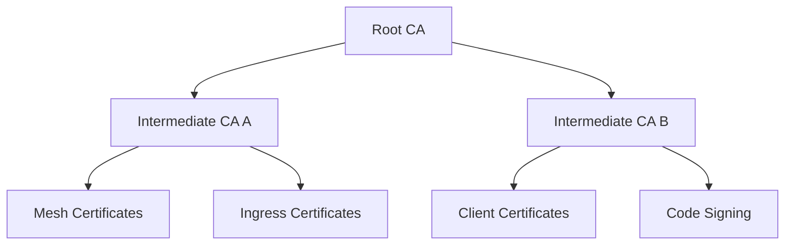

# 📜 Certificate Lifecycle

  

---

## 🎯 1. Overview

Certificate mismanagement is a leading cause of production outages. Expired certificates break TLS, mTLS, and API integrations with no graceful degradation. {Company} automates certificate issuance, renewal, and monitoring to eliminate manual processes. This document defines certificate types, PKI hierarchy, automated renewal patterns, and monitoring requirements.

For encryption and TLS standards, see [Security](./03-security.md).

---

## 📋 2. Certificate Types

| Certificate Type | Issuer | TTL | Use Case |
|-----------------|--------|-----|----------|
| **Public TLS** | AWS ACM / Let's Encrypt | 90 days (auto-renewed) | Customer-facing HTTPS endpoints |
| **Internal mTLS** | Istio CA (istiod) | 24 hours (auto-rotated) | Service-to-service mesh communication |
| **Ingress TLS** | cert-manager + Let's Encrypt | 90 days (auto-renewed) | Kubernetes ingress controllers |
| **Client certificates** | Internal CA | 1 year | B2B partner API authentication |
| **Code signing** | Internal CA | 2 years | Container image and artifact signing |

---

## 🏗️ 3. PKI Hierarchy

{Company} maintains a two-tier PKI hierarchy for internal certificates.

**Visual overview:**

| CA Tier | Storage | Key Type | Validity |
|---------|---------|----------|----------|
| **Root CA** | Offline HSM (air-gapped) | RSA 4096 or EC P-384 | 10 years |
| **Intermediate CA A** | KMS-backed (online) | EC P-256 | 3 years |
| **Intermediate CA B** | KMS-backed (online) | EC P-256 | 3 years |

### 3.1 Root CA Operations

| Operation | Frequency | Process |
|-----------|-----------|---------|
| Root CA key ceremony | Every 10 years | Multi-party ceremony with legal witness |
| Intermediate CA renewal | Every 3 years | Security team + platform engineering |
| CRL publication | Daily (automated) | Published to S3 + CDN |

---

## 🔄 4. Automated Renewal

All certificate renewal is automated. Manual certificate management is prohibited for production workloads.

### 4.1 cert-manager Configuration

cert-manager runs in every Kubernetes cluster and handles issuance and renewal.

| Parameter | Value |
|-----------|-------|
| **Renewal window** | 30 days before expiry |
| **Retry interval** | 1 hour on failure |
| **Issuers** | ClusterIssuer for Let's Encrypt, CA Issuer for internal |
| **Challenge type** | DNS-01 (via Route 53) for public certs |

### 4.2 Istio mTLS Rotation

| Parameter | Value |
|-----------|-------|
| **Workload certificate TTL** | 24 hours |
| **Root CA distribution** | Automatic via istiod |
| **Rotation trigger** | 50% of TTL elapsed |
| **Fallback** | Grace period of 12 hours beyond expiry |

---

## 🔒 5. mTLS Configuration

All service-to-service traffic within the mesh uses mTLS. No exceptions.

| Setting | Value |
|---------|-------|
| **PeerAuthentication mode** | `STRICT` (cluster-wide) |
| **Minimum TLS version** | TLS 1.2 |
| **Preferred TLS version** | TLS 1.3 |
| **Cipher suites** | ECDHE-based only (no RSA key exchange) |

### 5.1 mTLS Exceptions Process

If a workload genuinely cannot support mTLS (legacy integration, third-party agent):

1. File a security exception request with justification
2. Security team reviews and approves with compensating controls
3. Exception is scoped to a specific namespace and destination
4. Exception is reviewed quarterly and revoked when no longer needed

---

## 📊 6. Monitoring and Alerting

| Metric | Alert Threshold | Severity |
|--------|----------------|----------|
| Certificate expiry | < 14 days remaining | P2 (warning) |
| Certificate expiry | < 7 days remaining | P1 (critical) |
| cert-manager renewal failure | Any failure | P1 |
| Istio mTLS handshake errors | > 0.1% error rate over 5 minutes | P2 |
| CRL publication delay | > 24 hours since last publish | P1 |
| CA certificate expiry | < 90 days remaining | P1 |

### 6.1 Certificate Inventory Dashboard

All certificates are tracked in a Grafana dashboard (`Security - Certificate Inventory`) showing:

- Total certificates by type and issuer
- Certificates approaching renewal (sorted by expiry)
- Failed renewals with error details
- mTLS coverage percentage across namespaces

---

⬅️ [Back to section](./README.md) · 🏠 [Back to root](../README.md)

