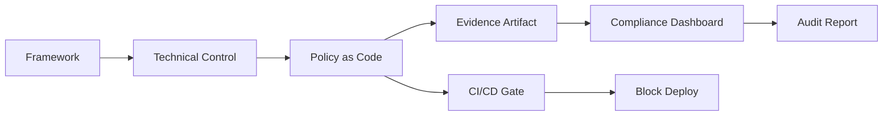

# 📋 Compliance Engineering

  

---

## 🎯 1. Overview

Compliance is not a quarterly scramble before an audit. It is a continuous engineering discipline. SOC 2, ISO 27001, and GDPR requirements are encoded as policy-as-code, enforced in CI/CD pipelines, and validated through automated evidence collection.

> **Rule:** Every compliance control must have an automated evidence source. Manual evidence gathering is a bug, not a process.

The goal is **continuous compliance** - the ability to demonstrate adherence to any framework at any point in time, not just during audit windows.

---

## 📐 2. Compliance Frameworks

{Company} maintains active compliance programs for the following frameworks:

| Framework | Scope | Cadence |
|-----------|-------|---------|
| SOC 2 Type II | All production systems | Annual audit, continuous monitoring |
| ISO 27001 | Information security management | Annual recertification |
| GDPR | Personal data processing | Ongoing, with annual review |
| PCI DSS | Payment processing systems | Annual assessment |

> **Rule:** When a new service enters production, the owning team must map it to applicable compliance frameworks within 30 days.

---

## 🗺️ 3. Control Mapping

Every compliance requirement maps to a technical control, an automation that enforces it, and an evidence source that proves it.

**Visual overview:**



Control mappings are stored in a structured YAML format alongside infrastructure code:

```yaml
controls:
  soc2-cc6.1:
    description: "Logical access controls"
    automation: terraform-iam-policy
    evidence: iam-access-review-report
    owner: platform-engineering
    frequency: continuous
```

---

## 🤖 4. Compliance as Code

Compliance policies are expressed as code using Open Policy Agent (OPA) and Terraform Sentinel. These policies run at three enforcement points:

1. **Pre-commit** - Local policy checks catch violations before code reaches the repository
2. **CI pipeline** - Automated policy evaluation blocks non-compliant changes
3. **Runtime** - Continuous scanning detects configuration drift in production

| Enforcement Point | Tool | Response |
|-------------------|------|----------|
| Infrastructure changes | OPA / Terraform Sentinel | Block apply |
| Container images | Trivy + admission controller | Reject deployment |
| IAM policies | Custom OPA rules | Block overly permissive roles |
| Data classification | Schema registry policies | Require PII annotations |

> **Rule:** All compliance policy-as-code must be version-controlled, peer-reviewed, and tested before deployment.

---

## 📊 5. Automated Evidence Collection

Evidence collection is fully automated. Each control has a corresponding collector that generates audit artifacts on a defined schedule.

| Evidence Type | Collection Method | Retention |
|---------------|-------------------|-----------|
| Access reviews | IAM role enumeration via cloud API | 7 years |
| Change logs | Git commit history + CI/CD logs | 7 years |
| Vulnerability scans | Trivy, Dependabot, SAST reports | 3 years |
| Encryption status | Cloud config rules | 7 years |
| Incident records | Incident tooling + retrospectives | 5 years |

> **Rule:** Evidence artifacts must be immutable. Store them in write-once storage with integrity checksums.

---

## 🔄 6. Audit Readiness

Compliance status is reported in real-time through a centralized dashboard. Teams receive alerts when controls drift out of compliance.

**Compliance health indicators:**

- **Green** - Control is automated, evidence is current, no findings
- **Yellow** - Evidence is stale or minor finding is open
- **Red** - Control is failing, evidence is missing, or critical finding is unresolved

> **Rule:** Red compliance status blocks production deployments for the affected service until the finding is resolved.

Audit readiness is measured by the percentage of controls that are green. The target is 95% or higher at all times - not just before scheduled audits.

---

## 🔗 7. Cross-References

- [Security](./03-security.md) - Security controls, IAM, encryption, and incident response
- [Privacy Engineering](./08-privacy-engineering.md) - Data classification, PII handling, GDPR erasure

---

<div align="center">

⬅️ [Back to section](./README.md) · 🏠 [Back to root](../README.md)

</div>
