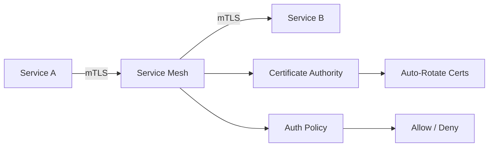

# 🔐 Zero-Trust Networking

  

---

## 🎯 1. Overview

The network perimeter is not a trust boundary. Every service, every request, and every connection must prove its identity and authorization - regardless of whether it originates inside or outside the cluster. "Inside the firewall" is not a security posture.

> **Rule:** No service-to-service communication is trusted by default. All internal traffic must be authenticated, authorized, and encrypted.

Zero-trust networking is not a product you install. It is an architecture that combines identity-based access, microsegmentation, mutual TLS, and continuous verification to eliminate implicit trust from the network layer.

---

## 🏗️ 2. Zero-Trust Principles

{Company} enforces five core zero-trust principles across all environments:

| Principle | Implementation |
|-----------|---------------|
| **Never trust, always verify** | mTLS on every connection, JWT validation on every request |
| **Least-privilege access** | Network policies deny-all by default, allow-list per service |
| **Assume breach** | Microsegmentation limits lateral movement |
| **Verify explicitly** | Identity checked at every hop, not just at the edge |
| **Encrypt everything** | TLS 1.3 for all traffic - internal and external |

---

## 🔒 3. Mutual TLS (mTLS)

All service-to-service communication uses mTLS managed by the service mesh (Istio). Services do not manage their own certificates.

**Visual overview:**



**mTLS requirements:**

- Certificate rotation happens automatically every 24 hours
- Services must not disable mTLS or use permissive mode in production
- All non-mesh traffic (legacy systems, external integrations) must terminate TLS at a gateway with identity verification

> **Rule:** Any service that bypasses mTLS in production requires a documented security exception approved by the security team.

---

## 🧱 4. Microsegmentation

Network policies enforce microsegmentation at the pod level. The default posture is **deny-all** - every service must explicitly declare which other services it needs to communicate with.

```yaml
apiVersion: networking.k8s.io/v1
kind: NetworkPolicy
metadata:
  name: orders-service-policy
spec:
  podSelector:
    matchLabels:
      app: orders-service
  policyTypes: [Ingress, Egress]
  ingress:
    - from:
        - podSelector:
            matchLabels:
              app: api-gateway
  egress:
    - to:
        - podSelector:
            matchLabels:
              app: payments-service
```

> **Rule:** Every service must have a NetworkPolicy. Services without a policy must not pass the CI/CD deployment gate.

---

## 🪪 5. Identity-Based Access

Access decisions are based on workload identity, not network location. Each service has a cryptographic identity (SPIFFE ID) issued by the mesh.

| Access Layer | Identity Mechanism | Enforcement |
|-------------|-------------------|-------------|
| Service-to-service | SPIFFE/mTLS identity | Istio AuthorizationPolicy |
| User-to-service | JWT with claims | API Gateway + service-level check |
| Agent-to-service | OAuth2 client credentials | Scoped tokens with short TTL |
| External integrations | API key + IP allowlist | API Gateway WAF rules |

> **Rule:** Network-level allow rules (IP allowlists, CIDR ranges) are supplementary controls only. They must never be the sole access control mechanism.

---

## 📐 6. Network Policy Design

Network policies follow a layered approach:

1. **Platform layer** - Global deny-all baseline, DNS egress for service discovery, mesh control plane access
2. **Namespace layer** - Cross-namespace rules for shared services (logging, monitoring, auth)
3. **Service layer** - Per-service ingress/egress rules declared by the owning team

Teams own their service-layer policies. Platform engineering owns the platform and namespace layers.

---

## 🔗 7. Cross-References

- [Security](./03-security.md) - IAM, encryption, shift-left security practices
- [API Gateway Strategy](./07-api-gateway-strategy.md) - Edge authentication, WAF, rate limiting

---

<div align="center">

⬅️ [Back to section](./README.md) · 🏠 [Back to root](../README.md)

</div>
