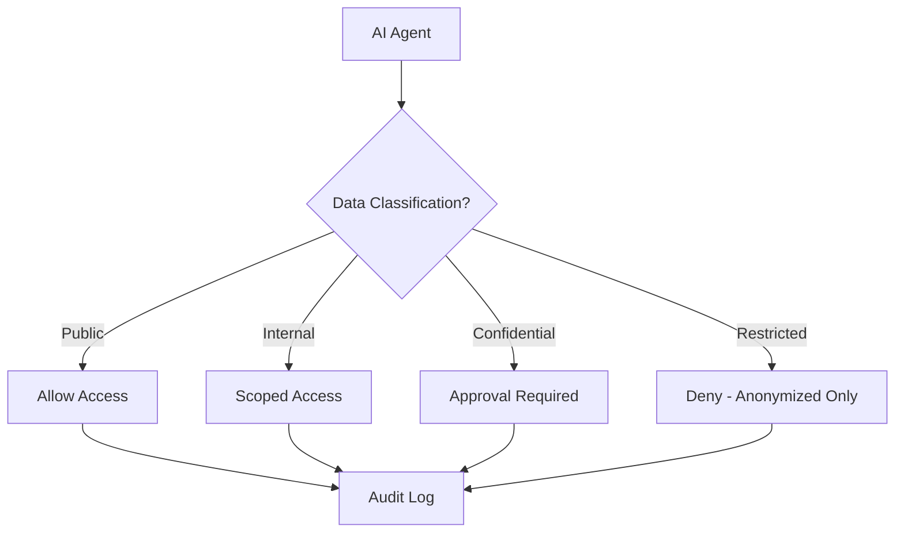

# 🤖 Agent Data Governance

  

---

## 🎯 1. Overview

AI agents can process data at a scale and speed that makes manual governance controls insufficient. An agent that can read a database, summarize its contents, and send that summary to an external API can exfiltrate sensitive data in seconds - without any malicious intent, just poor access scoping.

> **Rule:** Agent access to PII and sensitive data is restricted by default. Access must be explicitly granted per data classification level, per agent, with a documented business justification.

This document defines the data governance controls that apply specifically to AI agents operating within {Company} infrastructure, covering access restrictions, audit requirements, and dev-time governance for agent training and context.

---

## 🔒 2. Agent Data Access Restrictions

Agents inherit the data classification framework defined in privacy engineering. Access to each classification tier requires progressively stricter controls.

| Data Classification | Agent Access | Approval Required | Additional Controls |
|---------------------|-------------|-------------------|---------------------|
| **Public** | Allowed | None | Standard audit logging |
| **Internal** | Allowed | Team lead | Scoped to specific datasets |
| **Confidential** | Restricted | Data owner + security | Time-bound access, enhanced logging |
| **Restricted (PII)** | Denied by default | CISO + legal | Anonymized view only, no raw access |

**Visual overview:**

> **Rule:** Agents must never have direct access to restricted (PII) data in raw form. All agent interactions with PII must go through an anonymization layer that strips or masks identifiable fields before the data reaches the agent.

---

## 📋 3. Audit Trail for Agent Data Access

Every data access event by an agent must produce an immutable audit record that captures the full context of the access.

**Required audit fields for data access:**

| Field | Description |
|-------|-------------|
| `agent_id` | Unique identifier of the requesting agent |
| `data_source` | Database, API, or file path accessed |
| `data_classification` | Classification level of the accessed data |
| `query_or_operation` | The specific query or read operation performed |
| `records_accessed` | Count of records read or modified |
| `purpose` | Business justification or triggering task |
| `timestamp` | ISO 8601 timestamp with timezone |

> **Rule:** Data access audit logs must be retained for a minimum of 3 years. Logs for restricted data access must be retained for 7 years.

**Compliance implications:**

- SOC 2 - Agent data access logs feed into the CC6.1 (logical access) evidence collector
- GDPR - Agent access to EU personal data must be traceable for data subject access requests
- ISO 27001 - Agent data access is included in the annual access review scope

---

## 🧪 4. Dev-Time Data Governance

Agents that assist with development (code generation, debugging, context retrieval) interact with data during development workflows. This data requires governance controls even though it is not production data.

**Dev-time data categories:**

| Data Type | Governance Requirement |
|-----------|----------------------|
| **Source code** | Agents may access repos they are authorized for; no cross-org access |
| **Test data** | Must use synthetic or anonymized data; no production snapshots |
| **Configuration** | Agents may read non-secret config; secrets must be masked |
| **Logs and traces** | Dev environment logs only; production logs require scoped access |
| **Training context** | No PII, no customer data, no proprietary business logic from other teams |

> **Rule:** Agents used for code generation or context retrieval must not be trained on or given access to production customer data. Training context must be limited to synthetic data, public documentation, and approved internal knowledge bases.

**Context window governance:**

- Agents must not persist conversation context containing sensitive data beyond the session
- Context retrieved from RAG systems must respect data classification labels
- Agents must not send classified data to external LLM providers without explicit data processing agreements

---

## 🔄 5. Continuous Monitoring

Agent data access patterns must be continuously monitored for anomalies. Automated alerts trigger when agents deviate from expected behavior.

| Alert Condition | Severity | Response |
|----------------|----------|----------|
| Agent accesses data outside its authorized scope | Critical | Revoke access, investigate |
| Unusual volume of records accessed (more than 10x baseline) | High | Throttle, alert data owner |
| Agent attempts to access restricted data | Critical | Block, alert security team |
| Agent sends data to unauthorized external endpoint | Critical | Kill agent process, incident response |

---

## 🔗 6. Cross-References

- [Privacy Engineering](./08-privacy-engineering.md) - Data classification, PII handling, anonymization standards
- [Compliance Engineering](./16-compliance-engineering.md) - Automated evidence collection, SOC 2 and GDPR controls

---

⬅️ [Back to section](./README.md) · 🏠 [Back to root](../README.md)

