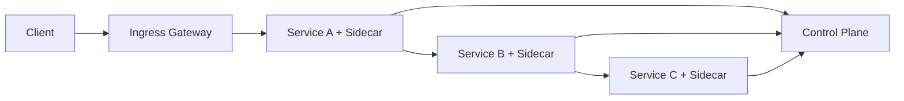

# 🕸️ Service Mesh

  

---

## 🎯 1. Overview

A service mesh handles cross-cutting networking concerns - mTLS, traffic management, observability, and retries - at the infrastructure layer so application code does not have to. It shifts networking complexity from application libraries into a dedicated data plane. This guide covers mesh selection, traffic management, and operational considerations.

> **Rule:** Service mesh adoption is mandatory for clusters running 10 or more services. Clusters with fewer services may use mesh-less alternatives if they meet the same security and observability requirements.

---

## 📐 2. Technology Selection

| Mesh | Architecture | Best for | Trade-off |
|------|-------------|----------|-----------|
| **Istio** | Sidecar (Envoy) | Full-featured mesh, traffic management, security | Higher resource overhead per pod |
| **Linkerd** | Sidecar (Rust proxy) | Lightweight, simpler operations | Fewer traffic management features |
| **Istio Ambient** | Sidecar-less (ztunnel + waypoint) | Reduced resource overhead, simpler rollout | Newer, less ecosystem tooling |
| **Cilium** | eBPF-based | High-performance networking, no sidecar | Requires kernel 5.10+, less L7 control |

> **Rule:** {Company} standardizes on Istio as the default mesh. Teams may use Istio Ambient mode for workloads where sidecar overhead is prohibitive. Alternative meshes require Platform Engineering approval.

---

## 🏗️ 3. Architecture

**Visual overview:**

| Component | Role |
|-----------|------|
| **Data plane** | Sidecar proxies (Envoy) that intercept all inbound/outbound traffic |
| **Control plane** | Istiod - manages configuration, certificate issuance, and service discovery |
| **Ingress gateway** | Edge proxy that terminates external TLS and routes to internal services |

---

## 🔀 4. Traffic Management

The mesh enables fine-grained traffic routing without application changes.

| Capability | Use case | Istio resource |
|-----------|----------|----------------|
| **Traffic splitting** | Canary deployments, A/B testing | VirtualService (weight-based routing) |
| **Request mirroring** | Shadow traffic for new versions | VirtualService (mirror) |
| **Circuit breaking** | Prevent cascading failures | DestinationRule (outlierDetection) |
| **Retries** | Transparent retry on 5xx errors | VirtualService (retries) |
| **Timeouts** | Enforce request deadlines | VirtualService (timeout) |
| **Fault injection** | Chaos testing (delays, aborts) | VirtualService (fault) |

### 4.1 Retry Policy Standards

| Setting | Default value |
|---------|--------------|
| Max retries | 2 |
| Retry on | `5xx`, `reset`, `connect-failure` |
| Per-try timeout | 2 seconds |
| Retry budget | 20% of base traffic |

> **Rule:** Application-level retries must be disabled when mesh-level retries are configured. Stacking retries causes exponential amplification.

---

## 📊 5. Observability

The mesh automatically generates observability signals without any application instrumentation.

| Signal | What the mesh provides |
|--------|----------------------|
| **Metrics** | Request rate, error rate, latency (RED metrics) per service pair |
| **Distributed traces** | Automatic span injection for every hop (requires propagating trace headers) |
| **Access logs** | Structured logs for every request with source, destination, status, latency |
| **Service graph** | Real-time dependency graph generated from traffic data |

> **Rule:** Services must propagate trace context headers (`traceparent`, `tracestate`) even though the mesh injects spans. Without propagation, traces are fragmented.

---

## 🔐 6. Security

| Feature | Implementation |
|---------|---------------|
| **mTLS everywhere** | Strict mode - no plaintext traffic between meshed services |
| **Authorization policies** | Deny-all default, allow-list per service pair |
| **Certificate rotation** | Automatic, every 24 hours |
| **Peer authentication** | SPIFFE identity per workload |

---

## ⚠️ 7. Anti-Patterns

| Anti-pattern | Problem | Fix |
|-------------|---------|-----|
| **Permissive mTLS mode in prod** | Allows plaintext traffic alongside encrypted | Enforce strict mTLS in all production namespaces |
| **No resource limits on sidecars** | Envoy consumes unbounded memory | Set sidecar resource requests and limits |
| **Stacked retries** | App retries x mesh retries = exponential load | Disable app retries when mesh retries are on |
| **Ignoring mesh overhead** | Latency budget does not account for proxy hops | Include proxy latency in SLO calculations |
| **Mesh for < 5 services** | Operational overhead exceeds benefit | Use direct mTLS without a full mesh |

---

## 🔗 8. Cross-References

- [Security](./03-security.md) - Broader security strategy including mTLS and identity
- [Zero-Trust Networking](./17-zero-trust-networking.md) - Zero-trust principles enforced by the mesh

---

⬅️ [Back to section](./README.md) · 🏠 [Back to root](../README.md)

