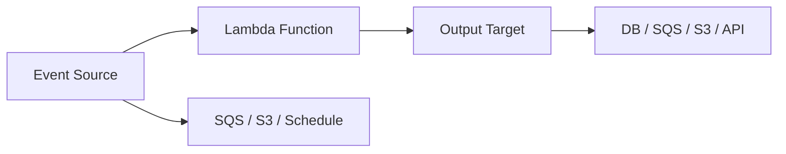

# ⚡ Serverless and FaaS Patterns

  

---

## 🎯 1. Overview

Serverless computing eliminates infrastructure management for workloads that are event-driven, bursty, or low-traffic. It is not a universal replacement for containers - it is a tool for specific patterns. Misapplied serverless leads to cold-start latency, vendor lock-in, and cost surprises.

> **Rule:** Serverless (Lambda, Cloud Functions) is approved for event-driven glue, data transformation, and low-traffic APIs. Latency-sensitive or high-throughput workloads must use container-based deployment.

---

## 📐 2. When to Use Serverless

| Use case | Serverless | Containers |
|----------|-----------|------------|
| Event-driven processing (S3 upload, SQS message) | Yes | Overkill |
| Low-traffic internal API (< 100 req/min) | Yes | Over-provisioned |
| Scheduled tasks (< 15 min runtime) | Yes | K8s CronJob also viable |
| Data transformation (ETL glue) | Yes | Overkill |
| Latency-sensitive API (p99 < 100ms) | No | Yes |
| High-throughput API (> 1,000 req/sec sustained) | No | Yes |
| Long-running process (> 15 min) | No | Yes |
| Stateful workload | No | Yes |

---

## 🏗️ 3. Lambda Patterns

### 3.1 Approved Patterns

| Pattern | Description | Example |
|---------|------------|---------|
| **Event processor** | Lambda triggered by SQS, SNS, S3, or EventBridge | Process uploaded CSV, resize image |
| **API handler** | Lambda behind API Gateway for low-traffic endpoints | Internal webhook receiver |
| **Scheduled task** | Lambda triggered by EventBridge schedule | Nightly report generation |
| **Stream processor** | Lambda consuming Kinesis or DynamoDB Streams | Real-time data enrichment |
| **Step Functions task** | Lambda as a step in a state machine | Workflow orchestration step |

**Visual overview:**

### 3.2 Function Design Rules

| Rule | Detail |
|------|--------|
| **Single responsibility** | One function, one job. No multi-purpose handlers. |
| **Idempotent** | Same event processed twice produces the same result |
| **Stateless** | No in-memory state between invocations; use DynamoDB or S3 |
| **Timeout < 60 seconds** | If it takes longer, it belongs in a container |
| **Package size < 50 MB** | Smaller packages = faster cold starts |

---

## 🧊 4. Cold Start Mitigation

Cold starts add latency on the first invocation after idle. Mitigation strategies depend on the runtime.

| Strategy | How it works | Trade-off |
|----------|-------------|-----------|
| **Provisioned concurrency** | Pre-warms N instances | Costs money even when idle |
| **SnapStart (Java)** | Snapshots the initialized JVM | Requires checkpoint-safe code |
| **Lightweight runtime** | Use Node.js, Python, or Go instead of Java | May not match team skills |
| **Keep-alive pings** | Scheduled event every 5 min to prevent idle | Hack; provisioned concurrency is better |
| **Minimal dependencies** | Smaller package, fewer imports | Requires careful dependency management |

> **Rule:** Java Lambdas must use SnapStart or provisioned concurrency. Unmitigated Java cold starts (3 - 10 seconds) are not acceptable for API-triggered functions.

---

## 💰 5. Cost Optimization

Serverless billing is per-invocation and per-millisecond of execution. Small inefficiencies scale linearly with traffic.

| Optimization | Impact |
|-------------|--------|
| **Right-size memory** | Lambda CPU scales with memory; profile to find the cost/performance sweet spot |
| **Reduce execution time** | Move expensive work to async processing; return early |
| **Use ARM (Graviton)** | 20% cheaper, often faster for compute-bound functions |
| **Batch processing** | Process SQS messages in batches of 10 instead of 1 |
| **Avoid over-triggering** | Debounce S3 events; filter EventBridge rules tightly |

> **Rule:** All Lambda functions must have a cost alert set at 2x the expected monthly baseline. Runaway Lambda costs are a common production incident.

---

## 🛡️ 6. Guardrails

| Guardrail | Configuration |
|-----------|--------------|
| **Concurrency limit** | Set per-function reserved concurrency to prevent runaway scaling |
| **Dead-letter queue** | Required for all async invocations |
| **Timeout** | Set to 2x expected execution time, max 60 seconds for APIs |
| **VPC placement** | Only when accessing VPC resources; avoid for public APIs (adds cold start) |
| **IAM role** | Least-privilege per function; no shared execution roles |

---

## ⚠️ 7. Anti-Patterns

| Anti-pattern | Problem | Fix |
|-------------|---------|-----|
| **Lambda for everything** | Cold starts, vendor lock-in, debugging difficulty | Use containers for sustained workloads |
| **Monolith Lambda** | One function handling all routes | Split into single-purpose functions |
| **No concurrency limit** | 1,000 concurrent invocations exhaust downstream DB | Set reserved concurrency |
| **Synchronous chains** | Lambda calling Lambda calling Lambda | Use Step Functions for orchestration |
| **No DLQ** | Failed async invocations are silently dropped | Attach a DLQ to every async function |

---

## 🔗 8. Cross-References

- [Cloud Architecture](./01-cloud-architecture.md) - Where serverless fits in the overall cloud strategy
- [FinOps](./05-finops.md) - Cost management practices for serverless workloads

---

⬅️ [Back to section](./README.md) · 🏠 [Back to root](../README.md)

