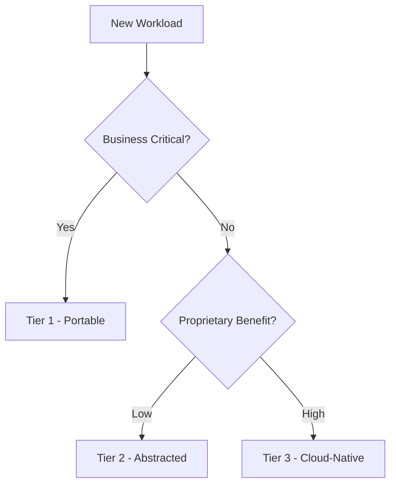

# ☁️ Multi-Cloud Strategy

  

---

## 🎯 1. Overview

Multi-cloud is a risk management strategy, not a performance optimization. Running workloads across multiple cloud providers reduces vendor dependency and strengthens negotiating leverage - but it multiplies operational complexity. The goal is not to use every cloud equally. It is to ensure {Company} can exit or reduce dependency on any single vendor within a reasonable timeline.

> **Rule:** Teams must not build multi-cloud abstractions speculatively. Cloud portability investments are justified only when there is a concrete business requirement (contractual obligation, regulatory mandate, or strategic cloud-exit planning).

---

## 📐 2. Strategy Tiers

{Company} categorizes workloads into portability tiers based on their strategic importance and migration cost.

| Tier | Portability level | Approach | Example |
|------|------------------|----------|---------|
| **Tier 1 - Portable** | Cloud-agnostic | Containerized on Kubernetes, no proprietary services | Core business services |
| **Tier 2 - Abstracted** | Provider-swappable | Uses cloud services behind an abstraction layer | Object storage, message queues |
| **Tier 3 - Cloud-native** | Provider-locked (acceptable) | Uses proprietary services where the benefit outweighs portability cost | ML training (SageMaker), managed databases (Aurora) |

**Visual overview:**

---

## 🔒 3. Vendor Lock-In Assessment

Before adopting any cloud-native service, teams must evaluate lock-in risk using this matrix.

| Factor | Low risk (0 pts) | Medium risk (1 pt) | High risk (2 pts) |
|--------|-----------------|-------------------|------------------|
| **Open standard** | Yes (S3 API, SQL) | Partial (proprietary extensions) | No (fully proprietary) |
| **Data portability** | Standard export format | Export with transformation | No export path |
| **Alternative exists** | Drop-in replacement available | Replacement with code changes | No alternative |
| **Migration effort** | < 1 sprint | 1 - 3 sprints | > 3 sprints |
| **Cost of switching** | Minimal | Moderate re-architecture | Full rewrite |

| Score | Decision |
|-------|----------|
| 0 - 3 | **Approved.** Low lock-in risk. |
| 4 - 6 | **Approved with mitigation.** Document the exit path before adoption. |
| 7 - 10 | **Requires Architecture Review.** Must justify the benefit over portable alternatives. |

---

## 🏗️ 4. Portability Layer

For Tier 2 workloads, {Company} maintains thin abstraction interfaces that allow swapping cloud implementations.

| Capability | Abstraction | AWS implementation | Portable alternative |
|-----------|-------------|-------------------|---------------------|
| **Object storage** | `StorageClient` interface | S3 | MinIO, GCS |
| **Message queue** | `QueueClient` interface | SQS | RabbitMQ, Pub/Sub |
| **Secrets** | `SecretsClient` interface | Secrets Manager | HashiCorp Vault |
| **Identity** | OIDC standard | Cognito | Keycloak, Auth0 |

### 4.1 Abstraction Rules

- Abstractions expose only the common denominator of capabilities across providers
- Provider-specific features are accessible but opt-in and clearly marked
- Abstraction implementations live in a shared library, not in application code
- Switching providers requires only a dependency and configuration change - no application code changes

---

## 🚪 5. Cloud-Exit Planning

Every critical system must have a documented exit plan. This is not a migration plan - it is a readiness assessment.

| Element | Requirement |
|---------|-------------|
| **Data export** | Documented process to export all data in a portable format (Parquet, SQL dump, S3-compatible) |
| **Service inventory** | List of all cloud services used, categorized by portability tier |
| **Dependency map** | Which services depend on which cloud-native features |
| **Estimated effort** | T-shirt size (S/M/L/XL) for migrating each service |
| **Contractual obligations** | Notice periods, data deletion requirements, transfer costs |

> **Rule:** Cloud-exit plans must be reviewed annually. Stale exit plans provide a false sense of security.

---

## 💰 6. Cost Considerations

Multi-cloud is expensive. Do not adopt it without accounting for the full cost.

| Cost category | Single cloud | Multi-cloud |
|--------------|-------------|-------------|
| **Engineering** | One set of tooling | Multiple toolchains, doubled expertise |
| **Data transfer** | Free within cloud | Cross-cloud egress fees |
| **Networking** | Cloud-native VPN | Cross-cloud VPN or interconnect |
| **Compliance** | One cloud's certifications | Multiple certification scopes |
| **Training** | One platform | Multiple platforms |

---

## ⚠️ 7. Anti-Patterns

| Anti-pattern | Problem | Fix |
|-------------|---------|-----|
| **Multi-cloud by default** | Doubles operational complexity without a business reason | Start single-cloud; plan for portability |
| **Lowest-common-denominator** | Avoids all cloud-native services; re-invents everything | Use Tier 3 for justified proprietary services |
| **No exit plan** | Vendor lock-in discovered only during a crisis | Document exit plans annually |
| **Thick abstraction layers** | Abstractions grow to mirror the full cloud API surface | Keep abstractions thin and stable |
| **Multi-cloud for HA** | Using two clouds for redundancy adds failure modes, not removes them | Use multi-region within one cloud for HA |

---

## 🔗 8. Cross-References

- [Cloud Architecture](./01-cloud-architecture.md) - Primary cloud architecture and region strategy
- [FinOps](./05-finops.md) - Cost management including cross-cloud egress tracking

---

⬅️ [Back to section](./README.md) · 🏠 [Back to root](../README.md)

