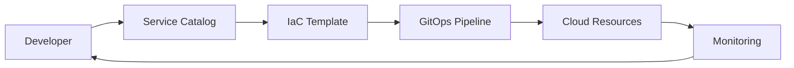

# 🛒 Self-Service Infrastructure

  

---

## 🎯 1. Overview

Self-service infrastructure enables product teams to provision, configure, and operate cloud resources without filing tickets or waiting for a platform team response. The goal is to reduce lead time for new environments from days to minutes while maintaining security, cost, and compliance guardrails.

> **Rule:** All infrastructure provisioning must go through the self-service catalog. Direct console or CLI provisioning outside the catalog is not permitted for production workloads.

---

## 📐 2. Self-Service Model

**Visual overview:**



| Layer | Tool | Responsibility |
|-------|------|---------------|
| **Catalog** | Backstage Software Catalog | Discover and request resources |
| **Templates** | Backstage Scaffolder + Terraform modules | Standardized, pre-approved IaC |
| **Pipeline** | GitHub Actions + ArgoCD | Plan, approve, apply |
| **Policy** | OPA / Sentinel | Enforce guardrails before apply |
| **Observability** | OpenTelemetry + dashboards | Monitor provisioned resources |

---

## 📋 3. Resource Catalog

Teams can provision these resources through the self-service catalog without additional approval:

| Resource | Template | Provisioning Time | Approval Required |
|----------|----------|-------------------|-------------------|
| Kubernetes namespace | `namespace-standard` | < 2 min | None |
| PostgreSQL (Aurora) | `rds-postgres-standard` | < 10 min | None |
| Redis cluster | `elasticache-redis` | < 10 min | None |
| S3 bucket | `s3-standard` | < 2 min | None |
| Kafka topic | `msk-topic` | < 5 min | None |
| Custom VPC peering | `vpc-peering` | < 30 min | Platform review |
| Production domain / TLS | `route53-cert` | < 15 min | Security review |

---

## 🔒 4. Guardrails

Every template embeds guardrails that enforce organizational standards automatically.

| Guardrail Category | Examples |
|--------------------|----------|
| **Cost** | Instance size caps, auto-scaling limits, mandatory cost tags |
| **Security** | Encryption at rest enabled, public access blocked, IAM least privilege |
| **Networking** | Private subnets only, no open security groups, VPC flow logs |
| **Compliance** | Required tagging (owner, environment, data classification) |
| **Naming** | Enforced naming convention: `{company}-{env}-{service}-{resource}` |

### 4.1 Policy-as-Code

All guardrails are implemented as policy-as-code and evaluated before `terraform apply`:

```
# Example OPA policy - deny public S3 buckets
deny["S3 bucket must not be public"] {
    input.resource.type == "aws_s3_bucket"
    input.resource.values.acl == "public-read"
}
```

---

## 🏗️ 5. Template Standards

Every Backstage Scaffolder template must include:

| Requirement | Detail |
|-------------|--------|
| **README** | What the template provisions and how to use it |
| **Inputs** | Typed parameters with validation and sensible defaults |
| **Outputs** | Resource ARNs, endpoints, connection strings |
| **Tags** | Mandatory cost allocation and ownership tags |
| **Monitoring** | Pre-configured dashboards and alerts |
| **Teardown** | Documented destroy procedure and data retention policy |

---

## 📊 6. Metrics and SLOs

| Metric | Target |
|--------|--------|
| Catalog coverage (resources available via self-service) | > 90% of common resources |
| Provisioning success rate | > 99% |
| Mean time to provision (standard resources) | < 10 min |
| Ticket-based provisioning (escape hatch usage) | < 10% of requests |
| Template freshness (last updated within 90 days) | 100% |

---

## ⚠️ 7. Anti-Patterns

| Anti-Pattern | Problem | Fix |
|-------------|---------|-----|
| Console cowboys | Resources created manually, no IaC record | Block console write access; enforce catalog-only provisioning |
| Template sprawl | Dozens of templates with overlapping functionality | Curate a canonical set; deprecate duplicates quarterly |
| Approval bottleneck | Platform team must approve every request | Automate policy checks; reserve approvals for exceptions |
| No teardown path | Orphaned resources accumulate cost | Require teardown docs and run quarterly cleanup |

---
<div align="center">

⬅️ [Back to section](./README.md) · 🏠 [Back to root](../README.md)

</div>
