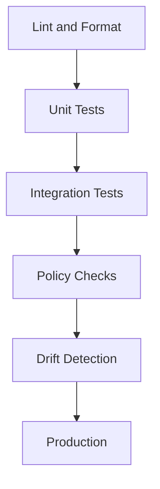

# 🧪 Infrastructure Testing

  

---

## 🎯 1. Overview

Infrastructure code is production code. It must be tested with the same rigor as application code. Untested Terraform modules, unchecked policy drift, and unvalidated configurations are the leading causes of infrastructure outages at scale.

> **Rule:** All IaC changes must pass linting, unit tests, and policy checks in CI before merge. No manual `terraform apply` against production.

---

## 📐 2. Testing Pyramid for Infrastructure

**Visual overview:**

| Layer | What It Tests | Tool | Run Frequency |
|-------|---------------|------|---------------|
| **Lint / format** | Syntax, formatting, best practices | `tflint`, `terraform fmt`, `checkov` | Every PR |
| **Unit test** | Module logic, variable validation, output correctness | `terraform test`, Terratest (Go) | Every PR |
| **Integration test** | Actual resource creation in ephemeral environment | Terratest, `kitchen-terraform` | Nightly or pre-release |
| **Policy check** | Compliance, security, cost guardrails | OPA / Rego, Sentinel, Checkov | Every PR |
| **Drift detection** | Divergence between state and actual resources | `terraform plan` (scheduled), Spacelift | Daily |

---

## 🔧 3. IaC Testing Standards

### 3.1 Unit Testing

Unit tests validate module behavior without provisioning real resources:

| Test Type | Example | Tool |
|-----------|---------|------|
| Variable validation | Reject invalid CIDR ranges | `terraform test` |
| Output verification | Module outputs expected ARN format | `terraform test` |
| Plan assertions | Plan produces expected resource count | Terratest `PlanStruct` |
| Conditional logic | Feature flags enable correct resources | `terraform test` |

### 3.2 Integration Testing

Integration tests provision real resources in an ephemeral AWS account:

| Requirement | Standard |
|-------------|----------|
| **Isolation** | Dedicated test account or namespace per test run |
| **Cleanup** | Automatic teardown on success and failure (deferred destroy) |
| **Timeout** | Maximum 30 minutes per test suite |
| **Cost cap** | Alert if test run exceeds $50 |
| **Parallelism** | Tests run in parallel with unique naming prefixes |

---

## 🛡️ 4. Policy-as-Code

All infrastructure must pass policy checks before provisioning:

| Policy Category | Example Rules |
|-----------------|--------------|
| **Security** | No public S3 buckets, no open security groups, encryption at rest required |
| **Networking** | No 0.0.0.0/0 ingress, VPC flow logs enabled, private subnets for databases |
| **Tagging** | Required tags: `owner`, `environment`, `cost-center`, `data-classification` |
| **Cost** | Instance size within approved list, no unbudgeted GPU instances |
| **Compliance** | Logging enabled, backup retention >= 30 days, deletion protection on |

Policy checks are enforced at four points: pre-commit hooks (warning), CI pipeline with OPA/Sentinel (hard gate - PR blocked), apply time via cloud-native guardrails like AWS SCPs (provisioning denied), and post-deploy scheduled scans (alert + remediation ticket).

---

## 🔍 5. Drift Detection

Configuration drift occurs when actual cloud state diverges from the IaC definition.

| Strategy | Implementation | Frequency |
|----------|---------------|-----------|
| **Scheduled plan** | `terraform plan` in CI with diff output | Daily |
| **State locking** | Remote state with DynamoDB locking | Always on |
| **Import auditing** | Flag resources not managed by Terraform | Weekly |
| **Alert on manual changes** | CloudTrail events for console modifications | Real-time |

When drift is detected:

1. **Alert** the owning team via Slack and PagerDuty (if critical)
2. **Classify** as intentional (document and import) or accidental (revert)
3. **Remediate** within 24 hours for production, 72 hours for non-production
4. **Post-mortem** if drift caused an incident

---

## 📋 6. CI Pipeline Structure

| Stage | Gate Type | Tools |
|-------|-----------|-------|
| `terraform fmt -check` | Hard gate | Terraform CLI |
| `tflint` | Hard gate | tflint |
| `checkov` | Hard gate | Checkov |
| `terraform validate` | Hard gate | Terraform CLI |
| `terraform plan` | Informational (plan output in PR comment) | Terraform CLI |
| `OPA policy eval` | Hard gate | Conftest / OPA |
| `terraform test` | Hard gate | Terraform CLI |
| `cost estimate` | Soft gate (comment only) | Infracost |

---

## ⚠️ 7. Anti-Patterns

| Anti-Pattern | Problem | Fix |
|-------------|---------|-----|
| Manual apply | No audit trail, no peer review | GitOps pipeline with PR-based apply |
| No integration tests | Module works in plan but fails in reality | Run Terratest in ephemeral accounts |
| Ignoring drift | State and reality diverge silently | Scheduled drift detection with alerts |
| Copy-paste modules | Duplicated logic across repos | Publish versioned modules to a private registry |
| Skipping policy checks | Non-compliant resources reach production | Hard-gate OPA checks in CI |

---

⬅️ [Back to section](./README.md) · 🏠 [Back to root](../README.md)

