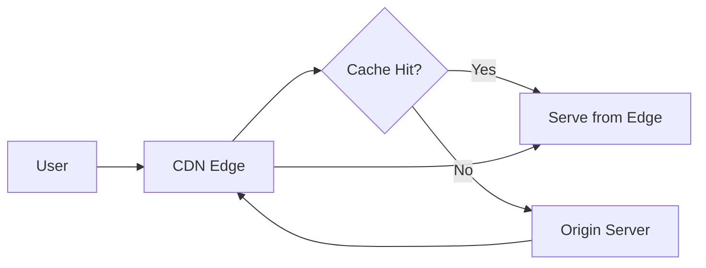

# 🌐 CDN and Edge Caching Strategy

  

---

## 🎯 1. Overview

A CDN (Content Delivery Network) reduces latency, offloads origin traffic, and improves availability by serving content from edge locations close to users. At {Company}, CloudFront is the default CDN. Every public-facing web application and API must be fronted by the CDN unless explicitly exempted.

> **Rule:** All static assets must be served through the CDN. API responses may be cached at the edge only when the cache key and TTL are explicitly defined.

---

## 📐 2. Architecture

**Visual overview:**

| Layer | Technology | Purpose |
|-------|-----------|---------|
| **Edge network** | CloudFront | Global distribution, TLS termination |
| **Edge compute** | CloudFront Functions / Lambda@Edge | Request routing, header manipulation, A/B testing |
| **Origin shield** | CloudFront Origin Shield | Reduce origin load by collapsing cache fills |
| **Origin** | ALB, API Gateway, S3 | Application servers and static storage |

---

## 📋 3. Caching Tiers

| Tier | Content Type | TTL | Cache Key | Invalidation |
|------|-------------|-----|-----------|--------------|
| **Immutable assets** | JS, CSS, images with hash in filename | 1 year | URL path | Deploy new hash (no invalidation needed) |
| **Static pages** | Marketing pages, docs | 5 - 15 min | URL path | On deploy or manual invalidation |
| **API responses (public)** | Product catalog, configuration | 30s - 5 min | URL path + query params | TTL expiry or event-driven invalidation |
| **API responses (personalized)** | User-specific data | No edge cache | N/A | N/A - always origin |
| **Media** | Images, video, PDFs | 24 hours | URL path | Manual invalidation |

### 3.1 Cache Key Design

| Element | Include in Cache Key? | Rationale |
|---------|-----------------------|-----------|
| URL path | Always | Primary identifier |
| Query parameters | Selectively (whitelist) | Prevent cache pollution from tracking params |
| `Accept-Language` | When i18n content varies | Serve correct locale |
| `Authorization` | Never | Personalized content must not be cached |
| Device type | Only for responsive image variants | Serve correct image size |

---

## 🔒 4. Security at the Edge

| Requirement | Implementation |
|-------------|----------------|
| **TLS 1.3** | Enforced on all CloudFront distributions |
| **HSTS** | `Strict-Transport-Security` header added at edge |
| **WAF** | AWS WAF rules attached to CloudFront distribution |
| **Origin access** | S3 origins use Origin Access Control (OAC); ALB origins verify shared secret header |
| **Geo-restrictions** | Configurable per distribution based on compliance requirements |
| **Bot management** | Rate limiting and bot detection at edge |

---

## 📊 5. Performance Standards

| Metric | Target |
|--------|--------|
| Cache hit ratio (static assets) | > 95% |
| Cache hit ratio (cacheable API responses) | > 70% |
| Edge latency (cache hit) | < 50ms |
| Origin shield hit ratio | > 80% |
| Time to first byte (global p95) | < 200ms |
| Invalidation propagation time | < 60 seconds |

---

## 🔄 6. Cache Invalidation Strategies

| Strategy | When to Use | Mechanism |
|----------|-------------|-----------|
| **TTL expiry** | Content with predictable freshness | Set `Cache-Control: max-age` and `s-maxage` |
| **Versioned URLs** | Immutable assets (JS, CSS, images) | Hash in filename - no invalidation needed |
| **Event-driven** | Content updated by backend events | Kafka consumer triggers CloudFront invalidation API |
| **Manual** | Emergency content corrections | CloudFront console or CLI invalidation |
| **Stale-while-revalidate** | Content where slight staleness is acceptable | `Cache-Control: stale-while-revalidate=60` |

### 6.1 Invalidation Budget

CloudFront allows 1,000 free invalidation paths per month. Beyond that, each invalidation costs money. Design cache keys and TTLs to minimize the need for manual invalidation.

---

## ⚠️ 7. Anti-Patterns

| Anti-Pattern | Problem | Fix |
|-------------|---------|-----|
| Cache everything by default | Personalized or sensitive data leaked to other users | Explicit opt-in caching with documented cache keys |
| No cache-control headers | CDN uses default TTL; behavior is unpredictable | Set explicit `Cache-Control` headers on every response |
| Query-param pollution | Tracking params create millions of unique cache keys | Whitelist only meaningful query params in cache key |
| Manual invalidation as primary strategy | Expensive, slow, and error-prone | Use TTL and versioned URLs; reserve invalidation for emergencies |
| No origin shield | Every edge miss hits origin directly | Enable CloudFront Origin Shield for popular content |

---

⬅️ [Back to section](./README.md) · 🏠 [Back to root](../README.md)

