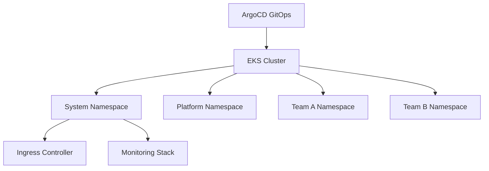

# ☸️ Kubernetes Cluster Operations

  

---

## 🎯 1. Overview

Kubernetes is the compute platform at {Company}. All containerized workloads run on Amazon EKS. This guide defines the operational standards for cluster management, namespace strategy, resource governance, and upgrade processes. Platform engineering owns the clusters; product teams own their namespaces.

> **Rule:** Product teams must not have cluster-admin access. All workload configuration is managed via GitOps (ArgoCD). No `kubectl apply` in production.

---

## 📐 2. Cluster Architecture

**Visual overview:**

| Cluster Component | Technology | Owner |
|-------------------|-----------|-------|
| **Control plane** | Amazon EKS (managed) | AWS + Platform Engineering |
| **Node groups** | Managed node groups (AL2023) | Platform Engineering |
| **GitOps** | ArgoCD | Platform Engineering |
| **Ingress** | NGINX Ingress Controller | Platform Engineering |
| **Service mesh** | Istio (where adopted) | Platform Engineering |
| **Monitoring** | Prometheus + Grafana + OpenTelemetry | Platform Engineering |

---

## 📋 3. Namespace Strategy

Each team gets one namespace per environment per cluster:

| Namespace Pattern | Example | Purpose |
|-------------------|---------|---------|
| `{team}-{env}` | `payments-prod` | Team workloads |
| `system` | `system` | Cluster infrastructure (ingress, DNS, cert-manager) |
| `monitoring` | `monitoring` | Prometheus, Grafana, alerting |
| `argocd` | `argocd` | GitOps controller |

### 3.1 Namespace Governance

| Control | Implementation |
|---------|----------------|
| **Resource quotas** | CPU, memory, and pod count limits per namespace |
| **Limit ranges** | Default and maximum resource requests per container |
| **Network policies** | Deny-all default; explicit allow for required traffic |
| **RBAC** | Team members get namespace-scoped roles only |
| **Pod security standards** | `restricted` profile enforced via admission controller |

---

## 🔒 4. Resource Governance

### 4.1 Resource Requests and Limits

| Resource | Request (minimum) | Limit (maximum) | Ratio |
|----------|-------------------|------------------|-------|
| **CPU** | Based on load testing | 2x request | 1:2 |
| **Memory** | Based on heap + overhead | 1.5x request | 1:1.5 |

> Requests must be based on actual observed usage, not guesses. Review resource utilization monthly and right-size.

### 4.2 Pod Disruption Budgets

Every production deployment must define a PodDisruptionBudget. Minimum available: 1 for 2 - 3 replicas, 50% for 4 - 10, 75% for > 10. Single-replica production deployments must scale up first.

### 4.3 Health Probes

| Probe | Purpose |
|-------|---------|
| **Liveness** | Restart unhealthy pods (lightweight, no dependency calls) |
| **Readiness** | Route traffic only to ready pods (verify downstream deps) |
| **Startup** | Allow slow-starting containers (generous timeout for JVM) |

---

## 🔄 5. Cluster Upgrade Strategy

EKS clusters must track the latest supported Kubernetes version within one minor version.

| Phase | Duration | Actions |
|-------|----------|---------|
| **Pre-upgrade** | 2 weeks | Run `kubectl deprecations` scan, test in staging |
| **Node group upgrade** | 1 day | Rolling update of node groups (one AZ at a time) |
| **Control plane upgrade** | 1 day | EKS managed upgrade |
| **Validation** | 1 week | Monitor for regressions, run smoke tests |
| **Add-on updates** | 1 week | Update CoreDNS, kube-proxy, VPC CNI, CSI drivers |

Minor version upgrades run every 4 - 6 months. Patch versions are applied within 2 weeks of release. Node AMI refresh runs monthly.

---

## 📊 6. Monitoring and Alerting

| Metric | Alert Threshold |
|--------|-----------------|
| Node CPU utilization | > 80% for 15 min |
| Node memory utilization | > 85% for 15 min |
| Pod restart count | > 3 in 10 min |
| Pending pods | > 0 for 10 min (capacity issue) |
| API server latency (p99) | > 1s |
| etcd disk IOPS | > 80% of provisioned |

---

## ⚠️ 7. Anti-Patterns

| Anti-Pattern | Problem | Fix |
|-------------|---------|-----|
| `kubectl apply` in production | No audit trail, no peer review | Use ArgoCD GitOps exclusively |
| No resource requests | Scheduler cannot make informed decisions; OOM kills | Set requests based on load testing |
| Cluster-admin for developers | Blast radius of mistakes is entire cluster | Namespace-scoped RBAC only |
| Single replica in production | No availability during node drains or deployments | Minimum 2 replicas with PDB |
| Skipping Kubernetes upgrades | Clusters fall out of support, security vulnerabilities accumulate | Upgrade within one minor version of latest |

---

⬅️ [Back to section](./README.md) · 🏠 [Back to root](../README.md)

