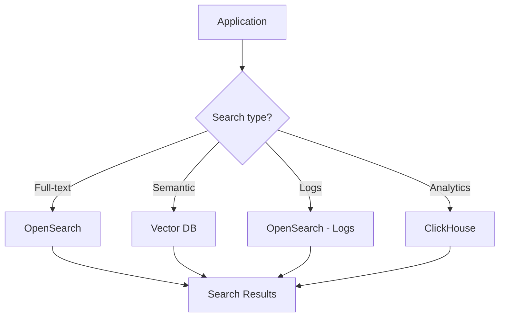

# 🔍 Search Infrastructure Patterns

  

---

## 🎯 1. Overview

Search is a cross-cutting infrastructure concern at {Company}. Whether powering product search, internal documentation discovery, log analysis, or AI-driven semantic retrieval, search infrastructure must be reliable, performant, and consistently operated. This document defines approved search technologies, indexing patterns, and operational standards.

> **Rule:** Every search use case must go through technology selection before deployment. Teams must not deploy ad hoc Elasticsearch or Solr clusters outside the approved architecture.

---

## 🗂️ 2. Search Technology Selection

| Use Case | Recommended Technology | Rationale |
|----------|----------------------|-----------|
| **Full-text product search** | OpenSearch (managed) | Feature-rich, managed service, relevance tuning |
| **Log and event search** | OpenSearch (managed) | Centralized log aggregation, retention policies |
| **Semantic / vector search** | pgvector or Qdrant | AI-native, embedding-based retrieval |
| **Autocomplete / typeahead** | OpenSearch with completion suggesters | Low-latency prefix matching |
| **Analytics aggregation** | OpenSearch or ClickHouse | Time-series aggregation, dashboards |

**Visual overview:**

---

## 📐 3. Indexing Patterns

| Pattern | Description | When to Use |
|---------|-------------|-------------|
| **Dual-write** | Application writes to primary DB and search index | Simple use cases, low write volume |
| **CDC-based** | Change data capture streams from DB to search index | High write volume, eventual consistency acceptable |
| **Event-driven** | Domain events trigger index updates via message queue | Decoupled systems, event-sourced architectures |
| **Batch reindex** | Periodic full reindex from source of truth | Data corrections, schema migrations, initial load |

> **Rule:** CDC-based indexing is the default pattern. Dual-write is only permitted for use cases with < 100 writes per second and where strong consistency is required.

---

## ⚙️ 4. Operational Standards

| Requirement | Standard |
|-------------|----------|
| **Cluster sizing** | Minimum 3 data nodes for production, 2 replicas per index |
| **Index lifecycle** | Hot-warm-cold architecture; hot < 7 days, warm < 30 days, cold to object storage |
| **Backup** | Daily snapshots to object storage, 30-day retention |
| **Monitoring** | Cluster health, indexing lag, query latency (p50, p95, p99), disk usage |
| **Alerting** | Cluster yellow/red, indexing lag > 5 minutes, p99 query latency > 500ms |
| **Access control** | Role-based access, no shared admin credentials |
| **Schema management** | Index mappings versioned in Git, applied via CI/CD |

---

## 📊 5. Performance Targets

| Metric | Target |
|--------|--------|
| Search query latency (p50) | < 50ms |
| Search query latency (p99) | < 200ms |
| Indexing lag (CDC) | < 30 seconds |
| Index availability | 99.95% |
| Reindex duration (full) | < 4 hours for largest index |

---

## 🧩 6. Relevance Engineering

| Practice | Description |
|----------|-------------|
| **Relevance testing** | Golden set of queries with expected top-5 results, validated on every mapping change |
| **Query analysis** | Weekly review of top queries with zero results |
| **A/B testing** | Test relevance changes against control before full rollout |
| **Synonym management** | Curated synonym lists maintained by domain teams, applied at query time |
| **Boosting rules** | Business boosting (e.g., promoted results) managed through configuration, not code |

> **Rule:** Every relevance change must be validated against the golden query set before production deployment.

---

## 🔗 7. Cross-References

- [Cloud Architecture](./01-cloud-architecture.md) - Infrastructure foundations and managed service standards
- [Configuration Management](./04-configuration-management.md) - Configuration standards for infrastructure components

---

⬅️ [Back to section](./README.md) · 🏠 [Back to root](../README.md)

