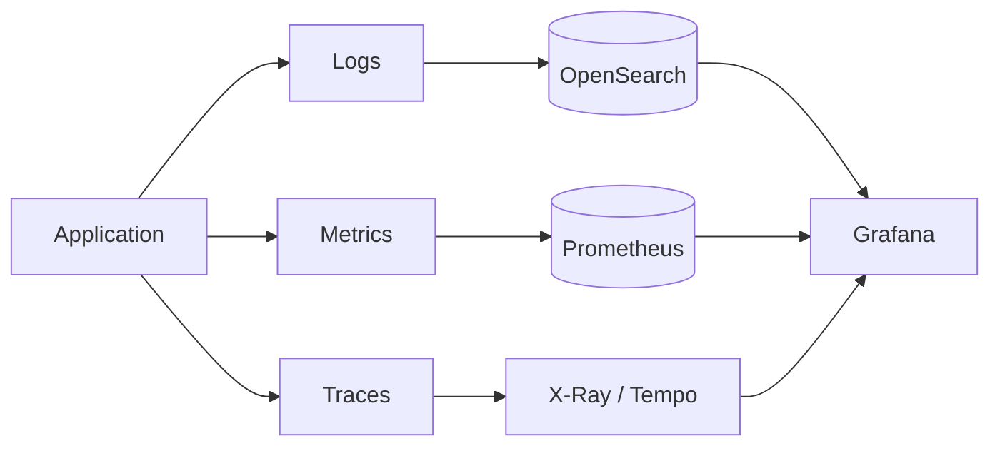

# 👁️ Observability Standards

  

---

## 🎯 1. Philosophy

You cannot operate what you cannot observe. Observability is not a feature - it is a prerequisite for production deployment. Every service must be observable from day one, not retrofitted after an incident.

**The three pillars:**
- **Logs** - what happened (events)
- **Metrics** - how the system is behaving (aggregates over time)
- **Traces** - where time was spent (request path)

All three must be in place before a service receives production traffic. The **fourth pillar** - alerting - is only valuable when the first three are right.

**Visual overview:**



---

## 📡 2. Logging

**Principle:** Structured logging applies to **every runtime** (JVM, Node.js, Go, Python, .NET, and others). Field names and transport stay the same; only the logging library and wiring differ.

### 2.1 Standard

All services must emit **structured JSON logs** to stdout. The log shipper (Fluent Bit) collects from stdout and forwards to the log backend - applications never write to files.

### 2.2 Required Fields

Every log line must contain:

```json
{
  "timestamp": "2026-11-15T14:30:00.123Z",
  "level": "INFO",
  "service": "orders-service",
  "version": "2.14.3",
  "environment": "production",
  "traceId": "01ARZ3NDEKTSV4RRFFQ69G5FAV",
  "spanId": "1fcb4b0a9c3eb4f8",
  "correlationId": "req_01HXYZ...",
  "message": "Order completed successfully",
  "orderId": "order_abc123",
  "durationMs": 145
}
```

| Field | Source (substitute per runtime) | Required |
|-------|--------|---------|
| `timestamp` | Logging framework (e.g. Logback on JVM) | Yes |
| `level` | Logging framework | Yes |
| `service` | Service identity from config (e.g. `spring.application.name` on Spring Boot) | Yes |
| `version` | Build / deployment metadata | Yes |
| `environment` | Deployment environment variable or profile | Yes |
| `traceId` | OpenTelemetry (auto-injected or SDK) | Yes |
| `spanId` | OpenTelemetry (auto-injected or SDK) | Yes |
| `correlationId` | Request context (e.g. MDC on JVM, AsyncLocal in .NET, continuation-local in Node.js) from `X-Request-ID` | Yes |
| `message` | Application | Yes |
| Domain fields | Application | As needed |

**Reference Implementation (JVM / Spring Boot):** Logback, `spring.application.name`, `SPRING_PROFILES_ACTIVE`, and MDC for correlation IDs, as shown below.

### 2.3 Logback Configuration

**Reference Implementation (JVM / Spring Boot):** Use the platform-standard `logback-spring.xml`. Include it from the platform BOM:

```xml
<!-- logback-spring.xml -->
<configuration>
  <include resource="logback/platform-json.xml"/>

  <root level="INFO">
    <appender-ref ref="JSON_CONSOLE"/>
  </root>

  <!-- Suppress noisy Spring Boot startup logs -->
  <logger name="org.springframework" level="WARN"/>
  <logger name="org.hibernate" level="WARN"/>
</configuration>
```

### 2.4 Logging Rules

| Rule | Detail |
|------|--------|
| **No sensitive data in logs** | No passwords, tokens, card numbers, PII (names, email, phone) |
| **No stack traces in INFO/WARN** | Stack traces are ERROR level only |
| **No log-and-throw** | Don't log an exception and then throw it - it doubles log noise |
| **Use parameterised logging** | `log.info("Order {} completed", orderId)` not string concat |
| **Log business events** | Order started, payment captured - these are invaluable for debugging |
| **Do not log in a tight loop** | Rate-limit or aggregate high-frequency events |

### 2.5 Log Levels in Production

| Level | When to Use |
|-------|------------|
| `ERROR` | Unhandled exception; service cannot fulfil request |
| `WARN` | Handled error; degraded operation; slow dependency |
| `INFO` | Business events (order started, payment captured); service lifecycle |
| `DEBUG` | Detailed diagnostic info - **disabled in production by default** |

DEBUG can be enabled per-service via a runtime feature flag without redeployment.

### 2.6 Log Backend

- **Amazon OpenSearch Service** - searchable log storage, 30-day hot retention, 90-day cold
- **Fluent Bit** - DaemonSet on EKS, collects from all pod stdout, forwards to OpenSearch
- **Grafana** - log queries via the Loki datasource (for dev/staging; OpenSearch for production)

---

## 📡 3. Metrics

**Principle:** Every service must expose a **Prometheus-compatible metrics scrape target** and the **RED** signals for HTTP workloads, regardless of language or framework. Path names (for example `/metrics` vs `/actuator/prometheus`) are implementation details; the contract is Prometheus exposition format and consistent labels (`service`, `environment`, `version`).

### 3.1 Standard

**Reference Implementation (Spring Boot):** Services use **`/actuator/prometheus`**. Prometheus scrapes this endpoint via a `ServiceMonitor` CRD (Prometheus Operator). Other runtimes use their framework's metrics endpoint or a sidecar exporter as long as the scrape contract is met.

### 3.2 Spring Boot Actuator Setup

**Reference Implementation (Spring Boot / Micrometer):** Include in `build.gradle`:
```kotlin
implementation("org.springframework.boot:spring-boot-starter-actuator")
implementation("io.micrometer:micrometer-registry-prometheus")
```

`application.yml`:
```yaml
management:
  endpoints:
    web:
      exposure:
        include: health, info, prometheus, metrics
  metrics:
    tags:
      service: ${spring.application.name}
      environment: ${spring.profiles.active}
      version: ${application.version}
```

### 3.3 RED Method - Required Metrics Per Service

Every HTTP service must expose these three metric families. **Reference Implementation (Spring Boot):** Micrometer registers them automatically with the names below; other stacks use equivalent histograms and counters (for example `http_requests_total` in some Prometheus client libraries).

| Metric Type | Metric Name | Description |
|-------------|-------------|-------------|
| **R**ate | `http_server_requests_seconds_count` | Requests per second |
| **E**rrors | `http_server_requests_seconds_count{status=~"5.."}` | Error rate |
| **D**uration | `http_server_requests_seconds` (histogram) | Latency distribution |

### 3.4 Business Metrics (Mandatory for Core Services)

Beyond RED, core services must instrument key business events using their platform metrics API (Prometheus client, OpenTelemetry metrics, or equivalent).

**Reference Implementation (Java / Micrometer):**

```java
// In OrderService.java
@Autowired MeterRegistry meterRegistry;

public Order completeOrder(String orderId) {
    Order order = orderRepository.findById(orderId).orElseThrow();
    order.complete();
    orderRepository.save(order);

    // Business metric
    meterRegistry.counter("orders.completed",
        "region", order.getRegion(),
        "service_type", order.getServiceType().name()
    ).increment();

    meterRegistry.timer("orders.duration",
        "service_type", order.getServiceType().name()
    ).record(order.getDurationSeconds(), TimeUnit.SECONDS);

    return order;
}
```

### 3.5 Kafka Consumer Metrics

All Kafka consumers must expose consumer lag metrics. **Reference Implementation (JVM clients):** The platform Kafka client configuration exports consumer metrics via JMX → Prometheus. Other runtimes use the client's built-in metrics or the broker / operator dashboards; the operational requirement is **visible lag per consumer group** you own.

Key metric: `kafka_consumer_group_lag` - alerts when lag exceeds threshold.

### 3.6 Grafana Dashboards

Every service **must** have a Grafana dashboard before production deployment. The platform team provides a **standard dashboard template** - teams import it and customise.

Minimum dashboard panels (add runtime-appropriate rows; JVM is one option among several):

| Panel | What to chart | Notes |
|-------|----------------|-------|
| Request rate | HTTP req/s | Required for HTTP services |
| Error rate | % 5xx (or domain errors) | Required |
| Latency | P50 / P95 / P99 | Required |
| **Reference Implementation (JVM)** | Heap usage, GC, threads | `jvm_memory_*`, runtime threads (including virtual threads where applicable) |
| **Node.js** | Event loop lag, heap | `nodejs_eventloop_lag_*`, V8 heap if exported |
| **Go** | Goroutines, heap / GC | `go_goroutines`, `go_memstats_*` |
| **Python** | Process memory, worker utilisation | Exporter or `process_*` metrics where used |
| DB pool | Pool active / max | HikariCP on JVM; equivalent pool metrics elsewhere |
| Kafka lag | Consumer lag | If service consumes |
| Resilience | Circuit breaker / retry state | Library-specific metric names |

At least **one** runtime resource panel (memory or equivalent) and **threads / concurrency** (where the runtime exposes it) must appear on Tier 1 dashboards.

Dashboards are stored as JSON in the service repository at `docs/dashboards/` and provisioned via Grafana's Terraform provider.

---

## 📡 4. Distributed Tracing

**Principle:** Distributed tracing applies to **all services**, using **OpenTelemetry** (auto-instrumentation **language agent** where available, or OTel SDK + manual instrumentation). Export path (for example OTLP to a collector, then **AWS X-Ray** or Tempo) is a platform wiring concern, not language-specific.

### 4.1 Standard

**OpenTelemetry** is the standard instrumentation approach. Traces are exported to **AWS X-Ray** (or the platform-configured backend).

### 4.2 Setup

**Substitution points:** JVM uses the OpenTelemetry Java agent; **Node.js** often uses `@opentelemetry/auto-instrumentations-node` or the OTel operator's Node agent; **Python** uses `opentelemetry-instrument` or gunicorn/uvicorn wrappers; **Go** typically relies on the OTel Go SDK with selected instrumentations. All paths should set the same `OTEL_*` environment variables where applicable.

**Reference Implementation (OpenTelemetry Java agent):** No application code changes required for basic tracing on the JVM.

```dockerfile
# Dockerfile
COPY --from=ghcr.io/open-telemetry/opentelemetry-operator/autoinstrumentation-java:{version} \
     /javaagent.jar /app/javaagent.jar

ENTRYPOINT ["java", \
  "-javaagent:/app/javaagent.jar", \
  "-jar", "/app/service.jar"]
```

Environment variables (set in Helm values):
```yaml
env:
  OTEL_SERVICE_NAME: orders-service
  OTEL_EXPORTER_OTLP_ENDPOINT: http://otel-collector.platform.svc.cluster.local:4318
  OTEL_PROPAGATORS: tracecontext,b3multi
  OTEL_RESOURCE_ATTRIBUTES: deployment.environment=production
```

### 4.3 Trace Propagation

- All inbound HTTP requests: Extract `traceparent` header (W3C TraceContext)
- All outbound HTTP calls: Inject `traceparent` automatically (via OpenTelemetry language agent or SDK middleware)
- All Kafka messages: Propagate trace context in message headers

The correlation ID (`X-Request-ID` / `X-Correlation-ID`) is bridged into the trace context automatically by the platform logging configuration.

### 4.4 Custom Spans

For important business operations, add custom spans with the OpenTelemetry API in your language.

**Reference Implementation (Java):**

```java
@Autowired Tracer tracer;

public AssignmentResult assignProvider(OrderRequest request) {
    Span span = tracer.spanBuilder("fulfillment.assignProvider")
        .setAttribute("region", request.getRegion())
        .setAttribute("service_type", request.getServiceType())
        .startSpan();
    try (var scope = span.makeCurrent()) {
        return doAssignment(request);
    } catch (Exception e) {
        span.recordException(e);
        span.setStatus(StatusCode.ERROR);
        throw e;
    } finally {
        span.end();
    }
}
```

---

## 🚨 5. Alerting

### 5.1 Philosophy

**Alert on symptoms, not causes.** High error rate is a symptom (alert on it). High CPU is a cause (usually don't alert on it - alert on the downstream effect like slow response times).

An alert should always answer: **"What is the user impact?"**

### 5.2 Alerting Stack

- **Prometheus** - evaluates alert rules
- **Grafana Alerting** - alert routing and deduplication
- **PagerDuty** - on-call escalation for P1/P2 alerts
- **Slack** - notification for P3/P4 alerts

### 5.3 Severity Levels

| Severity | Definition | Response SLA | Channel |
|----------|-----------|-------------|---------|
| **P1** | Production down or severely degraded; significant user impact | Acknowledge in 5 min, resolve in 30 min | PagerDuty + Slack |
| **P2** | Degraded performance; partial user impact | Acknowledge in 15 min, resolve in 2 hours | PagerDuty + Slack |
| **P3** | Non-critical issue; no immediate user impact | Next business day | Slack only |
| **P4** | Warning threshold; monitor | Weekly review | Dashboard only |

### 5.4 Standard Alert Rules (Platform-Provided)

The platform ships a `standard-alerts` Prometheus rule template. Every service automatically gets:

```yaml
# Automatically applied to all services
groups:
- name: service-standard-alerts
  rules:
  - alert: HighErrorRate
    expr: |
      rate(http_server_requests_seconds_count{status=~"5..",service="{{ .service }}"}[5m])
      / rate(http_server_requests_seconds_count{service="{{ .service }}"}[5m]) > 0.01
    for: 2m
    severity: P1

  - alert: HighLatency
    expr: |
      histogram_quantile(0.99, rate(http_server_requests_seconds_bucket{service="{{ .service }}"}[5m])) > 1.0
    for: 5m
    severity: P2

  - alert: PodCrashLooping
    expr: |
      rate(kube_pod_container_status_restarts_total{namespace="{{ .namespace }}"}[15m]) > 0
    severity: P1

  - alert: KafkaConsumerLagHigh
    expr: |
      kafka_consumer_group_lag{service="{{ .service }}"} > 10000
    for: 5m
    severity: P2
```

### 5.5 Runbook Requirement

**Every P1 and P2 alert must have a runbook.** The alert annotation must link to it:

```yaml
annotations:
  summary: "High error rate on {{ $labels.service }}"
  runbook: "https://wiki.{company}.internal/runbooks/{{ $labels.service }}#high-error-rate"
```

A P1 alert without a runbook is treated as an observability bug.

---

## 👁️ 6. SLOs and Error Budgets

### 6.1 Every Core Service Must Define SLOs

| Service | Availability SLO | Latency SLO (P99) |
|---------|-----------------|-------------------|
| Orders Service | 99.9% | < 500ms |
| Fulfillment Engine | 99.95% | < 200ms |
| Payment Service | 99.99% | < 1000ms |
| Pricing Service | 99.9% | < 100ms |

### 6.2 Error Budget Tracking

- SLO compliance and error budget burn rate are tracked in Grafana (SLO dashboard)
- When error budget is 50% consumed in a 30-day window - team is alerted
- When error budget is exhausted - new feature work pauses until reliability is restored
- Error budget policy is reviewed quarterly by the CTO

---

## 👁️ 7. Business Metrics & Product Analytics

System observability (RED metrics, SLOs) tells you if the platform is healthy. Business observability tells you if the **product** is healthy. Both are required.

### 7.1 Business Metrics Are Not System Metrics

| Concern | System Metric | Business Metric |
|---------|--------------|-----------------|
| Orders | `http_server_requests_seconds_count` (request rate) | `orders.requested` / `orders.completed` (conversion rate) |
| Fulfillment | `fulfillment.assignProvider` span duration | Assignment success rate, average wait time |
| Payments | Payment service error rate | Payment success rate, average price, revenue per hour |
| Providers | Provider service pod count | Active providers per region per hour, provider utilization % |

System metrics are owned by the service team. Business metrics are owned jointly by engineering and product.

### 7.2 Key Business Events to Instrument

Every core domain must emit business events as counters and histograms (Micrometer on JVM; equivalent in other metrics stacks).

**Reference Implementation (Java / Micrometer):**

```java
// In OrderService - business metric
meterRegistry.counter("business.orders.requested",
    "region", order.getRegion(),
    "service_type", order.getServiceType().name()
).increment();

meterRegistry.counter("business.orders.completed",
    "region", order.getRegion()
).increment();

// Conversion rate = orders.completed / orders.requested (computed in Grafana)
```

### 7.3 Standard Business Dashboard Panels

Every core service Grafana dashboard must include a **Business** section with:

| Panel | Metric | Purpose |
|-------|--------|---------|
| Order conversion rate | completed / requested | Are customers successfully completing orders? |
| Average wait time | Time from requested to assigned | Is fulfillment fast enough? |
| Provider utilization | Active orders / online providers | Is supply meeting demand? |
| Revenue per hour | Sum of prices per hour by region | Business health signal |
| Cancellation rate | cancelled / requested by reason | UX or supply problem? |
| Dynamic pricing frequency | % of orders with dynamic pricing > 1.0 | Pricing health |

### 7.4 Data Freshness SLA

Business metrics must be available in dashboards within the following windows:

| Metric Type | Freshness Target | Pipeline |
|-------------|-----------------|----------|
| Real-time counters (Prometheus) | < 30 seconds | Direct scrape |
| Kafka-derived analytics | < 5 minutes | Kafka → analytics consumer |
| CDC-derived warehouse metrics | < 30 minutes | Debezium → S3 → Redshift |
| Daily aggregates | < 2 hours after midnight UTC | Scheduled Glue ETL |

### 7.5 Product Analytics vs Engineering Dashboards

Product analytics dashboards live in **Amazon QuickSight** (connected to Redshift), not Grafana. Grafana is for operational visibility; QuickSight is for product decision-making.

The boundary is clear:
- **Grafana**: "Is the system healthy right now?" (engineering, on-call)
- **QuickSight**: "How did the product perform this week/month?" (product, leadership)

Both use the same underlying data - CDC events flow to Redshift, Prometheus metrics flow to Grafana. No duplicate instrumentation.

---

## 📋 8. Event Catalog

### 8.1 Why an Event Catalog

As the number of Kafka topics, event schemas, and consuming services grows, it becomes increasingly difficult to answer basic questions: "Who publishes this event?", "Who consumes it?", "What does the payload look like?", "Is this event deprecated?"

An **event catalog** is a browsable, searchable, always-up-to-date registry of all domain events in the platform.

### 8.2 Tooling: EventCatalog

We use [EventCatalog](https://eventcatalog.dev) as our event documentation platform.

| Concern | Implementation |
|---------|---------------|
| **Source of truth** | EventCatalog site, generated from event definitions in Git |
| **Schema registry** | AWS Glue Schema Registry (Avro) - EventCatalog links to schema versions |
| **Hosting** | Deployed as a static site to internal CDN (e.g., `events.{company}.internal`) |
| **CI integration** | EventCatalog is rebuilt on every merge to the events repo |

### 8.3 What Gets Cataloged

Every domain event must have an entry containing:

| Field | Description |
|-------|-------------|
| **Event name** | e.g., `orders.order.completed` |
| **Domain** | The bounded context that publishes the event |
| **Producer** | The service that publishes it |
| **Consumers** | All known downstream consumers |
| **Schema** | Link to the Avro schema in Glue Schema Registry (with version) |
| **Payload example** | A realistic JSON example |
| **Retention** | Kafka topic retention period |
| **SLA** | Expected publishing latency (e.g., "within 500ms of state change") |
| **Deprecation status** | Active / deprecated / sunset date |

### 8.4 Event Documentation as Code

Event definitions live alongside the service code. Each service's repository contains an `events/` directory:

```
orders-service/
├── src/
├── events/
│   ├── orders.order.requested.yaml
│   ├── orders.order.completed.yaml
│   └── orders.order.cancelled.yaml
└── ...
```

Example event definition:

```yaml
name: orders.order.completed
version: 2.1.0
summary: Published when an order reaches terminal completed state
domain: Orders
producers:
  - orders-service
consumers:
  - payment-service
  - notifications-service
  - analytics-pipeline
schema:
  type: avro
  registry: glue
  subject: orders.order.completed-value
retention: 30d
sla: "< 500ms from state transition"
```

### 8.5 Governance

| Rule | Enforcement |
|------|-------------|
| Every new Kafka topic must have an EventCatalog entry | CI check blocks PR if topic exists without matching `.yaml` |
| Schema changes must update the catalog entry | PR template includes checklist item |
| Deprecated events must have a sunset date | Quarterly audit of catalog for stale entries |
| Consumer list must be kept current | Consuming teams are responsible for adding themselves |

---

## 👁️ 9. Error Budget Operations

### 9.1 Burn-Rate Alerting

Error budgets are monitored using **multi-window burn-rate alerts** implemented as Prometheus recording rules. Two windows are evaluated simultaneously:

| Window | Purpose | Alert Condition |
|--------|---------|-----------------|
| **1-hour** | Detect fast burns (acute incidents) | Burn rate > 14.4× (consumes 100% of 30-day budget in 1 hour) |
| **6-hour** | Detect slow burns (chronic degradation) | Burn rate > 6× (consumes 100% of 30-day budget in 6 hours) |

Both windows must exceed their threshold simultaneously to fire an alert - this eliminates false positives from brief spikes.

### 9.2 SLI Specification per SLO

Every SLO must define its Service Level Indicator (SLI) precisely:

| SLO Type | SLI Formula | Example |
|----------|-------------|---------|
| **Availability** | `1 - (error_requests / total_requests)` | 99.9% availability = error rate must be < 0.1% over the window |
| **Latency** | `(requests_below_threshold / total_requests)` | 99th percentile < 500ms means ≥ 99% of requests must complete in < 500ms |

SLIs are computed from Prometheus counters - not from logs or synthetic checks. The authoritative SLI source is the service's own instrumentation.

### 9.3 Release Gating

- Deployments are **paused automatically** when the service's error budget has < 20% remaining in the current 30-day window
- When error budget is **exhausted (0% remaining)**, a feature freeze is enforced - only reliability-improving changes may be deployed
- CI/CD pipeline queries the SLO dashboard API before proceeding with production promotion
- Emergency hotfixes may bypass the gate with explicit approval (see below)

### 9.4 Error Budget Policy Table

| Budget Remaining | Status | Permitted Changes | Approval Required |
|-----------------|--------|-------------------|-------------------|
| > 50% | **Normal** | All changes permitted | Standard PR review |
| 20-50% | **Caution** | No risky changes (schema migrations, major refactors, new integrations); feature work continues | Service owner must approve any deployment |
| < 20% | **Reliability mode** | Only reliability improvements, bug fixes, and observability enhancements | Service owner approves all changes |
| 0% (exhausted) | **Freeze** | Only incident fixes and reliability work; all feature work paused | VP Engineering approves any deployment |

### 9.5 Exception Approval

| Status | Who Approves Exceptions |
|--------|------------------------|
| Caution | Service owner (Tech Lead) |
| Reliability mode | Service owner + Platform Engineering lead |
| Freeze | VP Engineering - written justification required, time-boxed exception only |

Exceptions are logged in the Reliability Review Board minutes and reviewed in the next monthly meeting.

---

## 📡 10. Metric Cardinality

### 10.1 Cardinality Ceiling

Every service must maintain **fewer than 100,000 active time series** in Prometheus. Exceeding this ceiling degrades query performance for the entire monitoring cluster and increases storage costs non-linearly.

The platform team monitors per-service cardinality via:
```promql
count by (service) ({__name__=~".+"})
```

Services approaching 80% of the ceiling receive automated warnings. Services exceeding the ceiling are required to reduce cardinality within 5 business days.

### 10.2 Forbidden Labels

The following values must **never** be used as Prometheus metric labels:

| Forbidden Label | Reason |
|----------------|--------|
| `user_id` | Unbounded cardinality - one series per user |
| `session_id` | Unbounded cardinality - one series per session |
| `request_id` | Unbounded cardinality - one series per request |
| `trace_id` | Unbounded cardinality - one series per trace |

These identifiers belong in **logs and traces**, not in metrics. If you need to count events per user, use a counter with bounded labels (e.g., `region`, `service_type`) and correlate with logs for per-user drill-down.

CI enforcement: the platform Prometheus metric linter (see Section 10.5) rejects any metric using these labels.

### 10.3 Histogram Bucket Conventions

All latency histograms must use the following standard bucket boundaries (in seconds):

```yaml
buckets: [0.005, 0.01, 0.025, 0.05, 0.1, 0.25, 0.5, 1, 2.5, 5, 10]
```

This set provides sufficient resolution for both fast endpoints (< 100ms) and slower operations (multi-second). Services may add **additional** buckets for specific needs but must not remove any standard buckets.

**Reference Implementation (Micrometer / Spring Boot):** Configure in `application.yml`:
```yaml
management:
  metrics:
    distribution:
      slo:
        http.server.requests: 5ms,10ms,25ms,50ms,100ms,250ms,500ms,1s,2.5s,5s,10s
```

### 10.4 Recording Rules for High-Cardinality Business Metrics

Any business metric with **more than 10 label combinations** must have a Prometheus recording rule that pre-aggregates common queries. This avoids expensive real-time aggregation at query time.

Example - if `business.orders.requested` has labels `region`, `service_type`, `channel`, and `pricing_tier`:

```yaml
groups:
- name: orders-business-recording-rules
  rules:
  - record: business:orders_requested:rate5m_by_region
    expr: sum by (region) (rate(business_orders_requested_total[5m]))
  - record: business:orders_requested:rate5m_by_service_type
    expr: sum by (service_type) (rate(business_orders_requested_total[5m]))
```

Dashboard queries must reference the recording rule, not the raw metric.

### 10.5 CI Check: Prometheus Metric Linting

Every service CI pipeline includes a **Prometheus metric lint step** that validates:

| Check | Rule |
|-------|------|
| Forbidden labels | Rejects `user_id`, `session_id`, `request_id`, `trace_id` |
| Naming conventions | Metric names must follow `snake_case` with unit suffix (`_seconds`, `_bytes`, `_total`) |
| Histogram buckets | Latency histograms must include all standard buckets |
| Cardinality estimate | Static analysis flags metrics with > 5 labels as requiring review |

The linter runs as part of the `test` stage in the CI pipeline. Failures block the build.

---

## 🚨 11. Alert Hygiene

### 11.1 Noise Budget

Each on-call rotation has a **noise budget of fewer than 5 non-actionable pages**. A non-actionable page is one where the on-call engineer acknowledged the alert but no human intervention was required (the system self-healed, or the alert was a false positive).

If a rotation exceeds 5 non-actionable pages, the team must dedicate time in the next sprint to tune or remove the offending alerts.

### 11.2 Monthly Alert Review

On the first week of every month, each team reviews all alerts that fired in the previous month:

| Alert Outcome | Action |
|---------------|--------|
| Paged and required intervention | Keep - validate runbook is current |
| Paged but resolved itself before engineer acted | Tune threshold or add `for` duration to debounce |
| Paged and was a false positive | Fix or delete the alert |
| Never fired in 6+ months | Review - is the threshold too high? Is the alert still relevant? |

Alerts that paged but required no action for **two consecutive months** must be deleted or reworked.

### 11.3 Signal-to-Noise Target

**> 80% of pages should result in meaningful human intervention.** This is tracked monthly per team and reviewed in the Reliability Review Board.

| Metric | Target | Measurement |
|--------|--------|-------------|
| Actionable page rate | > 80% | (pages requiring intervention / total pages) × 100 |
| Non-actionable pages per rotation | < 5 | Count of pages where no action was taken |
| Mean time to acknowledge | < 5 min (P1), < 15 min (P2) | PagerDuty analytics |

### 11.4 Runbook Linkage

Every alert - regardless of severity - must include a `runbook` annotation linking to its runbook:

```yaml
annotations:
  runbook: "https://wiki.{company}.internal/runbooks/{{ $labels.service }}#{{ $labels.alertname }}"
```

An alert without a runbook link is treated as an observability bug and must be fixed within the current sprint.

### 11.5 Severity Review

A **quarterly audit** of alert severity distribution is conducted by the Platform Engineering team:

| Check | Purpose |
|-------|---------|
| P1 count trend | Are P1 alerts increasing? Indicates systemic reliability issues |
| P1 → P2 reclassification | Alerts originally classified as P1 that consistently have low impact should be downgraded |
| P2 → P1 promotion | Alerts classified as P2 that consistently cause significant user impact should be upgraded |
| Orphaned alerts | Alerts for services that have been decommissioned or significantly refactored |

Results are presented at the Reliability Review Board and feed into the quarterly incident pattern analysis.

---

## 📡 12. Log Retention & Legal Hold

### 12.1 Retention Tiers

| Tier | Storage | Retention Period | Query Performance |
|------|---------|-----------------|-------------------|
| **Hot** | Amazon OpenSearch Service | 30 days | Full-text search, sub-second queries |
| **Cold** | Amazon S3 (Glacier Flexible Retrieval) | 1 year | Retrieval within 3-5 hours on request |

After cold retention expires, logs are permanently deleted unless a legal hold is in effect.

### 12.2 Legal Hold Process

On request from the Legal team, specific log streams can be **frozen indefinitely** until the hold is explicitly released.

**Process:**
1. Legal sends a written request to `platform-engineering@{company}.com` specifying the log streams (service name, date range, any relevant identifiers)
2. Platform Engineering applies **S3 Object Lock** (Governance mode or Compliance mode, as directed by Legal) to the relevant log objects
3. Platform Engineering confirms the hold in writing to Legal, referencing the object lock configuration
4. Locked objects are excluded from lifecycle expiration rules - they persist until Legal issues a release
5. On release, Platform Engineering removes the object lock and logs resume normal lifecycle

Legal holds are tracked in a shared register accessible to Platform Engineering and Legal.

### 12.3 Cost Management

High-volume services (producing **> 1 TB/month** of logs) must implement log sampling to control costs:

| Log Level | Production Sampling Rate | Rationale |
|-----------|------------------------|-----------|
| `ERROR` | 1:1 (no sampling) | Every error is valuable |
| `WARN` | 1:1 (no sampling) | Warnings indicate potential issues |
| `INFO` | 1:1 (no sampling) | Business events and lifecycle events |
| `DEBUG` | 1:10 (10% sampled) | Diagnostic detail - most value is in traces, not debug logs |

Sampling is implemented at the Fluent Bit layer using probabilistic sampling filters - application code does not need to change.

Services below 1 TB/month are not required to sample but are encouraged to keep DEBUG disabled in production by default (per Section 2.5).

### 12.4 Per-Tier Retention Override

| Service Tier | Hot Retention | Cold Retention | Approval Required |
|-------------|---------------|----------------|-------------------|
| Standard | 30 days | 1 year | None (default) |
| **Tier 1 (critical services)** | Up to 90 days | 1 year | VP Engineering approval |

Tier 1 services (Orders, Payments, Fulfillment) may request extended hot retention when longer query access is operationally justified (e.g., for slow-developing financial reconciliation issues). Requests are made via a platform engineering ticket and approved by VP Engineering.

Extended retention increases OpenSearch storage costs - the requesting team's cost centre is charged for the incremental storage.

---

## 🔄 13. Toil Measurement

### 13.1 Definition

Toil is work that is:

- **Manual** - a human must perform the task
- **Repetitive** - done over and over
- **Automatable** - could be handled by software
- **Reactive** - triggered by an event rather than proactive improvement
- **No enduring value** - does not permanently improve the system

Toil is distinct from engineering overhead (meetings, planning) and operational work that requires judgment.

### 13.2 Tracking

| Metric | Target | Measurement |
|--------|--------|-------------|
| % engineer time spent on toil | < 30% | Self-reported in weekly team survey |
| Toil reduction backlog items | Active at all times | Jira tickets labelled `toil` |
| Toil reduction velocity | ≥ 1 item closed per team per sprint | Jira query |

### 13.3 Process

1. Each team tags toil items in Jira with the `toil` label
2. During sprint planning, at least one toil-reduction item is prioritized per sprint
3. Monthly toil review in the Reliability Review Board - teams report toil percentage and reduction progress
4. If a team exceeds 30% toil for two consecutive months, the engineering manager and platform team collaborate on an automation plan

---

## 📋 14. SLO Adoption Scorecard

### 14.1 Scorecard

| Metric | Measurement | Target |
|--------|-------------|--------|
| % of Tier 1 services with SLOs defined | Backstage catalog query | 100% within 12 months of adoption |
| % of Tier 2 services with SLOs defined | Backstage catalog query | 100% within 12 months of adoption |
| % of Tier 3 services with SLOs defined | Backstage catalog query | 80% within 12 months of adoption |
| SLOs tracked in Grafana dashboards | Dashboard audit | 100% of defined SLOs |
| Error budget policy documented | Confluence page linked from Backstage | 100% of Tier 1-2 services |

### 14.2 Cadence

- Scorecard is tracked **quarterly** and reviewed at the Reliability Review Board
- Published in **Backstage** under the platform health section
- Services without SLOs are flagged to the owning tech lead with a 30-day remediation window

---

## 🚨 15. Incident Classification Matrix

Use the following matrix to classify incident severity based on the intersection of **impact** (how many users are affected) and **urgency** (how quickly must we respond).

| | **Immediate** | **Business Hours** | **Deferrable** |
|---|---|---|---|
| **Full** - all users affected, core function unavailable | **P1** | **P1** | **P2** |
| **Partial** - subset of users affected or degraded performance | **P1** | **P2** | **P3** |
| **None** - no current user impact, early warning or potential risk | **P2** | **P3** | **P4** |

### Classification Guidelines

| Factor | Immediate | Business Hours | Deferrable |
|--------|-----------|----------------|------------|
| Revenue impact | Active revenue loss | Potential revenue impact | No revenue impact |
| User-facing | Users actively blocked | Users experiencing degradation | No user-visible effect |
| Safety/compliance | Safety or compliance risk | Compliance deadline approaching | Informational |

This matrix supplements the severity definitions in Section 5.3. When in doubt, classify higher - it is easier to downgrade than to upgrade mid-incident.

---

## 📡 16. Synthetic Monitoring

### 16.1 Standard

All **Tier 1 API endpoints** must have CloudWatch Synthetics canaries running continuously in production.

| Parameter | Value |
|-----------|-------|
| Tool | AWS CloudWatch Synthetics |
| Cadence | Every 5 minutes |
| Regions | Primary region + secondary region (multi-region) |
| Alert condition | 2 consecutive failures trigger a P2 alert |
| Escalation | If canary fails for > 15 minutes → P1 |

### 16.2 Required Canary Scenarios

| Scenario | What It Tests | Example |
|----------|---------------|---------|
| **Health check** | Service is reachable and healthy | `GET /actuator/health` (Spring) or `GET /health` / `GET /ready` per stack returns success |
| **Auth flow** | Authentication and token issuance work end-to-end | Obtain token via OAuth2 client credentials grant |
| **Critical business flow** | Core business operation completes successfully | Create a synthetic order → verify 201 response and event published |

### 16.3 Canary Configuration

```yaml
canary:
  name: orders-service-health
  schedule:
    expression: rate(5 minutes)
  locations:
    - eu-west-1
    - eu-central-1
  steps:
    - name: health-check
      request:
        method: GET
        url: https://api.{company}.com/v1/orders/health
      assertions:
        - statusCode: 200
        - responseTime: < 2000ms
  alarm:
    consecutiveFailures: 2
    action: arn:aws:sns:eu-west-1:{account}:synthetic-monitoring-alerts
```

### 16.4 Ownership

Canary definitions live in the service's infrastructure repository (Terraform). The owning team is responsible for maintaining canary scenarios and responding to canary alerts.

---

## 🔄 17. Service Ownership Enforcement

### 17.1 Backstage Ownership Label

Every service registered in Backstage must have an `owner` field in its `catalog-info.yaml`:

```yaml
apiVersion: backstage.io/v1alpha1
kind: Component
metadata:
  name: orders-service
spec:
  type: service
  owner: team-orders
  lifecycle: production
```

Services without an `owner` field are blocked from deployment by the CI pipeline.

### 17.2 Orphan Scan

| Parameter | Value |
|-----------|-------|
| Scan frequency | Monthly (automated) |
| Definition of orphan | Service with no owner, or owner team that no longer exists |
| Notification | Orphaned services reported to VP Engineering |
| Remediation SLA | 14 calendar days to assign a new owner |

### 17.3 Ownership Transfer

Ownership transfers require a PR to the Backstage catalog that updates the `owner` field. The PR must be approved by both the outgoing and incoming team leads.

Transfer checklist:

- PagerDuty escalation policy updated to new team
- Runbooks reviewed and transferred
- On-call rotation includes members of the new owning team
- Grafana dashboard ownership updated

---

<div align="center">

⬅️ [Back to section](./README.md) · 🏠 [Back to root](../README.md)

</div>
