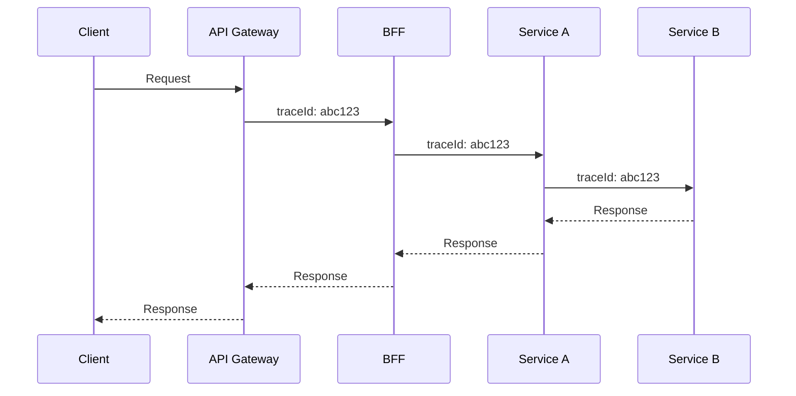

# 📡 Observability in Practice

  

---

## 🎯 1. The Goal

When something goes wrong in production at 2am, you should be able to answer these questions **without touching any server or running any queries manually:**

1. Which service is failing, and since when?
2. What errors are occurring and how often?
3. What was the exact request that triggered the failure?
4. Which user / order / provider was affected?
5. What did the service call downstream, and did that call fail?

This guide shows you **exactly how to set up** logging, metrics, and tracing so these questions are answerable. Examples that use **Spring Boot, Logback, Micrometer, and Actuator** are the **Reference Implementation (JVM)** for {Company}; the **same outcomes** (JSON logs, RED metrics, trace propagation) are required in **Node.js**, **Go**, **Python**, and other stacks using their standard libraries.

---

## 📡 2. Logging in Practice

**Principle:** Emit **structured JSON** on stdout with the required fields from [Observability Standards](./01-observability-standards.md). The wiring below is JVM-specific.

### 2.1 Setup

**Reference Implementation (JVM / Spring Boot / Logback):** The platform BOM includes the correct Logback configuration. Verify this in your `build.gradle.kts`:

**Substitution points:** **Node.js** (pino, winston with JSON), **Python** (structlog, logging JSON formatter), **Go** (zap, zerolog), **.NET** (Serilog compact JSON) - all must output the same field contract.

```kotlin
// These are included in platform BOM - no versions needed
implementation("net.logstash.logback:logstash-logback-encoder")
implementation("org.slf4j:slf4j-api")
```

`src/main/resources/logback-spring.xml` - copy this exactly (Reference Implementation):

```xml
<?xml version="1.0" encoding="UTF-8"?>
<configuration>
    <springProperty scope="context" name="appName" source="spring.application.name"/>
    <springProperty scope="context" name="appVersion" source="application.version" defaultValue="unknown"/>
    <springProperty scope="context" name="environment" source="spring.profiles.active" defaultValue="local"/>

    <appender name="JSON_CONSOLE" class="ch.qos.logback.core.ConsoleAppender">
        <encoder class="net.logstash.logback.encoder.LogstashEncoder">
            <customFields>{"service":"${appName}","version":"${appVersion}","environment":"${environment}"}</customFields>
            <fieldNames>
                <timestamp>timestamp</timestamp>
                <message>message</message>
                <logger>logger</logger>
                <thread>thread</thread>
                <levelValue>[ignore]</levelValue>
            </fieldNames>
        </encoder>
    </appender>

    <!-- Suppress noisy framework logs -->
    <logger name="org.springframework" level="WARN"/>
    <logger name="org.hibernate.SQL" level="WARN"/>
    <logger name="com.zaxxer.hikari" level="WARN"/>
    <logger name="org.apache.kafka" level="WARN"/>

    <!-- Your application logs at INFO -->
    <logger name="com.{company}" level="INFO"/>

    <root level="INFO">
        <appender-ref ref="JSON_CONSOLE"/>
    </root>
</configuration>
```

### 2.2 The Logger Pattern

**Reference Implementation (Java / SLF4J):** In every class that needs logging:

```java
import org.slf4j.Logger;
import org.slf4j.LoggerFactory;

public class OrderService {

    // One logger per class - use the class as the name
    private static final Logger log = LoggerFactory.getLogger(OrderService.class);

    // ...
}
```

### 2.3 Correlation ID - Propagating the Request ID

Every request that enters the system gets a correlation ID. This ID must flow through every log line so you can reconstruct a full request trace.

**Reference Implementation (Java / Spring MVC / Kafka):**

**Step 1: Extract it from the incoming request (in a filter)**

```java
@Component
@Order(1)
public class CorrelationIdFilter implements Filter {

    public static final String CORRELATION_ID_HEADER = "X-Correlation-ID";
    public static final String CORRELATION_ID_MDC_KEY = "correlationId";

    @Override
    public void doFilter(ServletRequest req, ServletResponse res, FilterChain chain)
            throws IOException, ServletException {

        HttpServletRequest request = (HttpServletRequest) req;
        HttpServletResponse response = (HttpServletResponse) res;

        // Use the incoming correlation ID, or generate one if not present
        String correlationId = Optional
            .ofNullable(request.getHeader(CORRELATION_ID_HEADER))
            .filter(s -> !s.isBlank())
            .orElse(UUID.randomUUID().toString());

        // Put it in MDC - every log line in this thread will include it automatically
        MDC.put(CORRELATION_ID_MDC_KEY, correlationId);

        // Echo it back in the response
        response.setHeader(CORRELATION_ID_HEADER, correlationId);

        try {
            chain.doFilter(req, res);
        } finally {
            MDC.clear();  // Always clear MDC at the end of the request
        }
    }
}
```

**Step 2: Propagate it on outbound HTTP calls**

```java
@Bean
public RestClient pricingServiceRestClient() {
    return RestClient.builder()
        .baseUrl("http://pricing-service.pricing.svc.cluster.local")
        .requestInterceptor((request, body, execution) -> {
            // Forward the correlation ID to downstream services
            String correlationId = MDC.get(CorrelationIdFilter.CORRELATION_ID_MDC_KEY);
            if (correlationId != null) {
                request.getHeaders().add("X-Correlation-ID", correlationId);
            }
            return execution.execute(request, body);
        })
        .build();
}
```

**Step 3: Include it in Kafka message headers**

```java
public void publish(OrderCompletedEvent event) {
    ProducerRecord<String, OrderCompletedAvro> record =
        new ProducerRecord<>(TOPIC, event.getOrderId().value(), toAvro(event));

    // Forward correlation ID into Kafka message headers
    String correlationId = MDC.get(CorrelationIdFilter.CORRELATION_ID_MDC_KEY);
    if (correlationId != null) {
        record.headers().add("X-Correlation-ID", correlationId.getBytes(StandardCharsets.UTF_8));
    }

    kafkaTemplate.send(record);
}
```

**Step 4: Extract it in Kafka consumers**

```java
@KafkaListener(topics = "orders.order.completed", ...)
public void consume(@Payload OrderCompletedAvro event,
                    @Headers MessageHeaders headers,
                    Acknowledgment acknowledgment) {

    // Restore correlation ID from Kafka header
    byte[] correlationIdBytes = (byte[]) headers.get("X-Correlation-ID");
    String correlationId = correlationIdBytes != null
        ? new String(correlationIdBytes, StandardCharsets.UTF_8)
        : UUID.randomUUID().toString();

    MDC.put("correlationId", correlationId);
    MDC.put("orderId", event.getOrderId());

    try {
        paymentService.capturePayment(event.getOrderId());
        acknowledgment.acknowledge();
    } finally {
        MDC.clear();
    }
}
```

### 2.4 What Good Log Lines Look Like

```java
@Service
public class OrderService {

    private static final Logger log = LoggerFactory.getLogger(OrderService.class);

    public Order requestOrder(CustomerId customerId, Location dispatch, Location delivery) {
        // Log the start of a business operation with key IDs
        log.info("Requesting order. customerId={}, dispatch={},{}", customerId, dispatch.lat(), dispatch.lng());

        Order order = Order.request(customerId, dispatch, delivery);
        orderRepository.save(order);

        // Log completion with IDs that will help debugging
        log.info("Order requested. orderId={}, customerId={}", order.getId(), customerId);

        eventPublisher.publish(new OrderRequestedEvent(order));
        return order;
    }

    public Order completeOrder(OrderId orderId) {
        log.info("Completing order. orderId={}", orderId);

        Order order = orderRepository.findById(orderId)
            .orElseThrow(() -> {
                log.warn("Order not found. orderId={}", orderId);  // WARN, not ERROR - expected case
                return new OrderNotFoundException(orderId);
            });

        PriceAmount price = pricingPort.calculateFinalPrice(orderId);
        order.complete(price);
        orderRepository.save(order);

        log.info("Order completed. orderId={}, priceAmount={}, durationSecs={}",
            orderId, price.amountInCents() / 100.0, order.getDurationSeconds());

        return order;
    }
}
```

Output (as JSON, with correlation ID automatically included from MDC):
```json
{
  "timestamp": "2026-11-15T14:30:01.123Z",
  "level": "INFO",
  "service": "orders-service",
  "environment": "production",
  "correlationId": "req-01HXYZ",
  "traceId": "01ARZ3NDEKTSV4RRFFQ69G5FAV",
  "message": "Order completed. orderId=order-abc123, priceAmount=12.50, durationSecs=847"
}
```

---

## 📡 3. Metrics in Practice

**Principle:** Expose a **Prometheus scrape endpoint** and **RED** metrics for HTTP services. Path and library names depend on the runtime.

### 3.1 Setup - Already Done

**Reference Implementation (Spring Boot / Micrometer):** Actuator + Micrometer Prometheus registry are in the platform BOM. Verify your `application.yml`:

```yaml
management:
  endpoints:
    web:
      exposure:
        include: health, info, prometheus, metrics
  metrics:
    tags:
      service: ${spring.application.name}
      environment: ${spring.profiles.active}
```

Spring Boot auto-instruments HTTP requests, JVM, and database connection pools. **Node.js:** `prom-client` with `express-prometheus-middleware` or OpenTelemetry metrics; **Go:** `prometheus/client_golang`; **Python:** `prometheus_client` with framework middleware - align metric names and labels with platform conventions.

### 3.2 Adding Business Metrics

**Reference Implementation (Java / Micrometer):**

```java
@Service
public class OrderService {

    private final MeterRegistry meterRegistry;
    private final Counter orderRequestedCounter;
    private final Counter orderCompletedCounter;
    private final Counter orderCancelledCounter;
    private final Timer orderDurationTimer;

    public OrderService(MeterRegistry meterRegistry, ...) {
        this.meterRegistry = meterRegistry;

        // Pre-register counters for better performance
        this.orderRequestedCounter = Counter.builder("orders.requested")
            .description("Total orders requested")
            .register(meterRegistry);

        this.orderCompletedCounter = Counter.builder("orders.completed")
            .description("Total orders completed")
            .register(meterRegistry);

        this.orderCancelledCounter = Counter.builder("orders.cancelled")
            .description("Total orders cancelled")
            .register(meterRegistry);

        this.orderDurationTimer = Timer.builder("orders.duration")
            .description("Duration of completed orders in seconds")
            .register(meterRegistry);
    }

    public Order requestOrder(CustomerId customerId, Location dispatch, Location delivery) {
        Order order = Order.request(customerId, dispatch, delivery);
        orderRepository.save(order);
        orderRequestedCounter.increment();   // ← increment the counter
        return order;
    }

    public Order completeOrder(OrderId orderId) {
        Order order = /* ... find and complete ... */;

        orderCompletedCounter.increment();

        // Record order duration as a histogram
        orderDurationTimer.record(order.getDurationSeconds(), TimeUnit.SECONDS);

        // With tags - allows filtering in Grafana
        meterRegistry.counter("orders.completed.by.type",
            "service_type", order.getServiceType().name(),
            "region", order.getRegion()
        ).increment();

        return order;
    }
}
```

### 3.3 Verifying Metrics Locally

**Reference Implementation:** scrape path is `/actuator/prometheus` on Spring Boot. Replace with your service's metrics path if different.

```bash
# Start your service, then:
curl http://localhost:8080/actuator/prometheus | grep "orders_"

# You should see:
# orders_requested_total 42.0
# orders_completed_total 38.0
# orders_cancelled_total 4.0
# orders_duration_seconds_bucket{le="60"} 25.0
# orders_duration_seconds_bucket{le="300"} 35.0
# orders_duration_seconds_sum 12450.0
# orders_duration_seconds_count 38.0
```

### 3.4 Basic Grafana Queries

These queries assume **Micrometer** HTTP metric names (`http_server_requests_*`). **Substitution:** map to your stack's HTTP histogram and counter names (for example `http_requests_*` from other Prometheus instrumentation).

```promql
# Request rate (requests per second, over last 5 minutes)
rate(http_server_requests_seconds_count{service="orders-service"}[5m])

# Error rate (% of 5xx responses)
rate(http_server_requests_seconds_count{service="orders-service",status=~"5.."}[5m])
/ rate(http_server_requests_seconds_count{service="orders-service"}[5m]) * 100

# P99 latency
histogram_quantile(0.99,
  rate(http_server_requests_seconds_bucket{service="orders-service"}[5m])
)

# Business metric: orders completed per minute
rate(orders_completed_total{service="orders-service"}[1m]) * 60

# Reference Implementation (JVM): heap usage
jvm_memory_used_bytes{service="orders-service", area="heap"}
/ jvm_memory_max_bytes{service="orders-service", area="heap"} * 100

# Node.js (examples - names depend on exporter): event loop lag, heap
# nodejs_eventloop_lag_seconds{service="orders-service"}
# process_resident_memory_bytes{service="orders-service"}

# Go (examples): goroutines and memory
# go_goroutines{service="orders-service"}
# process_resident_memory_bytes{service="orders-service"}

# Reference Implementation (JVM / HikariCP): DB pool saturation
hikaricp_connections_active{service="orders-service"}
/ hikaricp_connections_max{service="orders-service"} * 100
```

---

## 📡 4. Distributed Tracing in Practice

**Principle:** Use **OpenTelemetry** end to end (W3C `traceparent`, OTLP to the platform collector, export to X-Ray or Tempo). Prefer **auto-instrumentation** (language agent or official zero-code packages) before hand-rolling context propagation.

**Visual overview:**



### 4.1 Setup - OpenTelemetry language agent (JVM)

**Reference Implementation (Java):** Attach the OpenTelemetry **Java** language agent via the Dockerfile. No code changes needed for basic tracing on the JVM.

**Substitution points:** **Node.js** - run with `node --require @opentelemetry/auto-instrumentations-node/register` or the OpenTelemetry Operator Node image; **Python** - `opentelemetry-instrument` your ASGI/WSGI server; **Go** - compile in OTel Go SDK and selected `otelhttp` / gRPC instrumentations (no single agent; same env vars where supported).

```dockerfile
FROM amazoncorretto:21-alpine

# Download the OTel Java language agent
ADD https://github.com/open-telemetry/opentelemetry-java-instrumentation/releases/v{version}/download/opentelemetry-javaagent.jar /app/otel-agent.jar

COPY build/libs/orders-service.jar /app/service.jar

ENTRYPOINT ["java", \
  "-javaagent:/app/otel-agent.jar", \
  "-jar", "/app/service.jar"]
```

Set in Helm values (environment variables):
```yaml
env:
  OTEL_SERVICE_NAME: orders-service
  OTEL_EXPORTER_OTLP_ENDPOINT: http://otel-collector.platform.svc.cluster.local:4318
  OTEL_RESOURCE_ATTRIBUTES: "deployment.environment=production,service.version=2.14.3"
```

The Java language agent automatically traces Spring MVC, JDBC, Kafka, and common HTTP clients. Other runtimes get equivalent coverage from their OTel packages.

### 4.2 Adding Custom Spans

For important business operations, add custom spans with the OpenTelemetry API in your language.

**Reference Implementation (Java):**

```java
import io.opentelemetry.api.trace.Tracer;
import io.opentelemetry.api.trace.Span;
import io.opentelemetry.api.trace.StatusCode;
import io.opentelemetry.context.Scope;

@Service
public class OrderService {

    private final Tracer tracer;

    public OrderService(OpenTelemetry openTelemetry) {
        this.tracer = openTelemetry.getTracer("orders-service");
    }

    public AssignmentResult assignProvider(Order order) {
        // Create a span to track the fulfillment operation specifically
        Span span = tracer.spanBuilder("fulfillment.assignProvider")
            .setAttribute("order.id", order.getId().value())
            .setAttribute("order.region", order.getRegion())
            .setAttribute("order.service_type", order.getServiceType().name())
            .startSpan();

        try (Scope scope = span.makeCurrent()) {
            AssignmentResult result = fulfillmentServiceClient.findBestProvider(order);

            span.setAttribute("assignment.provider_id", result.getProviderId().value());
            span.setAttribute("assignment.distance_km", result.getDistanceKm());
            return result;

        } catch (Exception e) {
            span.recordException(e);
            span.setStatus(StatusCode.ERROR, e.getMessage());
            throw e;
        } finally {
            span.end();
        }
    }
}
```

### 4.3 Reading a Trace

A complete order request trace looks like:

```
POST /v1/orders (customer-bff) ──────────────────── 450ms
  └── POST /v1/orders (orders-service) ─────────── 420ms
        ├── SELECT * FROM orders (postgres) ──────── 5ms
        ├── GET /v1/price-estimate (pricing-service) 85ms
        │     └── SELECT * FROM pricing_rules ──────── 3ms
        ├── fulfillment.assignProvider ─────────────── 180ms
        │     └── POST /v1/assign (fulfillment-service) 178ms
        │           └── GEORADIUS providers (redis) ── 2ms
        ├── INSERT INTO orders (postgres) ─────────── 8ms
        └── PRODUCE orders.order.requested (kafka) ─── 12ms
```

If something is slow, you can see exactly where the time is spent. If pricing takes 85ms when it should take 20ms, that's your starting point.

### 4.4 Connecting Logs to Traces

**Reference Implementation (JVM):** The OpenTelemetry Java agent injects `traceId` and `spanId` into **MDC**; Logback (section 2.1) picks them up. **Node.js** - use a logging + OTel bridge (for example OpenTelemetry log correlation); **Python** - OTel logging handler or context vars; **Go** - attach trace fields in your structured logger from `span.SpanContext()`.

This means you can:
1. See a slow trace in X-Ray or Grafana Tempo
2. Copy the `traceId`
3. Search OpenSearch for logs with that `traceId`
4. Get all the log lines from that specific request across all services

---

## 👁️ 5. Health Checks

**Principle:** Expose **liveness** and **readiness** (or a single health surface split by probe) so Kubernetes can restart stuck processes and stop routing to unprepared instances. Implementations differ by framework.

**Reference Implementation (Spring Boot Actuator):** Configure as follows:

```yaml
management:
  endpoint:
    health:
      show-details: always          # Show details in all environments (internal only)
      probes:
        enabled: true               # Enable /actuator/health/liveness and /readiness
  health:
    db:
      enabled: true                 # Check DB connection
    kafka:
      enabled: true                 # Check Kafka connectivity
    redis:
      enabled: true                 # Check Redis connectivity
    diskspace:
      enabled: false                # Not useful in containers
```

```bash
# What Kubernetes calls:
curl http://localhost:8080/actuator/health/liveness
# → {"status":"UP"}  or  {"status":"DOWN"}

curl http://localhost:8080/actuator/health/readiness
# → {"status":"UP"}  or  {"status":"OUT_OF_SERVICE"}

# Detailed view (for debugging):
curl http://localhost:8080/actuator/health
# → {
#     "status": "UP",
#     "components": {
#       "db": {"status": "UP", "details": {"database": "PostgreSQL", "validationQuery": "isValid()"}},
#       "kafka": {"status": "UP"},
#       "redis": {"status": "UP"}
#     }
#   }
```

**Liveness vs Readiness:**
- **Liveness:** Is the **process** alive and not deadlocked? If DOWN → Kubernetes restarts the pod (on JVM this is often "is the JVM responsive"; other runtimes use the same idea).
- **Readiness:** Is the service ready to accept traffic? If DOWN → Kubernetes stops sending traffic (but doesn't restart).

Use readiness to signal "I'm starting up" or "I've lost my DB connection - stop sending me requests."

---

## 📋 6. Observability Checklist

Before going to production, verify each item. **Reference Implementation** URLs use **Actuator** on port 8080; adjust paths and ports for your stack.

```bash
# 1. Logs are JSON
curl -s http://localhost:8080/actuator/health  # trigger a request (Spring)
docker logs {container_id} | python3 -m json.tool  # must parse as JSON

# 2. Correlation ID appears in logs
curl -H "X-Correlation-ID: test-123" http://localhost:8080/v1/orders
docker logs {container_id} | grep "test-123"  # must appear

# 3. Metrics endpoint is working
curl http://localhost:8080/actuator/prometheus | head -50

# 4. Health endpoint responds
curl http://localhost:8080/actuator/health/readiness

# 5. Business metrics appear after an operation
curl -X POST http://localhost:8080/v1/orders ...
curl http://localhost:8080/actuator/prometheus | grep "orders_requested"
```

---

<div align="center">

⬅️ [Back to section](./README.md) · 🏠 [Back to root](../README.md)

</div>
