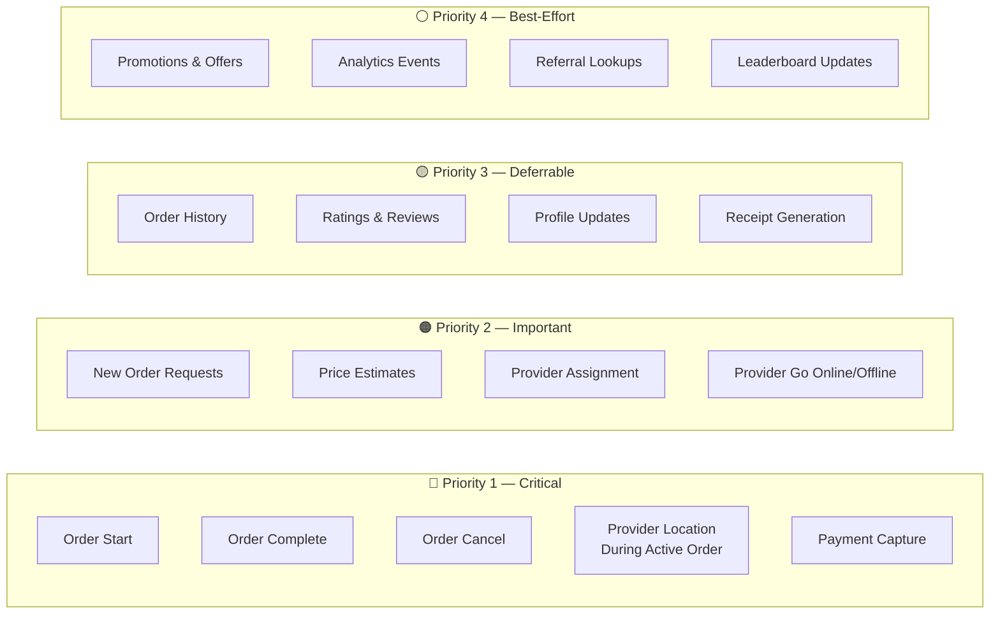
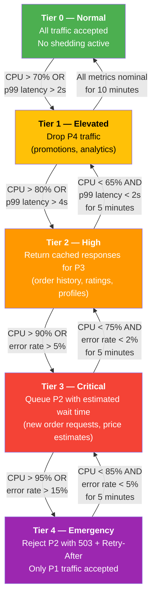
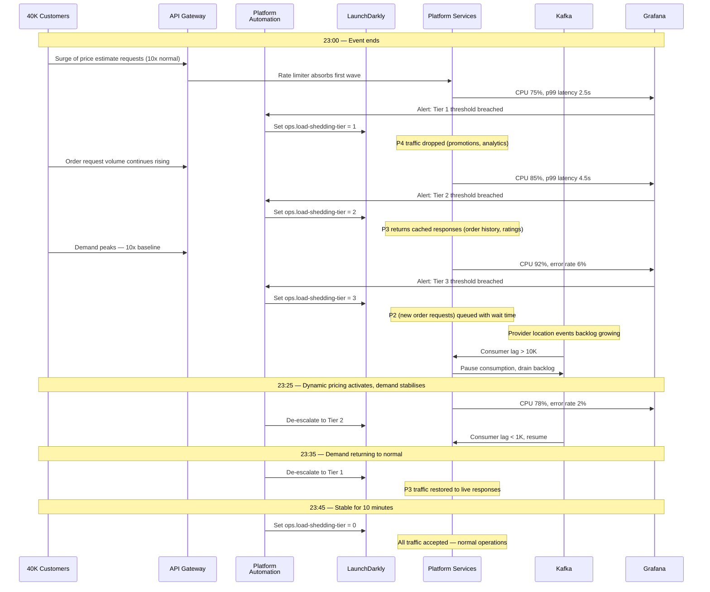
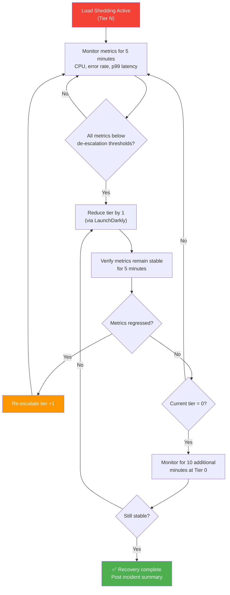

# Load Shedding & Backpressure Guide

> **Status:** Mandated  
> **Owner:** Platform Engineering  
> **Last Updated:** 2025

---

## 1. Why Load Shedding Matters

The platform operates in an environment where demand is inherently spiky. Seasonal peaks, promotional events, or sudden surges in activity can **10x normal request volume** in a matter of minutes.

Without load shedding:
- Every service degrades simultaneously
- Active orders fail alongside new requests
- Providers mid-order lose location updates
- Payment captures time out and retry endlessly
- The entire platform becomes unusable for everyone

With load shedding:
- **Critical functions survive** — a customer with an active order completes it safely
- Non-critical functions degrade gracefully — a customer browsing promotions sees a cached page
- New requests are queued with honest wait times — not silently dropped
- The platform recovers automatically as demand subsides

**The principle is simple: when you can't serve everyone, serve the most important requests first and shed the rest deliberately.**

---

## 2. Request Priority Classification

Every API endpoint in the platform is assigned a priority level. This classification determines which requests survive during overload.



### Priority Reference Table

| Priority | Label | Description | Shedding Behaviour |
|----------|-------|-------------|-------------------|
| **P1** | Critical | Operations for orders already in progress. Failure here means a customer stranded or a provider not paid. | **Never shed.** These requests are always accepted. |
| **P2** | Important | Operations that initiate new orders. Failure means lost revenue but no safety impact. | Queued with wait time at Tier 3; rejected with `Retry-After` at Tier 4. |
| **P3** | Deferrable | Read-heavy or eventually-consistent operations. Users can tolerate staleness. | Return cached/stale responses at Tier 2+. |
| **P4** | Best-Effort | Non-essential background operations. Users won't notice they're missing. | Dropped first, starting at Tier 1. |

### How Priority is Assigned

Every request entering the platform carries a priority header set by the API Gateway based on the endpoint path:

```yaml
# api-gateway priority mapping (Kong plugin config)
priority-classification:
  rules:
    - path_prefix: /api/v1/orders/*/start
      priority: P1
    - path_prefix: /api/v1/orders/*/complete
      priority: P1
    - path_prefix: /api/v1/orders/*/cancel
      priority: P1
    - path_prefix: /api/v1/providers/*/location
      priority: P1
      condition: "header:X-Active-Order exists"
    - path_prefix: /api/v1/payments/capture
      priority: P1

    - path_prefix: /api/v1/orders
      methods: [POST]
      priority: P2
    - path_prefix: /api/v1/price-estimates
      priority: P2
    - path_prefix: /api/v1/fulfillment
      priority: P2

    - path_prefix: /api/v1/orders/history
      priority: P3
    - path_prefix: /api/v1/ratings
      priority: P3
    - path_prefix: /api/v1/users/*/profile
      methods: [PUT, PATCH]
      priority: P3

    - path_prefix: /api/v1/promotions
      priority: P4
    - path_prefix: /api/v1/analytics
      priority: P4
```

---

## 3. Load Shedding Tiers

The platform operates on a five-tier escalation model. Each tier is a strict superset of the previous — Tier 3 includes all actions from Tiers 1 and 2.



### Tier Escalation Criteria

| Tier | Trigger Condition | P4 | P3 | P2 | P1 |
|------|------------------|----|----|----|----|
| 0 — Normal | All metrics nominal | ✅ Accept | ✅ Accept | ✅ Accept | ✅ Accept |
| 1 — Elevated | CPU > 70% OR p99 > 2s | ❌ Drop | ✅ Accept | ✅ Accept | ✅ Accept |
| 2 — High | CPU > 80% OR p99 > 4s | ❌ Drop | 📦 Cached | ✅ Accept | ✅ Accept |
| 3 — Critical | CPU > 90% OR errors > 5% | ❌ Drop | 📦 Cached | ⏳ Queued | ✅ Accept |
| 4 — Emergency | CPU > 95% OR errors > 15% | ❌ Drop | 📦 Cached | 🚫 Reject (503) | ✅ Accept |

### De-escalation Hysteresis

Tiers are escalated immediately but de-escalated slowly. Each lower tier requires stable metrics for **5 minutes** before stepping down. Return to Tier 0 requires **10 minutes** of nominal operation. This prevents flapping during oscillating load.

---

## 4. Implementation

### 4.1 Load Shedding Interceptor

The core mechanism is a Spring `HandlerInterceptor` that checks the current shedding tier (sourced from a LaunchDarkly operational flag) against the request's priority.

```java
@Component
@Order(Ordered.HIGHEST_PRECEDENCE)
public class LoadSheddingInterceptor implements HandlerInterceptor {

    private static final Logger log = LoggerFactory.getLogger(LoadSheddingInterceptor.class);
    private static final String PRIORITY_HEADER = "X-Request-Priority";
    private static final String SHEDDING_TIER_FLAG = "ops.load-shedding-tier";

    private final LDClient launchDarkly;
    private final MeterRegistry meterRegistry;
    private final RequestQueueService requestQueueService;

    public LoadSheddingInterceptor(LDClient launchDarkly,
                                   MeterRegistry meterRegistry,
                                   RequestQueueService requestQueueService) {
        this.launchDarkly = launchDarkly;
        this.meterRegistry = meterRegistry;
        this.requestQueueService = requestQueueService;
    }

    @Override
    public boolean preHandle(HttpServletRequest request,
                             HttpServletResponse response,
                             Object handler) throws Exception {

        int currentTier = launchDarkly.intVariation(
            SHEDDING_TIER_FLAG, LDContext.builder("system").build(), 0
        );

        if (currentTier == 0) {
            return true;
        }

        String priority = request.getHeader(PRIORITY_HEADER);
        if (priority == null) {
            priority = "P4";
        }

        return switch (priority) {
            case "P1" -> true;

            case "P2" -> handleImportantRequest(currentTier, request, response);

            case "P3" -> handleDeferrableRequest(currentTier, request, response);

            case "P4" -> {
                if (currentTier >= 1) {
                    recordShed(priority, currentTier);
                    response.setStatus(HttpServletResponse.SC_SERVICE_UNAVAILABLE);
                    response.setHeader("Retry-After", "120");
                    response.getWriter().write(
                        "{\"error\":\"service_overloaded\",\"message\":\"Please try again later\"}"
                    );
                    yield false;
                }
                yield true;
            }

            default -> true;
        };
    }

    private boolean handleImportantRequest(int tier,
                                           HttpServletRequest request,
                                           HttpServletResponse response) throws Exception {
        if (tier >= 4) {
            recordShed("P2", tier);
            response.setStatus(HttpServletResponse.SC_SERVICE_UNAVAILABLE);
            response.setHeader("Retry-After", "30");
            response.getWriter().write(
                "{\"error\":\"capacity_exceeded\",\"message\":\"High demand — please retry shortly\",\"retryAfterSeconds\":30}"
            );
            return false;
        }
        if (tier >= 3) {
            Duration estimatedWait = requestQueueService.enqueue(request);
            response.setStatus(HttpServletResponse.SC_ACCEPTED);
            response.getWriter().write(
                "{\"status\":\"queued\",\"estimatedWaitSeconds\":" + estimatedWait.getSeconds() + "}"
            );
            return false;
        }
        return true;
    }

    private boolean handleDeferrableRequest(int tier,
                                            HttpServletRequest request,
                                            HttpServletResponse response) throws Exception {
        if (tier >= 2) {
            recordShed("P3", tier);
            response.setStatus(HttpServletResponse.SC_OK);
            response.setHeader("X-Served-From-Cache", "true");
            return true; // Let it through to a cache-only handler
        }
        return true;
    }

    private void recordShed(String priority, int tier) {
        meterRegistry.counter("{company}.load_shedding.requests_shed",
            "priority", priority,
            "tier", String.valueOf(tier)
        ).increment();
        log.info("Request shed. priority={}, tier={}", priority, tier);
    }
}
```

### 4.2 Manual Activation via LaunchDarkly

Load shedding tiers can be activated automatically (by platform automation monitoring metrics) or **manually** by an on-call engineer using LaunchDarkly kill switches.

| Flag Key | Type | Values | Purpose |
|----------|------|--------|---------|
| `ops.load-shedding-tier` | Integer | `0`–`4` | Sets the current shedding tier globally |
| `ops.shed-p4-traffic` | Boolean | `true`/`false` | Quick kill switch for all P4 traffic |
| `ops.shed-promotions` | Boolean | `true`/`false` | Disable promotions endpoint specifically |
| `ops.queue-new-orders` | Boolean | `true`/`false` | Queue new order requests with wait time |

Manual activation is appropriate when:
- An expected event is approaching (promotional event, national holiday)
- You want to pre-emptively protect the platform before metrics degrade
- Automated escalation is too slow for the rate of change

---

## 5. Kafka Backpressure

Not all load arrives via HTTP. Kafka consumers can also be overwhelmed when producers spike — for example, when thousands of provider location updates pour in during a demand surge.

### 5.1 The Problem

If a consumer cannot process messages fast enough, the consumer lag grows. Unbounded lag causes:
- Stale data being processed (location update from 5 minutes ago is useless)
- Memory pressure as the consumer buffers messages
- Eventually, data loss if retention expires before processing catches up

### 5.2 Pause/Resume Strategy

Spring Kafka provides a native `pause()` / `resume()` API on the `KafkaListenerEndpointRegistry`. The strategy:

1. Monitor consumer lag via `kafka_consumer_lag` metric
2. If lag exceeds threshold → **pause** consumption
3. Process the existing backlog
4. When backlog is drained → **resume** consumption

```java
@Component
public class KafkaBackpressureManager {

    private static final Logger log = LoggerFactory.getLogger(KafkaBackpressureManager.class);
    private static final long LAG_THRESHOLD = 10_000;
    private static final long RESUME_THRESHOLD = 1_000;

    private final KafkaListenerEndpointRegistry registry;
    private final ConsumerLagService lagService;
    private final MeterRegistry meterRegistry;

    @Scheduled(fixedDelay = 5_000)
    public void checkBackpressure() {
        for (MessageListenerContainer container : registry.getAllListenerContainers()) {
            String listenerId = container.getListenerId();
            long currentLag = lagService.getLag(listenerId);

            if (currentLag > LAG_THRESHOLD && container.isRunning() && !container.isPauseRequested()) {
                log.warn("Pausing consumer due to high lag. listenerId={}, lag={}", listenerId, currentLag);
                container.pause();
                meterRegistry.counter("{company}.kafka.backpressure.pauses", "listener", listenerId).increment();
            }

            if (currentLag < RESUME_THRESHOLD && container.isPauseRequested()) {
                log.info("Resuming consumer after lag recovery. listenerId={}, lag={}", listenerId, currentLag);
                container.resume();
                meterRegistry.counter("{company}.kafka.backpressure.resumes", "listener", listenerId).increment();
            }
        }
    }
}
```

### 5.3 Configuration

```yaml
# application.yml
platform:
  kafka:
    backpressure:
      enabled: true
      lag-threshold: 10000         # Pause when lag exceeds this
      resume-threshold: 1000       # Resume when lag drops below this
      check-interval-ms: 5000     # How often to check

spring:
  kafka:
    consumer:
      max-poll-records: 500       # Limit batch size during recovery
      max-poll-interval-ms: 300000
    listener:
      concurrency: 3              # Parallel consumers per partition group
      ack-mode: MANUAL_IMMEDIATE  # Don't auto-commit until processed
```

---

## 6. API Gateway Rate Limiting

> **Note:** The primary API edge is AWS API Gateway + WAF (see `04-infrastructure-and-cloud/07-api-gateway-strategy.md`). Kong is referenced here as an alternative for service-level rate limiting within the mesh; the platform standard is API Gateway for external traffic.

Rate limiting at the API Gateway is the first line of defence — it rejects abusive or excessive traffic before it reaches application services.

### 6.1 Rate Limiting Dimensions

| Dimension | Scope | Purpose |
|-----------|-------|---------|
| **Per-user** | Individual authenticated user | Prevents a single user from hammering the API |
| **Per-client** | API key / OAuth client ID | Prevents a misbehaving integration from overloading |
| **Per-endpoint** | Specific API path | Protects expensive endpoints (price estimates, fulfillment) |
| **Global** | Entire API surface | Absolute ceiling to prevent platform-wide overload |

### 6.2 Token Bucket Algorithm

The platform uses the **token bucket** algorithm for rate limiting. Tokens are added at a fixed rate; each request consumes one token. If the bucket is empty, the request is rejected.

```
Bucket capacity:    100 tokens (burst allowance)
Refill rate:        20 tokens/second (sustained rate)

t=0:  bucket=100  → request accepted (bucket=99)
t=0:  burst of 80 → all accepted (bucket=19)
t=1:  bucket=39   → refilled 20 tokens
t=2:  bucket=59   → refilled 20 more
...
```

This allows short bursts (a customer opening the app and making several quick requests) while enforcing a sustained rate over time.

### 6.3 Rate Limit Configuration

```yaml
# Kong rate limiting plugin configuration
plugins:
  - name: rate-limiting-advanced
    config:
      # Per-user limits
      identifier: consumer
      strategy: redis
      redis:
        host: redis.{company}.internal
        port: 6379
        database: 1

      limits:
        # General API — per user
        - path: /api/v1/*
          per_user:
            second: 20
            minute: 300
            hour: 5000
          per_client:
            second: 100
            minute: 3000

        # Price estimates — expensive, protect heavily
        - path: /api/v1/price-estimates
          per_user:
            second: 5
            minute: 60
          per_client:
            second: 50
            minute: 500

        # Order creation — moderate protection
        - path: /api/v1/orders
          methods: [POST]
          per_user:
            second: 2
            minute: 20

        # Provider location updates — high frequency is expected
        - path: /api/v1/providers/*/location
          per_user:
            second: 2    # One update every 500ms is plenty
            minute: 120

      # Global ceiling
      global:
        second: 10000
        minute: 300000
```

### 6.4 Rate Limit Response

When rate-limited, the gateway returns:

```http
HTTP/1.1 429 Too Many Requests
Content-Type: application/json
X-RateLimit-Limit: 20
X-RateLimit-Remaining: 0
X-RateLimit-Reset: 1701234567
Retry-After: 3

{
  "error": "rate_limited",
  "message": "Too many requests — please slow down",
  "retryAfterSeconds": 3
}
```

### 6.5 Burst Handling

For expected traffic spikes (known events), the platform team can temporarily increase limits:

```bash
# Pre-event: increase rate limits for price estimates
curl -X PATCH http://kong-admin:8001/plugins/{price-estimate-rate-limit-id} \
  -d "config.limits[0].per_user.second=10" \
  -d "config.limits[0].per_user.minute=120"

# Post-event: revert
curl -X PATCH http://kong-admin:8001/plugins/{price-estimate-rate-limit-id} \
  -d "config.limits[0].per_user.second=5" \
  -d "config.limits[0].per_user.minute=60"
```

---

## 7. Worked Example: Event Surge

A major event ends at 23:00. 40,000 attendees open their apps simultaneously.



### Outcome

| Metric | Without Load Shedding | With Load Shedding |
|--------|-----------------------|--------------------|
| Active orders completed successfully | ~60% | **99.8%** |
| New order requests served | Platform crash — 0% | **85%** (15% queued briefly) |
| Promotions served | Platform crash — 0% | 0% (intentionally shed) |
| Mean recovery time | 25+ minutes (manual restart) | **< 5 minutes** (automatic) |
| Revenue impact | Severe — mass order failures | Minimal — only deferred traffic delayed |

---

## 8. Recovery Procedure

Exiting load shedding safely is as important as entering it. Dropping back to Tier 0 too quickly causes a "thundering herd" — all the queued and deferred traffic floods back simultaneously.



### Recovery Checklist

```
□  Current tier metrics are stable for 5+ minutes
□  Reduce tier by 1 via LaunchDarkly
□  Monitor error rate — no spike within 2 minutes
□  Monitor p99 latency — no regression
□  Monitor CPU utilisation — stays below threshold
□  Confirm Kafka consumer lag is nominal
□  Repeat until Tier 0 is reached
□  Hold at Tier 0 for 10 minutes
□  Confirm all service health checks pass
□  Post recovery summary to #incident channel
□  Update external status page if applicable
```

---

## 9. Monitoring & Alerting

### 9.1 Grafana Dashboard Panels

Every service dashboard should include a **Load Shedding** row with the following panels:

| Panel | Metric | Visualisation |
|-------|--------|---------------|
| **Current Shedding Tier** | `{company}_load_shedding_current_tier` | Stat panel (0–4 with colour thresholds) |
| **Rejected Requests/sec** | `rate({company}_load_shedding_requests_shed_total[1m])` | Time series, grouped by priority |
| **Queued Requests** | `{company}_load_shedding_queue_depth` | Gauge with warning threshold |
| **Shed Rate by Priority** | `sum by (priority)(rate({company}_load_shedding_requests_shed_total[5m]))` | Stacked area chart |
| **Kafka Consumer Lag** | `kafka_consumer_lag` | Time series per consumer group |
| **Rate Limit Rejections** | `kong_rate_limiting_rejections_total` | Time series per endpoint |

### 9.2 Alert Rules

```yaml
groups:
  - name: load-shedding
    rules:
      # P2 Alert: any load shedding activation
      - alert: LoadSheddingActivated
        expr: {company}_load_shedding_current_tier > 0
        for: 1m
        labels:
          severity: P2
        annotations:
          summary: "Load shedding active at Tier {{ $value }}"
          runbook: "https://wiki.{company}.internal/runbooks/load-shedding"

      # P1 Alert: Tier 3 or higher
      - alert: LoadSheddingCritical
        expr: {company}_load_shedding_current_tier >= 3
        for: 1m
        labels:
          severity: P1
        annotations:
          summary: "CRITICAL: Load shedding at Tier {{ $value }} — new order requests affected"
          runbook: "https://wiki.{company}.internal/runbooks/load-shedding#tier3"

      # Kafka backpressure alert
      - alert: KafkaConsumerPaused
        expr: {company}_kafka_backpressure_consumer_paused == 1
        for: 2m
        labels:
          severity: P2
        annotations:
          summary: "Kafka consumer {{ $labels.listener }} paused due to backpressure"

      # Rate limiting alert
      - alert: HighRateLimitRejections
        expr: rate(kong_rate_limiting_rejections_total[5m]) > 100
        for: 5m
        labels:
          severity: P3
        annotations:
          summary: "High rate of API rate limit rejections — possible abuse or misconfigured client"
```

### 9.3 PagerDuty Integration

| Alert | Severity | PagerDuty Action |
|-------|----------|-----------------|
| LoadSheddingActivated (Tier 1-2) | P2 | Notify on-call engineer via Slack + PagerDuty (low urgency) |
| LoadSheddingCritical (Tier 3+) | P1 | Page on-call engineer immediately (high urgency) |
| KafkaConsumerPaused | P2 | Notify on-call engineer |
| HighRateLimitRejections | P3 | Log to Slack channel for next-day review |

---

*← [Back to section](./README.md) · [Back to root](../README.md)*
