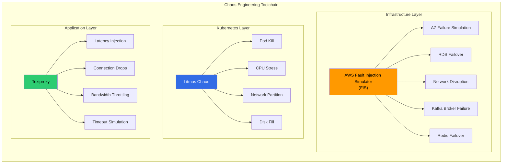
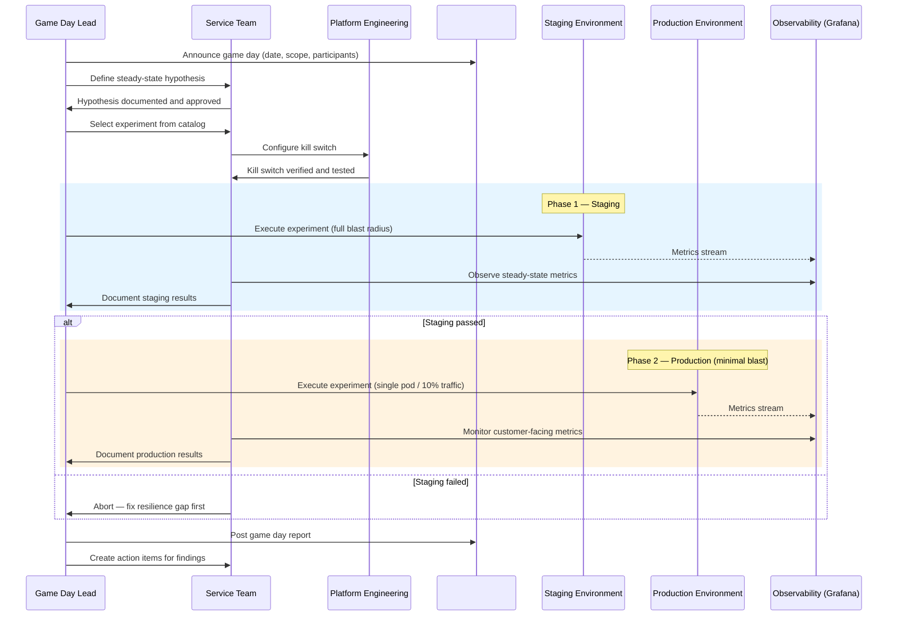
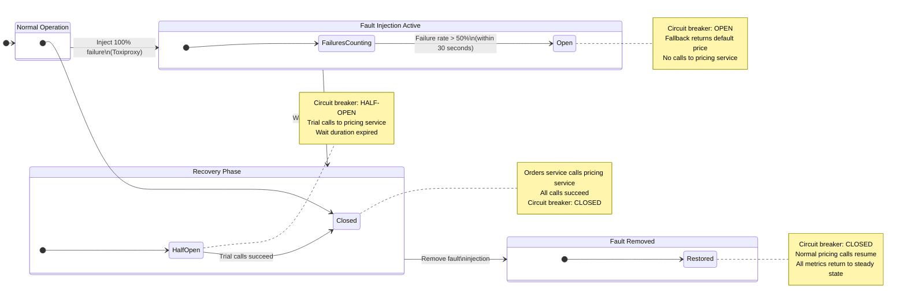
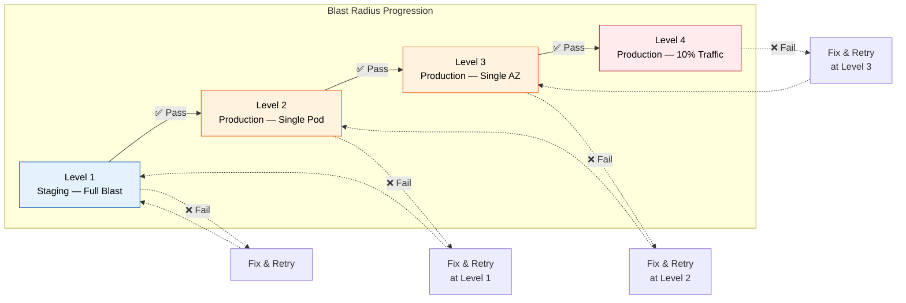

# Chaos Engineering Program

> **Status:** Mandated
> **Owner:** Platform Engineering
> **Last Updated:** 2025

---

## 1. Philosophy

You cannot be confident in circuit breakers you've never triggered, failover you've never tested, or load shedding you've never activated. Chaos engineering is how the platform builds that confidence.

Production systems are complex. They fail in unexpected ways — ways that unit tests, integration tests, and even staging environments cannot reproduce. Chaos engineering closes this gap by proactively injecting failures into production-like conditions and verifying that our resilience assumptions hold.

Chaos engineering is not optional. Every Tier-1 and Tier-2 service must participate in quarterly game days and maintain an experiment catalog that covers its critical failure modes.

---

## 2. Principles

| # | Principle | Detail |
|---|-----------|--------|
| 1 | **Start small, expand gradually** | Begin with a single pod in staging. Only after consistent success do you graduate to production, and only with minimal blast radius |
| 2 | **Always have a kill switch** | Every experiment must have an immediate abort mechanism. If the kill switch fails, the experiment is not approved |
| 3 | **Never run during freeze windows** | Change freeze windows exist for a reason. Chaos experiments are changes — they are subject to the same freeze |
| 4 | **Hypothesis first** | Document the steady-state hypothesis before the experiment. Without a hypothesis, you're just breaking things |
| 5 | **Automate rollback** | Manual rollback is not acceptable. The experiment must revert automatically when the kill switch is triggered or the duration expires |
| 6 | **Communicate transparently** | Announce all experiments in `#chaos-engineering`. No surprise chaos |

---

## 3. Tools

The platform uses a layered chaos toolchain, with each tool targeting a different level of the stack:



| Tool | Layer | Managed By | Fault Types |
|------|-------|-----------|-------------|
| **AWS FIS** | Infrastructure (AWS) | Platform Engineering | AZ failure, RDS failover, network disruption, Kafka broker failure, Redis failover |
| **Litmus** | Kubernetes | Platform Engineering | Pod kill, CPU stress, network partition, disk fill |
| **Toxiproxy** | Application | Service teams | Latency injection, connection drops, bandwidth throttling, timeout simulation |

---

## 4. Experiment Catalog

Every Tier-1 and Tier-2 service must maintain an experiment catalog. The table below shows the standard experiments that all qualifying services should implement:

| Experiment | Tool | Target | Expected Behavior | Blast Radius |
|-----------|------|--------|-------------------|--------------|
| **Pod kill** | Litmus | Single pod in target service | Kubernetes reschedules pod within 30s; no request failures due to readiness probe removal from Service endpoints | Single pod |
| **AZ failure** | FIS | Entire availability zone | Traffic shifts to remaining AZs; no customer-facing errors; latency increase < 20% | Single AZ |
| **Network latency injection** | Toxiproxy | Dependency calls (e.g., pricing → geolocation) | Circuit breaker opens if latency exceeds threshold; fallback activates; upstream callers degrade gracefully | Single dependency path |
| **Kafka broker failure** | FIS | Single MSK broker | Producers retry and rebalance to healthy brokers; consumers rebalance partitions; no message loss; processing delay < 60s | Single broker |
| **Redis failover** | FIS | ElastiCache primary node | Replica promotes to primary; cache miss spike handled by database; application reconnects automatically | Single Redis cluster |
| **Database failover** | FIS | RDS primary instance | Multi-AZ failover completes within 120s; connection pool reconnects; in-flight transactions retry; no data loss | Single RDS instance |
| **Dependency timeout** | Toxiproxy | Outbound HTTP calls to downstream service | Resilience4j timeout fires; circuit breaker opens after threshold; fallback response returned to caller | Single dependency |

---

## 5. Game Day Process

The platform runs quarterly game days — structured chaos exercises that simulate real-world failure scenarios with full incident response.



### Game Day Cadence

| Frequency | Activity | Participants |
|-----------|----------|-------------|
| **Quarterly** | Full game day with incident response simulation | All Tier-1 service teams, Platform Engineering, SRE on-call |
| **Monthly** | Automated experiment runs in staging (regression) | Platform Engineering (automated) |
| **Per release** | Smoke chaos test for critical path changes | Service team releasing the change |

---

## 6. Steady-State Hypothesis

Before injecting chaos, define what "normal" looks like. Without a steady-state hypothesis, you are just breaking things — not engineering resilience.

### Hypothesis Template

```
SERVICE:       [service name]
METRIC:        [metric name and source]
STEADY STATE:  [expected value/range under normal conditions]
TOLERANCE:     [acceptable deviation during chaos]
MEASUREMENT:   [how and where to observe — Grafana dashboard, CloudWatch alarm]
```

### Example — Fulfillment Engine

| Component | Metric | Steady State | Tolerance During Chaos |
|-----------|--------|-------------|----------------------|
| Fulfillment engine | Assignments processed per minute | > 100 assignments/min | > 80 assignments/min (20% degradation allowed) |
| Fulfillment engine | P99 latency | < 3s | < 5s |
| Fulfillment engine | Error rate | < 0.1% | < 1% |
| Fulfillment engine | Circuit breaker state | Closed | Open is acceptable if fallback activates |

If steady-state metrics breach the tolerance bounds during chaos, the experiment has revealed a resilience gap. This is a success — the experiment did its job. The team must then fix the gap before the next game day.

---

## 7. Circuit Breaker Validation

Circuit breakers are the most critical resilience pattern on the platform. A circuit breaker that has never been triggered in a realistic scenario is a liability, not an asset. This worked example shows how to validate a Resilience4j circuit breaker using chaos engineering.

### Worked Example: Pricing Service Circuit Breaker

**Hypothesis:** When the pricing service is fully unavailable, the orders service circuit breaker opens within 30 seconds and returns a default price estimate via the fallback.



### Validation Steps

| Step | Action | Expected Result | Verify In |
|------|--------|----------------|-----------|
| 1 | Inject 100% failure rate on pricing service calls via Toxiproxy | All pricing calls fail with connection reset | Toxiproxy admin API |
| 2 | Wait up to 30 seconds | Resilience4j circuit breaker transitions to OPEN | Grafana → `resilience4j_circuitbreaker_state` metric |
| 3 | Verify fallback activates | Orders service returns default price estimate (not an error) | Application logs + API response |
| 4 | Wait for configured `waitDurationInOpenState` | Circuit breaker transitions to HALF-OPEN | Grafana |
| 5 | Remove fault injection | Trial call succeeds; circuit breaker transitions to CLOSED | Toxiproxy admin API + Grafana |
| 6 | Verify steady state | All metrics return to pre-experiment levels within 60 seconds | Grafana dashboard |

---

## 8. Blast Radius Control

Chaos experiments must follow a strict blast radius progression. Jumping directly to production-wide experiments is prohibited.



### Level Requirements

| Level | Environment | Blast Radius | Prerequisites | Approval |
|-------|------------|-------------|---------------|----------|
| **1** | Staging | Full blast (all pods, all traffic) | Hypothesis documented, kill switch tested | Service team lead |
| **2** | Production | Single pod | Level 1 passed, PagerDuty on-call aware | Service team lead + Platform Engineering |
| **3** | Production | Single AZ | Level 2 passed within last 30 days | Platform Engineering |
| **4** | Production | 10% of traffic | Level 3 passed within last 30 days | Platform Engineering + Engineering Manager |

Each level requires successful completion of the previous level. A failure at any level resets the progression — the team must fix the resilience gap and re-validate from one level below.

---

## 9. Safety Rules

| # | Rule | Rationale |
|---|------|-----------|
| 1 | **Never run during freeze windows** | Freeze windows protect stability during critical business periods. Chaos experiments are destabilizing by design |
| 2 | **Always have a kill switch** | Every experiment must be immediately reversible. If the kill switch mechanism fails during pre-checks, the experiment is cancelled |
| 3 | **Always announce in `#chaos-engineering`** | Transparency prevents confusion. On-call engineers must know that an experiment is in progress to avoid false incident escalations |
| 4 | **Never target payment service without CTO approval** | Payment processing is the highest-risk domain. Chaos experiments on payment paths require explicit CTO sign-off |
| 5 | **Always have a rollback plan** | Beyond the kill switch, teams must document the manual rollback steps in case automation fails |
| 6 | **Abort immediately if customer-facing impact detected** | If real customers are experiencing errors or degraded service, the experiment ends instantly — no exceptions |
| 7 | **No experiments on services without observability** | If you cannot measure the impact, you cannot run the experiment. Services must have structured logging, metrics, and tracing before participating |
| 8 | **Two-person rule for production experiments** | At least two engineers must be present for any production chaos experiment — one to run, one to monitor and abort |

---

## 10. Reporting

Every chaos experiment produces a post-experiment report. Reports are the institutional memory of our resilience posture — they track what we've validated, what we've found, and what we've fixed.

### Report Template

```
# Chaos Experiment Report

**Service:**          [service name]
**Date:**             [YYYY-MM-DD]
**Experiment:**       [experiment name from catalog]
**Tool:**             [FIS / Litmus / Toxiproxy]
**Blast Radius:**     [staging full / prod single pod / prod single AZ / prod 10%]
**Duration:**         [minutes]
**Participants:**     [names]

## Hypothesis
[Steady-state hypothesis — copied from pre-experiment doc]

## Result
**Hypothesis:** Confirmed / Disproved

## Metrics During Experiment
| Metric              | Steady State | During Chaos | Within Tolerance? |
|---------------------|-------------|-------------|-------------------|
| [metric 1]          | [value]     | [value]     | Yes / No          |
| [metric 2]          | [value]     | [value]     | Yes / No          |

## Customer Impact
[None / Description of impact and duration]

## Findings
1. [Finding 1]
2. [Finding 2]

## Action Items
| # | Action | Owner | Due Date | Ticket |
|---|--------|-------|----------|--------|
| 1 | [action] | [name] | [date] | [JIRA link] |

## Screenshots / Grafana Links
[Links to dashboards showing the experiment timeline]
```

### Report Storage

All reports are stored in `docs/chaos-reports/` in the service repository, following the naming convention:

```
docs/chaos-reports/YYYY-MM-DD-experiment-name.md
```

### Metrics Tracked Across Experiments

| Metric | Purpose |
|--------|---------|
| Experiments run (per quarter) | Measures program adoption |
| Hypotheses confirmed vs disproved | Tracks resilience maturity |
| Mean time to detect (during chaos) | Validates observability |
| Mean time to recover (after kill switch) | Validates recovery automation |
| Action items closed (within 30 days) | Tracks follow-through |

---

*← [Back to section](./README.md) · [Back to root](../README.md)*
