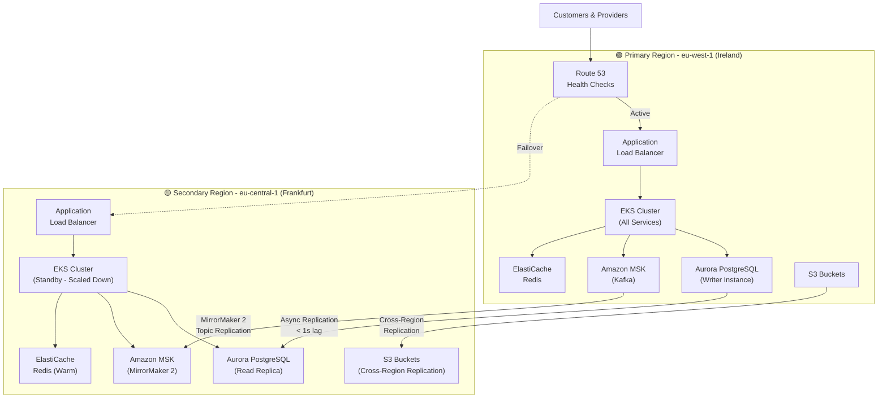
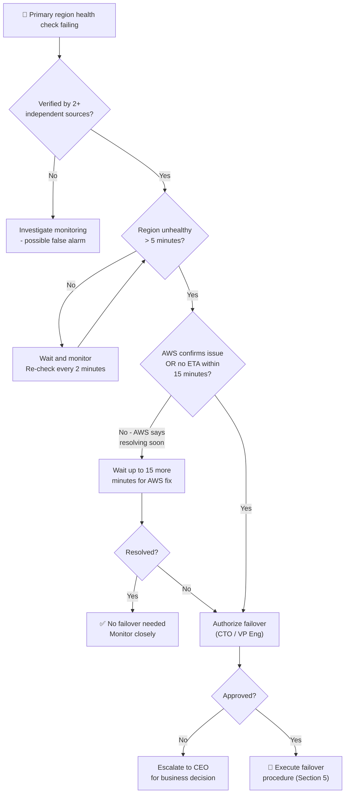

# 🔥 Disaster Recovery Playbook

  

---

## 🎯 1. Scope

This playbook covers **region-level failure recovery** - what to do when an entire cloud region becomes unavailable and the platform must fail over to a secondary region. Examples name **AWS**; principles apply to any hyperscaler or multi-region footprint.

**This is NOT the same as:**
- **Service-level incident management** - see [04-incident-management.md](./04-incident-management.md) for single-service outages, degraded performance, or bug-caused incidents
- **Load shedding** - see [05-load-shedding.md](./05-load-shedding.md) for handling demand spikes within a healthy region

**This IS for:**
- Complete region outage (example: `eu-west-1` in AWS becomes unavailable)
- Multi-zone failure within the primary region
- Region-wide networking issues that prevent serving traffic

These events are rare but catastrophic. When they happen, every minute counts - which is why this playbook exists and why we rehearse it quarterly.

### Universal principles (cloud-agnostic)

- **RPO / RTO** are contractual targets; design replication and failover to meet them per tier.
- **Active-passive or active-active** is an architecture choice; the playbook below uses active-passive with a warm secondary.
- **Failover** moves traffic and write authority to the healthy region; **failback** returns carefully after replication catch-up and reconciliation.
- **DNS or global load balancing** steers clients; **database promotion** moves the writer; **event replication** (Kafka mirror, bus replay) must be validated for offset lag.
- **Substitution points:** map each step to your cloud - **DNS failover** via health-checked records or global load balancer (Route 53, Cloud DNS, Azure Traffic Manager, NS1, etc.); **database** via cross-region read replica and controlled promotion (Aurora Global Database, Cloud SQL cross-region replica, Azure geo-replication, etc.); **Kubernetes** via multi-cluster GitOps (names vary; the procedure is the same).

---

## 🔥 2. Current DR Posture

**Reference implementation (AWS):** The platform runs an **active-passive** disaster recovery architecture with automated health checking and manual failover. Region names, service names, and CLI examples below are **AWS-specific**; keep the same sequence when you substitute equivalents.



### Replication Summary

| Component | Replication Method | Lag Target | Lag SLA |
|-----------|-------------------|------------|---------|
| **Aurora PostgreSQL** | Aurora Global Database (async) | < 1 second | < 5 seconds |
| **Kafka (MSK)** | MirrorMaker 2 | < 5 seconds | < 30 seconds |
| **Redis** | ElastiCache Global Datastore | < 1 second | < 3 seconds |
| **S3** | Cross-Region Replication | < 15 minutes | < 1 hour |
| **Secrets Manager** | Cross-region replication | Near-instant | < 1 minute |
| **EKS Workloads** | ArgoCD multi-cluster sync | Continuous | < 5 minutes |

### Secondary Region State

The secondary region is kept in a **warm standby** configuration:
- EKS cluster is running but workloads are scaled to **minimum replicas** (1 pod per service)
- Aurora read replica is continuously receiving replication
- MSK topics are mirrored via MirrorMaker 2
- Redis is warmed with global datastore
- ArgoCD is configured to sync but with auto-sync **disabled** (manual trigger required)

---

## 🔥 3. RTO / RPO by Service Tier

Recovery priorities and time objectives below are **universal**. Named components (Aurora, EKS, etc.) refer to the **reference implementation (AWS)** in Sections 2 and 5 unless stated otherwise.

| Tier | Services | RTO (Recovery Time) | RPO (Data Loss Window) | Recovery Priority |
|------|----------|---------------------|------------------------|-------------------|
| **Tier 1 - Critical** | Orders, Fulfillment, Payments, Provider Location | **30 minutes** | **< 5 seconds** | First - validate these before anything else |
| **Tier 2 - Important** | Pricing, Notifications, Auth/Identity | **30 minutes** | **< 30 seconds** | Second - enable once Tier 1 is healthy |
| **Tier 3 - Supporting** | Ratings, Order History, Promotions, Analytics | **2 hours** | **< 5 minutes** | Third - can wait until Tier 1 & 2 are stable |
| **Tier 4 - Internal** | Admin dashboards, Reporting, BI pipelines | **24 hours** | **< 1 hour** | Last - internal tools restored after user-facing services |

### Recovery Steps by Tier

**Tier 1 (Critical):**
1. Promote Aurora secondary to writer
2. Scale EKS deployments to production replica counts
3. Verify Kafka consumer offsets are current
4. Run health checks: order creation, order completion, payment capture
5. Verify provider location pipeline is ingesting

**Tier 2 (Important):**
1. Verify authentication service is healthy (JWT validation, token issuance)
2. Verify pricing service can compute prices
3. Verify notification service can deliver push notifications
4. Run integration smoke tests

**Tier 3 (Supporting):**
1. Verify read replicas are serving order history
2. Verify ratings and promotions services are healthy
3. Re-enable analytics event ingestion

**Tier 4 (Internal):**
1. Verify admin dashboards are accessible
2. Verify BI pipelines are processing
3. Verify reporting cron jobs are running

---

## 🔥 4. Failover Decision

Decision rights and timing thresholds are **universal**. References to the AWS status page are **reference implementation (AWS)** - use your provider's status and support channels in the same way.

### 4.1 Who Decides

Failover to the secondary region is a **major operational decision**. It is authorized by:

| Scenario | Decision Maker | Backup |
|----------|---------------|--------|
| Business hours (08:00-20:00) | **CTO** | VP Engineering |
| After hours | **VP Engineering (on-call)** | CTO |
| CTO and VP unreachable for 10+ min | **Senior Platform Engineer on-call** | Engineering Director |

### 4.2 Decision Criteria

Do **NOT** fail over for:
- A single service outage (handle via incident management)
- A single AZ failure (AWS typically resolves within minutes)
- A brief region blip (< 5 minutes)

**DO** fail over when:
- Primary region is unhealthy for **> 5 minutes**, AND
- AWS status page confirms a region-wide issue, OR
- AWS cannot confirm resolution within **15 minutes**

### 4.3 Decision Tree



---

## 🔥 5. Failover Procedure

**Reference implementation (AWS):** Once authorized, execute the following steps **in order**. Each step has a responsible party and an estimated duration. Replace CLI and product names with your cloud's global database failover, DNS API, managed Kafka mirror, and multi-cluster deploy tooling while preserving verification intent.

**Pre-requisite:** Open a dedicated Slack channel `#incident-dr-{YYYY-MM-DD}` and notify all participants.

### Step-by-Step

| Step | Action | Owner | Est. Time | Verification |
|------|--------|-------|-----------|-------------|
| 1 | **Verify primary is genuinely down.** Confirm from multiple vantage points (CloudWatch, external uptime monitors, manual curl from different networks). Rule out DNS or monitoring false alarms. | Platform Engineer | 2 min | 2+ independent sources confirm failure |
| 2 | **Notify stakeholders.** Post to `#incident-dr` channel. Tag @cto, @vp-eng, @platform-team, @engineering-leads. Use the communication template (Section 8). | Comms Lead | 1 min | Acknowledgement from CTO/VP |
| 3 | **Promote Aurora secondary to writer.** Execute Aurora Global Database planned failover. The secondary cluster in eu-central-1 becomes the new writer. | Platform Engineer | 3-5 min | `aws rds failover-global-cluster --global-cluster-identifier {company}-global-db --target-db-cluster-identifier {company}-eu-central-1` returns success. Writer endpoint resolves to eu-central-1. |
| 4 | **Update Route 53 DNS.** Switch all DNS records to point to secondary region ALBs. Set TTL to 60s for fast propagation. | Platform Engineer | 2 min | `dig api.{company}.{tld}` resolves to eu-central-1 ALB. Health checks show secondary as healthy. |
| 5 | **Verify MSK MirrorMaker data is current.** Check that Kafka topic offsets in eu-central-1 are within acceptable lag of eu-west-1's last known offset. | Platform Engineer | 2 min | Consumer group offsets are within 30 seconds of primary's last checkpoint. |
| 6 | **Trigger ArgoCD sync in secondary EKS cluster.** Scale all deployments to production replica counts. Enable auto-sync for continuous deployment. | Platform Engineer | 5-8 min | All deployments show `Running` with expected replica counts. `argocd app list` shows all apps as `Synced` and `Healthy`. |
| 7 | **Validate health checks for all Tier 1 services.** Run the Tier 1 smoke test suite. Verify orders can be created, completed, and payments captured. | QA Engineer | 5 min | Smoke test suite passes. Health endpoints return OK for all Tier 1 services (e.g. Spring Actuator `/actuator/health` if applicable). |
| 8 | **Validate Tier 2 services.** Run Tier 2 smoke tests. Verify pricing, auth, and notifications are functional. | QA Engineer | 5 min | Tier 2 smoke test suite passes. |
| 9 | **Update external status page.** Post current status to status.{company}.{tld}. Notify partners via API status webhook. | Comms Lead | 1 min | Status page shows "Operating with reduced redundancy - DR active". |
| 10 | **Monitor for 30 minutes.** Watch all dashboards for anomalies. Verify error rates, latency, and throughput are within acceptable ranges. | All | 30 min | Metrics are stable. No new alerts fire. |

### Total Expected Failover Time: ~25-35 minutes (within Tier 1 RTO of 30 minutes for critical path, Steps 1-7)

### Critical Commands Reference

```bash
# Step 3: Promote Aurora secondary
aws rds failover-global-cluster \
  --global-cluster-identifier {company}-global-db \
  --target-db-cluster-identifier {company}-eu-central-1

# Step 4: Update Route 53 (via Terraform or CLI)
aws route53 change-resource-record-sets \
  --hosted-zone-id Z1234567890 \
  --change-batch '{
    "Changes": [{
      "Action": "UPSERT",
      "ResourceRecordSet": {
        "Name": "api.{company}.{tld}",
        "Type": "A",
        "AliasTarget": {
          "HostedZoneId": "Z0987654321",
          "DNSName": "alb-eu-central-1.{company}.internal",
          "EvaluateTargetHealth": true
        }
      }
    }]
  }'

# Step 6: Scale up secondary EKS
kubectl --context {company}-eu-central-1 scale deployment \
  orders-service fulfillment-service payment-service provider-location-service \
  --replicas=5 -n production

# Trigger ArgoCD sync
argocd app sync --all --context {company}-eu-central-1

# Step 7: Run smoke tests
./scripts/dr-smoke-test.sh --region eu-central-1 --tier 1
```

---

## 🔥 6. Failback Procedure

**Reference implementation (AWS):** Once the primary region (`eu-west-1`) is restored by the cloud provider, we must carefully return to it. Failback is **not urgent** - take time to do it safely.

### 6.1 Pre-Failback Checklist

```
□  AWS confirms eu-west-1 is fully restored
□  eu-west-1 has been stable for at least 1 hour
□  Aurora replication from eu-central-1 → eu-west-1 is re-established and caught up
□  MSK MirrorMaker 2 is replicating from eu-central-1 → eu-west-1
□  EKS cluster in eu-west-1 is healthy with all pods running
□  Data reconciliation is complete (see Section 7)
□  Failback has been authorized by CTO/VP Engineering
□  Failback window is during low-traffic period (02:00-06:00)
```

### 6.2 Failback Steps

1. **Re-establish Aurora replication.** Ensure eu-west-1 has a read replica receiving all writes from eu-central-1 (now the writer).
2. **Verify replication lag is zero.** Aurora Global Database should show zero replication lag before proceeding.
3. **Run data reconciliation.** Compare critical data between regions (see Section 7 for split-brain handling).
4. **Promote eu-west-1 back to writer.** Execute Aurora Global Database switchover (planned, not forced).
5. **Update Route 53 DNS.** Point all records back to eu-west-1 ALBs.
6. **Scale up eu-west-1 EKS workloads.** Deploy production replica counts.
7. **Run full smoke test suite** against eu-west-1.
8. **Monitor for 1 hour** with both regions running.
9. **Scale down eu-central-1** back to warm standby (minimum replicas).
10. **Update status page.** "Fully restored - operating normally from primary region."

### 6.3 Verification Checklist

```
□  api.{company}.{tld} resolves to eu-west-1 ALB
□  Aurora writer is in eu-west-1
□  All Tier 1 health checks pass
□  All Tier 2 health checks pass
□  Error rates are at baseline for 30+ minutes
□  Kafka consumer lag is nominal
□  eu-central-1 is scaled back to standby
□  Status page updated
□  Post-failback report written
```

---

## ⚠️ 7. Split-Brain Handling

In rare cases, both regions may have accepted writes during the outage window - for example, if DNS propagation was slow and some clients continued hitting the primary while others were already routed to the secondary.

### 7.1 Why the global database pattern handles most of it

**Reference implementation (AWS):** Aurora Global Database uses **last writer wins** semantics during failover. Your managed database's promotion semantics may differ; document them in the same way. Because we promote the secondary to writer and the primary loses writer capability, true split-brain at the database level is extremely unlikely.

However, if the primary region experienced a **partial** failure (network partition rather than full outage), it's possible that:
- Some writes reached the primary database before it became unavailable
- Those writes may not have replicated to the secondary before promotion
- This constitutes data loss within the RPO window (< 5 seconds for Tier 1)

### 7.2 Application-Level Idempotency Saves the Day

Because platform services use **idempotency keys** for all mutating operations (see API Standards), duplicate processing is safe:

| Operation | Idempotency Key | Conflict Resolution |
|-----------|----------------|-------------------|
| Order creation | `orderId` (UUID generated client-side) | If order exists, return existing - no duplicate |
| Payment capture | `paymentId` + `idempotencyKey` | Payment gateway rejects duplicate capture |
| Provider location update | `providerId` + `timestamp` | Last-write-wins - latest location is correct |
| Rating submission | `orderId` + `raterId` | If rating exists, return existing |
| Profile update | `userId` + `version` | Optimistic locking - higher version wins |

### 7.3 Data Reconciliation Script

After failback, run the reconciliation script to identify and resolve any discrepancies:

```bash
# Compare critical tables between regions
./scripts/dr-reconcile.sh \
  --primary-dsn "aurora-eu-west-1.{company}.internal" \
  --secondary-dsn "aurora-eu-central-1.{company}.internal" \
  --tables "orders,payments,provider_locations" \
  --window "2026-01-15T10:00:00Z/2026-01-15T12:00:00Z" \
  --output reconciliation-report.json
```

The script compares records created/updated during the failover window and flags any conflicts for manual review. In practice, idempotency keys prevent most conflicts.

---

## 📋 8. Communication Templates

### 8.1 Internal Slack Template - DR Activation

```
🔴 DR ACTIVATION - Region Failover in Progress

**Region:** eu-west-1 (Ireland) → eu-central-1 (Frankfurt)
**Trigger:** [Description of regional failure]
**Time declared:** [HH:MM UTC]
**Authorized by:** [CTO / VP Engineering name]
**Incident Commander:** [Name]

**Current status:** Executing failover procedure step [N/10]
**Next update:** [HH:MM UTC] (every 10 minutes)

**What this means:**
- We are switching all platform traffic to our secondary region
- Active orders should continue with minimal disruption
- Some users may experience brief connectivity issues during DNS propagation

**Action required:**
- All engineering leads: confirm team availability in thread
- QA: prepare smoke test suite for secondary region validation
- Customer support: prepare for increased support volume

cc: @cto @vp-eng @platform-team @engineering-leads @customer-support-lead
```

### 8.2 External Status Page Template

**Initial notification:**
```
[Investigating] - We are currently experiencing issues with our services.
Our team has been alerted and is actively working to restore full service.
Active orders are being handled with priority. We will update this page
every 15 minutes.
```

**Failover in progress:**
```
[Identified] - We have identified a regional infrastructure issue affecting
our services. We are executing our disaster recovery plan to restore service
from our backup infrastructure. Some users may experience brief disruptions.
Active orders are unaffected.
```

**Failover complete:**
```
[Monitoring] - Service has been restored using our backup infrastructure.
We are monitoring closely for stability. Some features like order history
and promotions may be temporarily unavailable. Core platform
functionality is fully operational.
```

**Fully resolved:**
```
[Resolved] - All services have been fully restored. We have returned to
normal operations. We apologise for any inconvenience and will be publishing
a detailed incident report within 5 business days.
```

### 8.3 Executive Notification Template

```
Subject: [DR ACTIVATED] {Company} Regional Failover - [Date]

To: CEO, CFO, COO, CTO, VP Engineering, VP Operations

Summary:
At [HH:MM UTC] on [date], AWS region eu-west-1 (Ireland) experienced
[description]. We have activated our disaster recovery plan and failed
over to eu-central-1 (Frankfurt).

Impact:
- [N] minutes of degraded service during failover
- [N] active orders were affected (all completed successfully / [N] required manual intervention)
- Estimated revenue impact: [X]
- No data loss within our RPO commitments

Current Status: [Operating from secondary region / Fully restored]

Next Steps:
1. Continue monitoring secondary region for stability
2. Plan failback to primary region during next maintenance window
3. Conduct post-incident review within 5 business days
4. Publish findings and improvement actions

 - [CTO Name], Chief Technology Officer
```

---

## 🧪 9. Quarterly DR Exercise

Disaster recovery procedures that are never tested are disaster recovery procedures that don't work. The platform conducts a DR exercise **every quarter**.

### 9.1 Exercise Scope

| Exercise Type | Frequency | What We Test | Disruption |
|---------------|-----------|-------------|-----------|
| **Tabletop** | Every quarter | Walk through the playbook verbally. Identify gaps. Update contacts. | None |
| **Partial failover** | Twice per year | Fail over a single non-critical service to secondary region. Verify replication, DNS, and ArgoCD. | Minimal - single service only |
| **Full failover** | Once per year | Fail over all traffic to secondary region during a maintenance window. Execute the complete playbook. | Planned downtime window |

### 9.2 Participants

| Role | Responsibility During Exercise |
|------|-------------------------------|
| CTO / VP Engineering | Authorize exercise, observe decision-making |
| Platform Engineering (all) | Execute failover procedure |
| QA Lead | Run smoke test suites |
| On-call engineers (per domain) | Validate their services in secondary region |
| Customer Support Lead | Practise communication flow |
| Comms Lead | Draft status page updates |

### 9.3 Game Day Checklist

```
Pre-Exercise (1 week before):
□  Schedule the exercise window (off-peak)
□  Notify all participants with calendar invite
□  Notify customer support team of potential brief disruptions
□  Verify secondary region infrastructure is healthy
□  Verify Aurora replication lag is nominal
□  Verify MSK MirrorMaker is replicating
□  Prepare smoke test suite for secondary region
□  Pre-stage Slack channel: #dr-exercise-{YYYY-MM-DD}

During Exercise:
□  Start recording (screen + comms) for post-exercise review
□  Execute failover procedure exactly as documented (Sections 4-5)
□  Time each step
□  Document any deviations or issues encountered
□  Run full smoke test suite
□  Verify all tier services are operational
□  Execute failback procedure (Section 6)
□  Verify primary region is fully restored

Post-Exercise:
□  Compare actual timings against target RTO/RPO
□  Document all issues, gaps, and surprises
□  Update this playbook with any lessons learned
□  Update contact information if any have changed
□  File JIRA tickets for any remediation work
□  Present findings to engineering leadership
```

### 9.4 Post-Exercise Report Template

```markdown
# DR Exercise Report - Q[N] [YYYY]

**Date:** YYYY-MM-DD
**Exercise Type:** Tabletop / Partial / Full
**Participants:** [list]
**Duration:** [start time] - [end time]

## Results Summary

| Metric | Target | Actual | Pass/Fail |
|--------|--------|--------|-----------|
| Failover decision time | < 10 min | [X] min | ✅ / ❌ |
| Tier 1 RTO | 15 min | [X] min | ✅ / ❌ |
| Tier 2 RTO | 30 min | [X] min | ✅ / ❌ |
| Aurora promotion time | < 5 min | [X] min | ✅ / ❌ |
| DNS propagation | < 2 min | [X] min | ✅ / ❌ |
| Smoke tests passing | 100% | [X]% | ✅ / ❌ |
| Data loss (RPO) | < 5 sec | [X] sec | ✅ / ❌ |
| Total failover time | < 30 min | [X] min | ✅ / ❌ |
| Failback time | < 1 hour | [X] min | ✅ / ❌ |

## Issues Found

| # | Issue | Severity | JIRA Ticket |
|---|-------|----------|-------------|
| 1 | [description] | High/Med/Low | PLAT-XXXX |

## Lessons Learned

[Narrative description of what went well, what didn't, what was surprising]

## Action Items

| Action | Owner | Due Date |
|--------|-------|---------|
| [action] | [name] | [date] |

## Playbook Updates Made

[List any changes made to this playbook as a result of the exercise]
```

---

## 📋 10. Contacts & Escalation

### DR Response Team

| Role | Primary | Backup | Contact Method |
|------|---------|--------|---------------|
| **Decision Maker** | CTO | VP Engineering | PagerDuty (high urgency) + Phone |
| **Incident Commander** | Platform Team Lead | Senior Platform Engineer | PagerDuty + Slack |
| **Database Operations** | Senior DBA | Platform Engineer | PagerDuty + Slack |
| **Network / DNS** | Platform Engineer | DevOps Engineer | PagerDuty + Slack |
| **Application Validation** | QA Lead | Senior QA Engineer | Slack |
| **Communications (Internal)** | Engineering Manager | Tech Lead | Slack |
| **Communications (External)** | VP Operations | Customer Support Lead | Slack + Email |
| **AWS Support** | Platform Team Lead | CTO | AWS Enterprise Support (severity 1) |

### Escalation Path

```
Platform Engineer on-call
    → Platform Team Lead (5 min)
        → VP Engineering (10 min)
            → CTO (15 min)
                → CEO (if business impact is severe)
```

### External Contacts

| Contact | Purpose | Method |
|---------|---------|--------|
| AWS Enterprise Support | Region status, failover assistance | AWS Console → Support → Severity 1 |
| DNS Registrar | Domain resolution issues | Support portal |
| CDN Provider (CloudFront) | Edge caching, failover routing | Support portal |
| Payment Gateway | Payment processing during DR | Emergency hotline |
| Push Notification Provider | Notification delivery during DR | Support email |

### Communication Channels

| Channel | Purpose |
|---------|---------|
| `#incident-dr-{date}` | Primary coordination channel during DR |
| `#platform-engineering` | Platform team coordination |
| `#engineering-all` | Broad engineering awareness |
| `status.{company}.{tld}` | External status page |
| PagerDuty | Alerting and on-call escalation |

---

## 🔥 11. DNS Strategy

**Reference implementation (AWS):** The tables below use Route 53 and CloudWatch. **Cloud-neutral:** apply the same TTL, health-check, and synthetic monitoring ideas with your DNS and observability stack.

### TTL Configuration

| Record Type | TTL | Rationale |
|-------------|-----|-----------|
| All production DNS records (normal) | 300 seconds | Balances caching performance with change propagation speed |
| Failover-eligible records (health-check-enabled) | 60 seconds | Pre-configured for fast failover; already active |
| SOA MINIMUM (negative caching) | 60 seconds | Limits negative caching impact during failover |

### DNS Failover Testing

**Cadence:** Quarterly - separate from the full DR drill.

**Procedure:**
1. Simulate primary health check failure via Route 53 health check configuration
2. Verify client DNS resolution switches to secondary within 2× TTL (≤ 120 seconds)
3. Monitor for stale DNS responses from intermediate resolvers
4. Flip back to primary
5. Record resolution times and any anomalies

### Monitoring

| Check | Tool | Alert Threshold |
|-------|------|-----------------|
| Route 53 health check status | Grafana (via CloudWatch metrics) | Any production health check failing for > 2 minutes |
| DNS resolution time | External synthetic monitor | Resolution time > 1 second |
| Health check endpoint latency | CloudWatch | p99 > 3 seconds |

---

## 🔥 12. Rollback SLA

**Reference implementation (GitOps / ArgoCD):** When a production deployment causes issues, rollback speed is critical. The following SLA tiers define the maximum time from incident detection to a rolled-back, stable state.

| Tier | Rollback Method | Target Time | Detail |
|------|----------------|-------------|--------|
| **Tier 1** | ArgoCD automatic rollback | < 10 minutes | Argo Rollouts detects failed health checks during canary analysis and automatically aborts, rolling back to the previous revision with no human intervention. |
| **Tier 2** | Manual ArgoCD rollback | < 30 minutes | On-call engineer triggers rollback via ArgoCD UI or CLI (`argocd app rollback`). Used when an issue is detected post-canary, after full rollout. |
| **Tier 3** | Git revert + redeploy | < 60 minutes, best effort | Used when ArgoCD rollback is not sufficient (e.g., config changes in `platform-config` need reverting). Engineer reverts the commit, pushes, and the pipeline redeploys. Best effort - depends on CI pipeline speed and complexity of the revert. |

Tier 1 is the default for all services that use Argo Rollouts with canary analysis. Services that do not yet use canary deployments default to Tier 2.

---

<div align="center">

⬅️ [Back to section](./README.md) · 🏠 [Back to root](../README.md)

</div>
