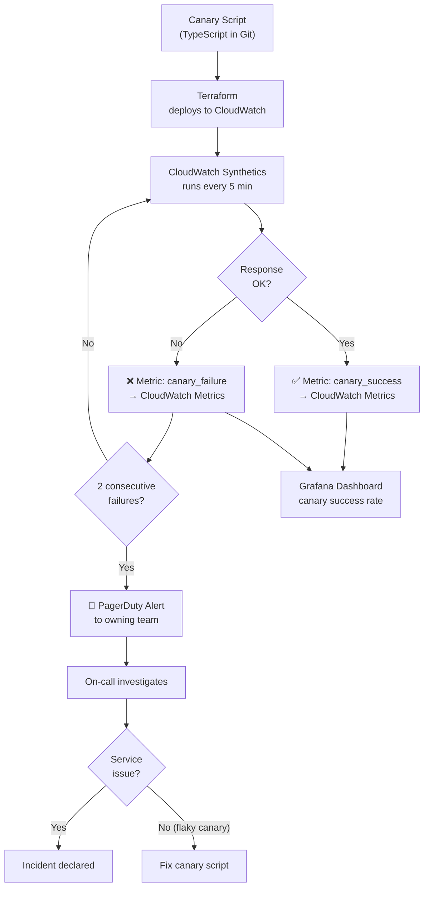
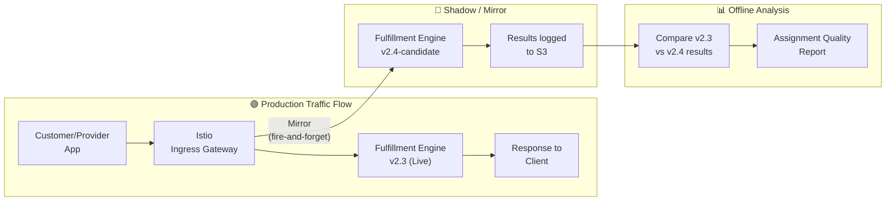
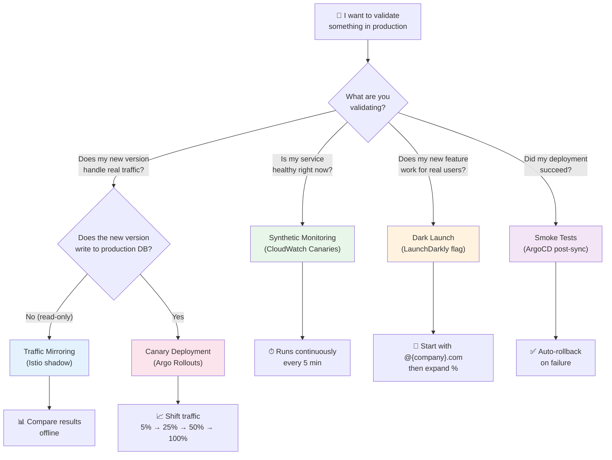

# 🧪 Testing in Production

  

---

## 🎯 1. Why Test in Production

Staging environments are useful but inherently limited. They **cannot replicate**:

| Production Reality | Staging Limitation |
|--------------------|--------------------|
| Real traffic volume and patterns | Synthetic load is an approximation |
| Actual data shapes and edge cases | Seeded data is clean and small |
| Third-party API behavior under load | Mocked or sandboxed |
| Multi-region latency and DNS | Single region / localhost |
| Real user behavior (retries, rage-taps, stale clients) | Scripted and predictable |
| Interaction between all services at current versions | Staging versions drift from production |

**Testing in production is not reckless — it is responsible**, provided it is done with safety rails, kill switches, and monitoring. This document defines the approved techniques and the rules governing their use.

---

## 📡 2. Synthetic Monitoring

### 2.1 CloudWatch Synthetics Canaries

Automated canary scripts run **every 5 minutes** against production APIs, simulating critical user journeys.

| Canary | Endpoint | Expected Behavior | Alert Threshold |
|--------|----------|-------------------|-----------------|
| **Order Request** | `POST /api/v1/orders/request` | 200 OK with order ID within 3s | 2 consecutive failures |
| **Price Estimate** | `POST /api/v1/orders/estimate` | 200 OK with price breakdown within 2s | 2 consecutive failures |
| **Provider Location** | `GET /api/v1/providers/{id}/location` | 200 OK with lat/lng within 1s | 2 consecutive failures |
| **Payment Capture** | `POST /api/v1/payments/capture` (test merchant) | 200 OK with transaction ID within 5s | 2 consecutive failures |
| **Customer Profile** | `GET /api/v1/customers/{id}` | 200 OK with profile data within 1s | 3 consecutive failures |
| **Health Checks** | `GET /healthz` on all services | 200 OK within 500ms | 1 failure |

### 2.2 Alerting

- **2 consecutive failures** → PagerDuty alert to the owning team
- **3 consecutive failures** → Escalation to on-call lead
- **5 consecutive failures** → Incident declared automatically

Canaries use a **dedicated test account** (`canary@{company}.com`) with a test payment method — never real user credentials.

---

## 🧪 3. Canary Scripts as Code

All canary scripts are stored in Git alongside the service they monitor, deployed via Terraform, and version-controlled like any other production artifact.

### 3.1 Repository Structure

```
services/
  orders-service/
    canaries/
      order-request-canary.ts
      price-estimate-canary.ts
    terraform/
      canary.tf
```

### 3.2 Canary Execution Flow



### 3.3 Canary Deployment

Canary Terraform is applied via the same ArgoCD pipeline as the service. When a service is deployed, its canaries are updated in the same cycle.

---

## 🧪 4. Traffic Mirroring

### 4.1 How It Works

Istio traffic mirroring duplicates production traffic to a **shadow service** running the new version. The shadow receives real traffic but its responses are **discarded** — fire-and-forget.



### 4.2 Use Case: Validating the New Fulfillment Algorithm

| Aspect | Detail |
|--------|--------|
| **Goal** | Validate v2.4 fulfillment algorithm against production traffic without risk |
| **Setup** | Deploy v2.4 as a shadow service; Istio mirrors 100% of fulfillment requests |
| **Duration** | 7 days to capture weekday and weekend patterns |
| **Comparison** | Offline analysis: assignment quality score, provider ETA accuracy, response latency |
| **Decision** | If v2.4 results are ≥ v2.3, proceed to canary rollout |

### 4.3 Rules for Traffic Mirroring

- Mirror is **read-only** — shadow service must not write to production databases
- Shadow service uses a separate database or writes to a log sink (S3)
- Shadow service has its own resource quota — must not starve production
- Mirroring is enabled via Istio `VirtualService` config, reviewed by Platform Engineering

---

## 🧪 5. Dark Launches

Deploy new functionality to production but expose it only to internal users via **LaunchDarkly feature flags**.

### 5.1 Process

| Step | Detail |
|------|--------|
| 1. Deploy | Code is deployed to production like any other release |
| 2. Flag gate | Feature is behind a LaunchDarkly flag, default **off** |
| 3. Enable for internal | Flag enabled for users matching `email ends with @{company}.com` |
| 4. Monitor | Compare metrics for flagged-on vs. flagged-off cohorts |
| 5. Expand | If metrics are good, roll to 5% → 25% → 50% → 100% |
| 6. Clean up | Remove feature flag within 30 days of full rollout |

### 5.2 Dark Launch vs. Canary Deployment

| | Dark Launch | Canary Deployment |
|-|------------|------------------|
| **What changes** | Feature/behavior behind a flag | Entire service version |
| **Who sees it** | Targeted users (e.g., `@{company}.com`) | % of all traffic |
| **Rollback** | Toggle flag off (instant) | Roll back deployment (minutes) |
| **Use case** | New feature validation | New version validation |

---

## 🧪 6. Smoke Tests

Lightweight health checks that run **automatically after every deployment** to verify the service is alive and functional.

### 6.1 Standard Smoke Test Suite

| Check | Endpoint | Expected |
|-------|----------|----------|
| Health check | `GET /healthz` | 200 OK |
| Readiness | `GET /readyz` | 200 OK |
| Dependency connectivity | `GET /healthz/dependencies` | All dependencies UP |
| Version verification | `GET /info` | Deployed version matches expected |

### 6.2 Implementation

Smoke tests are already embedded in the CD pipeline via ArgoCD post-sync hooks. This document formalizes the standard:

- Every service **must** expose `/healthz` and `/readyz`
- ArgoCD post-sync hook runs smoke tests within 60 seconds of deployment
- If smoke tests fail, ArgoCD **automatically rolls back** to the previous version
- Rollback triggers a PagerDuty alert to the deploying team

---

## ⚠️ 7. Safety Rules

Testing in production is powerful but dangerous if done carelessly. These rules are **non-negotiable**.

| Rule | Rationale |
|------|-----------|
| **Never test without a kill switch** | Every production test must be disable-able in < 1 minute (feature flag, canary rollback, traffic mirror disable) |
| **Never test payment mutations with real money** | All payment canaries use a dedicated test merchant account; dark launches of payment features use a test payment rail |
| **Always have monitoring in place** | Before enabling any production test, confirm that dashboards and alerts are active for the test surface |
| **Never test writes without idempotency** | If a test produces side effects, ensure they are idempotent and reversible |
| **Scope blast radius** | Start with the smallest possible scope — 1 canary, 1% traffic, internal users only |
| **Document the test** | Every production test has a ticket with: owner, start date, expected end date, kill switch location, rollback plan |

---

## 📋 8. Testing-in-Production Technique Selection

Use this diagram to choose the right technique for your scenario.



### 8.1 Technique Summary

| Technique | When to Use | Risk Level | Kill Switch |
|-----------|------------|:----------:|-------------|
| **Synthetic Monitoring** | Always — continuous health validation | 🟢 Very Low | Disable canary |
| **Traffic Mirroring** | Validating new algorithm/logic with real traffic | 🟢 Low | Remove mirror config |
| **Dark Launch** | Testing new feature with internal users first | 🟡 Medium | Toggle flag off |
| **Smoke Tests** | Post-deployment verification | 🟢 Very Low | Auto-rollback |
| **Canary Deployment** | Gradual rollout of new version | 🟡 Medium | Rollback deployment |

---

<div align="center">

⬅️ [Back to section](./README.md) · 🏠 [Back to root](../README.md)

</div>
