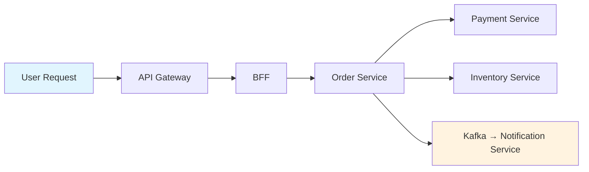
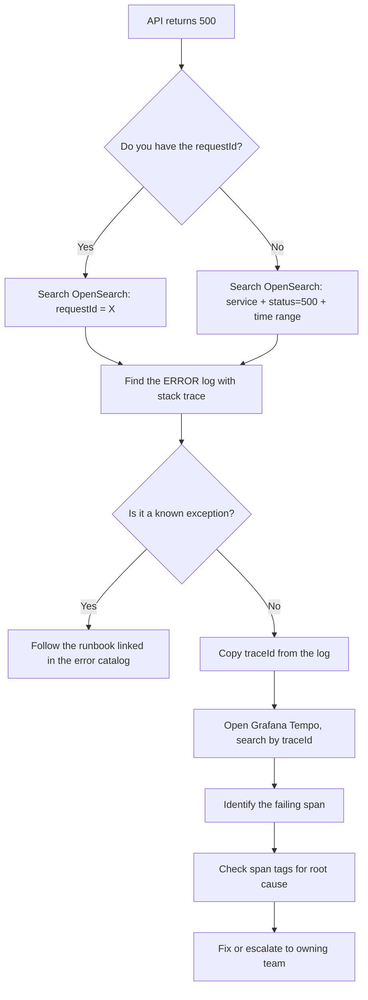

# 🔍 Debugging Guide

  

---

## 📋 Table of Contents

1. [Local Debugging](#1-local-debugging)
2. [Staging Environment Debugging](#2-staging-environment-debugging)
3. [Log Search](#3-log-search)
4. [Trace Exploration](#4-trace-exploration)
5. [Common Scenarios](#5-common-scenarios)
6. [Help Channels](#6-help-channels)

---

## 🔍 1. Local Debugging

### 1.1 IntelliJ Remote Debug Configuration

All {Company} Spring Boot services expose a debug port when running locally via Docker or Gradle. Attach IntelliJ's remote debugger to step through code running inside a container.

**Gradle (direct):**

```bash
./gradlew bootRun --debug-jvm
```

This starts the application with `-agentlib:jdwp=transport=dt_socket,server=y,suspend=n,address=*:5005`.

**Docker Compose (containerized):**

Add the JDWP agent to the service's `docker-compose.override.yml`:

```yaml
services:
  order-service:
    environment:
      JAVA_TOOL_OPTIONS: "-agentlib:jdwp=transport=dt_socket,server=y,suspend=n,address=*:5005"
    ports:
      - "5005:5005"
```

**IntelliJ Run Configuration:**

1. **Run → Edit Configurations → + → Remote JVM Debug**
2. Set **Host** = `localhost`, **Port** = `5005`
3. Set **Use module classpath** = the service module
4. Click **Debug** — the IDE attaches when the service starts

### 1.2 Attaching to a Docker Container

For non-JVM debugging (inspecting file systems, environment variables, network):

```bash
docker exec -it <container-name> /bin/sh

# Useful inspection commands
env | sort                        # verify environment variables
cat /etc/hosts                    # check DNS resolution
nc -zv postgres 5432              # test connectivity to Postgres
curl -s http://localhost:8080/actuator/health | jq .
```

### 1.3 Local Kafka Debugging

```bash
# List topics
docker exec kafka kafka-topics --bootstrap-server localhost:9092 --list

# Consume from a topic (read from beginning)
docker exec kafka kafka-console-consumer \
  --bootstrap-server localhost:9092 \
  --topic order.events \
  --from-beginning \
  --max-messages 10

# Describe consumer group lag
docker exec kafka kafka-consumer-groups \
  --bootstrap-server localhost:9092 \
  --group order-processor \
  --describe
```

---

## 🔍 2. Staging Environment Debugging

### 2.1 kubectl Port-Forward

Port-forwarding lets you access a staging pod's ports as if they were local. This is useful for hitting actuator endpoints, connecting a debugger, or querying a sidecar.

```bash
# Forward the application port
kubectl port-forward -n orders deployment/order-service 8080:8080

# Forward the debug port (if enabled in staging — Tier 3 only)
kubectl port-forward -n orders pod/order-service-abc123 5005:5005

# Forward PgBouncer sidecar (access staging DB via local psql)
kubectl port-forward -n orders pod/order-service-abc123 6432:6432
```

### 2.2 kubectl exec

Open a shell inside a running pod to inspect its environment, file system, or run diagnostic commands:

```bash
kubectl exec -it -n orders deployment/order-service -- /bin/sh

# Inside the pod
env | grep DB_          # check database config
cat /tmp/heapdump.hprof # retrieve a heap dump
wget -qO- http://localhost:8080/actuator/health | jq .
```

### 2.3 Log Tailing

Tail logs from a specific pod or all pods in a deployment:

```bash
# Single pod
kubectl logs -n orders pod/order-service-abc123 -f

# All pods in a deployment
kubectl logs -n orders deployment/order-service -f --all-containers

# Last 100 lines from a crashed pod
kubectl logs -n orders pod/order-service-abc123 --previous --tail=100
```

### 2.4 Ephemeral Debug Containers

For distroless images that lack a shell, use Kubernetes ephemeral containers:

```bash
kubectl debug -n orders pod/order-service-abc123 \
  -it \
  --image=busybox:1.36 \
  --target=order-service
```

---

## 🔍 3. Log Search

{Company} ships structured JSON logs to **OpenSearch** (via Fluent Bit). Grafana Loki is available as an alternative for teams that prefer LogQL.

### 3.1 OpenSearch Query Examples

**Find all logs for a specific trace:**

```json
{
  "query": {
    "bool": {
      "must": [
        { "match": { "traceId": "abc123def456" } }
      ]
    }
  },
  "sort": [{ "@timestamp": "asc" }]
}
```

**Find errors for a specific user in the last hour:**

```json
{
  "query": {
    "bool": {
      "must": [
        { "match": { "userId": "user-42" } },
        { "match": { "level": "ERROR" } },
        { "range": { "@timestamp": { "gte": "now-1h" } } }
      ]
    }
  }
}
```

**Find all logs for a specific request:**

```json
{
  "query": {
    "bool": {
      "must": [
        { "match": { "requestId": "req-789xyz" } }
      ]
    }
  },
  "sort": [{ "@timestamp": "asc" }]
}
```

### 3.2 Grafana Loki (LogQL) Equivalents

```logql
# By traceId
{service="order-service"} |= `abc123def456` | json

# By userId with error level
{service="order-service"} | json | userId="user-42" and level="ERROR"

# By requestId, last 1 hour
{service="order-service"} | json | requestId="req-789xyz"
```

### 3.3 Standard MDC Fields for Search

| Field | Description | Indexed? | Example |
|-------|-------------|----------|---------|
| `traceId` | Distributed trace identifier (X-Ray / OTEL) | Yes | `1-abc123-def456` |
| `spanId` | Current span within the trace | Yes | `span-789` |
| `requestId` | HTTP request correlation ID | Yes | `req-789xyz` |
| `userId` | Authenticated user identifier | Yes | `user-42` |
| `tenantId` | Multi-tenant partition key | Yes | `tenant-acme` |
| `service` | Kubernetes service name | Yes | `order-service` |
| `level` | Log level (ERROR, WARN, INFO, DEBUG) | Yes | `ERROR` |
| `exception` | Exception class name | Yes | `OrderNotFoundException` |

---

## 🔍 4. Trace Exploration

### 4.1 X-Ray / Grafana Tempo UI Walkthrough

{Company} uses AWS X-Ray for production tracing with Grafana Tempo as a secondary store for long-term retention and ad-hoc queries.



**Finding a trace:**

1. Open **Grafana → Explore → Tempo** (or X-Ray console).
2. Search by `traceId` if known, or by service + status code + time range.
3. The trace waterfall shows each span with timing.
4. Click a span to see tags (`http.status_code`, `db.statement`, `messaging.destination`).

### 4.2 Finding Slow Spans

| Step | Action |
|------|--------|
| 1 | Open Grafana Tempo → **Search** tab |
| 2 | Filter by service name and `minDuration > 500ms` |
| 3 | Sort by duration descending |
| 4 | Click the slowest trace to open the waterfall |
| 5 | Identify the widest span — this is the bottleneck |
| 6 | Check span tags: `db.statement` (slow query?), `http.url` (slow downstream?), `messaging.destination` (consumer lag?) |

### 4.3 Correlating Logs and Traces

Every log line includes `traceId` and `spanId` via MDC. To jump from a log to a trace:

1. Copy the `traceId` from the log entry in OpenSearch.
2. Paste it into Grafana Tempo's search bar.
3. The trace waterfall appears with all participating services.

To jump from a trace to logs:

1. Click a span in the Tempo waterfall.
2. Click **"Logs for this span"** (configured via Grafana data source correlation).
3. OpenSearch opens with a pre-filtered query for that `traceId` + `spanId`.

---

## 🔍 5. Common Scenarios

### 5.1 Diagnosis Quick Reference

| Scenario | First Step | Second Step | Third Step | Escalation |
|----------|-----------|-------------|------------|------------|
| **My API returns 500** | Check application logs for the `requestId` in OpenSearch | Search for the `traceId` in Tempo to see which downstream service failed | Check the failing service's logs for the root exception | Post in the owning team's Slack channel with `requestId` and `traceId` |
| **Kafka consumer is lagging** | Check consumer group lag: `kafka-consumer-groups --describe` or Grafana dashboard "Kafka Consumer Lag" | Check consumer pod logs for errors or slow processing | Check if the consumer is rebalancing (look for `Revoking partitions` log) | #platform-support with consumer group name and lag metrics |
| **Latency spike on one pod** | Check pod CPU/memory in Grafana → Kubernetes dashboards | Check for GC pauses in pod logs (`-Xlog:gc*`) | Check if the pod received disproportionate traffic (load balancer distribution) | Restart the pod; if recurrent, open a Jira ticket for investigation |
| **Can't connect to DB locally** | Verify Docker Compose is running: `docker compose ps` | Check `.env.local` for correct `DB_HOST`, `DB_PORT` | Test connectivity: `docker exec postgres pg_isready` | `make reset` to rebuild from scratch |
| **Feature flag not working** | Verify the flag key spelling in LaunchDarkly dashboard | Check the evaluation context: `userId`, `tenantId`, targeting rules | Check service logs for `LaunchDarkly: flag not found` warnings | Confirm the flag environment (flags are per-environment) |

### 5.2 My API Returns 500 — Detailed Walkthrough



### 5.3 Kafka Consumer Is Lagging — Detailed Walkthrough

1. **Measure the lag:** Open the "Kafka Consumer Lag" Grafana dashboard. Identify the consumer group and partitions with lag.
2. **Check for errors:** Search OpenSearch for the consumer service with `level=ERROR` in the relevant time window.
3. **Check processing time:** Look at the `kafka.consumer.process.duration` metric. If individual message processing is slow, profile the handler.
4. **Check for rebalances:** Search logs for `Revoking partitions` or `Assigning partitions`. Frequent rebalances indicate pod instability or session timeouts.
5. **Scale if needed:** If the consumer is healthy but overwhelmed, increase the replica count (ensure partition count >= replica count).

### 5.4 Can't Connect to DB Locally

```bash
# Step 1: Is Docker running?
docker compose -f docker-compose.infra.yml ps

# Step 2: Is Postgres healthy?
docker exec postgres pg_isready -U localdev

# Step 3: Can you connect?
docker exec -it postgres psql -U localdev -d app -c "SELECT 1;"

# Step 4: Is the application using the right config?
grep DB_ .env.local

# Step 5: Nuclear option
make reset
```

---

## 📋 6. Help Channels

### 6.1 Channel Directory

| Channel | Purpose | Best For | Response Time |
|---------|---------|----------|---------------|
| **#platform-support** | Platform infra, CI/CD, Docker, Kubernetes | "My build is broken", "Can't deploy to staging" | 4 business hours (SLA) |
| **#observability-help** | Logging, tracing, metrics, dashboards | "How do I query X in Grafana?", "My traces are missing" | 4 business hours |
| **Team Slack channel** | Domain-specific questions | "Why does order-service do X?", "Where is the code for Y?" | Same business day |
| **Office hours** (Tues/Thurs 2–3 PM) | Live troubleshooting | Complex issues that benefit from screen-sharing | Real-time |
| **Buddy (new joiners)** | First-week questions | "How do I set up my laptop?", "Where do I find X?" | Same day |

### 6.2 Buddy Program

Every new engineer is assigned a buddy from their team for the first 90 days. Buddies:

- Help with environment setup on day one.
- Are the first reviewer on the new joiner's initial PRs.
- Hold a weekly 15-minute check-in for the first month.
- Introduce the new joiner to cross-functional partners.

### 6.3 When to Escalate

| Signal | Action |
|--------|--------|
| Production incident affecting customers | Follow the [Incident Management](../05-operational-excellence/04-incident-management.md) process |
| Blocked for > 4 hours with no response in Slack | Tag `@platform-on-call` in #platform-support |
| Security concern (credential leak, vulnerability) | Immediately notify #security-incidents and follow the [Security Operations](../04-infrastructure-and-cloud/10-security-operations.md) playbook |
| Cross-team dependency blocking sprint work | Raise in the weekly dependency board review |

---

<div align="center">

⬅️ [Back to section](./README.md) · 🏠 [Back to root](../README.md)

</div>
