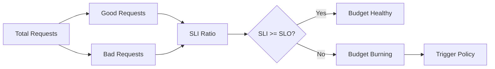

# 🎯 SLO Framework and Error Budget Policy

  

---

## 🎯 1. Overview

Every production service at {Company} must define Service Level Objectives (SLOs) backed by measurable Service Level Indicators (SLIs). SLOs quantify reliability expectations and give teams an objective signal for when to invest in reliability versus feature velocity.

> **Rule:** No service may launch to production without at least one availability SLO and one latency SLO approved by the owning team's engineering lead.

Cross-references: [Observability Standards](./01-observability-standards.md) for metric instrumentation, Alerting Design (see alerting standards) for alert configuration.

---

## 📏 2. SLI Types

| SLI Type | Definition | Measurement Method |
|:---------|:-----------|:-------------------|
| **Availability** | Ratio of successful to total requests | HTTP status codes at the load balancer |
| **Latency** | Requests served within a threshold | Histogram buckets at p50, p95, p99 |
| **Throughput** | Successfully processed events per second | Consumer lag and completion counters |
| **Correctness** | Responses returning expected results | Synthetic probes against known-good data |
| **Freshness** | Data age relative to source of truth | Timestamp comparison between stores |

> **Rule:** Measure SLIs at the point closest to the user. Prefer load balancer metrics over application-level metrics.

---

## 🏅 3. SLO Targets by Tier

{Company} classifies services into three tiers based on blast radius and customer impact.

| Dimension | Tier 1 - Critical | Tier 2 - Important | Tier 3 - Internal |
|:----------|:-------------------|:-------------------|:------------------|
| **Availability** | 99.95% (26 min/month) | 99.9% (43 min/month) | 99.5% (3.6 hr/month) |
| **Latency (p99)** | < 200 ms | < 500 ms | < 2000 ms |
| **Latency (p50)** | < 50 ms | < 100 ms | < 500 ms |
| **Error budget window** | 30 days rolling | 30 days rolling | 30 days rolling |
| **Review cadence** | Weekly | Bi-weekly | Monthly |

Tier assignment is recorded in the [Service Catalog](../01-platform-standards/04-service-catalog.md).

---

## 🧮 4. Error Budget Calculation

The error budget is the inverse of the SLO target applied over the measurement window.

```
Error budget = 1 - SLO target
Budget (minutes) = Error budget * window (minutes)
Remaining budget = Budget (minutes) - downtime (minutes)
```

**Example:** A Tier 1 service with 99.95% availability SLO over 30 days has `0.05% * 43,200 minutes = 21.6 minutes` of allowed downtime.

**Visual overview:**



---

## 🔥 5. Burn Rate Alerts

Burn rate measures how fast the error budget is being consumed relative to the window. A burn rate of 1.0 means the budget will exhaust exactly at the end of the window.

| Alert Level | Burn Rate | Long Window | Short Window | Action |
|:------------|:----------|:------------|:-------------|:-------|
| **Page (critical)** | 14.4x | 1 hour | 5 minutes | Wake on-call, immediate response |
| **Page (high)** | 6x | 6 hours | 30 minutes | Investigate within 30 minutes |
| **Ticket** | 3x | 1 day | 2 hours | Create a ticket, fix within 24 hours |
| **Record** | 1x | 3 days | 6 hours | Log for weekly review, no immediate action |

> **Rule:** All burn rate alerts must use multi-window, multi-burn-rate logic to reduce false positives. Single-threshold alerts on raw error rates are not permitted.

---

## 🛑 6. Budget Exhaustion Policy

When a service exhausts its error budget, the team must shift from feature work to reliability work until the budget recovers.

| Budget Remaining | Policy |
|:-----------------|:-------|
| **> 50%** | Normal operations. Ship features freely |
| **25-50%** | Caution. Review recent changes for reliability risk before deploying |
| **5-25%** | Restricted. Only ship changes that improve reliability or are business-critical with VP approval |
| **0% (exhausted)** | Freeze. All deployments halted except reliability fixes. Postmortem required |

Exemptions to the freeze require written approval from the service owner's director and the SRE lead.

---

## 📊 7. Governance and Review

| Activity | Cadence | Participants |
|:---------|:--------|:-------------|
| SLO dashboard review | Weekly | Service owner, on-call engineer |
| Budget status report | Bi-weekly | Engineering leads, SRE team |
| SLO target revision | Quarterly | Service owners, product managers, SRE |
| Tier re-classification | Annually | Architecture review board |

SLO definitions are stored as code alongside the service in a `slo.yaml` file and validated in CI. Changes to SLO targets require a pull request review from the SRE team.

---

<div align="center">

⬅️ [Back to section](./README.md) · 🏠 [Back to root](../README.md)

</div>
