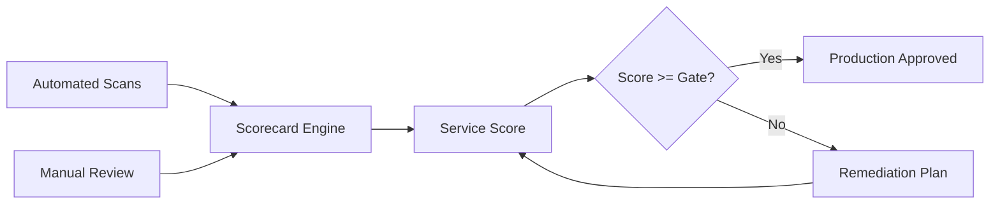

# 📋 Service Scorecards and Production Readiness Review

  

---

## 📋 Table of Contents

1. [Overview](#-1-overview)
2. [Scoring Dimensions](#-2-scoring-dimensions)
3. [Scoring Rubric](#-3-scoring-rubric)
4. [Readiness Gates](#-4-readiness-gates)
5. [Review Process](#-5-review-process)
6. [Remediation Tracking](#-6-remediation-tracking)

---

## 🎯 1. Overview

Service scorecards provide a standardized, quantitative assessment of every production service across reliability, security, observability, and operational maturity. They surface gaps before they become incidents and give teams a clear improvement path.

> **Rule:** Every production service must maintain a scorecard in the [Service Catalog](../01-platform-standards/04-service-catalog.md). Services scoring below "Acceptable" on any critical dimension must have a remediation plan within 14 days.

**Visual overview:**

---

## 📏 2. Scoring Dimensions

| Dimension | Weight | What It Measures |
|:----------|:-------|:-----------------|
| **Reliability** | 25% | SLOs defined, error budget tracking, resilience patterns |
| **Observability** | 20% | Structured logging, tracing, dashboards, alerting |
| **Security** | 20% | Dependency scanning, secrets management, auth |
| **Operational Readiness** | 15% | Runbooks, on-call rotation, incident response plan |
| **Code Quality** | 10% | Test coverage, linting compliance, dependency currency |
| **Documentation** | 10% | API docs, ADRs, onboarding guide |

---

## 🏆 3. Scoring Rubric

Each dimension is scored 1-5. The overall score is the weighted average.

| Score | Label | Criteria |
|:------|:------|:---------|
| **5** | Exemplary | Exceeds all requirements. Reference for other teams |
| **4** | Strong | Meets all requirements with minor improvements possible |
| **3** | Acceptable | Meets minimum requirements. No blocking gaps |
| **2** | Below Standard | Missing key requirements. Remediation required |
| **1** | Critical | Significant gaps posing production risk |

| Overall Score | Status | Policy |
|:-------------|:-------|:-------|
| >= 4.0 | Green | No restrictions |
| 3.0 - 3.9 | Yellow | Improvement plan recommended |
| 2.0 - 2.9 | Orange | Remediation plan required within 14 days |
| < 2.0 | Red | Deployment freeze until critical gaps resolved |

---

## 🚪 4. Readiness Gates

Binary pass/fail checks that block production deployment regardless of overall score.

| Gate | Requirement | Enforcement |
|:-----|:-----------|:------------|
| **SLO Defined** | Availability + latency SLO | CI check against `slo.yaml` |
| **Alerting Configured** | Burn rate alerts in PagerDuty | Terraform validation |
| **Runbook Exists** | Linked in service catalog | Service catalog API |
| **On-call Assigned** | PagerDuty schedule, >= 2 engineers | PagerDuty API |
| **Security Scan Passing** | No critical/high CVEs | CI pipeline gate |
| **Load Test Baseline** | At least one run with stored results | Artifact check |

---

## 🔄 5. Review Process

| Step | Activity | Timing |
|:-----|:---------|:-------|
| 1 | Automated scorecard generation | Daily (continuous) |
| 2 | Team self-review | Before readiness review |
| 3 | Peer review (platform engineer + owner) | 1 week before launch |
| 4 | Gate validation | Every deployment (CI/CD) |
| 5 | Quarterly re-assessment | Every 90 days |

New services must pass a 30-minute production readiness review with the owning team, a platform engineer, and optionally a security engineer before first production deployment. Existing services are re-assessed quarterly via automated scans.

---

## 🔧 6. Remediation Tracking

Remediation items are tracked as tickets with the label `scorecard-remediation`.

| Priority | SLA | Escalation |
|:---------|:----|:-----------|
| Critical (score 1) | 7 days | Engineering lead day 1, VP day 5 |
| Below Standard (score 2) | 14 days | Engineering lead day 7 |
| Improvement (score 3) | 30 days | Tracked in quarterly review |

> **Rule:** Remediation items that miss their SLA are automatically escalated one level up the management chain.

Scorecard data is exposed at `https://platform-api.internal.{company}.com/v1/scorecards` and displayed in Backstage.

---

⬅️ [Back to section](./README.md) · 🏠 [Back to root](../README.md)

