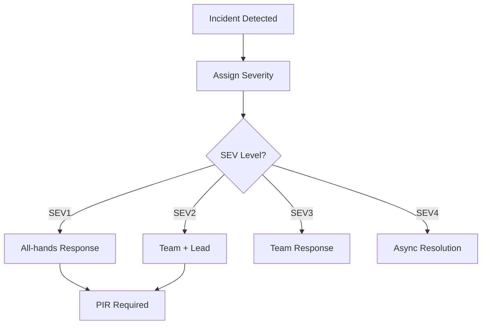

# 🚨 Incident Severity Classification and Escalation Matrix

  

---

## 🎯 1. Overview

Every incident at {Company} is assigned a severity level at declaration. Severity determines response urgency, communication requirements, and escalation paths.

> **Rule:** The incident commander assigns severity at declaration. Any participant may request a severity upgrade, but only the IC may downgrade.

**Visual overview:**



Cross-references: [Incident Management](./04-incident-management.md), [PIR Process](./15-pir-process.md).

---

## 🔴 2. Severity Definitions

| Severity | Customer Impact | Examples |
|:---------|:----------------|:---------|
| **SEV1** | Total outage or data loss affecting all users | API unavailability, data corruption, active security breach |
| **SEV2** | Significant degradation affecting many users | Payment failures, latency > 10x baseline, partial core outage |
| **SEV3** | Limited impact on a small subset | Single-region degradation, internal tool outage |
| **SEV4** | Minimal or no user impact | Error rates not breaching SLO, non-production outages |

### Classification guide

| Question | SEV1 | SEV2 | SEV3 | SEV4 |
|:---------|:-----|:-----|:-----|:-----|
| Revenue flow broken? | All users | Subset | No | No |
| Data loss? | Confirmed | Suspected | No | No |
| Active breach? | Yes | Contained | No | No |
| Blast radius | Global | Regional | Isolated | Non-prod |

---

## 📞 3. Escalation Matrix

| Severity | T+0 | T+5 min | T+15 min | T+30 min | Updates |
|:---------|:-----|:--------|:---------|:---------|:--------|
| **SEV1** | Page primary + secondary | Notify eng leadership | Notify VP/CTO | External comms | Every 30 min |
| **SEV2** | Page primary | IC triages | Notify eng lead | Status page | Every 60 min |
| **SEV3** | Slack team notification | Team investigates | - | Update if unresolved | As needed |
| **SEV4** | Auto-create ticket | Triage next business day | - | - | None |

> **Rule:** When in doubt, classify one level higher. Over-responding and downgrading is preferable to under-responding.

---

## 📝 4. Communication Templates

### Incident declaration (Slack)

```
INCIDENT DECLARED - [SEV level]
Service: [service name]
Impact: [one-line description]
Channel: #inc-[YYYYMMDD]-[short-name]
IC: @[name] | Status: Investigating
```

### Status update

```
INCIDENT UPDATE - [SEV level] - [service name]
Status: [Investigating | Identified | Monitoring | Resolved]
Impact: [current impact] | Next update: [time]
```

### External (SEV1/SEV2)

```
We are experiencing [brief impact description].
Our engineering team is actively investigating.
Next update in [time].
```

---

## 🔄 5. Severity Reclassification

| Direction | When | Authority |
|:----------|:-----|:----------|
| **Upgrade** | Impact broader than assessed | Any participant requests; IC approves |
| **Downgrade** | Impact narrower or mitigated | Incident commander only |

---

## 📊 6. Metrics and Review

| Metric | Target | Cadence |
|:-------|:-------|:--------|
| Mean time to detect (SEV1/SEV2) | < 5 min | Monthly |
| Mean time to acknowledge | < 5 min SEV1, < 15 min SEV2 | Monthly |
| Mean time to resolve | < 1 hr SEV1, < 4 hrs SEV2 | Monthly |
| Severity accuracy | > 90% | Quarterly |
| PIR completion (SEV1/SEV2) | 100% | Monthly |

Metrics published at `https://grafana.internal.{company}.com/d/incidents`.

---

<div align="center">

⬅️ [Back to section](./README.md) · 🏠 [Back to root](../README.md)

</div>
