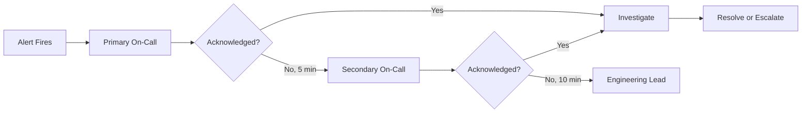

# 📟 On-Call Standards

  

---

## 📋 Table of Contents

1. [Overview](#-1-overview)
2. [Rotation Design](#-2-rotation-design)
3. [Compensation and Well-Being](#-3-compensation-and-well-being)
4. [Handoff Process](#-4-handoff-process)
5. [Escalation SLAs](#-5-escalation-slas)
6. [On-Call Review](#-6-on-call-review)

---

## 🎯 1. Overview

On-call is a shared responsibility that keeps {Company}'s systems reliable. Every team owning a production service must maintain an on-call rotation. On-call must be sustainable, well-compensated, and supported by tooling and runbooks.

> **Rule:** No engineer may be on-call for a service they have not been onboarded to. Onboarding includes a shadow shift, runbook walkthrough, and at least one simulated incident response.

**Visual overview:**



Cross-references: [Alerting Design](./12-alerting-design.md) for alert routing, [Incident Severity](./13-incident-severity.md) for escalation paths.

---

## 🔄 2. Rotation Design

| Parameter | Requirement |
|:----------|:-----------|
| **Rotation length** | 1 week (Monday 09:00 to Monday 09:00 local time) |
| **Minimum rotation size** | 4 engineers (no more than 1 week in 4) |
| **Primary and secondary** | Every rotation must have both |
| **Time zone coverage** | Follow-the-sun for teams spanning 3+ time zones |
| **Holidays** | Voluntary with 2x compensation. No mandatory holiday on-call |

| Model | When to Use |
|:------|:-----------|
| **Single-team** | 1-3 services, one time zone. 4-6 engineers rotating weekly |
| **Follow-the-sun** | Multiple time zones. Handoff at regional business hours |
| **Shared platform** | Infrastructure/platform services. Dedicated on-call pool |
| **Buddy system** | New engineers shadow experienced on-call for 2 rotations |

---

## 💰 3. Compensation and Well-Being

| Component | Policy |
|:----------|:-------|
| **Base stipend** | Fixed weekly stipend for carrying the pager, paid regardless of incidents |
| **Incident response pay** | Additional per-incident compensation for after-hours active response |
| **Holiday premium** | 2x the base stipend for public holiday coverage |
| **Compensatory time off** | Half-day off after shifts with > 3 hours of after-hours incident work |
| **Burnout protection** | No more than 2 consecutive weeks on-call. Managers monitor for fatigue |

> **Rule:** On-call compensation is defined in the team's operational agreement and approved by the engineering lead.

---

## 🤝 4. Handoff Process

| Step | Timing | Activity |
|:-----|:-------|:---------|
| 1 | Friday before rotation ends | Outgoing on-call writes handoff summary |
| 2 | Monday 09:00 | PagerDuty rotation auto-switches |
| 3 | Monday 09:15 | Incoming on-call reviews handoff summary |
| 4 | Monday 09:30 | Live handoff call if there are active issues |

### Handoff summary template

```
ON-CALL HANDOFF - Week of [date]
Active issues: [ongoing or simmering issues]
Recent incidents: [links to incidents from past week]
Upcoming risks: [deployments, migrations, changes]
Alert noise: [noisy alerts that need tuning]
Notes: [anything else incoming on-call should know]
```

---

## ⏱️ 5. Escalation SLAs

| Severity | Acknowledge | Begin Investigation | Escalate if No Progress |
|:---------|:-----------|:-------------------|:-----------------------|
| **SEV1** | < 5 minutes | Immediately | After 15 minutes |
| **SEV2** | < 15 minutes | Within 15 minutes | After 30 minutes |
| **SEV3** | < 1 hour | Within 2 hours | After 4 hours |
| **SEV4** | Next business day | Within 1 business day | After 3 business days |

> **Rule:** Acknowledging an alert means you are actively investigating. If you cannot investigate, escalate to the secondary immediately.

---

## 📊 6. On-Call Review

Teams review on-call health monthly.

| Metric | Target | Action if Missed |
|:-------|:-------|:-----------------|
| Pages per shift | < 10 total, < 5 after-hours | Alert quality review |
| Actionable page rate | > 80% | Tune or remove noisy alerts |
| Mean time to acknowledge | < 5 min for P1/P2 | Review notification setup |
| Handoff completion rate | 100% | Manager follow-up |
| Engineer satisfaction | >= 3.5 / 5.0 | Review rotation size and compensation |

All on-call engineers must have PagerDuty, Slack, Grafana, OpenSearch, and kubectl access provisioned before their first shadow shift.

---

<div align="center">

⬅️ [Back to section](./README.md) · 🏠 [Back to root](../README.md)

</div>
