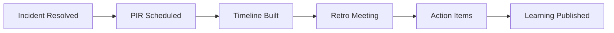

# 🔍 Post-Incident Review Process

  

---

## 🎯 1. Overview

Post-incident reviews (PIRs) are how {Company} learns from failures. Every SEV1 and SEV2 requires a PIR. SEV3 incidents require a lightweight review at the team's discretion.

> **Rule:** PIRs are blameless. They focus on systems, processes, and tooling - never individual fault. Blame language must be removed before publication.

**Visual overview:**



Cross-references: [Incident Severity](./13-incident-severity.md), [Incident Management](./04-incident-management.md).

---

## 📝 2. PIR Template

Templates at `https://wiki.internal.{company}.com/pir-template`.

| Section | Content |
|:--------|:--------|
| **Title** | `PIR-[YYYYMMDD]-[short-name]` |
| **Severity** | SEV level at close |
| **Duration** | Detection to resolution |
| **Impact** | Users affected, revenue/data impact |
| **Summary** | 2-3 sentence factual description |
| **Timeline** | Minute-by-minute reconstruction |
| **Root Cause** | Technical cause with evidence |
| **Contributing Factors** | Process/tooling/systemic factors |
| **What Went Well** | Effective response actions |
| **What Could Be Improved** | Hindrances to detection or response |
| **Action Items** | Specific, assigned, time-bound |

---

## ⏱️ 3. Timeline Reconstruction

The timeline must be factual, sourced from tooling, and free of blame.

| Source | What to Extract |
|:-------|:---------------|
| PagerDuty | Alert timing, acknowledgements, escalations |
| Slack | Key decisions and actions |
| ArgoCD | Deployments that may have triggered the incident |
| Grafana | Metric anomalies and timestamps |
| OpenSearch | Error patterns, first occurrence, volume |

```
[14:02 UTC] Alert: order-service p99 > 2s (PagerDuty)
[14:04 UTC] On-call acks, begins investigation (PagerDuty)
[14:08 UTC] IC identifies DB pool exhaustion (Slack)
[14:12 UTC] Mitigation: increase pool size (Slack)
[14:18 UTC] Latency returns to normal (Grafana)
```

---

## 🤝 4. Blameless Retrospective

Held within 5 business days, facilitated by someone not involved in the response.

| Phase | Time | Activity |
|:------|:-----|:---------|
| Context | 5 min | Read blameless ground rules |
| Timeline | 15 min | Chronological event review |
| Root cause | 15 min | "5 Whys" analysis |
| What went well | 10 min | Effective actions |
| Improvements | 10 min | Generate action items |
| Wrap-up | 5 min | Assign owners and deadlines |

**Ground rules:** Use "the system" as subject, not names. Assume best intent. Focus on making systems safer. Facilitator redirects blame language.

---

## ✅ 5. Action Item Tracking

Every item must link to a Jira ticket labeled `pir-action`.

| Priority | SLA | Escalation |
|:---------|:----|:-----------|
| P1 | 7 days | Eng lead day 1, VP day 5 |
| P2 | 30 days | Eng lead day 14 |
| P3 | 90 days | Quarterly review |

| Category | Examples |
|:---------|:---------|
| **Detection** | Add alert, improve SLO coverage |
| **Mitigation** | Circuit breaker, graceful degradation |
| **Prevention** | Fix root cause, add test |
| **Process** | Update runbook, fix escalation |

> **Rule:** Missed SLA items escalate one level. Recurring incidents from incomplete actions are reviewed at leadership level.

---

## 📢 6. Learning Distribution

| Mechanism | Audience | Cadence |
|:----------|:---------|:--------|
| PIR on wiki | All engineering | Within 5 business days |
| #engineering-incidents | All engineering | Within 1 business day |
| Incident digest email | Leadership | Monthly |
| Trends presentation | All engineering | Quarterly |
| Runbook updates | On-call engineers | Immediately |

---

<div align="center">

⬅️ [Back to section](./README.md) · 🏠 [Back to root](../README.md)

</div>
