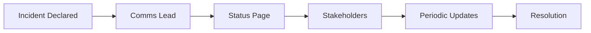

# 📢 Incident External Communications

  

---

## 🎯 1. Overview

Timely, honest communication during incidents maintains customer trust and reduces support volume. {Company} ensures the right audience receives the right information at the right time.

> **Rule:** External communication must begin within 15 minutes of SEV1 and within 30 minutes of SEV2 declaration.

**Visual overview:**



Cross-references: [Incident Severity](./13-incident-severity.md), [PIR Process](./15-pir-process.md).

---

## 🌐 2. Status Page Management

Public status page at `https://status.{company}.com`.

| Component | Maps To |
|:----------|:--------|
| **API** | API gateway and backend services |
| **Web Application** | Customer-facing web app |
| **Mobile** | iOS and Android clients |
| **Payments** | Payment processing pipeline |
| **Notifications** | Email, push, and SMS delivery |

| Status | Meaning | Color |
|:-------|:--------|:------|
| **Operational** | All systems normal | Green |
| **Degraded** | Elevated latency or reduced throughput | Yellow |
| **Partial Outage** | Some functionality unavailable | Orange |
| **Major Outage** | Core functionality unavailable | Red |

> **Rule:** Never mark "Operational" while an incident affects the component. Default to "Degraded" when uncertain.

---

## 📝 3. Notification Templates

### Investigating

```
[Component] - Investigating increased error rates
We are investigating [brief impact]. Some users may
experience [symptom]. Next update within [time].
```

### Identified

```
[Component] - Issue identified
We identified the cause of [impact]. A fix is being
implemented. Expected resolution: [time].
```

### Resolved

```
[Component] - Resolved
The issue has been resolved. All systems normal.
Post-incident summary within [timeframe].
```

---

## 🗺️ 4. Stakeholder Matrix

| Stakeholder | SEV1 | SEV2 | SEV3 | Channel |
|:------------|:-----|:-----|:-----|:--------|
| **Customers** | Status page + email | Status page | - | `status.{company}.com` |
| **Support** | Immediate briefing | Slack alert | Slack | #support-incidents |
| **Sales** | Affected accounts | Post-resolution | - | Email |
| **Executives** | Every 15 min | Every 30 min | - | #exec-incidents |
| **Legal** | If breach suspected | - | - | Direct message |
| **Partners** | If integration hit | If integration hit | - | Partner Slack |

---

## ⏱️ 5. Communication Timeline

| SEV1 | Action | SEV2 | Action |
|:-----|:-------|:-----|:-------|
| T+0 | Declare, assign comms lead | T+0 | Declare |
| T+10 min | Internal Slack update | T+15 min | Internal update |
| T+15 min | Status page + support brief | T+30 min | Status page |
| T+30 min | Executive summary | Every 60 min | Updates |
| Every 30 min | All channels updated | Resolution | Final update |
| Resolution | Final update + all-clear | | |
| T+24 hr | Customer email summary | | |

---

## 📨 6. Post-Incident Communication

Summary sent for all SEV1 and customer-impacting SEV2 incidents.

```
Subject: Post-Incident Summary - [Date] [Component]

What happened: [2-3 sentence factual description]
Impact: [Duration, affected users/features]
Root cause: [Non-technical explanation]
Preventive actions: [2-3 concrete steps]

Contact support@{company}.com with questions.
```

> **Rule:** Summaries must be reviewed by IC and engineering lead before distribution. They must be factual and free of jargon.

---

<div align="center">

⬅️ [Back to section](./README.md) · 🏠 [Back to root](../README.md)

</div>
