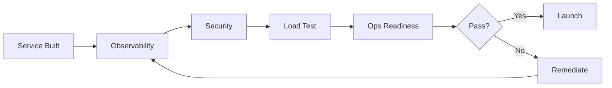

# 🚀 Production Readiness Checklist

  

---

## 🎯 1. Overview

Every new service at {Company} must pass a production readiness review before receiving traffic. This checklist codifies the minimum bar for safe operation.

> **Rule:** No service may receive production traffic without passing all mandatory gates. Exceptions require VP Engineering and SRE lead approval with a time-bound remediation plan.

**Visual overview:**

Cross-references: [Service Scorecards](./11-service-scorecards.md), [SLO Framework](./10-slo-framework.md).

---

## 🚪 2. Pre-Launch Gates

| Gate | Category | Validation |
|:-----|:---------|:-----------|
| SLOs defined in `slo.yaml` | Reliability | CI check |
| Health check endpoints | Reliability | Automated probe |
| Structured JSON logging | Observability | Format validator |
| Distributed tracing | Observability | Trace check |
| Grafana dashboard | Observability | Existence check |
| Burn rate alerts | Observability | Alert validation |
| SAST/SCA scans passing | Security | CI gate |
| Secrets in Vault | Security | Config scan |
| Auth enforced | Security | Manual review |
| Load test completed | Performance | Artifact check |
| Runbook linked | Operations | Catalog API |
| On-call rotation | Operations | PagerDuty API |
| Approved base image | Compliance | Image scan |

---

## 📊 3. Observability Requirements

| Area | Requirement |
|:-----|:-----------|
| **Log format** | Structured JSON per [Observability Standards](./01-observability-standards.md) |
| **Correlation** | `traceId`, `spanId`, `requestId`, `userId`, `tenantId` |
| **Sensitive data** | No PII, credentials, or full request bodies |
| **Tracing** | OpenTelemetry SDK, W3C Trace Context |
| **Sampling** | 10% head-based minimum; 100% for errors |
| **RED metrics** | Rate, Errors, Duration via Prometheus |
| **Dashboard** | SLO status, latency percentiles, error rates |

---

## 🔒 4. Security Review

| Check | Method |
|:------|:-------|
| No critical/high CVEs | Automated (Snyk/Trivy) |
| SAST passing | Automated (CI) |
| Secrets from Vault | Automated config scan |
| mTLS or JWT validation | Manual review |
| RBAC/ABAC policies | Manual review |
| Data classification | Manual review |
| NetworkPolicy | Policy-as-code |
| Image signed | CI gate |

---

## ⚡ 5. Load Testing

| Parameter | Requirement |
|:----------|:-----------|
| **Tool** | k6, Locust, or Gatling |
| **Scenario** | 2x anticipated peak traffic |
| **Duration** | 15 minutes minimum sustained |
| **Pass criteria** | p99 within SLO, errors < 1% |
| **Results** | `s3://{company}-loadtest-results/{service}/{date}/` |
| **Regression** | Must not degrade > 10% from baseline |

> **Rule:** Load tests run against an isolated environment mirroring production. Never test production without traffic shifting and a kill switch.

---

## 🔧 6. Operational Readiness

| Requirement | Detail |
|:------------|:-------|
| **Runbook** | Failure modes documented, linked from catalog |
| **On-call** | Min 4 engineers, primary + secondary |
| **Escalation** | Per [On-Call Standards](./14-on-call-standards.md) |
| **Rollback** | Revert within 5 minutes |
| **Feature flags** | Critical features behind flags |
| **DR plan** | RPO/RTO per [DR Playbook](./07-disaster-recovery-playbook.md) |

---

## ✅ 7. Launch Approval

| Step | Activity | Timeline |
|:-----|:---------|:---------|
| 1 | Complete all gates | Before review |
| 2 | Submit review request | 1 week before launch |
| 3 | Platform validates gates | 2 business days |
| 4 | Security review (if needed) | 3 business days |
| 5 | Readiness meeting (30 min) | After validation |
| 6 | Approval in catalog | Same day |
| 7 | Deploy via CD pipeline | Per schedule |

> **Rule:** Approval valid for 30 days. Re-review required if launch is delayed.

---

⬅️ [Back to section](./README.md) · 🏠 [Back to root](../README.md)

