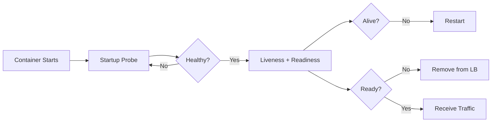

# 🏥 Health Check and Readiness Probe Standards

  

---

## 📋 Table of Contents

1. [Overview](#-1-overview)
2. [Probe Types](#-2-probe-types)
3. [Implementation Standards](#-3-implementation-standards)
4. [Dependency Health](#-4-dependency-health)
5. [Circuit Breaker Integration](#-5-circuit-breaker-integration)
6. [Configuration Reference](#-6-configuration-reference)
7. [Anti-Patterns](#-7-anti-patterns)

---

## 🎯 1. Overview

Health checks are the foundation of automated recovery in Kubernetes. Properly configured probes let the orchestrator route traffic, restart containers, and delay startup intelligently.

> **Rule:** Every production container must implement liveness, readiness, and startup probes. They must be independent and serve distinct purposes.

**Visual overview:**

Cross-references: [Resilience Patterns](./03-resilience-patterns.md), [Production Readiness](./17-production-readiness.md).

---

## 🔍 2. Probe Types

| Probe | Purpose | Failure Action | Path |
|:------|:--------|:---------------|:-----|
| **Startup** | Detect initialization complete | Retry, then kill | `/healthz/started` |
| **Liveness** | Detect deadlocked processes | Restart container | `/healthz/live` |
| **Readiness** | Detect if app can serve traffic | Remove from LB | `/healthz/ready` |

| Question | Liveness | Readiness |
|:---------|:---------|:----------|
| Check dependencies? | No | Yes - critical only |
| Failure consequence | Container restarted | Traffic stopped |
| Cascading failure risk | Yes, if checking deps | No |
| Max response time | < 100 ms | < 200 ms |

> **Rule:** Liveness probes must never check external dependencies. A database outage must not trigger restarts.

---

## 🏗️ 3. Implementation Standards

| Probe | Healthy Response | Unhealthy Response | Checks |
|:------|:----------------|:-------------------|:-------|
| Startup | `{"status": "started"}` | `{"status": "starting"}` | Context loaded, migrations done |
| Liveness | `{"status": "alive"}` | `{"status": "deadlocked"}` | Process responsive |
| Readiness | `{"status": "ready", "checks": {...}}` | `{"status": "not_ready", "checks": {...}}` | DB connected, critical services up |

---

## 🔗 4. Dependency Health

| Dependency | Criticality | Readiness Behavior |
|:-----------|:-----------|:-------------------|
| **Primary database** | Critical | Fails - pod removed from LB |
| **Cache (Redis)** | Degraded | Passes - falls back to DB |
| **Kafka** | Critical for consumers | Fails for consumer pods only |
| **Downstream HTTP** | Circuit breaker dependent | Passes if fallback exists |
| **External API** | Non-critical | Always passes |

> **Rule:** Never fail readiness for third-party dependencies. This can take all pods offline simultaneously.

---

## 🔌 5. Circuit Breaker Integration

| Circuit State | Readiness | Traffic |
|:-------------|:----------|:--------|
| **Closed** | Ready | Normal routing |
| **Open** (fallback) | Ready (warning) | Degraded via fallback |
| **Open** (no fallback) | Not ready | Pod removed from LB |
| **Half-open** | Ready (warning) | Limited validation traffic |

---

## ⚙️ 6. Configuration Reference

| Probe | Path | Period | Timeout | Failure Threshold | Initial Delay |
|:------|:-----|:-------|:--------|:------------------|:--------------|
| **Startup** | `/healthz/started` | 5s | 3s | 30 | 5s |
| **Liveness** | `/healthz/live` | 10s | 2s | 3 | - |
| **Readiness** | `/healthz/ready` | 5s | 3s | 3 | - |

> **Rule:** Use `startupProbe` for slow-starting apps instead of large `initialDelaySeconds` on liveness.

---

## ❌ 7. Anti-Patterns

| Anti-Pattern | Risk | Fix |
|:-------------|:-----|:----|
| Liveness checks DB | DB blip restarts all pods | Check internal health only |
| No startup probe (slow JVM) | Liveness kills during startup | Add startup probe |
| Shared liveness/readiness endpoint | Dep failure triggers restarts | Separate endpoints |
| Expensive health computation | Probes time out under load | Keep probes < 100 ms |
| Readiness fails for optional dep | All pods unready | Only fail for critical deps |

---

⬅️ [Back to section](./README.md) · 🏠 [Back to root](../README.md)

