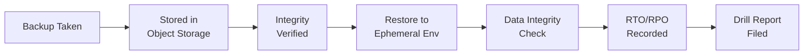

# 💾 Backup and Restore Testing

  

---

## 🎯 1. Philosophy

A backup that has never been restored is not a backup - it is a hope. {Company} treats backup restoration as a first-class engineering activity, not an afterthought. Every data store with production state must have a tested, documented, and regularly validated backup and restore procedure.

Backup testing is mandatory. A service cannot pass its Production Readiness Review without a verified restore drill.

---

## 💾 2. Backup Types

| Type | Description | Use Case | RPO |
|------|-------------|----------|-----|
| **Full snapshot** | Complete point-in-time copy of the data store | Disaster recovery, region failover | Snapshot interval (typically 24h) |
| **Continuous / WAL** | Write-ahead log shipping or change-data-capture stream | Point-in-time recovery within retention window | Near-zero (seconds to minutes) |
| **Logical export** | Schema-aware dump (e.g., `pg_dump`, Mongodump) | Cross-version migration, selective restore | Export interval |
| **Application-level** | Service exports its own domain objects to object storage | Business continuity, audit trail | Export interval |

Every Tier-1 service must use at least **full snapshot + continuous** backup. Tier-2 services require at minimum full snapshots.

---

## 📅 3. Testing Cadence

| Activity | Frequency | Scope | Owner |
|----------|-----------|-------|-------|
| **Automated restore smoke test** | Weekly | Restore latest snapshot to ephemeral environment, run health check | Platform automation |
| **Full restore drill** | Quarterly | Restore to isolated namespace, validate data integrity and application health | Service team + SRE |
| **Cross-region restore** | Semi-annually | Restore to secondary region, validate RTO/RPO targets | Platform Engineering |
| **Tabletop DR exercise** | Annually | Walk through full DR runbook with all stakeholders | Engineering Leadership |

---

## ⏱️ 4. RTO and RPO Validation

| Tier | RTO Target | RPO Target | Validation Method |
|------|-----------|-----------|-------------------|
| **Tier 1** | < 30 minutes | < 5 minutes | Quarterly timed restore drill |
| **Tier 2** | < 2 hours | < 1 hour | Quarterly automated restore |
| **Tier 3** | < 8 hours | < 24 hours | Semi-annual restore test |

**Visual overview:**



Every drill records actual RTO and RPO. If actual values exceed targets by more than 20%, the team must file an improvement ticket and resolve it before the next drill.

---

## 🔄 5. Restore Drill Procedure

Each restore drill follows a standard procedure:

1. **Notify** - announce in `#platform-announcements` at least 24 hours before the drill
2. **Provision** - create an isolated namespace or environment for the restore target
3. **Restore** - execute the restore using the documented runbook (no ad-hoc steps)
4. **Validate** - run data integrity checks, application health checks, and sample query verification
5. **Record** - log actual RTO, RPO, any errors encountered, and deviations from the runbook
6. **Report** - publish the drill report to the service's `docs/backup-drills/` directory

### Drill Report Template

```
SERVICE:        [service name]
DATE:           [YYYY-MM-DD]
BACKUP TYPE:    [full snapshot / continuous / logical]
BACKUP AGE:     [time since backup was taken]
ACTUAL RTO:     [minutes]
ACTUAL RPO:     [minutes]
TARGET RTO:     [minutes]
TARGET RPO:     [minutes]
RESULT:         [PASS / FAIL]
ISSUES:         [description or "none"]
ACTION ITEMS:   [list or "none"]
```

---

## 🛡️ 6. Backup Integrity

| Check | Frequency | Tool |
|-------|-----------|------|
| **Checksum validation** | Every backup | Built-in to backup tool |
| **Encryption verification** | Every backup | Automated post-backup hook |
| **Retention compliance** | Daily | Policy scanner |
| **Cross-region replication lag** | Continuous | CloudWatch / equivalent |

Backups must be encrypted at rest using the organization's KMS key. Unencrypted backups are a compliance violation and must be reported immediately.

---

## 📋 7. Ownership and Accountability

| Responsibility | Owner |
|---------------|-------|
| Backup configuration and scheduling | Platform Engineering |
| Restore runbook authoring and maintenance | Service team |
| Quarterly restore drill execution | Service team + SRE |
| Drill report review and RTO/RPO tracking | SRE |
| Cross-region DR exercises | Platform Engineering |
| Backup retention policy | Security + Compliance |

A service without a verified restore drill within the last 90 days is flagged in the Reliability Review Board and cannot deploy schema changes until the drill is completed.

---

<div align="center">

⬅️ [Back to section](./README.md) · 🏠 [Back to root](../README.md)

</div>
