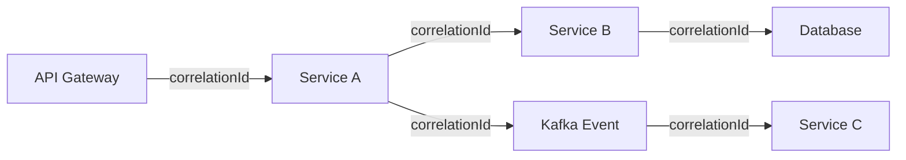

# 📝 Logging Standards and Taxonomy

  

---

## 🎯 1. Philosophy

Logs are the narrative record of system behavior. At {Company}, logs must be structured, consistent, and queryable across every service. Unstructured logs, inconsistent levels, and missing correlation IDs make incident response slower and debugging harder.

Every service must emit structured JSON logs that conform to the taxonomy defined in this document. No exceptions.

---

## 📊 2. Log Levels

All services must use the following log levels consistently. Misuse of levels (e.g., logging expected conditions as ERROR) creates alert fatigue and obscures real problems.

| Level | When to Use | Examples | Alertable |
|-------|-------------|---------|-----------|
| **ERROR** | Unexpected failure requiring investigation | Unhandled exception, database connection failure, payment gateway timeout after retries exhausted | Yes |
| **WARN** | Recoverable issue or degraded state | Circuit breaker opened, retry attempt succeeded, cache miss fallback activated | Threshold-based |
| **INFO** | Significant business or lifecycle event | Request received, order created, service started, deployment completed | No |
| **DEBUG** | Detailed diagnostic data for troubleshooting | Method entry/exit, variable state, query parameters | No (disabled in production by default) |

### Level Rules

- **ERROR must mean action required.** If the system can recover without human intervention, it is WARN, not ERROR.
- **INFO is for operators, DEBUG is for developers.** INFO logs must be readable without code context.
- **Production services run at INFO level** by default. DEBUG is enabled temporarily via feature flag for targeted troubleshooting only.

---

## 📋 3. Structured Log Format

Every log entry must be a single-line JSON object with these required fields:

| Field | Type | Description | Example |
|-------|------|-------------|---------|
| `timestamp` | ISO-8601 UTC | When the event occurred | `"2026-03-15T14:22:31.456Z"` |
| `level` | String | Log level | `"ERROR"` |
| `service` | String | Emitting service name | `"orders-service"` |
| `traceId` | String | OpenTelemetry trace ID | `"abc123def456"` |
| `spanId` | String | OpenTelemetry span ID | `"span789"` |
| `correlationId` | String | Business correlation ID | `"ord-2026-0412-xyz"` |
| `message` | String | Human-readable description | `"Order creation failed"` |
| `logger` | String | Class or module name | `"com.{company}.orders.OrderService"` |

### Optional Fields

| Field | Type | Description |
|-------|------|-------------|
| `userId` | String | Authenticated user ID (never PII) |
| `errorCode` | String | Application-specific error code |
| `durationMs` | Number | Operation duration in milliseconds |
| `metadata` | Object | Additional structured context |

---

## 🔗 4. Correlation IDs

Every inbound request must carry or generate a correlation ID that propagates through all downstream calls. This is the primary mechanism for tracing a business transaction across services.

**Visual overview:**

| Rule | Detail |
|------|--------|
| **Generation** | The API gateway generates a correlation ID if none is present in the `X-Correlation-ID` header |
| **Propagation** | Every service must forward the correlation ID to all outbound HTTP, gRPC, and Kafka calls |
| **Kafka headers** | Correlation ID is set as a Kafka record header (`correlation-id`) |
| **Logging** | Every log entry must include the `correlationId` field |

---

## 🔒 5. PII Redaction

Logs must never contain personally identifiable information. The platform provides a log sanitization library that all services must use.

| Data Type | Handling | Example |
|-----------|----------|---------|
| **Email** | Hash or replace with token | `"user@example.com"` becomes `"[REDACTED_EMAIL]"` |
| **Phone number** | Replace with token | `"+1234567890"` becomes `"[REDACTED_PHONE]"` |
| **Name** | Replace with user ID reference | `"Jane Doe"` becomes `"user:u-abc123"` |
| **Address** | Never log | Omit entirely |
| **Auth tokens** | Never log | Omit entirely |
| **IP address** | Truncate last octet | `"10.0.1.42"` becomes `"10.0.1.x"` |

The sanitization library is applied as a logging filter. Services that bypass the filter fail the security audit.

---

## 📅 6. Log Retention

| Environment | Retention | Storage |
|-------------|-----------|---------|
| **Production** | 90 days hot (searchable), 365 days cold (archived) | Centralized log platform + object storage |
| **Staging** | 14 days | Centralized log platform |
| **Development** | 3 days | Local log aggregator |

Retention periods are driven by compliance requirements. Security-related logs (authentication, authorization failures) are retained for a minimum of 365 days in hot storage regardless of environment.

---

## 🚫 7. Anti-Patterns

| Anti-Pattern | Why It Is Harmful | Correct Approach |
|-------------|-------------------|------------------|
| Logging stack traces at INFO | Noise in production, performance cost | Log stack traces at ERROR only |
| Logging request/response bodies | PII risk, storage cost, performance impact | Log request metadata (method, path, status, duration) |
| Using string concatenation for log messages | Prevents structured parsing, wastes CPU if level is disabled | Use parameterized logging (`log.info("Order {} created", orderId)`) |
| Inconsistent timestamp formats | Breaks log correlation across services | Always use ISO-8601 UTC |
| Logging in loops without rate limiting | Can produce millions of log lines per minute | Add sampling or rate limiting for high-frequency paths |

---

⬅️ [Back to section](./README.md) · 🏠 [Back to root](../README.md)

