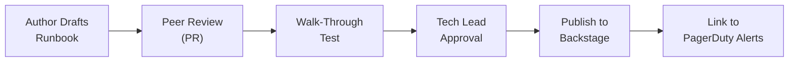

# 📒 Runbook Authoring Standards

  

---

## 🎯 1. Philosophy

A runbook that cannot be followed by an on-call engineer at 3 AM under stress is not a runbook - it is a liability. Runbooks must be concise, actionable, and tested. They are living documents that degrade if not maintained.

Every production service at {Company} must have a runbook. Every PagerDuty alert must link to a runbook entry. If an alert fires without a runbook, that is a defect to be fixed within 48 hours.

---

## 📋 2. Required Sections

Every runbook must contain the following sections in this order:

| Section | Purpose | Required |
|---------|---------|----------|
| **Service overview** | What the service does in one paragraph | Yes |
| **Architecture** | Key dependencies, data stores, message queues | Yes |
| **Contact and escalation** | On-call rotation, tech lead, downstream contacts | Yes |
| **Common alerts** | One subsection per alert with diagnosis and remediation steps | Yes |
| **Health checks** | How to verify the service is operating normally | Yes |
| **Useful commands** | Copy-paste-ready commands for common diagnostic tasks | Yes |
| **Disaster recovery** | Steps for full restore from backup or failover to secondary region | Yes |
| **Recent changes log** | Summary of significant changes that may affect troubleshooting | Recommended |

---

## 📝 3. Alert Entry Template

Each alert in the runbook follows this structure:

```
### {Alert Name}
Severity: P1 / P2 / P3
What it means: [one sentence]
User impact: [what users experience]

Diagnosis: 1) Check Grafana [link] 2) Check deployments 3) Check pod status 4) Check logs

Cause 1: [description] - Diagnosis: [what to look for] - Fix: [command or action]
Cause 2: [description] - Diagnosis: [what to look for] - Fix: [command or action]

Escalation: If unresolved after 20 minutes, escalate to [contact].
```

---

## 🔍 4. Quality Criteria

Runbooks are reviewed against these quality criteria during the Production Readiness Review and during quarterly maintenance.

| Criterion | Requirement |
|-----------|------------|
| **Actionable** | Every step tells the reader exactly what to do - no ambiguity |
| **Copy-pasteable** | Commands include the correct namespace, service name, and flags |
| **Linked** | Dashboard links, escalation contacts, and related runbooks are hyperlinked |
| **Tested** | At least one engineer other than the author has followed the runbook end-to-end |
| **Current** | Reviewed within the last 90 days and reflects the current architecture |
| **Indexed** | Registered in Backstage and linked from every associated PagerDuty alert |

---

## 🔄 5. Review Process

**Visual overview:**



| Step | Owner |
|------|-------|
| **Draft** - author writes or updates using the template | Service engineer |
| **Peer review** - teammate (not the author) reviews for clarity | Peer engineer |
| **Walk-through** - different engineer follows steps in staging | Nominated tester |
| **Approval** - tech lead approves after walk-through evidence | Tech lead |
| **Publish** - merge and register in Backstage; link PagerDuty alerts | Author |

---

## 🧪 6. Testing Requirements

A runbook is not complete until it has been tested. "I wrote it from memory" is not sufficient.

| Test Type | When | Method |
|-----------|------|--------|
| **Walk-through test** | Before initial publication | Another engineer follows every step in staging |
| **Incident simulation** | Quarterly game day | Runbook is used during a simulated incident |
| **Post-incident validation** | After every P1/P2 incident | If the runbook was used, update it with any corrections discovered |

If a runbook step fails during an incident, the post-incident review must include an action item to fix the runbook. Runbook accuracy is tracked as a reliability metric.

---

## 📅 7. Maintenance Cadence

| Activity | Frequency | Owner |
|----------|-----------|-------|
| **Staleness check** | Monthly (automated) | Platform tooling scans `last_reviewed` metadata |
| **Content review** | Every 90 days | Service team |
| **Architecture alignment** | After any dependency or infrastructure change | Service team |
| **Post-incident update** | Within 5 business days of a P1/P2 incident | Incident responder |

Runbooks without a review in the last 90 days are flagged in the Reliability Review Board. Services with stale runbooks receive a warning in Backstage and cannot pass their next Production Readiness Review.

---

## 📍 8. Storage and Discovery

Runbooks live at `docs/runbook.md` in each service repository, written in Markdown. They are registered in Backstage via the `{company}.com/runbook` annotation in `catalog-info.yaml` and indexed by TechDocs for full-text search. Every PagerDuty alert rule must include a `runbook_url` pointing to the relevant section.

---

<div align="center">

⬅️ [Back to section](./README.md) · 🏠 [Back to root](../README.md)

</div>
