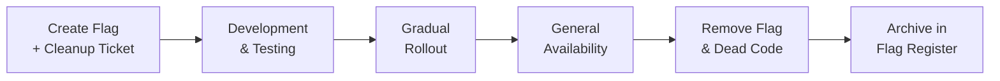

# 🚩 Feature Flag Management

  

---

## 🎯 1. Philosophy

Feature flags are the primary mechanism for decoupling deployment from release at {Company}. Every new user-facing feature ships behind a flag. Flags enable safe rollouts, instant rollback, and controlled experimentation - but only if they are managed with discipline.

Unmanaged flags become technical debt. A flag that has been "temporarily" enabled for six months is no longer a flag - it is dead code wrapped in a conditional. This document defines the lifecycle rules that prevent flag sprawl.

---

## 🏷️ 2. Flag Types

| Type | Purpose | Typical Lifespan | Example |
|------|---------|-----------------|---------|
| **Release** | Gate a feature until it is ready for general availability | Days to weeks | `enable-new-checkout-flow` |
| **Ops** | Control operational behavior at runtime (circuit breakers, load shedding) | Permanent | `orders-circuit-breaker-pricing` |
| **Experiment** | A/B test or gradual percentage rollout | Weeks to months | `experiment-new-search-ranking` |
| **Permission** | Enable a feature for specific users, teams, or tenants | Varies | `beta-analytics-dashboard` |

---

## 🔄 3. Lifecycle Management

Every flag must follow this lifecycle. Flags without an expiry date or a cleanup ticket are rejected during code review.

**Visual overview:**

| Phase | Actions | Owner |
|-------|---------|-------|
| **Create** | Define flag in the flag management platform; create a cleanup Jira ticket with a due date | Feature developer |
| **Development** | Use the flag in code; write tests for both flag-on and flag-off paths | Feature developer |
| **Rollout** | Enable for internal users, then percentage rollout, then full rollout | Feature developer + product |
| **GA** | Flag is fully enabled for all users; begin cleanup | Feature developer |
| **Cleanup** | Remove the flag from code, delete the conditional paths, remove the flag definition | Feature developer |

---

## ⏰ 4. Stale Flag Cleanup

| Flag Type | Maximum Age Before Cleanup Required | Enforcement |
|-----------|-------------------------------------|-------------|
| **Release** | 30 days after GA | Automated Jira ticket escalation |
| **Experiment** | 90 days after experiment conclusion | Experiment platform auto-closes |
| **Permission** | Review every 180 days | Quarterly access review |
| **Ops** | No expiry (permanent by design) | Annual review during architecture audit |

### Enforcement Mechanism

1. Every flag has a `created_date` and `expected_cleanup_date` in the flag management platform
2. A weekly automated scan identifies flags past their cleanup date
3. Overdue flags generate a Jira ticket assigned to the flag creator's team
4. Flags overdue by more than 30 days are escalated to the tech lead
5. Flags overdue by more than 60 days are reported to the Reliability Review Board

---

## 🧪 5. Testing with Flags

All feature-flagged code must be tested with the flag in both states. Shipping a flag without testing the off-path is shipping untested code.

| Test Requirement | Detail |
|-----------------|--------|
| **Unit tests** | Test both flag-on and flag-off paths for all flagged logic |
| **Integration tests** | CI pipeline runs the full test suite with all release flags off, then again with all on |
| **Staging validation** | Feature is tested in staging with the flag on before any production rollout |
| **Rollback verification** | Turning the flag off in staging produces no errors, data corruption, or degraded behavior |

---

## 📋 6. Naming Convention

| Component | Convention | Example |
|-----------|-----------|---------|
| **Prefix** | Flag type abbreviation | `rel-`, `ops-`, `exp-`, `perm-` |
| **Service** | Service name | `orders`, `payments` |
| **Description** | Kebab-case feature description | `new-checkout-flow` |
| **Full name** | `{prefix}-{service}-{description}` | `rel-orders-new-checkout-flow` |

Names must be descriptive enough that any engineer can understand the flag's purpose without reading the code. Generic names like `feature-1` or `test-flag` are rejected during review.

---

## 🛡️ 7. Safety Rules

| Rule | Rationale |
|------|-----------|
| **Never nest flags** | `if (flagA && flagB)` creates an exponential testing matrix; refactor into a single flag |
| **Never use flags for long-lived branching** | Flags are not a substitute for proper architecture; if a flag lives longer than 90 days (release type), reconsider the design |
| **Ops flags require a runbook entry** | Operational flags are toggled during incidents; the on-call engineer must know what each flag does |
| **Flag changes in production are audited** | Every toggle is logged with who, when, and why in the flag management platform |
| **Rollback plan for every rollout** | Before enabling a flag in production, document the rollback step (usually: turn the flag off) |

---

## 📊 8. Metrics

| Metric | Target | Tracked By |
|--------|--------|-----------|
| Total active release flags | < 15 per service | Flag management platform |
| Stale flags (past cleanup date) | 0 | Automated weekly scan |
| Average flag lifespan (release type) | < 30 days | Flag management platform |
| Flags without cleanup tickets | 0 | Code review enforcement |

Flag health metrics are included in the engineering health dashboard and reviewed monthly by engineering leadership.

---

⬅️ [Back to section](./README.md) · 🏠 [Back to root](../README.md)

