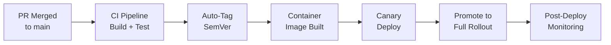

# 🚀 Release Management and Versioning

  

---

## 🎯 1. Philosophy

Releasing software must be boring. At {Company}, releases are automated, versioned, and reversible. Every production deployment has a version tag, a changelog, and a rollback path. We practice continuous delivery - every merge to `main` is a release candidate. Feature flags control user-facing exposure.

---

## 🔢 2. Semantic Versioning

All services and libraries follow [Semantic Versioning 2.0.0](https://semver.org/).

| Component | Format | Increment When |
|-----------|--------|---------------|
| **MAJOR** | `X.0.0` | Breaking API change, backward-incompatible schema migration, contract change |
| **MINOR** | `0.X.0` | New feature, backward-compatible API addition, new event type |
| **PATCH** | `0.0.X` | Bug fix, performance improvement, dependency update with no API change |

### Version Rules

| Rule | Detail |
|------|--------|
| **Pre-1.0 services** | New services may use `0.x.y` during initial development; breaking changes are expected |
| **Post-1.0 services** | MAJOR bumps require a migration guide and a deprecation period for the old version |
| **Libraries** | Internal shared libraries follow the same SemVer rules; consumers pin to minor version |
| **Container images** | Tagged with SemVer and the short Git SHA: `v1.4.2-a3b8c1d` |

---

## 🚂 3. Release Process

**Visual overview:**

| Step | Automation | Human Action |
|------|-----------|-------------|
| **PR merged to main** | GitHub merge | Developer approves and merges |
| **CI build and test** | GitHub Actions | None - fully automated |
| **Version tagging** | Conventional commits determine version bump | None - automated by CI |
| **Container image build** | Docker build, push to registry | None |
| **Canary deployment** | ArgoCD Rollouts deploys to 10% of pods | None |
| **Canary promotion** | Auto-promote after 10 minutes if error rate < threshold | On-call reviews dashboard |
| **Full rollout** | ArgoCD completes rolling update | None |

---

## 📝 4. Changelog Automation

Changelogs are generated automatically from commit messages using the [Conventional Commits](https://www.conventionalcommits.org/) specification.

| Prefix | Maps To | Changelog Section |
|--------|---------|-------------------|
| `feat:` | MINOR bump | **Features** |
| `fix:` | PATCH bump | **Bug Fixes** |
| `perf:` | PATCH bump | **Performance** |
| `refactor:` | PATCH bump | **Internal** |
| `BREAKING CHANGE:` | MAJOR bump | **Breaking Changes** |
| `docs:` | No bump | **Documentation** |
| `chore:` | No bump | **Maintenance** |

Changelogs are written to `CHANGELOG.md` in the repository root and attached to the GitHub Release with a link to the diff.

---

## 🔙 5. Rollback Procedures

Rollback must be achievable within 5 minutes. If a rollback takes longer, the deployment pipeline has a gap that must be fixed.

| Scenario | Rollback Method | Command |
|----------|----------------|---------|
| **Bad code deployment** | ArgoCD rollback to previous revision | `argocd app rollback {service} --revision {n-1}` |
| **Feature causing issues** | Turn off feature flag | Flag management platform toggle |
| **Config change** | Revert config commit and sync | `git revert {sha} && git push` |
| **Schema migration** | Forward-fix only (backward-compatible migrations required) | Deploy a new migration that corrects the issue |

### Rollback Rules

| Rule | Detail |
|------|--------|
| **No backward-incompatible migrations** | Every schema migration must be backward-compatible so the previous application version can run against the new schema |
| **Canary failure auto-rollback** | If the canary exceeds the error rate threshold, ArgoCD Rollouts automatically rolls back without human intervention |
| **Rollback does not require re-approval** | Rolling back to a previously deployed version does not require a new PR or review |
| **Post-rollback PIR** | Every production rollback triggers a lightweight post-incident review |

---

## 📅 6. Release Cadence

| Release Type | Cadence | Scope |
|-------------|---------|-------|
| **Continuous** | Every merge to main | Individual service changes |
| **Coordinated release** | Scheduled (announced 48h in advance) | Multi-service changes requiring ordered deployment |
| **Hotfix** | As needed | Critical bug fix bypassing the normal queue (still goes through CI) |
| **Freeze exception** | Rare (CTO approval) | Emergency fix during a change freeze window |

Coordinated releases require a release plan specifying deployment order, rollback sequence, and a designated coordinator.

---

## 🛡️ 7. Release Governance

| Gate | Requirement | Enforced By |
|------|------------|-------------|
| **CI green** | All tests pass, linting clean, security scan clear | GitHub Actions (merge blocked if failing) |
| **Code review** | At least one approval from a code owner | GitHub branch protection |
| **Changelog present** | Conventional commit messages present for version determination | CI validation step |
| **No open critical vulnerabilities** | Snyk / dependency scan shows zero critical findings | CI security gate |
| **Canary success** | Error rate and latency within threshold during canary window | ArgoCD Rollouts analysis |

---

⬅️ [Back to section](./README.md) · 🏠 [Back to root](../README.md)

