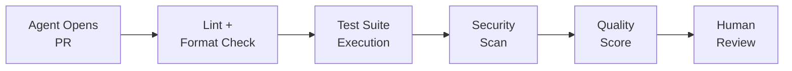

# 🔍 Review Engineering for Agent Output

  

---

## 🎯 1. Philosophy

AI agents accelerate engineering - but acceleration without validation is recklessness. Every artifact produced by an agent (code, configuration, documentation, infrastructure-as-code) must pass through a review gate before it reaches production. The rigor of the gate scales with the blast radius of the change.

At {Company}, we treat agent output the same way we treat human output - it must be reviewed, tested, and approved. The difference is that agents can produce volume at a pace that overwhelms traditional review. Review engineering solves this by combining human judgment with automated validation.

---

## 🔄 2. Review Tiers

Not all agent output requires the same level of scrutiny. The review tier is determined by the blast radius and reversibility of the change.

| Tier | Blast Radius | Review Requirement | Examples |
|------|-------------|-------------------|---------|
| **Tier 1 - Critical** | Production infrastructure, security, data schemas | Human review mandatory; two approvals required | IaC changes, auth config, database migrations |
| **Tier 2 - Standard** | Application code, API changes, service logic | Human review mandatory; one approval required | Feature code, API endpoints, business logic |
| **Tier 3 - Low risk** | Documentation, tests, non-functional changes | Automated validation; human review recommended | README updates, test additions, comment changes |

---

## 🤖 3. Automated Validation Gates

Automated gates run before human review to catch common issues and reduce reviewer burden. Agent-authored PRs must pass all gates before a human reviewer is assigned.

**Visual overview:**

| Gate | What It Checks | Blocks Merge |
|------|---------------|-------------|
| **Lint and format** | Code style, formatting, import ordering | Yes |
| **Test suite** | All existing tests pass; new code has test coverage | Yes |
| **Security scan** | No new critical/high vulnerabilities, no secrets in code | Yes |
| **Diff size check** | PR does not exceed 400 lines changed (excluding generated files) | Yes - requires split |
| **Provenance label** | PR is labelled with `agent-authored` for audit trail | Yes |
| **Quality score** | Automated quality assessment meets minimum threshold | Advisory (does not block) |

---

## 📊 4. Quality Scoring

Every agent-authored PR receives an automated quality score based on the following dimensions. The score helps reviewers prioritize their attention.

| Dimension | Weight | Measurement |
|-----------|--------|-------------|
| **Test coverage delta** | 25% | New code has test coverage >= 80% |
| **Complexity** | 20% | Cyclomatic complexity of changed methods is within team threshold |
| **Consistency** | 20% | Code follows existing patterns in the codebase (naming, structure) |
| **Documentation** | 15% | Public APIs have documentation; complex logic has explanatory comments |
| **Diff clarity** | 20% | Changes are focused (single concern), commits are well-structured |

| Score | Label | Action |
|-------|-------|--------|
| 90-100 | Excellent | Standard review process |
| 70-89 | Good | Standard review process |
| 50-69 | Needs attention | Reviewer must inspect flagged dimensions closely |
| Below 50 | Requires rework | PR returned to agent for improvement before human review |

---

## 👤 5. Human Review Workflow

Human reviewers are the final gate. Automated validation reduces noise, but human judgment is required for architectural fitness, business logic correctness, and maintainability.

| Responsibility | Detail |
|---------------|--------|
| **Reviewer assignment** | Code owners are auto-assigned; agent-authored PRs follow the same CODEOWNERS rules as human PRs |
| **Review SLA** | Agent-authored PRs are reviewed within the same SLA as human PRs (24 business hours) |
| **Feedback loop** | If a reviewer rejects an agent PR, the rejection reason is logged for agent improvement |
| **Approval authority** | Only human engineers with code owner status can approve merges |

---

## 📋 6. Audit and Traceability

Every agent-authored change must be traceable from PR to production.

| Artifact | Requirement |
|----------|------------|
| **PR label** | `agent-authored` label applied automatically |
| **Agent identity** | PR description includes the agent name and session ID |
| **Prompt context** | The triggering task or prompt is linked in the PR description |
| **Review record** | GitHub review history preserved (approvals, comments, changes requested) |
| **Deployment tag** | Container image metadata includes `agent-authored=true` annotation |

---

## 📊 7. Metrics

Track these metrics to measure the effectiveness of the review engineering program.

| Metric | Target | Purpose |
|--------|--------|---------|
| Agent PR approval rate (first submission) | >= 75% | Measures agent output quality |
| Agent PR review turnaround time | <= 24 business hours | Ensures agent PRs are not deprioritized |
| Automated gate pass rate | >= 90% | Measures pre-review quality |
| Post-merge incident rate (agent PRs) | <= human PR baseline | Validates that agent code is production-safe |
| Rejection reason distribution | Tracked quarterly | Identifies areas for agent improvement |

---

⬅️ [Back to section](./README.md) · 🏠 [Back to root](../README.md)

