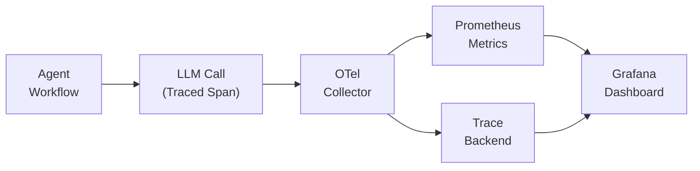

# 🔭 Agent Observability and LLM FinOps

  

---

## 🎯 1. Philosophy

LLM calls are not free - they consume tokens, incur cost, add latency, and can fail silently in ways that degrade user experience without triggering traditional alerts. At {Company}, every LLM call is traced, every token is accounted for, and every agent workflow has a cost budget. Observability for agents is not optional - it is a prerequisite for production deployment.

---

## 📡 2. LLM Call Tracing

Every LLM invocation must be captured as a span within the existing OpenTelemetry tracing infrastructure. Agent calls extend the same trace that tracks HTTP requests, database queries, and message processing.

### Required Span Attributes

| Attribute | Type | Description |
|-----------|------|-------------|
| `llm.provider` | String | Model provider (e.g., `openai`, `anthropic`, `bedrock`) |
| `llm.model` | String | Model identifier (e.g., `gpt-4o`, `claude-sonnet-4-20250514`) |
| `llm.prompt_tokens` | Integer | Number of input tokens |
| `llm.completion_tokens` | Integer | Number of output tokens |
| `llm.total_tokens` | Integer | Total tokens consumed |
| `llm.latency_ms` | Integer | End-to-end latency of the LLM call |
| `llm.status` | String | `success`, `error`, `timeout`, `rate_limited` |
| `llm.agent_id` | String | Identifier of the agent workflow |
| `llm.task_type` | String | Category of the task (e.g., `code_generation`, `review`, `summarization`) |

**Visual overview:**

---

## 💰 3. Token Usage Monitoring

Token consumption is tracked at three levels of granularity.

| Level | Granularity | Purpose |
|-------|-------------|---------|
| **Per-call** | Individual LLM invocation | Detect anomalous calls (e.g., runaway prompts) |
| **Per-workflow** | End-to-end agent task | Measure cost-per-task and compare across workflow versions |
| **Per-team** | Aggregated by owning team | Budget allocation and chargeback |

### Alerting Thresholds

| Condition | Alert | Action |
|-----------|-------|--------|
| Single call > 100K tokens | WARN | Investigate prompt size; likely missing context trimming |
| Workflow cost > 2x historical average | WARN | Review for prompt regression or unnecessary retries |
| Team daily spend > budget ceiling | ERROR | Throttle non-critical agent workflows; notify team lead |
| Provider error rate > 5% | ERROR | Switch to fallback provider if configured |

---

## 💲 4. Cost Attribution

Every LLM call is tagged with ownership metadata (`team`, `service`, `workflow`, `environment`) so costs are attributed to the team and workflow that incurred them.

### Cost Reporting

| Report | Frequency | Audience |
|--------|-----------|----------|
| **Daily cost summary** | Daily (automated) | Team Slack channel |
| **Weekly cost trend** | Weekly | Engineering leadership |
| **Monthly chargeback** | Monthly | FinOps + team leads |
| **Quarterly budget review** | Quarterly | CTO + FinOps |

Teams that consistently exceed their LLM budget must present an optimization plan at the monthly engineering review.

---

## 📊 5. Quality Metrics

Cost without quality context is meaningless. Track quality alongside spend to ensure agent value.

| Metric | Target |
|--------|--------|
| **Task success rate** - agent tasks producing accepted output | >= 80% |
| **First-pass acceptance** - output accepted without modification | >= 60% |
| **Rework rate** - output requiring significant revision | <= 15% |
| **Hallucination rate** - fabricated or incorrect information | <= 2% |
| **Latency P95** - end-to-end agent task duration | Workflow-specific SLO |

When a model upgrade or prompt change is deployed, compare quality metrics against the previous version for at least 7 days before retiring the old version.

---

## 🛡️ 6. Governance

| Rule | Detail |
|------|--------|
| **No untraced LLM calls** | Every LLM invocation must flow through the instrumented SDK; direct API calls that bypass tracing are not permitted |
| **Budget ceilings** | Every team has a monthly LLM budget ceiling set during quarterly planning |
| **Model allow-list** | Only models on the approved list may be used in production (see AI Engineering section) |
| **Prompt versioning** | Prompts are version-controlled; changes go through code review |
| **Data residency** | LLM calls must not send PII or restricted data to external providers without approved redaction |

---

## 📋 7. Dashboard Panels

The agent observability Grafana dashboard includes these panels:

| Panel | Refresh |
|-------|---------|
| **LLM calls per minute** by provider and model | Real-time |
| **Token consumption** by team and workflow | Real-time |
| **Cost accumulation** (daily, weekly, monthly) | Hourly |
| **Error rate and latency** by provider | Real-time |
| **Quality scores** by workflow | Daily |
| **Budget utilization** by team | Daily |

---

⬅️ [Back to section](./README.md) · 🏠 [Back to root](../README.md)

