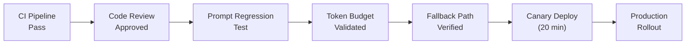

# 🛡️ Agent Operational Safety

  

---

## 🎯 1. Philosophy

Agents that modify production systems carry the same blast radius as any automated process - and potentially more, because their behavior is non-deterministic. At {Company}, agent operational safety follows the same principles as any production deployment: validated before release, observable in operation, and reversible when things go wrong.

---

## 🚦 2. Deployment Gates

Agent workflows must pass through all standard deployment gates plus agent-specific checks before reaching production.

| Gate | Standard Service | Agent Workflow (Additional) |
|------|-----------------|---------------------------|
| CI green (lint, test, security) | Required | Required |
| Code review approval | Required | Required (agent-authored PRs follow review engineering standards) |
| Canary deployment | Required | Required with extended observation window (20 min minimum) |
| **Prompt regression test** | N/A | Required - verify output quality against a golden test set |
| **Token budget validation** | N/A | Required - confirm the workflow stays within its per-task token ceiling |
| **Fallback path verified** | N/A | Required - confirm the workflow degrades gracefully when the LLM provider is unavailable |
| **Human escalation path tested** | N/A | Required - confirm the workflow can escalate to a human when confidence is low |

**Visual overview:**

---

## 🔙 3. Rollback Triggers

Agent workflows have additional rollback triggers beyond standard service metrics. Any one of these conditions triggers an automatic rollback.

| Trigger | Threshold | Detection |
|---------|-----------|-----------|
| **Error rate** | > 5% of agent tasks returning errors | Prometheus alert |
| **Quality score drop** | Quality score falls below 60 (from baseline >= 80) | Quality scoring pipeline |
| **Token budget exceeded** | Single workflow exceeds 3x its average token consumption | Token monitoring alert |
| **Hallucination detected** | Automated factuality check flags output | Validation pipeline |
| **Human override rate spike** | > 40% of agent output rejected by human reviewers in a 1-hour window | Review metrics |
| **LLM provider degradation** | Provider latency > 3x baseline or error rate > 10% | Provider health check |

### Rollback Procedure

1. ArgoCD Rollouts automatically aborts the canary and rolls back to the previous version
2. Alert fires in `#agent-operations` Slack channel with the triggering condition
3. On-call engineer verifies rollback; workflow stays on previous version until the issue is fixed
4. A new deployment follows the standard gate process from the beginning

---

## 🔄 4. Resilience Patterns

Agent workflows must implement the following resilience patterns to handle LLM provider outages and degraded performance.

| Pattern | Implementation | Requirement |
|---------|---------------|-------------|
| **Provider fallback** | If the primary LLM provider is unavailable, route to a secondary provider | Mandatory for Tier-1 agent workflows |
| **Graceful degradation** | If no LLM provider is available, the workflow completes without the agent step (e.g., skip auto-review, queue for human) | Mandatory for all workflows |
| **Circuit breaker** | Circuit breaker on LLM provider calls opens after sustained errors | Mandatory |
| **Timeout** | Hard timeout on every LLM call (default: 60 seconds) | Mandatory |
| **Retry with backoff** | Retry transient failures with exponential backoff; max 3 retries | Mandatory |
| **Rate limiting** | Client-side rate limiting to stay within provider quotas | Mandatory |

---

## 💥 5. Chaos Testing for Agents

Agent workflows participate in the chaos engineering program with agent-specific experiments.

| Experiment | Injection Method | Expected Behavior |
|-----------|-----------------|-------------------|
| **LLM provider unavailable** | Block outbound traffic to provider API | Circuit breaker opens; workflow falls back to secondary provider or graceful degradation |
| **LLM latency injection** | Add 30-second delay to provider responses | Timeout fires; workflow returns graceful degradation response |
| **Token budget exhaustion** | Set token budget to 10% of normal | Workflow terminates gracefully; does not retry indefinitely |
| **Quality score collapse** | Inject low-quality responses via mock provider | Quality gate blocks output; human escalation triggered |
| **Rate limit hit** | Simulate provider 429 responses | Retry with backoff; dequeue to secondary provider |

Chaos experiments for agent workflows follow the same cadence and reporting requirements as standard chaos experiments (see [06-chaos-engineering.md](./06-chaos-engineering.md)).

---

## 📋 6. Disaster Recovery

Agent workflows must have documented DR procedures that address agent-specific failure scenarios.

| Scenario | DR Procedure |
|----------|-------------|
| **Primary LLM provider outage** | Automatic failover to secondary provider; reduced functionality acceptable |
| **All LLM providers unavailable** | Agent workflows pause; tasks queue for human processing; no data loss |
| **Agent workflow produces bad output at scale** | Kill switch disables the agent workflow; human fallback processes queued tasks |
| **Prompt corruption or injection** | Revert to last known good prompt version; quarantine affected outputs for review |
| **Token budget depleted for the month** | Non-critical agent workflows are suspended; critical workflows continue with CTO approval |

### Kill Switch

Every agent workflow must have a feature flag that serves as a kill switch. Toggling this flag immediately stops the agent from processing new tasks. The kill switch is documented in the service runbook and tested quarterly.

---

## 📊 7. Operational Metrics

| Metric | Target | Alert Threshold |
|--------|--------|-----------------|
| Agent workflow availability | >= 99.5% | < 99% |
| Fallback activation rate | < 5% | > 10% |
| Mean time to detect agent quality drop | < 10 minutes | > 20 minutes |
| Kill switch activation time | < 30 seconds | > 2 minutes |
| DR drill completion | Quarterly | Overdue by > 30 days |

These metrics are reported in the agent observability dashboard and reviewed in the monthly SRE sync.

---

⬅️ [Back to section](./README.md) · 🏠 [Back to root](../README.md)

