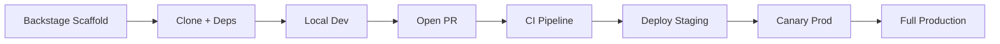
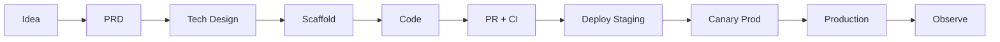

# 🛤️ Golden Path

  

---

## 🎯 What Is the Golden Path?

The golden path is a **complete, opinionated, end-to-end walkthrough** of building and shipping a service on this platform. It covers everything from creating the repository to running code in production, observable and monitored.

This is not a tutorial - it is **the way things are done here**. Following it means you get all platform capabilities (CI, CD, observability, security, service catalog) for free.

**Multi-runtime rule:** {Company} maintains a **golden path for every supported runtime** (scaffold, local run, CI, deploy, observability). The steps below document the **Java Microservice reference implementation**; other templates mirror the same stages with runtime-native build tools and health endpoints.

**Visual overview:**



The full software development lifecycle from idea to production:

**Visual overview:**



---

## 🛤️ End-to-End Steps

### Step 1: Scaffold the Service

Open Backstage and use the **Java Microservice** template (**reference implementation**):

```
Backstage → Create → Java Microservice
  Name: orders-service
  Team: team-orders
  Domain: orders
  Port: 8080
```

This creates:
- GitHub repository `{company}/orders-service` with branch protection enabled
- Standard project structure (see below)
- CI pipeline (`.github/workflows/pr.yml`, `main.yml`)
- ArgoCD application manifest added to `platform-config` repo (dev namespace)
- Backstage catalog entry registered
- Slack channel `#service-orders-service` created

**Time: < 5 minutes**

---

### Step 2: Clone & Verify Local Setup

```bash
gh repo clone {company}/orders-service
cd orders-service

# Start dependencies
docker compose up -d

# Verify dependencies healthy
docker compose ps

# Run the service (Java reference)
./gradlew bootRun --args='--spring.profiles.active=local'

# Verify it starts (Spring Boot Actuator reference)
curl http://localhost:8080/actuator/health
# → {"status":"UP"}
```

Other runtimes use the health URL and command documented in that service's README (for example `/healthz` and `npm run dev`).

**Time: < 10 minutes**

---

### Step 3: Project Structure

**Reference implementation:** the Java template generates this structure - understand it before adding code. Hexagonal layout and OpenAPI-first apply to all services; folder names differ by language.

```
orders-service/
├── src/
│   ├── main/
│   │   ├── java/com/{company}/orders/
│   │   │   ├── api/                    # Controllers, DTOs, OpenAPI annotations
│   │   │   │   ├── OrderController.java
│   │   │   │   └── dto/
│   │   │   ├── domain/                 # Business logic (pure Java, no Spring)
│   │   │   │   ├── Order.java          # Domain entity
│   │   │   │   ├── OrderService.java   # Domain service
│   │   │   │   └── OrderRepository.java # Repository interface (port)
│   │   │   ├── infrastructure/         # Adapters (Spring, JPA, Kafka, AWS)
│   │   │   │   ├── persistence/
│   │   │   │   │   └── JpaOrderRepository.java
│   │   │   │   ├── kafka/
│   │   │   │   │   └── OrderEventProducer.java
│   │   │   │   └── aws/
│   │   │   └── OrdersServiceApplication.java
│   │   └── resources/
│   │       ├── application.yml
│   │       ├── application-local.yml
│   │       ├── application-production.yml
│   │       └── db/migration/           # Flyway migrations
│   └── test/
│       ├── java/com/{company}/orders/
│       │   ├── domain/                 # Unit tests
│       │   ├── integration/            # Integration tests (Testcontainers)
│       │   ├── contract/               # Pact consumer/provider tests
│       │   └── architecture/           # ArchUnit tests
│       └── resources/
├── api/
│   └── openapi.yaml                    # OpenAPI 3.1 spec
├── docs/
│   ├── adr/                            # Architecture Decision Records
│   ├── runbook.md                      # Operational runbook
│   ├── performance.md                  # Performance baselines
│   └── dashboards/                     # Grafana dashboard JSON
├── docker-compose.yml
├── Dockerfile
├── build.gradle.kts
├── catalog-info.yaml                   # Backstage registration
└── README.md
```

---

### Step 4: Design the API First

Before writing any implementation code, write the OpenAPI spec at `api/openapi.yaml`.

Example for a `POST /v1/orders` endpoint:

```yaml
openapi: 3.1.0
info:
  title: Orders Service API
  version: 1.0.0

paths:
  /v1/orders:
    post:
      summary: Request a new order
      operationId: requestOrder
      tags: [orders]
      requestBody:
        required: true
        content:
          application/json:
            schema:
              $ref: '#/components/schemas/OrderRequest'
      responses:
        '201':
          description: Order created successfully
          content:
            application/json:
              schema:
                $ref: '#/components/schemas/Order'
        '400':
          $ref: '#/components/responses/BadRequest'
        '401':
          $ref: '#/components/responses/Unauthorized'
```

Raise a PR for API review **before** implementing. This is the API-first contract review.

---

### Step 5: Write the Domain Logic

Write the domain layer first with **no framework imports** (pure Java below as **reference implementation**):

```java
// domain/Order.java
public class Order {
    private final OrderId id;
    private OrderStatus status;
    private final CustomerId customerId;
    private final Location dispatch;
    private final Location delivery;
    private Instant startedAt;
    private Instant completedAt;

    public static Order request(CustomerId customerId, Location dispatch, Location delivery) {
        return new Order(OrderId.generate(), OrderStatus.REQUESTED, customerId, dispatch, delivery);
    }

    public void start(ProviderId providerId) {
        if (status != OrderStatus.MATCHED) {
            throw new InvalidOrderStateException("Cannot start order in state: " + status);
        }
        this.status = OrderStatus.IN_PROGRESS;
        this.startedAt = Instant.now();
    }

    public void complete() {
        if (status != OrderStatus.IN_PROGRESS) {
            throw new InvalidOrderStateException("Cannot complete order in state: " + status);
        }
        this.status = OrderStatus.COMPLETED;
        this.completedAt = Instant.now();
    }
}
```

Write unit tests for the domain first:

```java
// domain/OrderTest.java
class OrderTest {

    @Test
    void start_givenOrderIsMatched_transitionsToInProgress() {
        Order order = Order.request(CustomerId.of("customer-1"), DISPATCH, DELIVERY);
        order.match(ProviderId.of("provider-1"));

        order.start(ProviderId.of("provider-1"));

        assertThat(order.getStatus()).isEqualTo(OrderStatus.IN_PROGRESS);
    }

    @Test
    void start_givenOrderIsRequested_throwsInvalidState() {
        Order order = Order.request(CustomerId.of("customer-1"), DISPATCH, DELIVERY);

        assertThatThrownBy(() -> order.start(ProviderId.of("provider-1")))
            .isInstanceOf(InvalidOrderStateException.class);
    }
}
```

---

### Step 6: Add Integration Tests

**Reference implementation (Java):** test persistence and Kafka with Testcontainers. Other stacks use equivalent integration harnesses (testcontainers for Go, Docker services in CI, etc.) per platform standards.

```java
// integration/OrderRepositoryIntegrationTest.java
@Tag("integration")
class OrderRepositoryIntegrationTest extends BaseIntegrationTest {

    @Autowired OrderRepository orderRepository;

    @Test
    @Transactional
    void save_andFind_persistsOrder() {
        Order order = Order.request(CustomerId.of("customer-1"), DISPATCH, DELIVERY);

        orderRepository.save(order);

        Order found = orderRepository.findById(order.getId()).orElseThrow();
        assertThat(found.getStatus()).isEqualTo(OrderStatus.REQUESTED);
        assertThat(found.getCustomerId()).isEqualTo(CustomerId.of("customer-1"));
    }
}
```

---

### Step 7: Raise a Pull Request

```bash
git checkout -b feat/ORD-1001-request-order-endpoint
git add .
git commit -m "feat(orders): add order request endpoint"
git push origin feat/ORD-1001-request-order-endpoint
gh pr create --fill
```

The PR pipeline automatically runs:
- Checkstyle
- Unit tests
- Integration tests
- Coverage check (≥ 80%)
- Snyk scan
- SonarCloud analysis
- Docker build

**Estimated pipeline time: 8-10 minutes**

Get one review approval → merge.

---

### Step 8: Merge & Watch the Pipeline

On merge to `main`:

```
GitHub Actions → build + test → push image to ECR
                            → update image tag in platform-config
                            → ArgoCD detects change
                            → deploys to dev namespace
                            → smoke tests run
                            → promotes to staging
                            → E2E tests run
                            → deploys to production (canary)
                            → canary analysis passes
                            → full production rollout
```

Watch in real time:
- **GitHub Actions** - CI progress
- **ArgoCD UI** - deployment progress
- **Grafana** - service metrics appearing live

**Total time, merge to production: ~15 minutes**

---

### Step 9: Verify in Production

```bash
# Check the service is healthy in production
kubectl -n orders-production get pods
kubectl -n orders-production logs -l app=orders-service --tail=50

# Call the API (staging first)
curl -H "Authorization: Bearer $TOKEN" \
     https://api-staging.{company}.com/v1/orders

# Check Grafana dashboard
open https://grafana.{company}.internal/d/orders-service
```

---

### Step 10: Add a Runbook

Before you declare the service production-ready, write the runbook at `docs/runbook.md`:

```markdown
# Orders Service - Runbook

## Service Overview
[One paragraph]

## Common Alerts and Responses

### HighErrorRate
**Impact:** Customers cannot create orders
**First check:** Grafana → Orders dashboard → Error rate panel
**Common causes:**
  1. Database connection exhausted → check connection pool metrics
  2. Downstream service (fulfillment) is down → check fulfillment service health
**Resolution steps:**
  1. ...

### KafkaConsumerLagHigh
**Impact:** Order events delayed; downstream services (payments, notifications) lagging
**First check:** Kafka consumer group lag dashboard
...

## Escalation
On-call: PagerDuty → team-orders
Tech Lead: @lead-engineer
```

Link the runbook from `catalog-info.yaml`.

---

## 📋 Checklist: Is My Service Golden Path Compliant?

```
Repository & Code
[ ] Created via Backstage template (not manually)
[ ] catalog-info.yaml registered and accurate
[ ] CODEOWNERS file present
[ ] README complete (local dev instructions work)
[ ] OpenAPI spec at api/openapi.yaml
[ ] ADR raised for any non-standard decisions

Testing
[ ] Unit test coverage ≥ 80%
[ ] Integration tests use Testcontainers
[ ] ArchUnit tests present
[ ] Pact contracts defined for all consumer relationships

CI/CD
[ ] PR pipeline passes in < 10 minutes
[ ] All quality gates green (coverage, Snyk, Sonar)
[ ] No secrets in repository (Gitleaks clean)
[ ] Main pipeline deploys to dev automatically

Observability
[ ] Structured JSON logging with correlation IDs
[ ] Prometheus metrics endpoint active
[ ] Grafana dashboard created
[ ] At least one P1/P2 alert rule configured
[ ] All P1/P2 alerts have runbook links
[ ] Runbook complete at docs/runbook.md
[ ] Distributed tracing configured (OTel agent)

Production Readiness
[ ] Readiness and liveness probes configured
[ ] Graceful shutdown (30s drain) configured
[ ] HPA configured (min 3 replicas in production)
[ ] Resource requests and limits set
[ ] Pod anti-affinity across AZs
[ ] Feature flags for unreleased features
[ ] PagerDuty service configured
[ ] SLO defined and tracked
```

---

## 🏗️ JVM Options Template

**Reference implementation (Java):** JVM services deployed via the shared backend Helm chart use a standard set of JVM flags in the chart defaults. Node, Go, and .NET services use their own **runtime tuning** (Node `--max-old-space-size`, Go `GOGC`, .NET GC heap limits) documented in the runtime-specific golden path; the principle is the same: align memory and diagnostics with container limits.

### Standard JVM Flags

```
-XX:+UseG1GC
-XX:MaxRAMPercentage=75
-XX:+ExitOnOutOfMemoryError
-Xlog:gc*:file=/dev/stdout
-XX:+FlightRecorder
-XX:StartFlightRecording=settings=default,maxsize=100m
```

| Flag | Purpose |
|------|---------|
| `-XX:+UseG1GC` | G1 garbage collector - low-latency, suitable for containerized workloads |
| `-XX:MaxRAMPercentage=75` | Heap sized as percentage of container memory limit - avoids hardcoded `-Xmx` values that drift from resource limits |
| `-XX:+ExitOnOutOfMemoryError` | Terminates the JVM on OOM so Kubernetes restarts the pod cleanly instead of leaving a zombie process |
| `-Xlog:gc*:file=/dev/stdout` | GC logs written to stdout for collection by the logging pipeline |
| `-XX:+FlightRecorder` | Enables JDK Flight Recorder for low-overhead production profiling |
| `-XX:StartFlightRecording=settings=default,maxsize=100m` | Continuous recording with a 100 MB rolling buffer for post-incident analysis |

### Overriding JVM Options

Teams may override JVM flags in their service's Helm values file (**Java reference**). Any override must be documented in an ADR explaining why the default is not suitable for the service's workload.

```yaml
# values-production.yaml
jvmOpts: >-
  -XX:+UseG1GC
  -XX:MaxRAMPercentage=80
  -XX:+ExitOnOutOfMemoryError
  -Xlog:gc*:file=/dev/stdout
  -XX:+FlightRecorder
  -XX:StartFlightRecording=settings=default,maxsize=200m
```

---
<div align="center">

⬅️ [Back to section](./README.md) · 🏠 [Back to root](../README.md)

</div>
