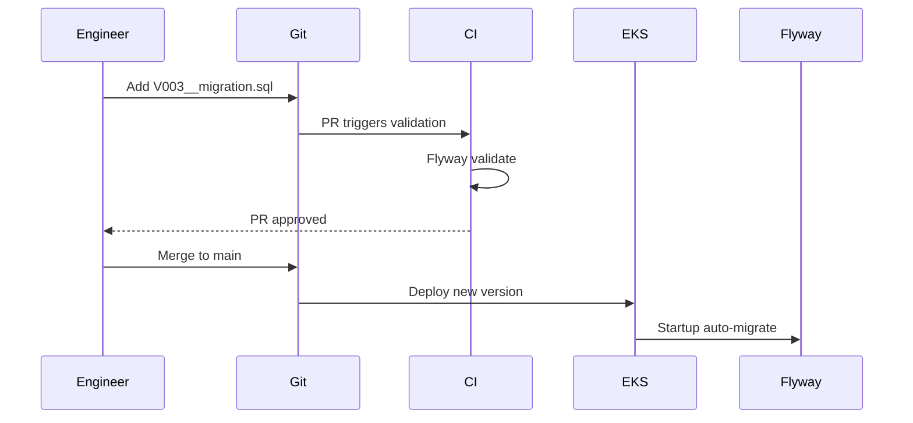

# 🗄️ Database Migrations

  

---

## 🎯 1. The Golden Rule

**Never change a database schema by hand.** Not in dev. Not in staging. Never in production.

Every schema change — table, column, index, constraint — must go through a **Flyway migration script** that is committed to Git, reviewed in a PR, and applied automatically by the CI/CD pipeline.

Why:
- Hand-applied changes in prod are invisible to the rest of the team
- They can't be rolled forward in other environments
- They can't be audited or reverted systematically
- They cause environment drift — "works in staging, broken in prod"

---

## 💻 2. Flyway Setup

**Visual overview:**



Flyway is included in the platform BOM. It runs automatically on application startup.

```kotlin
// build.gradle.kts — already in platform BOM
implementation("org.flywaydb:flyway-core")
implementation("org.flywaydb:flyway-database-postgresql")
```

```yaml
# application.yml
spring:
  flyway:
    enabled: true
    locations: classpath:db/migration
    baseline-on-migrate: false   # Never true for new services
    validate-on-migrate: true    # Always true — detect tampering
    out-of-order: false          # Always false — enforce sequential order
```

---

## 📏 3. File Naming Convention

All migration files live in `src/main/resources/db/migration/`.

**Format:** `V{version}__{description}.sql`

```
V1__create_orders_table.sql
V2__add_provider_id_to_orders.sql
V3__create_order_events_table.sql
V4__add_index_on_orders_customer_id.sql
V5__add_price_currency_column.sql
```

Rules:
- Two underscores between version and description
- Use `snake_case` for the description
- **Version numbers are sequential integers** — `V1`, `V2`, `V3` — not dates, not decimals
- Description must be meaningful — `V3__misc_changes` is rejected in code review
- **Never rename or edit a migration file once it is merged to main** — Flyway checksums will fail

---

## 🗄️ 4. Writing Good Migration Scripts

### 4.1 Always Specify Explicit Constraints and Types

```sql
-- ❌ Bad — vague types, no constraints
CREATE TABLE orders (
    id VARCHAR,
    status VARCHAR,
    price DECIMAL
);

-- ✅ Good — explicit, safe, production-grade
CREATE TABLE orders (
    id            VARCHAR(36)     NOT NULL,
    customer_id   VARCHAR(36)     NOT NULL,
    provider_id   VARCHAR(36),                    -- nullable until assigned
    status        VARCHAR(20)     NOT NULL,
    dispatch_lat  DECIMAL(9, 6)   NOT NULL,
    dispatch_lng  DECIMAL(9, 6)   NOT NULL,
    delivery_lat  DECIMAL(9, 6)   NOT NULL,
    delivery_lng  DECIMAL(9, 6)   NOT NULL,
    price_amount  INTEGER,                         -- cents; nullable until completed
    price_currency VARCHAR(3),
    requested_at  TIMESTAMPTZ     NOT NULL DEFAULT NOW(),
    started_at    TIMESTAMPTZ,
    completed_at  TIMESTAMPTZ,
    created_at    TIMESTAMPTZ     NOT NULL DEFAULT NOW(),
    updated_at    TIMESTAMPTZ     NOT NULL DEFAULT NOW(),

    CONSTRAINT pk_orders PRIMARY KEY (id),
    CONSTRAINT chk_orders_status CHECK (
        status IN ('REQUESTED', 'MATCHED', 'IN_PROGRESS', 'COMPLETED', 'CANCELLED')
    )
);
```

### 4.2 Always Add Indexes for Query Patterns

```sql
-- Add index in the same migration as the table, or a separate one
-- Name indexes explicitly
CREATE INDEX idx_orders_customer_id ON orders(customer_id);
CREATE INDEX idx_orders_status ON orders(status);
CREATE INDEX idx_orders_provider_id ON orders(provider_id) WHERE provider_id IS NOT NULL;

-- For compound queries:
CREATE INDEX idx_orders_customer_status ON orders(customer_id, status);
```

### 4.3 Include Helpful Comments

```sql
-- V7__add_cancellation_reason_to_orders.sql
-- Adds cancellation tracking per product requirement ORD-2341.
-- The column is nullable because it only applies to CANCELLED orders.
-- The constraint is enforced at application level; the DB constraint is a safety net.

ALTER TABLE orders
    ADD COLUMN cancellation_reason VARCHAR(50),
    ADD COLUMN cancelled_at TIMESTAMPTZ,
    ADD COLUMN cancelled_by VARCHAR(20);  -- 'CUSTOMER', 'PROVIDER', 'SYSTEM'
```

---

## 🧩 5. The Expand-Contract Pattern

This is the most important thing to understand about schema migrations in a live system.

**The problem:** You cannot make a breaking schema change in a single deployment because:
- The new code and old code run simultaneously during a rolling deployment
- The old code will break if it encounters a schema it doesn't understand

**The solution:** Every breaking change takes **three deployments**.

### 5.1 Example: Renaming a Column

Say we want to rename `dispatch_address` → `dispatch_location`.

**Wrong approach (single step — breaks during rolling deploy):**
```sql
-- ❌ Never do this on a live system
ALTER TABLE orders RENAME COLUMN dispatch_address TO dispatch_location;
```

**Right approach (three steps):**

---

**Step 1 — EXPAND: Add the new column (backward compatible)**

```sql
-- V12__add_dispatch_location_column.sql
-- Expand: add new column alongside old one. Both exist simultaneously.
-- Old code writes to dispatch_address. New code writes to both.
ALTER TABLE orders ADD COLUMN dispatch_location VARCHAR(500);
```

Deploy code that writes to **both** columns:
```java
order.setDispatchAddress(address);    // old column — keep writing
order.setDispatchLocation(address);   // new column — start writing
```

---

**Step 2 — MIGRATE: Backfill the new column**

```sql
-- V13__backfill_dispatch_location.sql
-- Backfill: copy existing data to new column.
-- Run in batches for large tables to avoid locking.
UPDATE orders
SET dispatch_location = dispatch_address
WHERE dispatch_location IS NULL
  AND dispatch_address IS NOT NULL;
```

Deploy code that reads from the **new** column:
```java
// Old column still exists and is still being written to
// New column is now populated and being read from
return order.getDispatchLocation();
```

---

**Step 3 — CONTRACT: Remove the old column**

Only after all services are deployed and reading from the new column:

```sql
-- V14__drop_dispatch_address_column.sql
-- Contract: old column no longer needed. Safe to remove.
-- Verify dispatch_location has no NULLs before running this.
ALTER TABLE orders
    ALTER COLUMN dispatch_location SET NOT NULL,  -- enforce now
    DROP COLUMN dispatch_address;                  -- remove old column
```

---

### 5.2 Expand-Contract for Adding a NOT NULL Column

```sql
-- ❌ Wrong — will fail if any rows exist (or during rolling deploy)
ALTER TABLE orders ADD COLUMN service_type VARCHAR(20) NOT NULL;

-- ✅ Step 1: Add as nullable
ALTER TABLE orders ADD COLUMN service_type VARCHAR(20);

-- ✅ Step 2: Backfill (in a separate migration after code is deployed)
UPDATE orders SET service_type = 'STANDARD' WHERE service_type IS NULL;

-- ✅ Step 3: Add NOT NULL constraint (after all rows are populated)
ALTER TABLE orders ALTER COLUMN service_type SET NOT NULL;
```

---

## 🗄️ 6. Large Table Migrations

For tables with millions of rows, `ALTER TABLE` locks the table and blocks reads/writes. Use these patterns:

### 6.1 Add Index Without Locking

```sql
-- ❌ This locks the table
CREATE INDEX idx_orders_completed_at ON orders(completed_at);

-- ✅ This runs without locking (takes longer, but safe in production)
CREATE INDEX CONCURRENTLY idx_orders_completed_at ON orders(completed_at);
```

### 6.2 Add Column With Default Without Locking (PostgreSQL 11+)

```sql
-- PostgreSQL 11+ handles this without a table rewrite
-- For older versions, add nullable first, backfill, then add default
ALTER TABLE orders ADD COLUMN is_shared BOOLEAN NOT NULL DEFAULT FALSE;
```

### 6.3 Batch Updates for Large Backfills

Never run a migration that updates millions of rows in one statement:

```sql
-- ❌ Locks the table for minutes
UPDATE orders SET service_type = 'STANDARD' WHERE service_type IS NULL;

-- ✅ Batch it (run in a loop or scheduled job)
DO $$
DECLARE
    batch_size INT := 1000;
    rows_updated INT;
BEGIN
    LOOP
        UPDATE orders
        SET service_type = 'STANDARD'
        WHERE id IN (
            SELECT id FROM orders
            WHERE service_type IS NULL
            LIMIT batch_size
        );
        GET DIAGNOSTICS rows_updated = ROW_COUNT;
        EXIT WHEN rows_updated = 0;
        PERFORM pg_sleep(0.1);  -- brief pause between batches
    END LOOP;
END $$;
```

---

## 🛤️ 7. What To Do When You Make a Mistake

**Scenario: You merged a migration with a bug and it's already applied in dev.**

You cannot edit the migration file — Flyway will detect the checksum mismatch and refuse to start.

**The fix: Write a new migration that corrects it.**

```sql
-- V8__add_wrong_column.sql (already applied — DO NOT TOUCH)
ALTER TABLE orders ADD COLUMN price_in_dollars DECIMAL(10,2);

-- V9__fix_price_column_type.sql (new migration to correct it)
-- Corrects V8 which used wrong type. Price should be integer cents, not decimal dollars.
ALTER TABLE orders
    ADD COLUMN price_amount_cents INTEGER,
    DROP COLUMN price_in_dollars;
```

**If the migration was only applied locally and not merged:**

```bash
# Repair the Flyway checksum after editing the file (dev only, never prod)
./gradlew flywayRepair
```

---

## 📋 8. Migration Checklist

Before raising a PR with a migration, verify:

```
[ ] File follows naming convention: V{N}__{description}.sql
[ ] Version number is the next sequential integer (check existing files)
[ ] Description clearly states what the migration does
[ ] No data loss for existing rows (nullable columns, defaults provided)
[ ] Indexes added for all new foreign keys and common query patterns
[ ] Large table changes use CONCURRENTLY or batching
[ ] No single-step breaking changes (use expand-contract for renaming/removing)
[ ] Migration tested locally against a populated database (not just empty)
[ ] Rollback strategy documented (in PR description)
```

---

## 💻 9. Checking Migration Status

```bash
# See which migrations have been applied
./gradlew flywayInfo

# Validate that applied migrations match the files
./gradlew flywayValidate

# Local only — reset your local DB and re-run from scratch
./gradlew flywayClean flywayMigrate
```

---
<div align="center">

⬅️ [Back to section](./README.md) · 🏠 [Back to root](../README.md)

</div>
