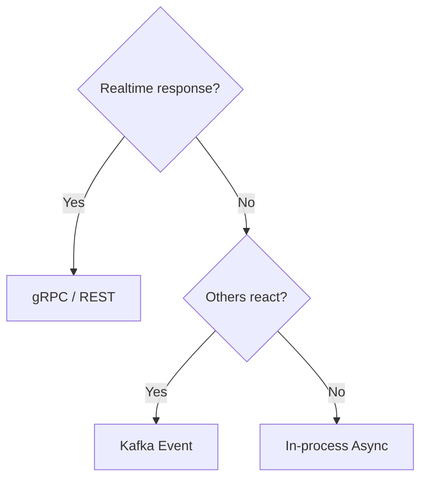
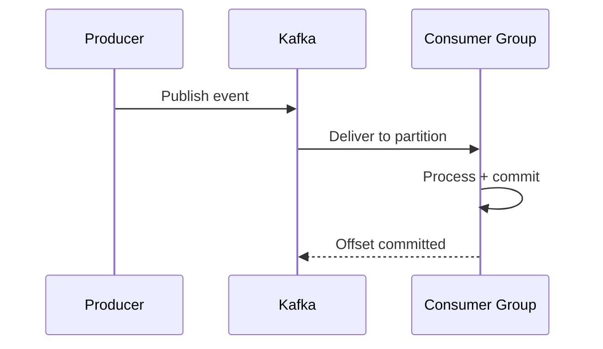

# 📨 Kafka Patterns

  

---

## 🎯 1. When to Use Kafka (and When Not To)

Kafka is not a replacement for REST APIs. Use it for the right problem.

**Visual overview:**



| Use Kafka When | Use REST/gRPC Instead When |
|---------------|---------------------------|
| A state change in one service needs to trigger work in another service | You need a real-time response from the other service |
| Multiple services care about the same event | Only one service cares |
| Eventual consistency is acceptable | The user is waiting for the result |
| You need a durable audit trail of events | You need a simple request/response |
| You want to decouple the producer from its consumers | The consumer must be available for the call to succeed |

**Example — use Kafka:**
> When an order completes, the Payments service, Notifications service, and Analytics pipeline all need to react. The Orders service should not call each of them synchronously.

**Example — use REST:**
> When a customer requests an order, the BFF needs to return an order ID immediately. The Orders service must respond synchronously.

---

## 📨 2. Core Concepts

Before writing any Kafka code, understand these concepts:

- **Topic:** A named, ordered, durable log of messages — like a database table for events
- **Partition:** Topics are split into partitions for parallelism. Messages in the same partition are ordered. Messages across partitions are not.
- **Consumer Group:** A set of consumers that share the work of reading from a topic. Each partition is assigned to exactly one consumer in the group.
- **Offset:** The position of a message in a partition. Kafka tracks which offset a consumer group has read up to.
- **At-least-once delivery:** Kafka delivers messages at least once. Your consumer must handle duplicates.

---

## 📨 3. Standard Kafka Configuration

### 3.1 application.yml (Producer)

```yaml
spring:
  kafka:
    bootstrap-servers: ${KAFKA_BOOTSTRAP_SERVERS}
    producer:
      key-serializer: org.apache.kafka.common.serialization.StringSerializer
      value-serializer: io.confluent.kafka.serializers.KafkaAvroSerializer
      acks: all                    # Wait for all replicas — never lose a message
      retries: 3
      retry-backoff-ms: 1000
      enable-idempotence: true     # Exactly-once producer semantics
      properties:
        schema.registry.url: ${SCHEMA_REGISTRY_URL}
        max.in.flight.requests.per.connection: 1  # Required with idempotence
```

### 3.2 application.yml (Consumer)

```yaml
spring:
  kafka:
    consumer:
      group-id: ${spring.application.name}.${topic-name}.consumer
      key-deserializer: org.apache.kafka.common.serialization.StringDeserializer
      value-deserializer: io.confluent.kafka.serializers.KafkaAvroDeserializer
      auto-offset-reset: earliest    # Start from beginning if no committed offset
      enable-auto-commit: false      # NEVER auto-commit — we commit after processing
      max-poll-records: 100          # Process in batches of 100
      properties:
        schema.registry.url: ${SCHEMA_REGISTRY_URL}
        specific.avro.reader: true
```

---

## 📨 4. Writing a Producer

### 4.1 The Wrong Way

```java
// ❌ Bad — direct KafkaTemplate in domain service
// Domain should not know about Kafka
@Service
public class OrderService {
    @Autowired
    private KafkaTemplate<String, Object> kafkaTemplate;  // Kafka in domain!

    public void completeOrder(OrderId orderId) {
        order.complete();
        kafkaTemplate.send("orders.order.completed", orderId.value(), event);  // Bad!
    }
}
```

### 4.2 The Right Way — Via Port

Following hexagonal architecture (see [Hexagonal Architecture Guide](../02-architecture-and-api/03-hexagonal-architecture.md)):

```java
// Domain port — what the domain needs
// com/{company}/orders/domain/port/outbound/OrderEventPublisher.java
public interface OrderEventPublisher {
    void publish(OrderCompletedEvent event);
}

// Domain event — plain Java record
// com/{company}/orders/domain/event/OrderCompletedEvent.java
public record OrderCompletedEvent(
    OrderId orderId,
    CustomerId customerId,
    ProviderId providerId,
    PriceAmount price,
    Instant completedAt
) {}

// Infrastructure adapter — Kafka implementation
// com/{company}/orders/infrastructure/kafka/KafkaOrderEventPublisher.java
@Component
public class KafkaOrderEventPublisher implements OrderEventPublisher {

    private static final String TOPIC = "orders.order.completed";
    private static final Logger log = LoggerFactory.getLogger(KafkaOrderEventPublisher.class);

    private final KafkaTemplate<String, OrderCompletedAvro> kafkaTemplate;
    private final OrderEventAvroMapper mapper;

    public KafkaOrderEventPublisher(KafkaTemplate<String, OrderCompletedAvro> kafkaTemplate,
                                    OrderEventAvroMapper mapper) {
        this.kafkaTemplate = kafkaTemplate;
        this.mapper = mapper;
    }

    @Override
    public void publish(OrderCompletedEvent event) {
        OrderCompletedAvro avroEvent = mapper.toAvro(event);
        String key = event.orderId().value();  // Use orderId as key for ordering

        kafkaTemplate.send(TOPIC, key, avroEvent)
            .whenComplete((result, ex) -> {
                if (ex != null) {
                    log.error("Failed to publish OrderCompletedEvent. orderId={}",
                        event.orderId(), ex);
                    // Don't swallow — let it propagate to trigger retry or alert
                    throw new EventPublishingException("Failed to publish event", ex);
                }
                log.info("Published OrderCompletedEvent. orderId={}, partition={}, offset={}",
                    event.orderId(),
                    result.getRecordMetadata().partition(),
                    result.getRecordMetadata().offset());
            });
    }
}
```

---

## 📨 5. Writing a Consumer

**Visual overview:**



### 5.1 The Basic Pattern

```java
@Component
public class OrderCompletedEventConsumer {

    private static final Logger log = LoggerFactory.getLogger(OrderCompletedEventConsumer.class);

    private final PaymentService paymentService;

    public OrderCompletedEventConsumer(PaymentService paymentService) {
        this.paymentService = paymentService;
    }

    @KafkaListener(
        topics = "orders.order.completed",
        groupId = "payments-service.order-completed.consumer",
        containerFactory = "kafkaListenerContainerFactory"
    )
    public void consume(
            @Payload OrderCompletedAvro event,
            @Header(KafkaHeaders.RECEIVED_PARTITION) int partition,
            @Header(KafkaHeaders.OFFSET) long offset,
            Acknowledgment acknowledgment) {

        log.info("Received OrderCompletedEvent. orderId={}, partition={}, offset={}",
            event.getOrderId(), partition, offset);

        try {
            paymentService.capturePayment(event.getOrderId(), event.getPriceAmount());
            acknowledgment.acknowledge();  // Commit offset ONLY after successful processing
            log.info("Processed OrderCompletedEvent. orderId={}", event.getOrderId());

        } catch (Exception e) {
            log.error("Failed to process OrderCompletedEvent. orderId={}", event.getOrderId(), e);
            // Do NOT acknowledge — message will be retried
            // The error handler will decide whether to retry or send to DLQ
            throw e;
        }
    }
}
```

### 5.2 Key Rules for Consumers

| Rule | Why |
|------|-----|
| Never `acknowledgment.acknowledge()` before processing succeeds | If processing fails after ack, you lose the message |
| Always log the orderId / correlation ID at the start | Enables log tracing through the consumer |
| Never put slow operations (external HTTP) inside the listener without a timeout | One slow message blocks the whole partition |
| Never commit offsets in a loop inside the listener | Offset management is per-message |

---

## 🧩 6. Idempotent Consumers — Handling Duplicates

Kafka delivers messages **at least once**. Your consumer will receive the same message more than once — during rebalances, restarts, or network issues. Your consumer must handle this safely.

### 6.1 The Pattern — Idempotency Key Table

```sql
-- Migration: V15__create_processed_events_table.sql
-- Tracks which Kafka events have already been processed
CREATE TABLE processed_events (
    event_id      VARCHAR(100) NOT NULL,
    topic         VARCHAR(100) NOT NULL,
    processed_at  TIMESTAMPTZ NOT NULL DEFAULT NOW(),

    CONSTRAINT pk_processed_events PRIMARY KEY (event_id, topic)
);

-- Clean up old records to prevent unbounded growth
CREATE INDEX idx_processed_events_processed_at ON processed_events(processed_at);
```

```java
@Component
public class OrderCompletedEventConsumer {

    private final PaymentService paymentService;
    private final ProcessedEventRepository processedEventRepository;

    @KafkaListener(topics = "orders.order.completed", ...)
    @Transactional  // Atomic: process + mark as processed in one transaction
    public void consume(@Payload OrderCompletedAvro event, Acknowledgment acknowledgment) {

        String eventId = event.getOrderId() + "-completed";

        // Check if we've already processed this event
        if (processedEventRepository.existsByEventIdAndTopic(eventId, "orders.order.completed")) {
            log.info("Duplicate event ignored. eventId={}", eventId);
            acknowledgment.acknowledge();
            return;
        }

        // Process the event
        paymentService.capturePayment(event.getOrderId(), event.getPriceAmount());

        // Mark as processed (within the same transaction)
        processedEventRepository.save(new ProcessedEvent(eventId, "orders.order.completed"));

        acknowledgment.acknowledge();
    }
}
```

---

## 📨 7. Dead Letter Queue (DLQ) — Handling Poison Messages

A "poison message" is a message your consumer cannot process — bad data, a schema it doesn't understand, or a persistent downstream failure. Without a DLQ, this message blocks the partition forever.

### 7.1 DLQ Configuration

```java
@Configuration
public class KafkaConsumerConfig {

    @Bean
    public ConcurrentKafkaListenerContainerFactory<String, Object> kafkaListenerContainerFactory(
            ConsumerFactory<String, Object> consumerFactory,
            KafkaTemplate<String, Object> kafkaTemplate) {

        var factory = new ConcurrentKafkaListenerContainerFactory<String, Object>();
        factory.setConsumerFactory(consumerFactory);
        factory.getContainerProperties().setAckMode(ContainerProperties.AckMode.MANUAL);

        // Retry 3 times with exponential backoff, then send to DLQ
        factory.setCommonErrorHandler(new DefaultErrorHandler(
            new DeadLetterPublishingRecoverer(kafkaTemplate,
                (record, ex) -> new TopicPartition(
                    record.topic() + ".dlq",    // DLQ topic: orders.order.completed.dlq
                    record.partition()
                )
            ),
            new ExponentialBackOffWithMaxRetries(3)
        ));

        return factory;
    }
}
```

### 7.2 DLQ Topic Naming

```
{original-topic}.dlq

Examples:
  orders.order.completed.dlq
  orders.order.requested.dlq
  payments.payment.captured.dlq
```

### 7.3 Monitoring and Replaying DLQ Messages

- DLQ consumer lag is monitored and alerts if > 0 for more than 5 minutes
- A DLQ message means something went wrong — investigate before replaying
- To replay DLQ messages, use the platform DLQ replay tool (available in the Ops portal)

---

## 🧩 8. Partition Key Strategy

The partition key determines which partition a message goes to. Messages with the same key always go to the same partition — and are therefore ordered relative to each other.

```java
// ✅ Use the entity ID as the partition key
// This ensures all events for the same order are ordered
kafkaTemplate.send("orders.order.completed", order.getId().value(), event);

// ✅ For provider location updates — use provider ID
// All location updates for the same provider are ordered
kafkaTemplate.send("providers.provider.location-updated", provider.getId().value(), locationEvent);

// ❌ Don't use null — messages go to random partitions, losing ordering
kafkaTemplate.send("orders.order.completed", null, event);

// ❌ Don't use a timestamp — all messages go to one partition (hot partition)
kafkaTemplate.send("orders.order.completed", Instant.now().toString(), event);
```

---

## 🧩 9. Transactional Outbox Pattern

**Problem:** What if the service saves to the database but then crashes before publishing the Kafka event? The data is saved, but no one is notified.

```java
// ❌ Dangerous — if crash happens between save and publish, event is lost
orderRepository.save(order);           // persisted
kafkaTemplate.send(TOPIC, event);     // crash here → event never published
```

**Solution:** The Transactional Outbox pattern.

```sql
-- V16__create_outbox_table.sql
CREATE TABLE outbox_events (
    id           VARCHAR(36)   NOT NULL,
    topic        VARCHAR(100)  NOT NULL,
    partition_key VARCHAR(100) NOT NULL,
    payload      JSONB         NOT NULL,
    created_at   TIMESTAMPTZ   NOT NULL DEFAULT NOW(),
    published_at TIMESTAMPTZ,

    CONSTRAINT pk_outbox_events PRIMARY KEY (id)
);

CREATE INDEX idx_outbox_unpublished ON outbox_events(created_at)
    WHERE published_at IS NULL;
```

```java
@Transactional  // Single transaction — both succeed or both fail
public Order completeOrder(OrderId orderId) {
    Order order = orderRepository.findById(orderId).orElseThrow();
    order.complete(price);
    orderRepository.save(order);

    // Write event to outbox table — same transaction as the order save
    outboxRepository.save(new OutboxEvent(
        UUID.randomUUID().toString(),
        "orders.order.completed",
        orderId.value(),
        objectMapper.writeValueAsString(buildEvent(order))
    ));

    return order;  // Event is NOT published yet — the outbox publisher does that
}
```

A separate scheduled job (or Debezium CDC) reads the outbox table and publishes to Kafka:

```java
@Scheduled(fixedDelay = 1000)  // Every second
@Transactional
public void publishOutboxEvents() {
    List<OutboxEvent> unpublished = outboxRepository.findUnpublished(Limit.of(100));

    for (OutboxEvent event : unpublished) {
        kafkaTemplate.send(event.getTopic(), event.getPartitionKey(), event.getPayload());
        outboxRepository.markPublished(event.getId());
    }
}
```

Use this pattern for any event that **must not be lost** — payment captures, order completions, fraud signals.

---

## 📊 10. Consumer Group Lag Monitoring

Consumer lag = the number of messages published to a topic that your consumer hasn't processed yet.

A growing lag means your consumer is falling behind. This is a leading indicator of problems.

Every consumer must have a Grafana alert on lag:

```yaml
# Alert rule — in platform standard alerts
- alert: KafkaConsumerLagHigh
  expr: kafka_consumer_group_lag{group="payments-service.order-completed.consumer"} > 1000
  for: 5m
  severity: P2
  annotations:
    summary: "Payments consumer is falling behind on order-completed events"
    runbook: "https://wiki.{company}.internal/runbooks/payments-service#consumer-lag"
```

---

## 💻 11. Local Development with Kafka

```bash
# Start Kafka locally via docker compose
docker compose up -d kafka

# Produce a test message (for manual testing)
docker exec -it kafka kafka-console-producer \
  --bootstrap-server localhost:9092 \
  --topic orders.order.completed

# Consume messages (to verify your consumer is working)
docker exec -it kafka kafka-console-consumer \
  --bootstrap-server localhost:9092 \
  --topic orders.order.completed \
  --from-beginning

# Check consumer group lag
docker exec -it kafka kafka-consumer-groups \
  --bootstrap-server localhost:9092 \
  --describe \
  --group payments-service.order-completed.consumer
```

---

## 📋 12. Topic Creation Workflow

Topics are not self-service — creation is a controlled process to ensure consistency and data governance.

### 12.1 Request Process

| Step | Action | Owner |
|------|--------|-------|
| 1 | Submit request via Backstage topic creation form or PR to `platform-config` repo | Requesting team |
| 2 | Platform team reviews: partition count, replication factor, retention policy, schema subject | Platform Engineering |
| 3 | Data steward for the owning domain approves data classification and retention | Data steward |
| 4 | Topic provisioned via Terraform MSK module | Platform Engineering (automated) |

### 12.2 Default Topic Configuration

| Parameter | Default | Override Requires |
|-----------|---------|-------------------|
| **Partition count** | 6 | Platform team approval with load justification |
| **Replication factor** | 3 | Not overridable in production |
| **Retention** | 7 days | Data steward approval for longer retention |
| **Cleanup policy** | `delete` | `compact` requires ADR |
| **Schema subject** | `{domain}.{entity}.{event}.v1` | Must match naming convention |

### 12.3 Approval Matrix

| Approver | What They Verify |
|----------|-----------------|
| **Platform team** | Naming convention, partition count, replication factor, Terraform plan |
| **Data steward** (domain) | Data classification, retention policy, PII considerations, consumer access |

---

## 🛤️ 13. DLQ Replay Procedure

### 13.1 Replay Mechanism

DLQ messages are replayed via the Ops Portal UI or CLI:

```bash
kafka-dlq-replay --topic {topic}.dlq --from {date} --dry-run
```

Always run with `--dry-run` first to preview the messages that will be replayed.

### 13.2 Safety Checks

| Check | Detail |
|-------|--------|
| **Idempotency key verification** | Each message's idempotency key is validated before replay |
| **Replay count limit** | Maximum 10,000 messages per batch — larger replays require batching |
| **Dry-run first** | `--dry-run` is mandatory before any live replay |
| **Original idempotency key** | Replayed messages use the original idempotency key — no new key is generated |

### 13.3 Interaction with Idempotency Tables

If the idempotency key has already been processed and the result is cached in the `processed_events` table, the replay is a **no-op** — the consumer detects the duplicate and skips processing. This is the expected behavior for most replays of transient failures.

### 13.4 Audit Trail

All replays are logged with:

| Field | Description |
|-------|-------------|
| **Operator** | Who initiated the replay (SSO identity) |
| **Timestamp** | When the replay was executed |
| **Topic** | Source DLQ topic |
| **Message count** | Number of messages replayed |
| **Dry-run** | Whether it was a dry-run or live replay |

Audit entries are written to the `ops-audit-log` and are retained for 12 months.

---
<div align="center">

⬅️ [Back to section](./README.md) · 🏠 [Back to root](../README.md)

</div>
