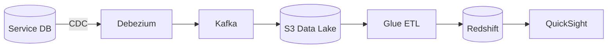

# 🏗️ Data Platform

  

---

## 🎯 1. Data Ownership Principle

Each domain service is the **single source of truth** for its own data. No other service reads from a domain's database directly. Data is shared through:
- APIs (synchronous, request-time)
- Domain events on Kafka (asynchronous, eventual consistency)
- Read projections in the data warehouse (analytical, batch)

---

## 📏 2. Event Schema Registry

### 2.1 Standard

All Kafka messages use **Avro** schemas, registered in a **governed schema registry**. **Reference implementation (AWS):** AWS Glue Schema Registry. **Alternatives:** Confluent Schema Registry, Azure Schema Registry, or equivalent.

### 2.2 Schema Evolution Rules

We follow **backward compatibility** rules - new consumers can read old messages, old consumers can read new messages:

| Change | Allowed? |
|--------|---------|
| Add field with default value | ✅ Yes |
| Remove field (with or without default) | ❌ No - breaking (removing a field is always a breaking change; requires the breaking change playbook) |
| Add required field (no default) | ❌ No - breaking |
| Remove required field | ❌ No - breaking |
| Change field type | ❌ No - breaking |
| Rename field | ❌ No (add new + deprecate old) |

Breaking schema changes require a new schema version and a migration plan.

### 2.3 Schema Naming

```
{domain}.{entity}.{version}

Examples:
  orders.order.v1
  payments.payment.v2
  providers.provider-location.v1
```

---

## 🏗️ 3. Analytics Data Pipeline

### 3.1 Architecture

**Reference implementation (AWS):** S3, Glue, Redshift, QuickSight, MSK, and Aurora in the diagrams and prose below map to lake + ETL + warehouse + BI in any cloud.

> **Note:** CDC in this document refers to **Change Data Capture** (Debezium/outbox pattern), not Consumer-Driven Contracts (testing). See [GLOSSARY.md](../GLOSSARY.md).

**Visual overview:**



```
Operational DBs (Aurora)
        │
        │ CDC via Debezium
        ▼
    Kafka (MSK)
        │
        │ Kafka Connect S3 Sink
        ▼
    S3 (Raw Layer)
        │
        │ AWS Glue ETL
        ▼
  Amazon Redshift (Data Warehouse)
        │
        │ dbt transformations
        ▼
  Redshift (Curated Layer)
        │
        ▼
  Amazon QuickSight / Grafana (Reporting)
```

### 3.2 CDC (Change Data Capture)

- **Debezium** captures row-level changes from Aurora and publishes to Kafka
- Topic naming for CDC: `cdc.{database}.{table}` e.g. `cdc.orders.orders`
- CDC events are never consumed by application services - analytics pipeline only

### 3.3 Data Retention

| Layer | Retention | Storage |
|-------|----------|---------|
| Kafka (hot) | 7-30 days per topic | MSK |
| S3 raw | 7 years | S3 Glacier tiering |
| Redshift curated | 3 years | Redshift |

---

## 🔐 4. GDPR & Data Compliance

- **Right to erasure:** Implemented via a `data-deletion-service` that accepts a customer/provider ID and triggers deletion across all operational stores and queues a downstream analytics tombstone event
- **Data residency:** All EU customer data stored in `eu-west-1` or `eu-central-1` only; enforced by SCP
- **Consent:** Consent records stored in a dedicated consent service; downstream systems subscribe to consent-revoked events
- **Data inventory:** Maintained in the data catalog (**reference:** AWS Glue Data Catalog + Backstage)

---

---

## 🎯 5. Data Store Selection Guide

Picking the wrong data store is expensive to fix. Use this decision guide before choosing:

```
Is this data relational / transactional?
  └─ YES → PostgreSQL (RDS or Aurora)

Is this data a cache or session state that can be rebuilt?
  └─ YES → Redis (ElastiCache)

Is this a stream of events that multiple consumers need?
  └─ YES → Kafka (MSK)

Is this binary data (images, documents, files)?
  └─ YES → S3

Is this for full-text or geospatial search?
  └─ YES → OpenSearch

Is this for analytics / reporting (read-heavy, large scans)?
  └─ YES → Redshift

Is this for real-time geospatial queries (provider locations)?
  └─ YES → Redis with GEO commands
```

---

## 🧩 6. Provider Location - Geospatial Pattern

Provider location updates are the highest-frequency writes on the platform (~5 updates/second/active provider). They use Redis geospatial indexes.

**Reference implementation (Java / Spring Data Redis):**

```java
// Writing provider location (from location update consumer)
@Component
public class ProviderLocationRepository {

    private final RedisTemplate<String, String> redisTemplate;
    private static final String GEO_KEY = "provider:locations";

    public void updateLocation(ProviderId providerId, double lat, double lng) {
        redisTemplate.opsForGeo().add(
            GEO_KEY,
            new Point(lng, lat),     // Note: Redis uses lng, lat order
            providerId.value()
        );
        // Set expiry: if a provider hasn't updated in 5 minutes, remove them
        redisTemplate.expire(GEO_KEY + ":" + providerId.value(), Duration.ofMinutes(5));
    }

    // Find providers within radius (for fulfillment)
    public List<ProviderId> findProvidersWithinRadius(Location center, double radiusKm) {
        Circle circle = new Circle(
            new Point(center.lng(), center.lat()),
            new Distance(radiusKm, Metrics.KILOMETERS)
        );

        GeoResults<RedisGeoCommands.GeoLocation<String>> results =
            redisTemplate.opsForGeo().radius(GEO_KEY, circle);

        return results.getContent().stream()
            .map(r -> ProviderId.of(r.getContent().getName()))
            .collect(Collectors.toList());
    }
}
```

---

## 🏗️ 7. Analytics Pipeline - Step by Step

### 7.1 Change Data Capture (CDC) with Debezium

Debezium captures every INSERT, UPDATE, DELETE from Aurora and publishes to Kafka without any application code changes.

```yaml
# Debezium connector config (deployed as Kafka Connect connector)
{
  "name": "orders-cdc-connector",
  "config": {
    "connector.class": "io.debezium.connector.postgresql.PostgresConnector",
    "database.hostname": "orders-aurora-cluster.xxx.eu-west-1.rds.amazonaws.com",
    "database.port": "5432",
    "database.user": "debezium_user",
    "database.password": "${file:/opt/kafka/config/secrets.properties:db.password}",
    "database.dbname": "orders",
    "database.server.name": "orders-db",
    "table.include.list": "public.orders,public.order_events",
    "topic.prefix": "cdc.orders",
    "plugin.name": "pgoutput",
    "publication.name": "debezium_publication",
    "slot.name": "debezium_slot"
  }
}
```

This produces events on Kafka topics:
- `cdc.orders.public.orders` - all changes to the orders table
- `cdc.orders.public.order_events` - all changes to order_events

### 7.2 CDC Event Shape

```json
{
  "before": null,
  "after": {
    "id": "order-abc123",
    "customer_id": "customer-xyz",
    "status": "COMPLETED",
    "price_amount": 1250,
    "completed_at": "2024-11-15T14:30:00Z"
  },
  "op": "c",           // "c" = create, "u" = update, "d" = delete
  "ts_ms": 1700055000000
}
```

### 7.3 Data Warehouse Loading

Kafka Connect S3 Sink writes CDC events to S3 in Parquet format. AWS Glue crawls the S3 bucket and populates the Glue Data Catalog. Redshift Spectrum or a Glue ETL job loads the data into Redshift.

---

## ❌ 8. Data Ownership Anti-Patterns

These are the most common mistakes. Avoid them:

| Anti-Pattern | Why It's Wrong | Fix |
|-------------|---------------|-----|
| Service A reads from Service B's database | Creates hidden coupling; B can't change schema without breaking A | A calls B's API or subscribes to B's events |
| Shared "common" database across services | Schema changes affect all services; can't deploy independently | Each service owns its own schema |
| Putting business logic in the data warehouse | Analytics DB is for reading, not processing | Process in the owning service; project results to analytics |
| Using Kafka as a database (relying on retention for state) | Topic data expires; compacted topics are not a database | Use a real DB as source of truth; Kafka for events only |
| Storing PII in Kafka topics | Hard to delete on GDPR erasure request | Store a reference ID in Kafka; PII stays in the DB |

---

## 📏 9. Redshift Conventions

### 9.1 Schema Naming

| Schema | Purpose | Example |
|--------|---------|---------|
| `raw_` | Unprocessed data from CDC or external sources | `raw_orders`, `raw_payments` |
| `curated_` | Cleaned, deduplicated, business-ready tables | `curated_orders`, `curated_payments` |
| `analytics_` | Aggregated tables optimised for reporting | `analytics_orders`, `analytics_revenue` |

### 9.2 Table Naming

Tables follow the pattern `{domain}_{entity}`:

```
curated_orders.orders_completed
curated_payments.payments_captured
analytics_fulfillment.provider_utilization_hourly
```

### 9.3 Sort and Distribution Keys

| Use Case | Sort Key | Dist Key |
|----------|----------|----------|
| Time-series queries | `timestamp` or `created_at` | `AUTO` or date column |
| Lookup by ID | Primary key (`id`) | Primary key (`id`) |
| Large table joins | Join column | Join key (collocate joined tables) |

### 9.4 Table Format Example

```sql
CREATE TABLE curated_orders.orders_completed (
    order_id       VARCHAR(36)   NOT NULL,
    customer_id    VARCHAR(36)   NOT NULL,
    region         VARCHAR(20)   NOT NULL,
    service_type   VARCHAR(50),
    price_amount   DECIMAL(10,2) NOT NULL,
    currency       VARCHAR(3)    DEFAULT 'GBP',
    completed_at   TIMESTAMP     NOT NULL,
    loaded_at      TIMESTAMP     DEFAULT GETDATE()
)
DISTSTYLE KEY
DISTKEY (customer_id)
SORTKEY (completed_at);
```

---

## 🏗️ 10. Pipeline Orchestration

### 10.1 Orchestrator Selection

| Orchestrator | Use Case |
|-------------|----------|
| **Apache Airflow** (managed deployment ref: MWAA) | Primary orchestrator for all batch data pipelines |
| **AWS Step Functions** (reference) | Event-driven Lambda chains only (not for batch ETL) |

Airflow is the default. Step Functions (or your cloud's workflow engine) are permitted only for lightweight, event-driven workflows where serverless functions are the compute layer and no complex dependency graph exists.

### 10.2 DAG Naming

DAGs follow the pattern `{domain}_{pipeline}_{frequency}`:

```
orders_cdc_load_hourly
payments_reconciliation_daily
analytics_revenue_aggregation_daily
fulfillment_provider_metrics_hourly
```

### 10.3 SLA Monitoring

Every production DAG must configure an Airflow SLA:

```python
default_args = {
    'owner': 'data-platform',
    'sla': timedelta(hours=1),
}
```

SLA misses trigger alerts to the data platform team's Slack channel and are tracked in the monthly data platform review.

---

## 🏗️ 11. CDC Operations

### 11.1 Connector Lifecycle

| Phase | Process |
|-------|---------|
| **Creation** | Connectors are provisioned via Terraform; managed by the data platform team |
| **Schema changes** | Source service applies expand-contract pattern in the database before the connector picks up changes |
| **Monitoring** | Connector health, lag, and error metrics monitored via Prometheus + Grafana |
| **Decommissioning** | Connector removed via Terraform PR; associated Kafka topics retained per retention policy |

### 11.2 Publication and Slot Naming

| Resource | Naming Convention | Example |
|----------|-------------------|---------|
| PostgreSQL publication | `{service}_publication` | `orders_publication` |
| PostgreSQL replication slot | `{service}_slot` | `orders_slot` |
| Kafka topic (CDC) | `cdc.{database}.{schema}.{table}` | `cdc.orders.public.orders` |

### 11.3 Schema Change Procedure

When a source service needs to change its database schema:

1. **Expand:** Add new columns or tables in the source database (non-breaking)
2. **Migrate data:** Backfill new columns if needed
3. **Update consumers:** Downstream pipelines updated to handle the new schema
4. **Contract:** Remove old columns only after all consumers have migrated and a quarantine period (minimum 30 days) has passed

The Debezium connector will automatically pick up new columns. Removing columns without the expand-contract process will break CDC pipelines.

---

## 📊 12. Real-Time Analytics

| Technology | Use Case | Status |
|-----------|----------|--------|
| **Managed streaming analytics (ref: Kinesis Data Analytics)** | Streaming SQL over a managed stream for real-time aggregations | Adopted |
| **Warehouse materialized views (ref: Redshift)** | Near-real-time dashboards refreshed from streaming ingestion | Adopted |
| **Apache Flink** | Complex event processing, windowed aggregations | Trial (tech radar) - evaluated but not adopted for production |

A managed streaming SQL or Flink-on-Kubernetes solution is acceptable where it meets SLOs. For near-real-time dashboard requirements, prefer warehouse materialized views refreshed on a schedule over building custom streaming consumers.

---

## 🔐 13. Fine-Grained Data Access

### 13.1 Column-Level Grants

PII columns in Redshift (e.g., `customer_email`, `customer_phone`, `customer_name`) are protected with column-level grants:

```sql
GRANT SELECT (order_id, region, service_type, price_amount, completed_at)
ON curated_orders.orders_completed
TO GROUP analytics_users;
```

Access to PII columns requires explicit approval from the data steward.

### 13.2 Row-Level Security (RLS)

Multi-tenant analytics use Redshift RLS policies to restrict data visibility by tenant or region:

```sql
CREATE RLS POLICY region_policy
WITH (region VARCHAR(20))
USING (region = current_setting('app.current_region'));
```

### 13.3 Access Request Process

| Step | Action | Approver |
|------|--------|----------|
| 1 | Engineer submits access request via data catalog | Automatic |
| 2 | Data steward reviews and approves/rejects | Domain data steward |
| 3 | Access granted via infrastructure-as-code (**reference:** Terraform-managed IAM and Redshift groups) | Data platform team |

---

## 📊 14. Pipeline Freshness Monitoring

### 14.1 Thresholds

| Service Tier | Maximum Pipeline Lag | Alert Channel |
|-------------|---------------------|---------------|
| **Tier 1** | < 15 minutes | PagerDuty (P2) |
| **Tier 2** | < 1 hour | Slack alert |
| **Tier 3** | < 4 hours | Dashboard only |

### 14.2 Monitoring Stack

| Tool | Purpose |
|------|---------|
| Airflow SLA alerts | Detects DAG runs that exceed their SLA |
| Cloud metrics (**reference:** CloudWatch custom metric) | `pipeline.lag.seconds` - measures time since last successful load |
| Grafana dashboard | Pipeline freshness dashboard with per-pipeline lag visualisation |

### 14.3 Alerting

```yaml
- alert: PipelineFreshnessBreached
  expr: pipeline_lag_seconds{tier="1"} > 900
  for: 5m
  labels:
    severity: P2
  annotations:
    summary: "Tier 1 pipeline {{ $labels.pipeline }} lag exceeds 15 minutes"
    runbook: "https://wiki.{company}.internal/runbooks/data-platform#pipeline-freshness"
```

---
<div align="center">

⬅️ [Back to section](./README.md) · 🏠 [Back to root](../README.md)

</div>
