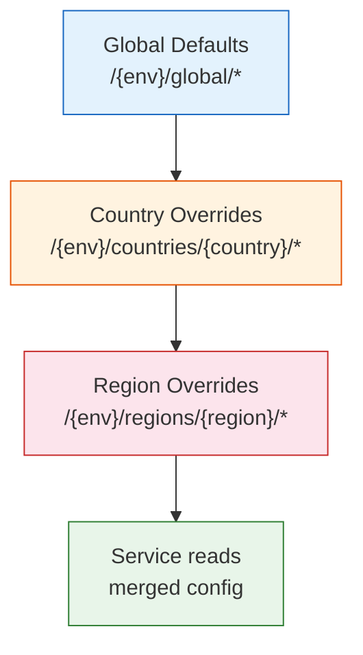
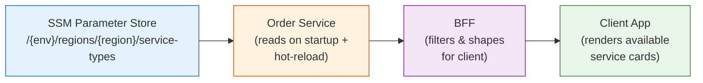
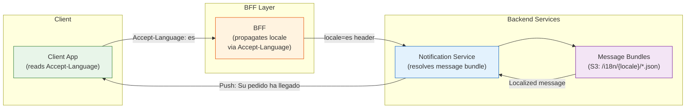
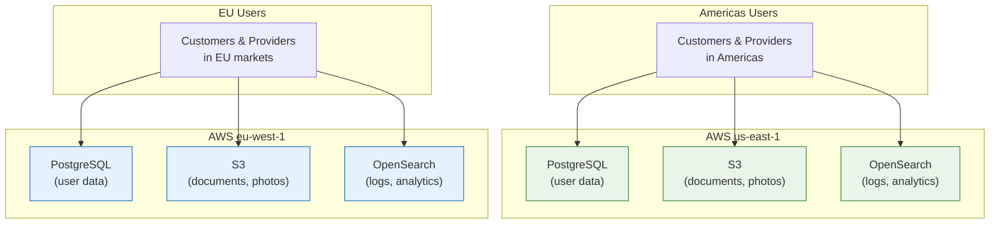

# 06 — Multi-Region Patterns

> **Status:** Mandated · **Owner:** Platform Engineering · **Last Updated:** 2025

---

## Table of Contents

1. [Overview](#1-overview)
2. [Region as a Configuration Dimension](#2-region-as-a-configuration-dimension)
3. [Multi-Currency Handling](#3-multi-currency-handling)
4. [Service Types Per Region](#4-service-types-per-region)
5. [Regulatory Compliance](#5-regulatory-compliance)
6. [Timezone Handling](#6-timezone-handling)
7. [Localization](#7-localization)
8. [Feature Rollout by Geography](#8-feature-rollout-by-geography)
9. [New Region Launch Checklist](#9-new-region-launch-checklist)
10. [Data Residency](#10-data-residency)

---

## 1. Overview

The platform operates across multiple regions spanning different countries, currencies, languages, and regulatory environments. Each region has its own pricing rules, service types, regulatory requirements, currencies, and operational constraints.

A naive approach would litter the codebase with `if (region === "us-east")` branches. This does not scale. By the time the platform operates in 20 regions, condition-based code becomes unmaintainable, untestable, and a source of production incidents.

**The core principle:** region-specific behavior is driven by **configuration**, not code. Services read configuration for the active region and apply it uniformly through generic, parameterized logic. There are no region-specific code paths — only region-specific configuration values.

This guide defines how every platform service, BFF, and client application must handle multi-region concerns.

---

## 2. Region as a Configuration Dimension

### Configuration Hierarchy

All region-specific configuration follows a strict hierarchy with inheritance. More specific levels override less specific ones.



### SSM Parameter Store Structure

```
/{env}/global/pricing/base-price-multiplier          → 1.0
/{env}/global/pricing/dynamic-pricing-cap            → 3.0
/{env}/global/fulfillment/max-radius-km              → 5

/{env}/countries/US/pricing/tax-rate                  → 0.08
/{env}/countries/US/regulatory/min-provider-age       → 21
/{env}/countries/GB/pricing/tax-rate                  → 0.20

/{env}/regions/us-east/pricing/base-price             → 500    (5.00 USD in cents)
/{env}/regions/us-east/pricing/per-km-rate            → 150    (1.50 USD in cents)
/{env}/regions/us-east/pricing/per-min-rate           → 50     (0.50 USD in cents)
/{env}/regions/us-east/fulfillment/max-radius-km      → 8      (overrides global 5)

/{env}/regions/us-west/pricing/base-price             → 450
/{env}/regions/us-west/pricing/per-km-rate            → 140

/{env}/regions/eu-central/pricing/base-price          → 800    (8.00 EUR in cents)
/{env}/regions/eu-central/pricing/per-km-rate         → 200
```

### Resolution Order

When a service needs a config value for a region:

1. Check `/{env}/regions/{region}/{key}` — if exists, use it.
2. Else check `/{env}/countries/{country}/{key}` — if exists, use it.
3. Else check `/{env}/global/{key}` — if exists, use it.
4. Else fail loudly (missing required config is a startup error).

Services cache resolved config with a **60-second TTL** and subscribe to SSM change notifications for hot-reload.

---

## 3. Multi-Currency Handling

### Integer-Only Monetary Values

All monetary values are stored and transmitted as **integers in the smallest currency unit**:

| Currency | ISO 4217 Code | Smallest Unit | Example: 25.50 |
|----------|--------------|---------------|----------------|
| US Dollar | USD | Cent (1/100) | `2550` |
| Euro | EUR | Cent (1/100) | `2550` |
| British Pound | GBP | Penny (1/100) | `2550` |
| Kuwaiti Dinar | KWD | Fils (1/1000) | `25500` |
| Japanese Yen | JPY | Yen (1/1) | `26` |

**Critical rules:**

- **Never use floating point** for monetary values. Not in code, not in databases, not in API payloads, not in Kafka events.
- **Always store the currency code** alongside the amount. A bare `2550` is meaningless without knowing if it is USD cents or KWD fils.
- **Never convert currencies in the transactional path.** The Pricing Service computes prices in the region's native currency. Period.
- **Currency conversion** happens only in the **reporting layer** (analytics, finance exports) using daily exchange rates from a reference source.

### Payload Format

```json
{
  "price": {
    "amount": 2550,
    "currency": "USD"
  },
  "tip": {
    "amount": 500,
    "currency": "USD"
  }
}
```

### Display Formatting

The BFF formats monetary values for display using the locale's conventions:

| Locale | Value | Display |
|--------|-------|---------|
| `en-US` | `{ amount: 2550, currency: "USD" }` | `$25.50` |
| `en-GB` | `{ amount: 2550, currency: "GBP" }` | `£25.50` |
| `de-DE` | `{ amount: 800, currency: "EUR" }` | `8,00 €` |

---

## 4. Service Types Per Region

Service types are **configuration-driven**, not hard-coded. Different regions support different service types based on market demand and regulatory requirements.

### Example Configuration

| Region | Supported Service Types |
|--------|------------------------|
| US East | Economy, Comfort, Premium |
| US West | Economy, Comfort |
| EU Central | Economy, Comfort, Premium, Luxury |
| APAC North | Economy, Comfort, Premium |
| APAC South | Economy, Comfort |

### Configuration Flow



### Service Type Configuration Structure

```json
{
  "serviceTypes": [
    {
      "id": "ECO",
      "name": { "en": "Economy", "es": "Económico" },
      "maxCapacity": 4,
      "icon": "eco_standard",
      "sortOrder": 1,
      "enabled": true
    },
    {
      "id": "CMF",
      "name": { "en": "Comfort", "es": "Confort" },
      "maxCapacity": 4,
      "icon": "comfort_standard",
      "sortOrder": 2,
      "enabled": true
    },
    {
      "id": "PRM",
      "name": { "en": "Premium", "es": "Premium" },
      "maxCapacity": 4,
      "icon": "premium_standard",
      "sortOrder": 3,
      "enabled": true
    }
  ]
}
```

When a new service type is needed in a region, it is a **config change** — no code deployment required. The Order Service picks up the new type via SSM hot-reload, and the app renders it dynamically.

---

## 5. Regulatory Compliance

Each market has unique regulatory requirements for providers, service delivery, and operations. These rules are stored as configuration and enforced by the **Provider Profile Service** and the **Compliance Service**.

### Region-Specific Compliance Rules

| Regulation | Region A | Region B | Region C |
|-----------|----------|----------|----------|
| Minimum provider age | 21 | 18 | 21 |
| Maximum equipment age | 5 years | 7 years | 5 years |
| Insurance required | Comprehensive | Third-party minimum | Comprehensive |
| Background check | Federal clearance | Local clearance | National clearance |
| Licensing | State license | National license | Regional permit |
| Compliance inspection | Annual | Biannual | Annual |
| Document renewal alert | 30 days before expiry | 45 days before expiry | 30 days before expiry |

### Enforcement

- The Provider Profile Service validates all provider documents against the region's regulatory config at onboarding and on a **daily scheduled check**.
- If a document expires, the provider is moved to `SUSPENDED` status and cannot receive order offers.
- Regulatory config is versioned. When regulations change, the new version takes effect on a specified date, and all active providers are re-validated.

---

## 6. Timezone Handling

### Rules

1. **All storage is in UTC.** PostgreSQL columns use `TIMESTAMP WITH TIME ZONE` which stores in UTC.
2. **All Kafka events use UTC.** The `occurredAt` field in every domain event is UTC (ISO 8601 with `Z` suffix).
3. **All inter-service communication is in UTC.** No exceptions.
4. **Display conversion happens at the BFF layer.** The BFF resolves the user's timezone and converts timestamps for display.
5. **API responses include timezone information** so clients can format locally if needed.

### API Response Format

```json
{
  "order": {
    "startedAt": "2025-06-15T14:30:00Z",
    "completedAt": "2025-06-15T14:52:00Z",
    "timezone": "America/New_York"
  }
}
```

### Java Best Practices

```java
// CORRECT: Use ZonedDateTime for display, Instant for storage/events
Instant now = Instant.now();                                          // storage
ZonedDateTime local = now.atZone(ZoneId.of("America/New_York"));     // display

// WRONG: Never use java.util.Date, Calendar, or SimpleDateFormat
// WRONG: Never use LocalDateTime for timestamped events (loses timezone)
// WRONG: Never hardcode UTC offsets (-05:00) — use IANA timezone IDs
```

- Use `ZoneId`, never `TimeZone` (legacy).
- Use `DateTimeFormatter.ISO_INSTANT` for serialization.
- Store timezone IDs per region in SSM: `/{env}/regions/us-east/timezone` → `America/New_York`.

---

## 7. Localization

### Supported Locales

| Locale | Language | Direction | Markets |
|--------|----------|-----------|---------|
| `en` | English | LTR | All markets |
| `es` | Spanish | LTR | Americas |
| `fr` | French | LTR | EU, Africa |
| `de` | German | LTR | EU |
| `ja` | Japanese | LTR | APAC |

### Localization Flow



### Message Bundle Structure

Message bundles are stored in S3 and cached at the BFF and Notification Service layers:

```
s3://{company}-i18n-{env}/
  ├── en/
  │   ├── orders.json       → { "order.started": "Order started", ... }
  │   ├── notifications.json
  │   └── errors.json
  ├── es/
  │   ├── orders.json       → { "order.started": "Pedido iniciado", ... }
  │   ├── notifications.json
  │   └── errors.json
  └── fr/
      └── ...
```

### RTL Layout Support

- The mobile app enables RTL layout globally when the locale requires it (e.g., `ar`, `he`).
- All layout components use logical properties (`start`/`end`) instead of physical (`left`/`right`).
- Icons with directional meaning (back arrow, forward chevron) are mirrored.
- Maps remain LTR — geographic orientation is universal.
- Every PR runs UI snapshot tests in both LTR and RTL modes.

### Dynamic Content Localization

Push notifications, emails, and SMS messages are localized at send time:

1. The sending service emits a notification event with a `messageKey` and `params`.
2. The Notification Service resolves the user's preferred locale from their profile.
3. The message bundle for that locale is fetched, and `messageKey` is interpolated with `params`.
4. The localized message is delivered.

This ensures the content-authoring teams define messages once per key, and translations are managed independently.

---

## 8. Feature Rollout by Geography

The platform uses **LaunchDarkly** for feature flag management with geographic targeting at three levels:

| Level | Targeting Attribute | Example |
|-------|-------------------|---------|
| **Region** | `user.region` | Enable `new-fulfillment-algo` for `us-east` only |
| **Country** | `user.country` | Enable `scheduled-orders` for all `US` regions |
| **Zone** | `user.zone` | Enable `multi-stop` for all `americas` regions |

### Rollout Strategy Example

Rolling out a new fulfillment algorithm:

| Phase | Target | Duration | Success Criteria |
|-------|--------|----------|-----------------|
| 1 | US East only (5% of customers) | 1 week | Assignment rate ≥ baseline, ETA accuracy ≥ 90% |
| 2 | US East (100%) | 1 week | No degradation in cancel rate |
| 3 | All US regions | 2 weeks | Consistent metrics across regions |
| 4 | All Americas regions | 2 weeks | Final validation |
| 5 | Global (all regions) | — | Full rollout, remove flag |

### LaunchDarkly Context

Every BFF request to LaunchDarkly includes:

```json
{
  "kind": "user",
  "key": "user-abc-123",
  "region": "us-east",
  "country": "US",
  "zone": "americas",
  "appVersion": "4.12.0",
  "platform": "ios",
  "userRole": "customer"
}
```

This allows targeting by any combination of geography, platform, app version, and user role.

---

## 9. New Region Launch Checklist

Launching the platform in a new region is a cross-functional operation. The following checklist ensures nothing is missed.

### Infrastructure

- [ ] Confirm AWS region for data residency (see [Section 10](#10-data-residency))
- [ ] VPC peering configured if services span regions
- [ ] DNS and CDN edge locations cover the new geography
- [ ] Monitoring dashboards created for the new region

### Configuration

- [ ] SSM parameters populated for the region:
  - `/{env}/regions/{region}/pricing/*`
  - `/{env}/regions/{region}/service-types`
  - `/{env}/regions/{region}/timezone`
  - `/{env}/regions/{region}/currency`
  - `/{env}/regions/{region}/regulatory/*`
- [ ] LaunchDarkly targeting rules updated to include the new region
- [ ] All feature flags default to `off` for the new region until verified

### Data Seeding

- [ ] Pricing rules configured and validated (base price, per-km, per-min, dynamic pricing rules)
- [ ] Geofence zones defined (region boundary, airport zones, restricted zones)
- [ ] Service types enabled for the region
- [ ] Payment methods configured (card, wallet, alternative methods) per local requirements
- [ ] Promo codes created for launch marketing

### Testing

- [ ] Load test executed simulating expected launch-day demand (2x projected peak)
- [ ] End-to-end order flow tested (request → assign → dispatch → delivery → payment)
- [ ] Provider onboarding flow tested with local regulatory requirements
- [ ] Localization validated for all supported locales in the market
- [ ] Offline mode tested with local network conditions

### Monitoring

- [ ] Region-specific monitoring dashboard deployed
- [ ] Alerts configured: assignment rate, order completion rate, payment success rate
- [ ] On-call team briefed on region-specific nuances
- [ ] Escalation runbook updated with region-specific contacts (local ops, regulatory)

### Go-Live

- [ ] Feature flags flipped to `on` for the region (staged: 5% → 25% → 100%)
- [ ] War room staffed for the first 48 hours
- [ ] Rollback plan documented and rehearsed

---

## 10. Data Residency

The platform complies with data residency requirements by ensuring user data is stored in the correct geographic region.

### Regional Data Mapping



### Rules

| Data Type | Americas Storage | EU Storage | Cross-Region Allowed? |
|-----------|-----------------|------------|----------------------|
| User PII (name, phone, email) | us-east-1 | eu-west-1 | No |
| Order data | us-east-1 | eu-west-1 | No |
| Payment data | us-east-1 | eu-west-1 | No |
| Anonymized analytics | us-east-1 | eu-central-1 | Yes (aggregated only) |
| System logs (no PII) | us-east-1 | eu-west-1 | Yes |
| ML training data | us-east-1 | eu-central-1 | Yes (anonymized only) |

### Enforcement

- **AWS Service Control Policies (SCPs)** prevent services from creating resources or writing data outside their designated region.
- **Database routing:** The data access layer resolves the user's region from their profile and routes queries to the correct regional database.
- **S3 bucket policies** restrict write access to the designated region's buckets.
- **Kafka topics** are regional. Americas events flow through Kafka clusters in us-east-1; EU events through eu-west-1. Cross-region event mirroring is prohibited for PII topics.
- **Audit:** A quarterly automated scan verifies no PII has leaked across regional boundaries. Violations trigger a P1 incident.

---

← [Back to section](./README.md) · [Back to root](../README.md)
