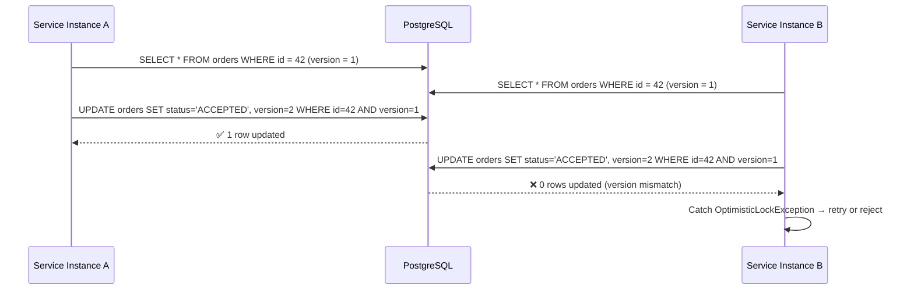
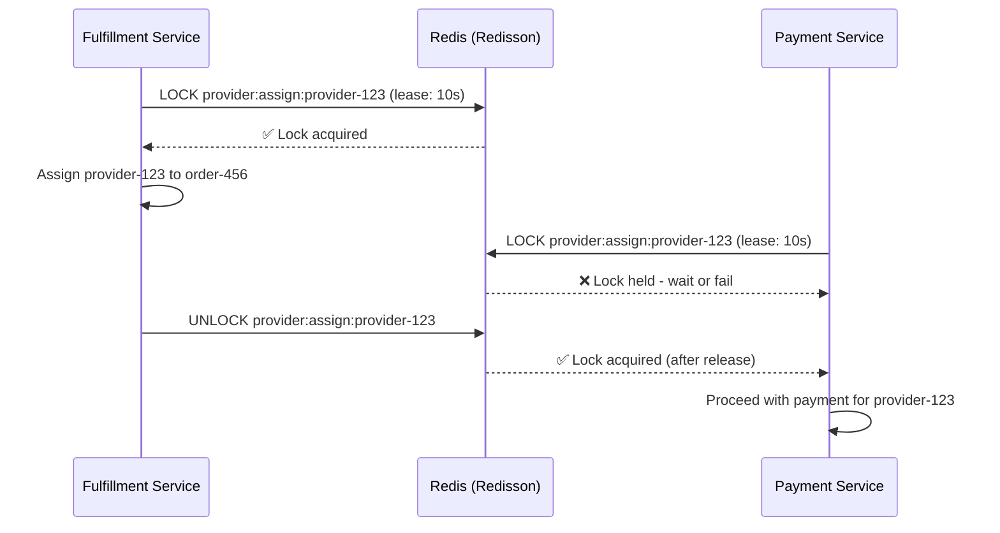
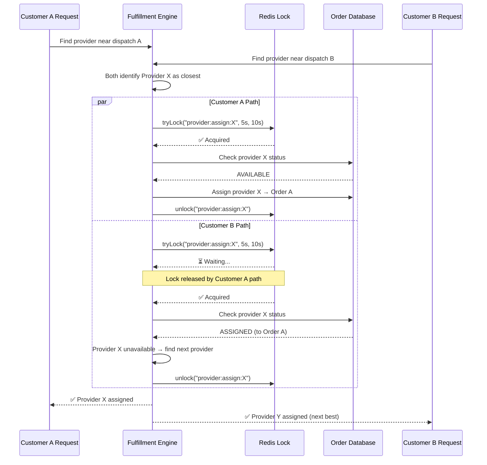
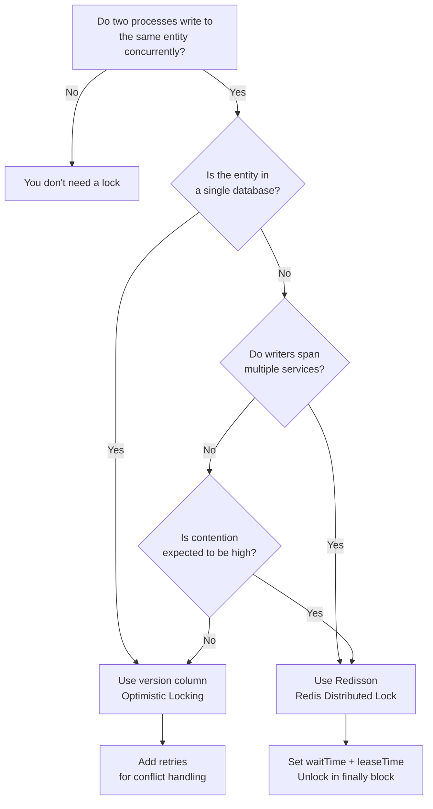

# 🔐 Distributed Locking

  

---

## 📋 Table of Contents

1. [When You Need Distributed Locks](#1-when-you-need-distributed-locks)
2. [Optimistic Locking (database)](#2-optimistic-locking-database)
3. [Redis Distributed Locks with Redisson](#3-redis-distributed-locks-with-redisson)
4. [Lock Timeout and Lease Expiry](#4-lock-timeout-and-lease-expiry)
5. [Double-Assignment Prevention](#5-double-assignment-prevention)
6. [Testing Concurrent Access](#6-testing-concurrent-access)
7. [Anti-Patterns](#7-anti-patterns)
8. [Decision Guide](#8-decision-guide)

---

## 🎯 1. When You Need Distributed Locks

In a platform serving concurrent requests, certain operations **must not happen twice**:

| Scenario | What Goes Wrong Without a Lock |
|----------|-------------------------------|
| **Double-assignment** | Two customers get assigned the same provider. One order fails, both customers wait. |
| **Double-charge** | Payment is captured twice for the same order. Customer is overcharged, refund required. |
| **Concurrent order state update** | Two services update an order simultaneously - one update is silently lost. |
| **Duplicate payout** | Provider receives two payouts for one order. Finance reconciliation breaks. |
| **Race on promo code redemption** | Two customers redeem the same single-use promo code. Revenue leakage. |

### The Rule

> If two processes can act on the same entity at the same time, and at least one of them writes, you need coordination.

The form of coordination depends on the scope:

- **Same database row?** → Optimistic locking with a version column (Section 2; JPA `@Version` is the Java reference).
- **Cross-service coordination?** → Redis distributed lock with Redisson (Section 3).
- **Neither?** → You probably don't need a lock (Section 8).

---

## 🔐 2. Optimistic Locking (database)

Optimistic locking is the **default choice** when writers target the **same row in one database**. It requires no external infrastructure, has low contention overhead in the happy path, and uses the database's MVCC semantics. **Every mainstream stack** can express this: JPA `@Version`, Hibernate, SQLAlchemy version counters, TypeORM `@VersionColumn`, Drizzle/Prisma optimistic checks, or raw SQL `UPDATE ... WHERE id = ? AND version = ?`.

The Java examples below are **reference implementation**.

### How It Works



### Worked Example: Order Entity

```java
@Entity
@Table(name = "orders")
public class Order {

    @Id
    @GeneratedValue(strategy = GenerationType.UUID)
    private UUID id;

    @Version
    private Long version;

    @Enumerated(EnumType.STRING)
    private OrderStatus status;

    private UUID customerId;
    private UUID providerId;

    /**
     * Monetary amount in the smallest currency unit (e.g. USD cents, GBP pence, JPY whole yen).
     * Store as integer to avoid floating-point errors; always pair with a currency code in the real model.
     */
    @Column(name = "price_amount_cents")
    private long priceAmountCents;
}
```

### Service Layer with Retry

```java
@Service
@RequiredArgsConstructor
public class OrderService {

    private final OrderRepository orderRepository;

    @Retryable(
        retryFor = OptimisticLockingFailureException.class,
        maxAttempts = 3,
        backoff = @Backoff(delay = 100, multiplier = 2)
    )
    @Transactional
    public Order acceptOrder(UUID orderId, UUID providerId) {
        Order order = orderRepository.findById(orderId)
            .orElseThrow(() -> new OrderNotFoundException(orderId));

        if (order.getStatus() != OrderStatus.PENDING) {
            throw new InvalidOrderStateException(orderId, order.getStatus(), OrderStatus.ACCEPTED);
        }

        order.setStatus(OrderStatus.ACCEPTED);
        order.setProviderId(providerId);
        return orderRepository.save(order);
    }
}
```

### When to Use

| Use When | Don't Use When |
|----------|----------------|
| Contention is rare (most updates succeed first try) | High contention expected (many writers on same row) |
| Both readers are hitting the same database | Writers are in different services with different databases |
| You can tolerate retry latency on conflict | You need mutual exclusion across distributed processes |

---

## 🔐 3. Redis Distributed Locks with Redisson

When the coordination boundary extends beyond a single database, the platform uses **Redisson** to acquire distributed locks backed by Redis.

### How It Works



### Worked Example: Preventing Double-Assignment

```java
@Service
@RequiredArgsConstructor
public class ProviderAssignmentService {

    private final RedissonClient redisson;
    private final AssignmentRepository assignmentRepository;

    public AssignmentResult assignProvider(UUID providerId, UUID orderId) {
        String lockKey = "provider:assign:" + providerId;
        RLock lock = redisson.getLock(lockKey);

        boolean acquired = false;
        try {
            acquired = lock.tryLock(5, 10, TimeUnit.SECONDS);
            if (!acquired) {
                throw new ProviderBusyException(providerId);
            }

            if (assignmentRepository.isProviderAssigned(providerId)) {
                throw new ProviderAlreadyAssignedException(providerId);
            }

            return assignmentRepository.assignProviderToOrder(providerId, orderId);
        } catch (InterruptedException e) {
            Thread.currentThread().interrupt();
            throw new LockAcquisitionException(lockKey, e);
        } finally {
            if (acquired && lock.isHeldByCurrentThread()) {
                lock.unlock();
            }
        }
    }
}
```

### Redisson Spring Boot Configuration

```yaml
spring:
  redis:
    redisson:
      config: |
        singleServerConfig:
          address: "redis://distributed-lock.{company}.internal:6379"
          connectionMinimumIdleSize: 5
          connectionPoolSize: 20
          timeout: 3000
          retryAttempts: 3
          retryInterval: 1500
```

### Lock Key Naming Convention

```
<domain>:<action>:<entity-id>

Examples:
  provider:assign:provider-123
  payment:capture:order-456
  promo:redeem:PROMO-2026
  order:state:order-789
```

---

## 🔐 4. Lock Timeout and Lease Expiry

Distributed locks **must always have a lease (TTL)**. A lock without a timeout is a deadlock waiting to happen.

### Timeout Parameters

| Parameter | Meaning | Recommended Value | Why |
|-----------|---------|-------------------|-----|
| `waitTime` | How long a caller waits to acquire the lock | 3-5 seconds | Fail fast - if you can't get the lock quickly, the operation is already contended |
| `leaseTime` | How long the lock is held before automatic release | 10-30 seconds | Safety net - if the holder crashes, the lock auto-expires |

### Lease Expiry Safety Net

```
Thread A acquires lock (lease = 10s)
Thread A crashes at T+3s
   ↓
Lock auto-expires at T+10s
   ↓
Thread B acquires lock at T+10s - system recovers
```

### Rules

1. **Always set a lease time.** Redisson's default `tryLock()` without `leaseTime` uses a watchdog that renews indefinitely - disable this by always passing an explicit lease.
2. **Lease > expected operation time.** If your critical section takes 2 seconds, set the lease to 10 seconds. If it takes 15 seconds, reconsider - you're holding a lock too long.
3. **Prefer short leases.** Shorter leases mean faster recovery from holder crashes.
4. **Never use `lock()` (blocking forever).** Always use `tryLock(waitTime, leaseTime, unit)`.

---

## 🔐 5. Double-Assignment Prevention

The canonical example of distributed locking on the platform: preventing two orders from being assigned to the same provider simultaneously.



### Why Both Lock AND Check?

The lock ensures mutual exclusion. The status check ensures correctness even if the lock fails (defense in depth). Neither alone is sufficient:

- **Lock without check:** If the lock implementation has a bug, double-assignment happens.
- **Check without lock:** TOCTOU race - status can change between the check and the assignment.

---

## 🧩 6. Testing Concurrent Access

Concurrency bugs only manifest under load. Every locking implementation must include a concurrent access test.

### JUnit 5 + ExecutorService Example

```java
@SpringBootTest
class ProviderAssignmentConcurrencyTest {

    @Autowired
    private ProviderAssignmentService assignmentService;

    @Autowired
    private OrderRepository orderRepository;

    @Test
    @DisplayName("Only one order should be assigned to a provider under concurrent requests")
    void shouldPreventDoubleAssignment() throws InterruptedException {
        UUID providerId = UUID.randomUUID();
        UUID orderA = createPendingOrder();
        UUID orderB = createPendingOrder();

        int threads = 2;
        ExecutorService executor = Executors.newFixedThreadPool(threads);
        CountDownLatch latch = new CountDownLatch(1);
        AtomicInteger successes = new AtomicInteger(0);
        AtomicInteger failures = new AtomicInteger(0);

        Runnable assignA = () -> {
            awaitLatch(latch);
            try {
                assignmentService.assignProvider(providerId, orderA);
                successes.incrementAndGet();
            } catch (Exception e) {
                failures.incrementAndGet();
            }
        };

        Runnable assignB = () -> {
            awaitLatch(latch);
            try {
                assignmentService.assignProvider(providerId, orderB);
                successes.incrementAndGet();
            } catch (Exception e) {
                failures.incrementAndGet();
            }
        };

        executor.submit(assignA);
        executor.submit(assignB);
        latch.countDown();

        executor.shutdown();
        assertTrue(executor.awaitTermination(10, TimeUnit.SECONDS));

        assertThat(successes.get()).isEqualTo(1);
        assertThat(failures.get()).isEqualTo(1);

        List<Order> assignedOrders = orderRepository.findByProviderId(providerId);
        assertThat(assignedOrders).hasSize(1);
    }

    private void awaitLatch(CountDownLatch latch) {
        try { latch.await(); } catch (InterruptedException e) {
            Thread.currentThread().interrupt();
        }
    }

    private UUID createPendingOrder() {
        Order order = new Order();
        order.setStatus(OrderStatus.PENDING);
        return orderRepository.save(order).getId();
    }
}
```

### Test Requirements

| Requirement | Detail |
|-------------|--------|
| Use `CountDownLatch` | Ensures threads start at the exact same instant |
| Assert exactly 1 success | Proves mutual exclusion |
| Assert database state | The ground truth is the DB, not the return value |
| Run in CI | Concurrent tests must run in the pipeline, not just locally |

---

## ❌ 7. Anti-Patterns

| Anti-Pattern | Why It's Dangerous | What to Do Instead |
|--------------|--------------------|--------------------|
| **Lock without timeout** | Holder crash → permanent deadlock | Always use `tryLock(wait, lease, unit)` |
| **Coarse-grained locks** | Locking `provider:*` instead of `provider:assign:123` serializes all provider operations | Lock at the finest granularity possible |
| **Lock for reads** | Readers don't need mutual exclusion; locks add latency | Use read replicas or caches for reads |
| **Nested locks** | Thread holds Lock A, tries Lock B; another thread holds B, tries A → deadlock | Avoid nested locks; redesign to single lock scope |
| **Business logic in lock scope** | Holding a lock while calling an external API (payment gateway) → long hold times | Do the external call outside the lock; use saga pattern |
| **Ignoring lock failure** | `tryLock` returns `false` and the code proceeds anyway | Always check the return value; fail or retry explicitly |
| **Process-local mutex in a distributed system** | `synchronized`, single-process locks, or one-runtime locks only coordinate one instance | Use database version columns or Redis (or another cluster-wide lock) for multi-instance coordination |
| **Forgetting `finally` block** | Exception in critical section → lock never released | Always unlock in `finally` |

---

## 🎯 8. Decision Guide

### When to Lock - and How



### Quick Reference

| Question | Answer | Lock Type |
|----------|--------|-----------|
| Same DB, low contention? | Version column (JPA `@Version` in Java reference) | Optimistic (DB) |
| Same DB, high contention? | Consider Redisson or redesign to reduce contention | Redis |
| Cross-service, same entity? | Redisson with entity-scoped lock key | Redis |
| Cross-service, saga/workflow? | You need a saga, not a lock | None (saga) |
| Single-threaded processor? | No concurrency → no lock needed | None |

---
<div align="center">

⬅️ [Back to section](./README.md) · 🏠 [Back to root](../README.md)

</div>
