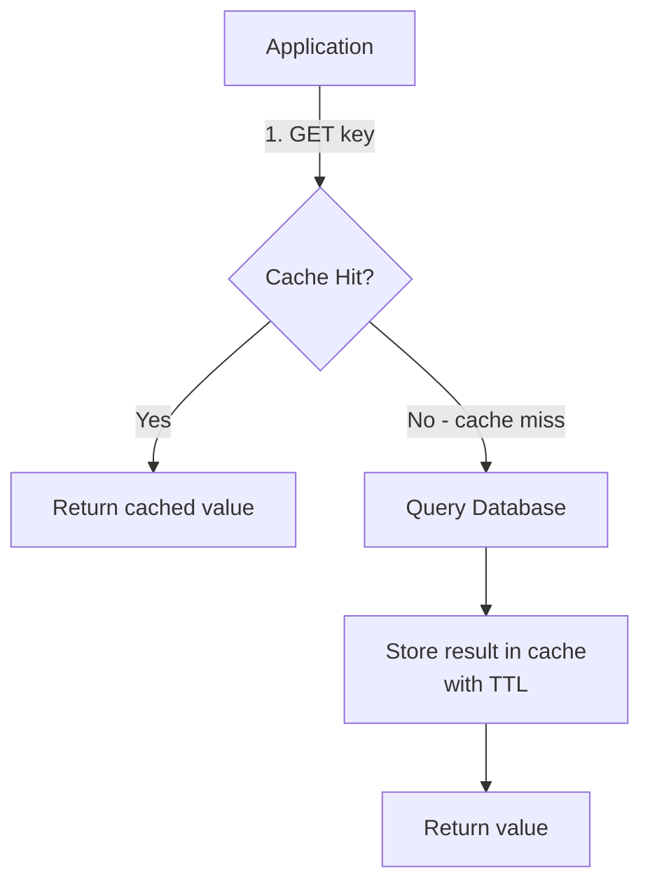
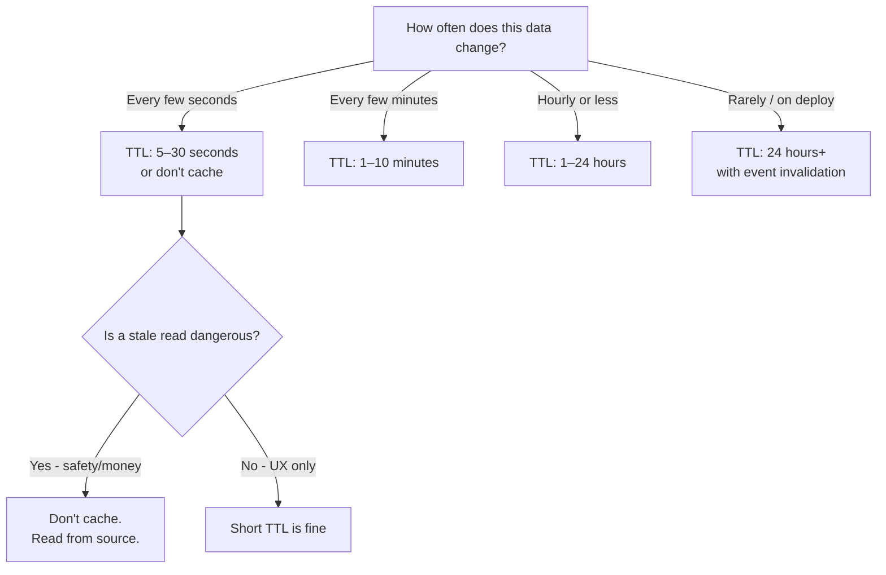
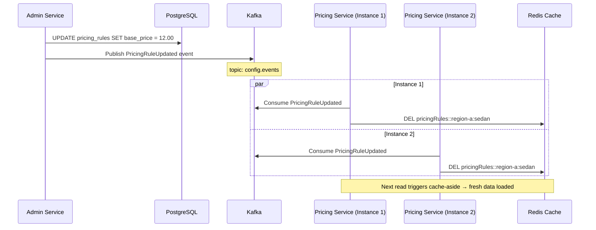
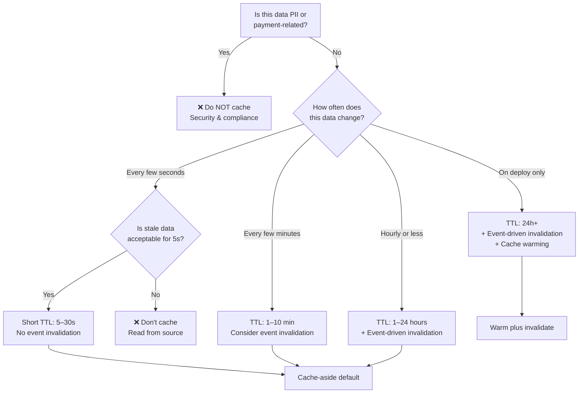

# ⚡ Cache Patterns

  

---

## 📋 Table of Contents

1. [Caching Philosophy](#1-caching-philosophy)
2. [Cache-Aside Pattern](#2-cache-aside-pattern)
3. [TTL Strategy](#3-ttl-strategy)
4. [Event-Driven Invalidation](#4-event-driven-invalidation)
5. [Cache Warming on Startup](#5-cache-warming-on-startup)
6. [Cache Stampede Prevention](#6-cache-stampede-prevention)
7. [What NOT to Cache](#7-what-not-to-cache)
8. [Metrics](#8-metrics)
9. [Redis Configuration](#9-redis-configuration)
10. [Decision Guide](#10-decision-guide)

---

## 🎯 1. Caching Philosophy

> **A cache is always eventually consistent. Design accordingly.**

Caching is a performance optimization, not a source of truth. Every cached value has a bounded staleness window, and every system must function correctly - albeit slower - if the cache is cold or unavailable.

**Core principles:**

- **The database is truth.** The cache is a projection. If they disagree, the database wins.
- **Stale reads are acceptable within the TTL contract.** If a pricing rule changes, customers may see the old rate for up to `TTL` seconds. This is by design.
- **Cache unavailability must not cause outages.** Services must degrade to direct-database reads. Latency increases; correctness does not decrease.
- **PII and payment data are never cached.** Compliance and security requirements override performance goals.
- **Measure everything.** A cache without metrics is a cache you'll regret.

---

## 🧩 2. Cache-Aside Pattern

Cache-aside (also called lazy-loading) is the **default caching pattern**: read cache first, on miss load from the **source of truth** (database or service), then populate the cache with a **TTL**. Invalidation stays explicit (delete key on write or via events). Framework annotations are optional sugar; the behavior is the same in any language.

### Flow



### Reference implementation (Spring Cache + Redis)

```java
@Configuration
@EnableCaching
public class CacheConfig {

    @Bean
    public RedisCacheManager cacheManager(RedisConnectionFactory factory) {
        RedisCacheConfiguration defaults = RedisCacheConfiguration.defaultCacheConfig()
            .entryTtl(Duration.ofMinutes(30))
            .serializeValuesWith(
                SerializationPair.fromSerializer(new GenericJackson2JsonRedisSerializer())
            )
            .disableCachingNullValues();

        Map<String, RedisCacheConfiguration> perCache = Map.of(
            "pricingRules", defaults.entryTtl(Duration.ofHours(1)),
            "regionConfig", defaults.entryTtl(Duration.ofHours(24)),
            "providerProfile", defaults.entryTtl(Duration.ofMinutes(10))
        );

        return RedisCacheManager.builder(factory)
            .cacheDefaults(defaults)
            .withInitialCacheConfigurations(perCache)
            .build();
    }
}
```

### Service usage (Java reference)

```java
@Service
@RequiredArgsConstructor
public class PricingRuleService {

    private final PricingRuleRepository pricingRuleRepository;

    @Cacheable(value = "pricingRules", key = "#regionId + ':' + #serviceType")
    public PricingRule getPricingRule(String regionId, String serviceType) {
        return pricingRuleRepository.findByRegionIdAndServiceType(regionId, serviceType)
            .orElseThrow(() -> new PricingRuleNotFoundException(regionId, serviceType));
    }

    @CacheEvict(value = "pricingRules", key = "#regionId + ':' + #serviceType")
    public PricingRule updatePricingRule(String regionId, String serviceType, PricingRuleUpdate update) {
        PricingRule rule = getPricingRuleInternal(regionId, serviceType);
        rule.applyUpdate(update);
        return pricingRuleRepository.save(rule);
    }
}
```

---

## ⚡ 3. TTL Strategy

TTL (time-to-live) defines the maximum staleness window. Choose TTL based on change frequency and blast radius of a stale read; pair long TTLs with **event-driven invalidation** when freshness matters. The table below is guidance for any Redis or remote cache client.

| Data Type | TTL | Rationale | Invalidation Strategy |
|-----------|-----|-----------|----------------------|
| **Provider location** | 5 seconds | Location data is useless if stale; fulfillment depends on freshness | Natural expiry only |
| **Dynamic pricing** | 30 seconds | Pricing should reflect current demand closely | Natural expiry + event invalidation |
| **Provider profile** | 10 minutes | Name, rating, vehicle info changes rarely during a shift | Event invalidation on profile update |
| **Pricing rules** | 1 hour | Pricing rules change during business operations, not mid-order | Event invalidation on rule change |
| **Region configuration** | 24 hours | Region boundaries, zones, and service areas change very rarely | Event invalidation on config deploy |
| **Service types** | 24 hours | Static reference data; changes are planned deployments | Event invalidation on deploy |
| **Country/currency data** | 7 days | Nearly static; changes are coordinated releases | Manual invalidation on release |

### TTL Selection Flowchart



---

## ⚡ 4. Event-Driven Invalidation

For data with long TTLs, relying on natural expiry alone means users see stale data for too long after a change. The platform uses **Kafka-driven cache invalidation** to proactively clear cache entries when the source data changes.

### Flow



### Kafka consumer for cache invalidation (Java reference)

```java
@Component
@RequiredArgsConstructor
@Slf4j
public class CacheInvalidationConsumer {

    private final CacheManager cacheManager;

    @KafkaListener(topics = "config.events", groupId = "pricing-service-cache-invalidation")
    public void onConfigEvent(ConfigEvent event) {
        switch (event.getType()) {
            case PRICING_RULE_UPDATED -> {
                String key = event.getRegionId() + ":" + event.getServiceType();
                evict("pricingRules", key);
            }
            case REGION_CONFIG_UPDATED -> {
                evict("regionConfig", event.getRegionId());
            }
            case SERVICE_TYPE_UPDATED -> {
                clearAll("serviceTypes");
            }
        }
    }

    private void evict(String cacheName, String key) {
        Cache cache = cacheManager.getCache(cacheName);
        if (cache != null) {
            cache.evict(key);
            log.info("Evicted cache entry: {}::{}", cacheName, key);
        }
    }

    private void clearAll(String cacheName) {
        Cache cache = cacheManager.getCache(cacheName);
        if (cache != null) {
            cache.clear();
            log.info("Cleared all entries from cache: {}", cacheName);
        }
    }
}
```

### Idempotency

Cache invalidation is inherently idempotent - evicting a key that doesn't exist is a no-op. Duplicate Kafka messages are safe.

---

## ⚡ 5. Cache Warming on Startup

For critical reference data, a cold cache on startup means the first requests after a deployment pay a latency penalty. The platform warms key caches during application startup.

### Implementation (Java reference)

```java
@Component
@RequiredArgsConstructor
@Slf4j
public class CacheWarmer implements ApplicationRunner {

    private final PricingRuleRepository pricingRuleRepository;
    private final RegionConfigRepository regionConfigRepository;
    private final CacheManager cacheManager;

    @Override
    public void run(ApplicationArguments args) {
        log.info("Warming caches...");

        Cache pricingCache = cacheManager.getCache("pricingRules");
        pricingRuleRepository.findAllActive().forEach(rule -> {
            String key = rule.getRegionId() + ":" + rule.getServiceType();
            pricingCache.put(key, rule);
        });
        log.info("Warmed {} pricing rule entries", pricingRuleRepository.countActive());

        Cache regionCache = cacheManager.getCache("regionConfig");
        regionConfigRepository.findAllActive().forEach(config -> {
            regionCache.put(config.getRegionId(), config);
        });
        log.info("Warmed {} region config entries", regionConfigRepository.countActive());

        log.info("Cache warming complete");
    }
}
```

### Readiness gate

The application's Kubernetes readiness probe should only return healthy **after** cache warming completes. This prevents the load balancer from routing traffic to an instance with a cold cache.

**Reference implementation (Spring Boot Actuator):**

```yaml
readinessProbe:
  httpGet:
    path: /actuator/health/readiness
    port: 8080
  initialDelaySeconds: 30
  periodSeconds: 5
```

The `ApplicationRunner` sets a readiness flag that the health indicator checks.

---

## ⚡ 6. Cache Stampede Prevention

A **cache stampede** occurs when a popular cache key expires and hundreds of concurrent requests simultaneously query the database to re-fill it. This can overload the database.

### Strategy 1: Lock-based fill (mutex)

Only one thread (or goroutine, or async worker) fills the cache; others wait or fall through to the source. **Reference implementation (Java + Redisson):**

```java
@Service
@RequiredArgsConstructor
public class StampedeProtectedCacheService {

    private final RedissonClient redisson;
    private final RedisTemplate<String, Object> redisTemplate;
    private final PricingRuleRepository pricingRuleRepository;

    public PricingRule getPricingRule(String regionId, String serviceType) {
        String cacheKey = "pricingRules::" + regionId + ":" + serviceType;

        Object cached = redisTemplate.opsForValue().get(cacheKey);
        if (cached != null) {
            return (PricingRule) cached;
        }

        String lockKey = "lock:fill:" + cacheKey;
        RLock lock = redisson.getLock(lockKey);

        try {
            if (lock.tryLock(3, 10, TimeUnit.SECONDS)) {
                try {
                    cached = redisTemplate.opsForValue().get(cacheKey);
                    if (cached != null) {
                        return (PricingRule) cached;
                    }

                    PricingRule rule = pricingRuleRepository
                        .findByRegionIdAndServiceType(regionId, serviceType)
                        .orElseThrow();

                    redisTemplate.opsForValue().set(cacheKey, rule, 1, TimeUnit.HOURS);
                    return rule;
                } finally {
                    lock.unlock();
                }
            }
            return pricingRuleRepository
                .findByRegionIdAndServiceType(regionId, serviceType)
                .orElseThrow();
        } catch (InterruptedException e) {
            Thread.currentThread().interrupt();
            throw new CacheException("Lock interrupted", e);
        }
    }
}
```

### Strategy 2: Probabilistic early expiry

Each cache entry is stored with its expiry metadata. As the TTL approaches, each read has an increasing probability of triggering a background refresh, spreading refills over time. **Reference implementation (Java):**

```java
public PricingRule getPricingRuleWithEarlyExpiry(String cacheKey) {
    CacheEntry<PricingRule> entry = getEntryWithMetadata(cacheKey);
    if (entry == null) {
        return fillCache(cacheKey);
    }

    double remainingTtlRatio = entry.remainingTtlRatio();
    double refreshProbability = Math.max(0, 1 - remainingTtlRatio * 3);

    if (ThreadLocalRandom.current().nextDouble() < refreshProbability) {
        CompletableFuture.runAsync(() -> fillCache(cacheKey));
    }

    return entry.getValue();
}
```

### When to Use Which

| Strategy | Use When |
|----------|----------|
| Lock-based fill | High-cardinality keys where stampede is per-key; moderate request volume |
| Probabilistic early expiry | Low-cardinality, high-traffic keys (pricing rules, region config) where even one stampede is costly |

---

## ❌ 7. What NOT to Cache

Some data categories must **never** be stored in Redis, regardless of performance benefits.

| Data Category | Reason | Alternative |
|---------------|--------|-------------|
| **PII** (customer name, phone, email) | GDPR / PDPA compliance; Redis is not encrypted at field level | Encrypt at rest in Aurora; use short-lived in-memory DTOs |
| **Payment tokens** | PCI-DSS scope; cache compromise exposes payment credentials | Tokenization service with vault (e.g., Stripe tokens) |
| **Authentication secrets** | Leaked JWTs or API keys enable impersonation | Store in Secrets Manager; rotate frequently |
| **Full order history** | Large, per-user data that doesn't benefit from caching (low reuse) | Paginated database queries |
| **Raw GPS coordinates with customer identity** | Surveillance risk if breached | Cache anonymized geohashes only |

### Enforcement

- **Code review checklist** includes a "no-PII-in-cache" item.
- **Static analysis rule** flags `@Cacheable` on methods that return entities containing PII fields (annotated with `@PII`).

---

## 📊 8. Metrics

A cache without observability is a liability. Every cache exposes the following metrics to Prometheus, visualized in Grafana.

### Required Metrics

| Metric | Description | Alert Threshold |
|--------|-------------|-----------------|
| `cache_hit_total` | Total cache hits by cache name | - |
| `cache_miss_total` | Total cache misses by cache name | - |
| `cache_hit_ratio` | `hits / (hits + misses)` | <80% → warning |
| `cache_eviction_total` | Evictions due to memory pressure | >100/min → warning |
| `cache_put_total` | Cache writes | - |
| `cache_latency_seconds` | Redis GET/SET latency | P99 > 5ms → warning |
| `cache_size` | Number of keys per cache | - |

### Grafana Dashboard Panels

| Panel | Visualization | Purpose |
|-------|---------------|---------|
| Hit Rate by Cache | Time series (%) | Spot caches with poor hit rates - likely bad TTL or key design |
| Miss Rate Spike | Time series | Detect stampedes or cold-cache events after deployments |
| Eviction Rate | Time series | Detect memory pressure - need to increase Redis node size or reduce cached data |
| Latency Heatmap | Heatmap | Identify Redis performance degradation |
| Cache Size Trend | Time series | Capacity planning for Redis memory |

### Spring Boot Actuator integration (Java reference)

```yaml
management:
  metrics:
    cache:
      instrument: true
    tags:
      application: ${spring.application.name}
    export:
      prometheus:
        enabled: true
```

---

## ⚡ 9. Redis Configuration

### Spring Boot Redis configuration (reference)

```yaml
spring:
  data:
    redis:
      host: session-cache.{company}.internal
      port: 6379
      timeout: 2000ms
      lettuce:
        pool:
          min-idle: 5
          max-idle: 20
          max-active: 50
          max-wait: 1000ms
        shutdown-timeout: 200ms

  cache:
    type: redis
    redis:
      time-to-live: 30m
      cache-null-values: false
      key-prefix: "${spring.application.name}::"
      use-key-prefix: true
```

### Redis Cluster Topology (Production)

| Cluster | Purpose | Endpoint | Max Memory Policy |
|---------|---------|----------|-------------------|
| `session-cache` | General-purpose caching (pricing rules, region config, profiles) | `session-cache.{company}.internal:6379` | `allkeys-lru` |
| `provider-location` | Geospatial provider index (GEOADD/GEOSEARCH) | `provider-location.{company}.internal:6379` | `noeviction` |
| `distributed-lock` | Redisson distributed locks | `distributed-lock.{company}.internal:6379` | `noeviction` |

### Key Namespace Convention

```
<service-name>::<cache-name>::<key>

Examples:
  pricing-service::pricingRules::region-a:sedan
  order-service::regionConfig::region-b
  fulfillment-engine::providerProfile::provider-123
```

### Memory Management Rules

| Rule | Detail |
|------|--------|
| Use `allkeys-lru` for caches | Least-recently-used eviction prevents OOM |
| Use `noeviction` for locks | Lock eviction would silently break mutual exclusion |
| Monitor `used_memory_rss` | Alert if RSS exceeds 80% of node memory |
| Set `maxmemory` explicitly | Don't rely on default - set per cluster based on capacity plan |

---

## 🎯 10. Decision Guide

### Should You Cache This Data?



### Quick Reference Table

| Question | Answer | Action |
|----------|--------|--------|
| Is it PII or payment data? | Yes | Do not cache |
| Does it change every second? | Yes | Don't cache, or use 5s TTL |
| Is it reference data? | Yes | Long TTL + event invalidation + warm on startup |
| Is it per-user data? | Yes | Short TTL, watch memory usage |
| Is it per-request data? | Yes | Don't cache (zero reuse) |
| Do multiple services need it? | Yes | Shared Redis cache with clear namespace |
| Is the source database fast? | Yes | Maybe you don't need a cache at all |

---

## ⚡ 11. In-process caching (Caffeine reference)

Not all caching requires Redis. For small, frequently accessed reference data with short TTLs, an **in-process** cache (per pod) avoids the network round-trip. **Caffeine** is the **Java reference implementation**; Node has `lru-cache`, Go has `ristretto` / `bigcache`, .NET has `IMemoryCache`, all with the same caveats (per-instance staleness, bounded size).

### Use Cases

| Appropriate | Not Appropriate |
|-------------|----------------|
| Configuration and reference data (feature flags, region config, currency data) | User-specific data (profiles, preferences) |
| Data with TTL < 5 minutes | Session state |
| Max ~10,000 entries per cache | Shared mutable state across service instances |
| Read-heavy, rarely changing data | Data that must be consistent across all pods immediately |

### Forbidden for

- **User data** - must be consistent across all service instances; use Redis.
- **Session state** - must survive pod restarts; use Redis or the session store.
- **Shared mutable state** - in-process caches are per-pod; mutations are invisible to other instances.

### Invalidation via Kafka (Java reference)

When the source data changes, a Kafka consumer triggers targeted invalidation:

```java
@KafkaListener(topics = "config.events", groupId = "${spring.application.name}-caffeine-invalidation")
public void onConfigEvent(ConfigEvent event) {
    Cache caffeineCache = caffeineCacheManager.getCache(event.getCacheName());
    if (caffeineCache != null) {
        caffeineCache.evict(event.getKey());
    }
}
```

This ensures that even with an in-process cache, data changes propagate within the Kafka consumer lag window (typically < 1 second).

### Monitoring

**Reference (Java):** Caffeine integrates with Micrometer for Prometheus. Other runtimes expose the same hit/miss/eviction signals with their metrics libraries.

| Metric | Description |
|--------|-------------|
| `cache.gets{result=hit}` | Total cache hits |
| `cache.gets{result=miss}` | Total cache misses |
| `cache.evictions` | Eviction count (due to size or expiry) |
| `cache.size` | Current number of entries |
| Hit rate | Derived: `hits / (hits + misses)` - alert if < 80% |

### Configuration (Java reference)

```java
@Configuration
@EnableCaching
public class CaffeineCacheConfig {

    @Bean
    public CacheManager caffeineCacheManager() {
        CaffeineCacheManager manager = new CaffeineCacheManager();
        manager.setCaffeine(Caffeine.newBuilder()
            .maximumSize(10_000)
            .expireAfterWrite(Duration.ofMinutes(5))
            .recordStats());
        return manager;
    }
}
```

Service usage with `@Cacheable` (Java reference):

```java
@Cacheable(value = "currencyConfig", key = "#currencyCode", cacheManager = "caffeineCacheManager")
public CurrencyConfig getCurrencyConfig(String currencyCode) {
    return currencyConfigRepository.findByCurrencyCode(currencyCode)
        .orElseThrow(() -> new CurrencyNotFoundException(currencyCode));
}
```

---
<div align="center">

⬅️ [Back to section](./README.md) · 🏠 [Back to root](../README.md)

</div>
