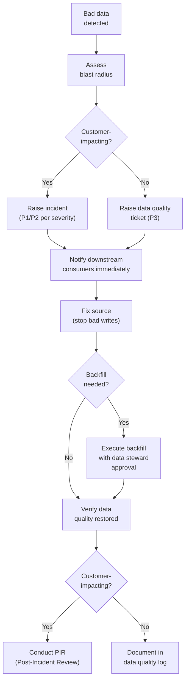
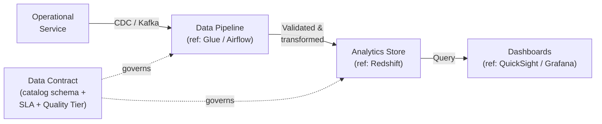
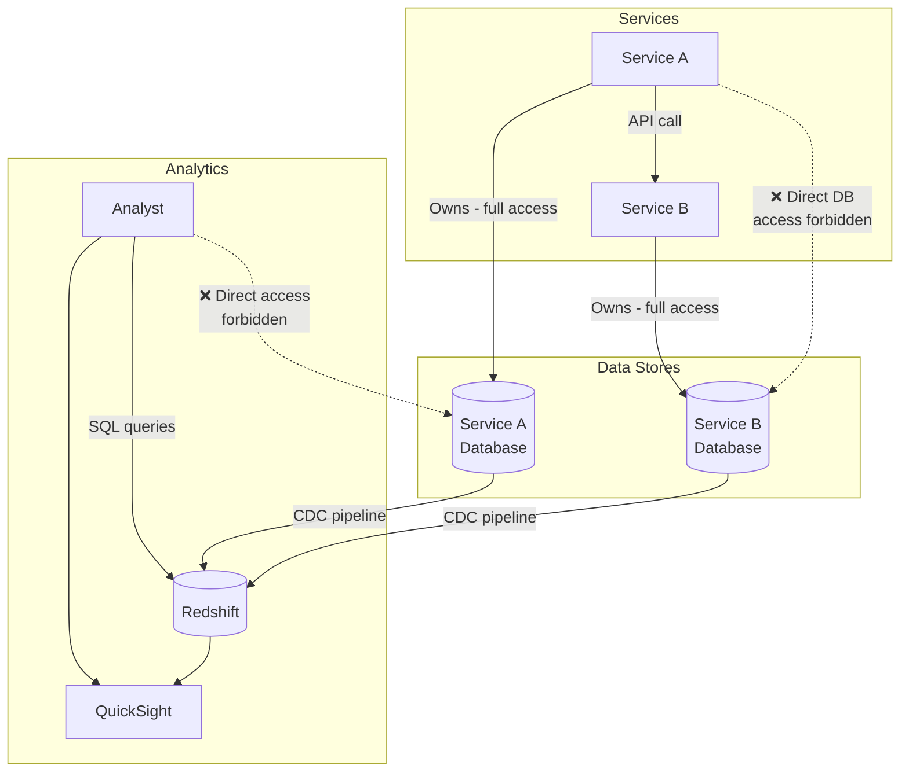

# 📊 Data Governance

  

---

## 📋 Table of Contents

1. [Data Steward Role](#1-data-steward-role)
2. [Data Quality SLAs](#2-data-quality-slas)
3. [Data Catalog](#3-data-catalog)
4. [Data Quality Monitoring](#4-data-quality-monitoring)
5. [Bad Data Incident Process](#5-bad-data-incident-process)
6. [Analytics Data Contracts](#6-analytics-data-contracts)
7. [Data Retention Matrix](#7-data-retention-matrix)
8. [PII Handling](#8-pii-handling)
9. [Data Access Controls](#9-data-access-controls)

---

## 📊 1. Data Steward Role

Every domain at {Company} has a designated **data steward** - a named individual responsible for the quality, accessibility, retention, and compliance of the data produced by their domain.

### 1.1 Responsibilities

| Responsibility | Detail |
|----------------|--------|
| **Data quality** | Define and enforce data quality SLAs for all datasets produced by the domain |
| **Data access** | Approve or deny access requests to domain data; maintain IAM policies |
| **Retention** | Define retention periods for all data stores; ensure automated enforcement |
| **Compliance** | Ensure data handling aligns with GDPR, PDPA, and internal privacy policies (cross-reference `04-infrastructure-and-cloud/08-privacy-engineering.md`) |
| **Schema ownership** | Approve schema changes for Kafka topics and database tables owned by the domain |
| **Catalog registration** | Ensure all datasets are registered in the data catalog before production deployment |

### 1.2 Registration

Data stewards are listed in the **Backstage service catalog** under the `data-steward` role for their domain. Every domain service page in Backstage displays the current data steward.

| Domain | Data Steward Role | Registered In |
|--------|-------------------|---------------|
| Orders | Orders domain data steward | Backstage → Orders Service → Team |
| Payments | Payments domain data steward | Backstage → Payment Service → Team |
| Customers | Customer domain data steward | Backstage → Customer Profile → Team |
| Providers | Provider domain data steward | Backstage → Provider Profile → Team |
| Pricing | Pricing domain data steward | Backstage → Pricing Service → Team |
| Fulfillment | Fulfillment domain data steward | Backstage → Fulfillment Engine → Team |

### 1.3 Escalation

If a data quality issue arises and the data steward is unavailable, the escalation path is: domain tech lead → engineering manager → VP Engineering.

---

## 📊 2. Data Quality SLAs

Data quality is measured and enforced via tiered SLAs. The tier is determined by the downstream impact of data quality degradation.

### 2.1 Tier Definitions

| Tier | Completeness | Freshness | Accuracy | Examples |
|------|-------------|-----------|----------|----------|
| **Tier 1 - Critical** | ≥ 99.9% | < 5 minutes | ≥ 99.9% | Order events, payment transactions, real-time pricing data |
| **Tier 2 - Important** | ≥ 99% | < 30 minutes | ≥ 99% | Provider profiles, customer preferences, fulfillment assignments |
| **Tier 3 - Standard** | ≥ 95% | < 2 hours | ≥ 95% | Analytics aggregations, reporting datasets, historical trends |

### 2.2 Measurement Definitions

| Metric | Definition |
|--------|-----------|
| **Completeness** | Percentage of required fields that are non-null and non-empty across all records in the dataset |
| **Freshness** | Maximum delay between the source event timestamp and the data being available in the target store |
| **Accuracy** | Percentage of records that match the source of truth (validated via reconciliation jobs) |

### 2.3 SLA Breach Response

| Tier | Alert Channel | Response Time | Escalation |
|------|--------------|---------------|------------|
| Tier 1 | PagerDuty (P1) | 15 minutes | Immediate - data steward + on-call engineer |
| Tier 2 | PagerDuty (P3) | 1 hour | Data steward notified |
| Tier 3 | Slack alert | Next business day | Data steward reviews in weekly data quality review |

---

## 📊 3. Data Catalog

All datasets - databases, Kafka topics, object storage prefixes, warehouse tables, and event schemas - must be registered in the data catalog before production deployment. Unregistered datasets are invisible, ungoverned, and a compliance risk.

### 3.1 Catalog Tools

**Reference implementation (AWS):** Glue Data Catalog for lake and warehouse metadata; map to Unity Catalog, Azure Purview, or equivalent.

| Tool | Purpose | What to Register |
|------|---------|-----------------|
| **Glue Data Catalog** (reference) | Schema registry for databases, data lakes, and ETL jobs | Managed SQL tables, lake datasets, warehouse tables, ETL jobs |
| **EventCatalog** | Event schema documentation and discovery | Kafka topics, event schemas, producer/consumer relationships |
| **Backstage** | Service catalog with data ownership metadata | Service → data store mapping, data steward assignment |

### 3.2 Registration Requirements

| Field | Required | Example |
|-------|----------|---------|
| **Dataset name** | Yes | `orders.order_events` |
| **Owner** | Yes | `orders-team` |
| **Data steward** | Yes | `jane.doe@{company}.com` |
| **Classification** | Yes | `Personal` / `Operational` / `Public` (per privacy-engineering.md §2) |
| **Schema** | Yes | Avro schema (Kafka), DDL for relational stores, catalog table definition for lake objects (**reference:** Glue table for S3) |
| **Retention policy** | Yes | `90 days` / `7 years` / `indefinite (anonymized)` |
| **Quality tier** | Yes | `Tier 1` / `Tier 2` / `Tier 3` |
| **Consumers** | Yes | List of services or teams that consume this dataset |

### 3.3 Enforcement

Registration is validated during the deployment pipeline. A service that produces data to an unregistered Kafka topic or writes to an unregistered object storage prefix will trigger a CI warning in staging and a **deployment block** in production.

---

## 📊 4. Data Quality Monitoring

Automated data quality checks run continuously to detect anomalies, schema violations, and SLA breaches before they impact downstream consumers.

### 4.1 Tools

| Tool | Use Case | Where It Runs |
|------|----------|---------------|
| **Great Expectations** | Batch data quality validation for S3 and Redshift datasets | Airflow DAGs, post-ETL |
| **Deequ on Spark (ref: AWS Glue)** | Data quality checks integrated into managed Spark ETL | Vendor Spark / Glue jobs |
| **Custom Kafka consumers** | Real-time schema and quality validation for streaming data | EKS (dedicated quality-monitor service) |

### 4.2 Standard Quality Checks

| Check | Description | Applies To |
|-------|-------------|-----------|
| **Schema conformance** | All records conform to the registered schema; no unexpected nulls in required fields | Kafka topics, S3 datasets |
| **Completeness** | Required fields are populated above the tier threshold | All datasets |
| **Freshness** | Data arrives within the tier freshness SLA | All datasets |
| **Uniqueness** | Primary key / event ID is unique within the expected window | Kafka topics, database tables |
| **Range validation** | Numeric values fall within expected bounds (e.g., price > 0, latitude between -90 and 90) | Domain-specific |
| **Referential integrity** | Foreign key references resolve to existing records in the referenced dataset | Database tables, joined datasets |
| **Anomaly detection** | Record volume, null rate, or value distribution deviates significantly from historical baseline | Tier 1 and Tier 2 datasets |

### 4.3 Great Expectations Example

```python
import great_expectations as gx

context = gx.get_context()

validator = context.sources.pandas_default.read_csv("s3://data-lake/orders/2026-04-01/")

validator.expect_column_values_to_not_be_null("order_id")
validator.expect_column_values_to_not_be_null("customer_id")
validator.expect_column_values_to_be_between("total_amount", min_value=0)
validator.expect_column_values_to_be_in_set(
    "status", ["CREATED", "ASSIGNED", "IN_PROGRESS", "COMPLETED", "CANCELLED"]
)
validator.expect_column_values_to_match_regex(
    "order_id", r"^ord-[a-f0-9]{8}-[a-f0-9]{4}-[a-f0-9]{4}-[a-f0-9]{4}-[a-f0-9]{12}$"
)

results = validator.validate()
```

### 4.4 Alerting

Quality check failures trigger alerts through the SLA breach response matrix (§2.3). All alerts include:
- Dataset name and owner
- Check that failed
- Expected vs actual values
- Link to the Great Expectations validation result or monitoring dashboard

---

## 📋 5. Bad Data Incident Process

When bad data reaches production - corrupted records, incorrect values, schema violations that bypassed validation - the impact can cascade to downstream consumers, dashboards, and customer-facing features. Speed and blast-radius assessment are critical.

### 5.1 Incident Flow

**Visual overview:**



### 5.2 Steps

| Step | Action | Owner |
|------|--------|-------|
| **1. Detect** | Automated quality check fails, or downstream consumer reports anomaly | Quality monitoring system / consuming team |
| **2. Assess blast radius** | Identify all downstream datasets, services, and dashboards affected | Data steward + on-call engineer |
| **3. Notify** | Alert downstream consumers via Slack and PagerDuty (if Tier 1) | Data steward |
| **4. Stop the bleeding** | Fix the source: patch the producer, revert the bad deployment, or halt the pipeline | Producing team |
| **5. Backfill** | Replay corrected data for the affected time window; coordinate with consumers to reprocess | Data steward + producing team |
| **6. Verify** | Run quality checks on the corrected data; confirm with downstream consumers | Data steward |
| **7. PIR** | If customer-impacting, conduct a Post-Incident Review (per `05-operational-excellence/04-incident-management.md`) | Data steward + engineering manager |

---

## 📊 6. Analytics Data Contracts

An analytics data contract is a formal agreement between a data producer and its analytics consumers. It defines the schema, SLA, and change management process for data flowing from operational systems into the analytics platform.

### 6.1 Contract Components

| Component | Detail |
|-----------|--------|
| **Schema** | Published in the data catalog; versioned (**reference:** AWS Glue Data Catalog) |
| **Freshness SLA** | Maximum delay from source event to availability in the analytics store |
| **Quality tier** | Tier 1, 2, or 3 (per §2) |
| **Breaking change policy** | Follows the event schema evolution process (`02-architecture-and-api/08-event-schema-evolution.md`) |
| **Consumer notification** | All registered consumers are notified before any schema change |

### 6.2 Contract Flow

**Visual overview:**



### 6.3 Breaking Changes

Breaking changes to analytics data (column removal, type change, semantic change) follow the same process as event schema evolution:

1. Publish the new schema version in the data catalog (**reference:** AWS Glue).
2. Dual-write to both old and new tables for the migration window.
3. Notify all analytics consumers.
4. Consumers migrate queries and dashboards.
5. Deprecate and remove the old table per the deprecation lifecycle.

---

## 📊 7. Data Retention Matrix

Each domain must maintain a data retention matrix that defines the lifecycle of every data store it owns. The following template must be filled per domain and registered in the data catalog.

### 7.1 Template

| Store | Data Examples | Retention | Archive Strategy | Deletion Method | Legal Hold |
|-------|---------------|-----------|-----------------|----------------|------------|
| **Primary DB (RDS/Aurora)** | Active orders, customer profiles | Per domain policy (e.g., 90 days active) | Archive to S3 Glacier after active window | Automated TTL job or scheduled deletion | Suspend deletion for flagged records |
| **Read replicas** | Replica of primary data | Mirrors primary | N/A - follows primary | Follows primary | Follows primary |
| **Kafka topics** | Domain events | 7 days (default topic retention) | Export to S3 via Kafka Connect for long-term | Kafka log segment deletion | N/A - use S3 archive for legal hold |
| **S3 objects** | Data lake files, backups, exports | Per classification: 90 days - 7 years | S3 Intelligent-Tiering → Glacier after 90 days | S3 lifecycle policy | S3 Object Lock (compliance mode) |
| **OpenSearch indexes** | Application logs, search indexes | 30 days (logs), 90 days (search) | Snapshot to S3 | Index lifecycle management (ILM) policy | Snapshot preserved |
| **Redshift tables** | Analytics datasets | Indefinite (anonymized) or per contract | N/A - Redshift is the archive | Manual deletion with data steward approval | Query audit log preserved |
| **Application logs** | CloudWatch, structured logs | 30 days | Export to S3 after 30 days | CloudWatch retention policy | S3 archive |

### 7.2 Rules

- **Every data store must have a defined retention period.** No exceptions. "We'll figure it out later" is not a retention policy.
- **Retention is enforced automatically.** Manual deletion is not a strategy - it is a liability. Use TTL, lifecycle policies, and scheduled jobs.
- **Legal hold overrides retention.** When legal places a hold on data related to litigation or regulatory investigation, automated deletion is suspended for the held records until the hold is lifted.
- **Anonymized data may be retained indefinitely.** Data that has been irreversibly anonymized (per `04-infrastructure-and-cloud/08-privacy-engineering.md` §4) is not subject to PII retention limits.

---

## 🔐 8. PII Handling

Data governance and privacy engineering are inseparable. This section cross-references the privacy engineering standards and adds data-governance-specific controls.

### 8.1 Data Classification Labels

Every dataset in the data catalog must have a classification label from the privacy engineering classification scheme:

| Label | Meaning | Governance Implication |
|-------|---------|----------------------|
| **Highly Sensitive** | Payment data, national IDs | Tokenized, HSM-encrypted, MPA for access, never in analytics without anonymization |
| **Personal** | Name, email, phone, location | Encrypted at rest, access logged, anonymized before analytics export |
| **Operational** | Order IDs, timestamps, metrics | Standard controls, no special anonymization required |
| **Public** | Aggregated ratings, region stats | No special controls |

### 8.2 Anonymization for Analytics

PII data must be anonymized before it enters the analytics platform. The following transformations are applied automatically in the data pipeline:

| PII Field | Anonymization Method | Result |
|-----------|---------------------|--------|
| Customer ID | One-way hash (SHA-256 with salt) | `a1b2c3d4...` (non-reversible) |
| Customer name | Removed | N/A |
| Email address | Removed | N/A |
| Phone number | Removed | N/A |
| GPS coordinates | Rounded to H3 resolution 7 (~5 km²) | `872a1070dffffff` |
| IP address | Removed | N/A |

### 8.3 Cross-Reference

For full PII handling details - including data classification, privacy impact assessments, right to erasure, and consent management - see `04-infrastructure-and-cloud/08-privacy-engineering.md`.

---

## 🔐 9. Data Access Controls

### 9.1 Principles

| Principle | Rule |
|-----------|------|
| **No direct cross-service DB access** | Services access each other's data via APIs or Kafka events - never via direct database queries. A service's database is a private implementation detail. |
| **Least privilege** | IAM policies grant the minimum permissions required. No wildcard (`*`) resource permissions for data stores. |
| **Analytics via Redshift/QuickSight only** | Analysts and data scientists access production data through Redshift (read replicas) or QuickSight dashboards - never via direct RDS connections. |
| **Audit trail** | All data access is logged. PII access is logged with justification (per privacy-engineering.md §10). |

### 9.2 Access Model

**Visual overview:**



### 9.3 Access Request Process

| Step | Action |
|------|--------|
| 1 | Requester submits access request via the data access portal (Backstage plugin) |
| 2 | Data steward for the target dataset reviews and approves/denies within 2 business days |
| 3 | Approved access is provisioned via IAM policy update (automated) |
| 4 | Access is time-boxed: default 90 days, renewable with re-approval |
| 5 | Quarterly access review revokes stale permissions (per privacy-engineering.md §10) |

---
<div align="center">

⬅️ [Back to section](./README.md) · 🏠 [Back to root](../README.md)

</div>
