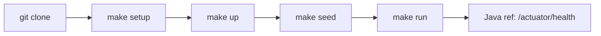
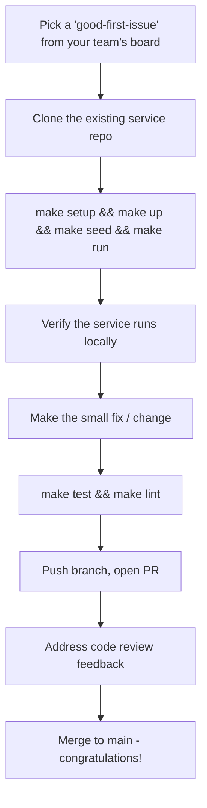

# 💻 Local Development Guide

  

---

## 📋 Table of Contents

1. [Prerequisites](#1-prerequisites)
2. [Clone-to-Running in Five Minutes](#2-clone-to-running-in-five-minutes)
3. [Docker Compose Stack](#3-docker-compose-stack)
4. [Database Seeding](#4-database-seeding)
5. [Secrets in Local Dev](#5-secrets-in-local-dev)
6. [Makefile Targets](#6-makefile-targets)
7. [First PR Path](#7-first-pr-path)
8. [Troubleshooting FAQ](#8-troubleshooting-faq)

---

## 💻 1. Prerequisites

Every {Company} engineer needs the **common** toolchain below plus **one runtime SDK** for the services you work on. You do not need every language installed globally unless you touch those codebases.

| Tool | Minimum Version | Install |
|------|----------------|---------|
| **Docker Desktop** | 4.28+ | `brew install --cask docker` |
| **Docker Compose** | v2.24+ | Bundled with Docker Desktop |
| **Make** | 3.81+ | Pre-installed on macOS |
| **AWS CLI** | 2.x | `brew install awscli` |
| **kubectl** | 1.29+ | `brew install kubectl` |
| **Helm** | 3.14+ | `brew install helm` |
| **pre-commit** | 3.x | `brew install pre-commit` |

**Runtime SDKs (pick what your services use):**

| Runtime | Minimum version | Typical install |
|---------|-----------------|-----------------|
| **Java** (reference) | 21 LTS | `brew install --cask temurin@21` or SDKMAN + Corretto |
| **Node.js** | 20 LTS | `brew install node@20` or nvm |
| **Go** | 1.22+ (platform pin) | `brew install go` or official archive |
| **Python** | 3.11+ (platform pin) | `brew install python@3.11` or uv/pyenv |

### 1.1 Recommended IDE Plugins

| IDE | Plugin | Purpose |
|-----|--------|---------|
| IntelliJ | EnvFile | Load `.env.local` into run configs |
| IntelliJ | Docker | Manage containers from IDE |
| VS Code | Dev Containers | Open project inside container |
| VS Code | REST Client | Test APIs without Postman |

---

## 💻 2. Clone-to-Running in Five Minutes

Every service repository follows the same **bootstrap flow**; concrete targets may differ by runtime (Gradle vs npm vs `go run`). The diagram uses the **Java reference** health URL.



```bash
git clone git@github.com:{company}/<service-name>.git
cd <service-name>

make setup   # installs pre-commit hooks, downloads .env.local template
make up      # starts Docker Compose infrastructure (Postgres, Redis, Kafka, LocalStack)
make seed    # loads minimal seed data (Java ref: Flyway + seed SQL; other stacks use their migrator)
make run     # Java ref: Spring local profile; see README for other runtimes
```

**Java reference:** the service is ready when `http://localhost:8080/actuator/health` returns `{"status": "UP"}`. Other services use the readiness check documented in `README.md`.

---

## 💻 3. Docker Compose Stack

All {Company} services share a common `docker-compose.infra.yml` pulled from the `platform-local-stack` repository. Services extend it with a local `docker-compose.override.yml` for service-specific needs.

### 3.1 Core Infrastructure Services

| Service | Image | Port | Purpose |
|---------|-------|------|---------|
| **Postgres 16** | `postgres:16-alpine` | 5432 | Primary data store |
| **Redis 7** | `redis:7-alpine` | 6379 | Cache & session store |
| **Kafka (KRaft)** | `confluentinc/cp-kafka:7.6.0` | 9092 | Event streaming |
| **Schema Registry** | `confluentinc/cp-schema-registry:7.6.0` | 8081 | Local Avro schema registry |
| **LocalStack** | `localstack/localstack:3.4` | 4566 | S3, SQS, SNS, Secrets Manager |
| **Mailpit** | `axllent/mailpit:latest` | 8025 (UI), 1025 (SMTP) | Email capture |

### 3.2 Docker Compose Snippet

```yaml
# docker-compose.infra.yml
version: "3.9"

services:
  postgres:
    image: postgres:16-alpine
    environment:
      POSTGRES_DB: ${SERVICE_DB_NAME:-app}
      POSTGRES_USER: ${SERVICE_DB_USER:-localdev}
      POSTGRES_PASSWORD: ${SERVICE_DB_PASSWORD:-localdev}
    ports:
      - "5432:5432"
    volumes:
      - pgdata:/var/lib/postgresql/data
    healthcheck:
      test: ["CMD-SHELL", "pg_isready -U localdev"]
      interval: 5s
      timeout: 3s
      retries: 5

  redis:
    image: redis:7-alpine
    ports:
      - "6379:6379"
    healthcheck:
      test: ["CMD", "redis-cli", "ping"]
      interval: 5s
      timeout: 3s
      retries: 5

  kafka:
    image: confluentinc/cp-kafka:7.6.0
    environment:
      KAFKA_NODE_ID: 1
      KAFKA_PROCESS_ROLES: broker,controller
      KAFKA_CONTROLLER_QUORUM_VOTERS: 1@kafka:29093
      KAFKA_LISTENERS: PLAINTEXT://0.0.0.0:9092,CONTROLLER://0.0.0.0:29093
      KAFKA_ADVERTISED_LISTENERS: PLAINTEXT://localhost:9092
      KAFKA_CONTROLLER_LISTENER_NAMES: CONTROLLER
      KAFKA_LISTENER_SECURITY_PROTOCOL_MAP: PLAINTEXT:PLAINTEXT,CONTROLLER:PLAINTEXT
      KAFKA_OFFSETS_TOPIC_REPLICATION_FACTOR: 1
      CLUSTER_ID: "local-dev-cluster-001"
    ports:
      - "9092:9092"
    healthcheck:
      test: ["CMD", "kafka-broker-api-versions", "--bootstrap-server", "localhost:9092"]
      interval: 10s
      timeout: 5s
      retries: 10

  schema-registry:
    image: confluentinc/cp-schema-registry:7.6.0
    depends_on:
      kafka:
        condition: service_healthy
    environment:
      SCHEMA_REGISTRY_HOST_NAME: schema-registry
      SCHEMA_REGISTRY_KAFKASTORE_BOOTSTRAP_SERVERS: kafka:9092
    ports:
      - "8081:8081"

  localstack:
    image: localstack/localstack:3.4
    environment:
      SERVICES: s3,sqs,sns,secretsmanager
      DEFAULT_REGION: us-east-1
    ports:
      - "4566:4566"
    volumes:
      - "./infra/localstack-init:/etc/localstack/init/ready.d"

volumes:
  pgdata:
```

### 3.3 Port Allocation Convention

To avoid conflicts when running multiple services simultaneously, each service reserves a port range assigned in the service catalog.

| Service | App Port | Debug Port | Management Port |
|---------|----------|------------|-----------------|
| order-service | 8080 | 5005 | 8081 |
| payment-service | 8082 | 5006 | 8083 |
| notification-service | 8084 | 5007 | 8085 |
| user-service | 8086 | 5008 | 8087 |
| inventory-service | 8088 | 5009 | 8089 |

---

## 🗄️ 4. Database Seeding

### 4.1 Seed Script Convention

**Java reference:** services maintain seed data under `src/main/resources/db/seed/`. Other runtimes keep seeds under the path their migration tool expects. Seed files follow the naming convention:

```
db/seed/
├── V9000.1__seed_lookup_data.sql      # enums, statuses, categories
├── V9000.2__seed_test_users.sql       # test user accounts
├── V9000.3__seed_sample_entities.sql  # domain-specific sample data
```

The `V9000.x` prefix (**Flyway reference**) ensures seed scripts run after schema migrations but are excluded from production by profile gating.

### 4.2 Minimal Dataset Per Service

Each service defines a **minimal viable dataset** - the smallest set of rows needed for the service to function locally. This is not a production data dump; it is curated for developer ergonomics.

| Data Category | Examples | Required? |
|---------------|----------|-----------|
| **Lookup / Reference** | Order statuses, payment methods, regions | Yes - always seeded |
| **Test Users** | `testuser@{company}.dev` with known ID | Yes - enables auth flows |
| **Sample Entities** | 3–5 orders, 2 payments, 1 notification | Yes - enables UI exploration |
| **Edge Cases** | Cancelled order, failed payment | Optional - useful for debugging |

### 4.3 Seed Script Best Practices

```sql
-- V9000.1__seed_lookup_data.sql
INSERT INTO order_status (code, label, sort_order)
VALUES
    ('CREATED', 'Created', 1),
    ('CONFIRMED', 'Confirmed', 2),
    ('IN_PROGRESS', 'In Progress', 3),
    ('DELIVERED', 'Delivered', 4),
    ('CANCELLED', 'Cancelled', 5)
ON CONFLICT (code) DO NOTHING;
```

- Always use `ON CONFLICT DO NOTHING` or `INSERT ... WHERE NOT EXISTS` so seeds are idempotent.
- Never reference auto-generated IDs from other tables; use deterministic UUIDs (`uuid_generate_v5`).
- Keep seed data realistic but not sensitive - no production PII, no real credentials.

---

## 🔐 5. Secrets in Local Dev

### 5.1 `.env.local` with Dummy Values

Every repository ships a `.env.local.template` file with safe, non-secret default values. On `make setup`, it is copied to `.env.local` (which is `.gitignore`-d).

```properties
# .env.local - safe dummy values for local development
DB_HOST=localhost
DB_PORT=5432
DB_NAME=app
DB_USER=localdev
DB_PASSWORD=localdev

REDIS_HOST=localhost
REDIS_PORT=6379

KAFKA_BOOTSTRAP_SERVERS=localhost:9092
SCHEMA_REGISTRY_URL=http://localhost:8081

AWS_ENDPOINT=http://localhost:4566
AWS_ACCESS_KEY_ID=test
AWS_SECRET_ACCESS_KEY=test
AWS_REGION=us-east-1

LAUNCHDARKLY_SDK_KEY=sdk-local-test-key
```

### 5.2 LocalStack Secrets Manager

For services that read secrets from AWS Secrets Manager at startup, LocalStack is pre-seeded with dummy secrets via an init script:

```bash
#!/bin/bash
# infra/localstack-init/01-secrets.sh
awslocal secretsmanager create-secret \
  --name "local/order-service/db" \
  --secret-string '{"username":"localdev","password":"localdev","host":"postgres","port":"5432","dbname":"app"}'

awslocal secretsmanager create-secret \
  --name "local/order-service/api-keys" \
  --secret-string '{"stripe":"sk_test_fake","sendgrid":"SG.fake"}'
```

### 5.3 Spring bootstrap load pattern (Java reference)

Services on Spring use a `BootstrapConfiguration` that detects the `local` profile and routes Secrets Manager calls to LocalStack. Other SDKs use the same idea: endpoint override and dummy credentials when `AWS_ENDPOINT` points at LocalStack.

```java
@Configuration
@Profile("local")
public class LocalSecretsConfig {

    @Bean
    public SecretsManagerClient secretsManagerClient() {
        return SecretsManagerClient.builder()
                .endpointOverride(URI.create("http://localhost:4566"))
                .region(Region.US_EAST_1)
                .credentialsProvider(StaticCredentialsProvider.create(
                        AwsBasicCredentials.create("test", "test")))
                .build();
    }
}
```

---

## 💻 6. Makefile Targets

Every {Company} service repository includes a `Makefile` with standardized targets. Teams may add service-specific targets but must not remove or rename the platform targets.

| Target | Description | Idempotent? |
|--------|-------------|-------------|
| `make setup` | Copy `.env.local.template` → `.env.local`, install pre-commit hooks, pull Docker images | Yes |
| `make up` | Start Docker Compose infrastructure in detached mode | Yes |
| `make down` | Stop and remove Docker Compose containers | Yes |
| `make reset` | `down` + remove volumes + `up` + `seed` (full reset) | Yes |
| `make seed` | Run migrations + seed scripts against local DB (Java ref: Flyway) | Yes |
| `make run` | Start the app with local config (Java ref: `SPRING_PROFILES_ACTIVE=local`) | No |
| `make test` | Run unit + integration tests | No |
| `make lint` | Run linters (Java: checkstyle/spotless; Node: eslint; etc.) | Yes |
| `make build` | Build production artifact (JAR, binary, or Docker image) | No |
| `make logs` | Tail Docker Compose logs | No |
| `make clean` | Remove build artifacts (`.gradle`, `node_modules`, `dist`, etc.) | Yes |

### 6.1 Makefile skeleton (Java / Gradle reference)

```makefile
.PHONY: setup up down reset seed run test lint build logs clean

ENV_FILE := .env.local

setup:
	@test -f $(ENV_FILE) || cp .env.local.template $(ENV_FILE)
	@pre-commit install
	@docker compose -f docker-compose.infra.yml pull

up:
	@docker compose -f docker-compose.infra.yml up -d --wait

down:
	@docker compose -f docker-compose.infra.yml down

reset: down
	@docker compose -f docker-compose.infra.yml down -v
	@$(MAKE) up seed

seed:
	@./gradlew flywayMigrate -Dflyway.locations="filesystem:src/main/resources/db/migration,filesystem:src/main/resources/db/seed"

run:
	@SPRING_PROFILES_ACTIVE=local ./gradlew bootRun

test:
	@./gradlew test

lint:
	@./gradlew spotlessCheck checkstyleMain

build:
	@./gradlew bootJar

logs:
	@docker compose -f docker-compose.infra.yml logs -f

clean:
	@./gradlew clean
	@rm -rf build/ .gradle/
```

---

## 🛤️ 7. First PR Path

New engineers should ship code on their first day. The recommended first PR path is intentionally simpler than the golden path scaffold - it removes the cognitive overhead of creating a new service.

### 7.1 Steps



### 7.2 Good First Issues

Team leads maintain a backlog of issues tagged `good-first-issue` in Jira. These issues:

- Are scoped to a single file or a small set of files.
- Do not require deep domain knowledge.
- Have clear acceptance criteria.
- Include pointers to relevant code locations.

Examples: fix a typo in an error message, add a missing validation, update a test fixture, add a new field to a DTO.

### 7.3 Pairing

Every new engineer is assigned a **buddy** from their team. The buddy:

- Walks through the first PR together in a pairing session.
- Is the first reviewer on the PR.
- Answers questions asynchronously via DM or the team Slack channel.

---

## 💻 8. Troubleshooting FAQ

### 8.1 Common Issues

| Problem | Cause | Fix |
|---------|-------|-----|
| `make up` fails with "port already in use" | Another service or old container is occupying the port | `docker compose down` in all service directories, or `lsof -i :<port>` to find the process |
| Postgres container exits immediately | Corrupted volume data | `docker volume rm <service>_pgdata && make up` |
| Kafka consumer never receives messages | Topic auto-create is disabled; topic doesn't exist locally | Run `make seed` which creates topics, or manually create via `kafka-topics --create` |
| App hangs at startup waiting for secrets | Waiting for a secret from Secrets Manager that LocalStack hasn't seeded | Verify `infra/localstack-init/01-secrets.sh` ran: `awslocal secretsmanager list-secrets` |
| Schema Registry rejects a schema | Incompatible schema change locally | Reset the registry: `docker compose down schema-registry && docker volume rm schema-registry-data && make up` |
| Tests fail with "connection refused" on CI but pass locally | Docker Compose services not started in CI | Ensure the CI pipeline uses the `services:` block or `make up` step |
| `UnsupportedClassVersionError` (Java) | Wrong JDK | `java -version` must match the service (21+ for reference stack). Use SDKMAN: `sdk use java 21.x-tem`. |
| Wrong runtime version (Node / Go / Python) | Local SDK does not match `.nvmrc`, `go.mod`, or tool pin | Use the version in the repo; see README. |

### 8.2 M1 / ARM (Apple Silicon) Gotchas

| Issue | Workaround |
|-------|------------|
| Kafka image crashes with `exec format error` | Use `confluentinc/cp-kafka:7.6.0` - ARM-native since 7.4 |
| `testcontainers` pulls amd64 images | Set `DOCKER_DEFAULT_PLATFORM=linux/arm64` or add `TESTCONTAINERS_RYUK_DISABLED=true` in `.env.local` |
| Rosetta-emulated containers are slow | Prefer ARM-native images; check Docker Desktop → Settings → "Use Rosetta" is enabled for unavoidable amd64 images |
| `localstack` is slow on first start | Pre-pull image: `docker pull localstack/localstack:3.4` - subsequent starts use cache |
| Native compilation (`GraalVM`) fails | GraalVM native-image on ARM requires `graalvm-jdk-21` from SDKMAN and Xcode CLI tools |

### 8.3 Getting Help

| Channel | Use For | Response SLA |
|---------|---------|--------------|
| **#platform-support** (Slack) | Infrastructure, Docker, CI/CD questions | 4 business hours |
| **Team Slack channel** | Domain / codebase questions | Same day |
| **Office hours** (Tues/Thurs 2–3 PM) | Live troubleshooting, screen-sharing | Real-time |
| **Buddy** | First-week questions, PR reviews | Same day |
| **Backstage docs** | Self-service reference | N/A |

---
<div align="center">

⬅️ [Back to section](./README.md) · 🏠 [Back to root](../README.md)

</div>
