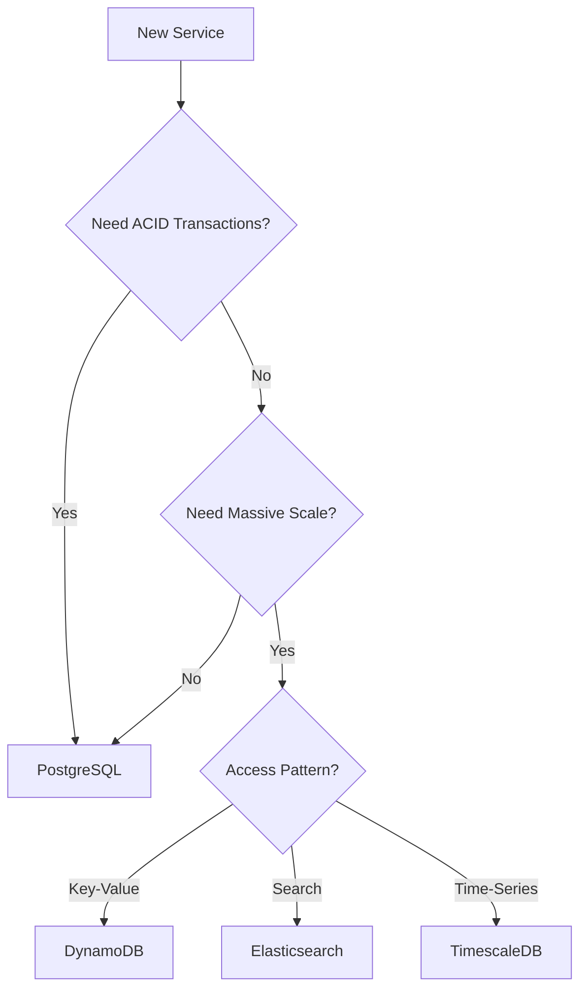

# 🗄️ Database Selection and Polyglot Persistence

  

---

## 🎯 1. Overview

Choosing the right database is one of the most consequential technical decisions a team makes. The wrong choice leads to painful migrations, performance cliffs, and operational burden. Polyglot persistence - using different databases for different workloads - is powerful but introduces operational complexity that must be earned.

> **Rule:** PostgreSQL is the default database for all new services. Teams choosing a different database must document the justification in an ADR using the decision matrix in Section 3.

---

## 📐 2. Database Categories

| Category | Technology | Best for | Not for |
|----------|-----------|----------|---------|
| **Relational** | PostgreSQL (default) | ACID transactions, complex queries, referential integrity | Unbounded horizontal scale, unstructured data |
| **Document** | MongoDB, DynamoDB | Flexible schema, hierarchical data, high write throughput | Complex joins, multi-document transactions |
| **Key-value** | Redis, DynamoDB | Caching, session storage, rate limiting | Complex queries, large datasets |
| **Search** | Elasticsearch, OpenSearch | Full-text search, log aggregation, analytics | Primary data storage, transactional writes |
| **Time-series** | TimescaleDB, InfluxDB | Metrics, IoT data, time-ordered events | General-purpose queries |
| **Graph** | Neo4j, Neptune | Relationship traversal, recommendation engines | Simple CRUD, tabular data |
| **Wide-column** | Cassandra, ScyllaDB | Massive write throughput, time-series at scale | Ad-hoc queries, strong consistency |

---

## 🧭 3. Decision Matrix

Score each criterion for your workload. The result guides your technology choice.

| # | Criterion | Relational (0 pts) | NoSQL (1 pt) |
|---|-----------|-------------------|-------------|
| 1 | Data model | Structured, well-defined schema | Schema-flexible, nested documents |
| 2 | Consistency | Strong consistency required | Eventual consistency acceptable |
| 3 | Query patterns | Complex joins, aggregations | Simple key-based lookups |
| 4 | Scale | Vertical scaling sufficient (< 10 TB) | Horizontal scaling required (> 10 TB) |
| 5 | Transactions | Multi-table transactions needed | Single-document atomicity sufficient |
| 6 | Write throughput | < 10,000 writes/sec | > 10,000 writes/sec sustained |

| Score | Recommendation |
|-------|----------------|
| 0 - 2 | **PostgreSQL.** Your workload fits the relational model. |
| 3 - 4 | **Evaluate.** Consider DynamoDB or MongoDB if specific NoSQL advantages are needed. |
| 5 - 6 | **NoSQL.** Choose based on access pattern: DynamoDB for key-value, Elasticsearch for search, Cassandra for time-series. |

**Visual overview:**

---

## 🏗️ 4. Polyglot Persistence

Using multiple databases within a single service or across services is called polyglot persistence. It is a tool for optimization, not a default.

### 4.1 When Polyglot Is Justified

| Scenario | Primary store | Secondary store |
|----------|--------------|----------------|
| **Search over relational data** | PostgreSQL (source of truth) | Elasticsearch (search index) |
| **Caching hot data** | PostgreSQL (durable) | Redis (cache) |
| **Analytics on transactional data** | PostgreSQL (OLTP) | ClickHouse or Redshift (OLAP) |
| **High-throughput event log** | Kafka (stream) | PostgreSQL (materialized view) |

### 4.2 Polyglot Rules

| Rule | Rationale |
|------|-----------|
| One database is the source of truth | Avoid split-brain data conflicts |
| Secondary stores are derived | Populated via CDC, events, or sync jobs |
| Each database has one owning team | No shared database across team boundaries |
| Operational cost is budgeted | Each database adds monitoring, backup, and on-call scope |

---

## 🛡️ 5. Operational Requirements

Every database - regardless of type - must meet these operational standards:

| Requirement | Detail |
|-------------|--------|
| **Automated backups** | Daily with point-in-time recovery; tested quarterly |
| **Monitoring** | Connection pool, query latency, replication lag, disk usage |
| **Alerting** | Disk > 80%, replication lag > 30s, connection pool > 90% |
| **Encryption** | At rest (AES-256) and in transit (TLS 1.3) |
| **Access control** | Service-specific credentials; no shared database users |
| **Runbook** | Documented failover, scaling, and recovery procedures |

---

## ⚠️ 6. Anti-Patterns

| Anti-pattern | Problem | Fix |
|-------------|---------|-----|
| **Shared database** | Multiple services read/write the same tables | One database per service; use events for cross-service data |
| **NoSQL by default** | Teams choose Mongo or Dynamo without a relational evaluation | Start with PostgreSQL; justify alternatives |
| **Polyglot without ops budget** | Adding databases without adding operational capacity | Budget for monitoring, backups, and on-call per database |
| **Database as integration layer** | Services integrate via shared tables or views | Use APIs or events for integration |
| **ORM-driven schema** | Schema designed around ORM convenience, not query patterns | Design schema for query performance first |

---

## 🔗 7. Cross-References

- [Database Migrations](./03-database-migrations.md) - Schema migration standards for all database types
- [Cache Patterns](./08-cache-patterns.md) - When to use Redis as a secondary store

---

⬅️ [Back to section](./README.md) · 🏠 [Back to root](../README.md)

