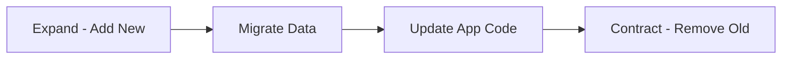

# 🔀 Data Migration Patterns

  

---

## 🎯 1. Overview

Data migrations move or transform data between schemas, databases, or systems. Done poorly, they cause downtime, data loss, or corruption. Every migration at {Company} must be zero-downtime, reversible, and tested in a staging environment before production.

> **Rule:** All data migrations must be backward-compatible and zero-downtime. Migrations that require application downtime need VP Engineering approval and a scheduled maintenance window.

---

## 📐 2. Migration Categories

| Category | Scope | Example | Risk |
|----------|-------|---------|------|
| **Schema evolution** | Column add/rename/drop | Add `currency` column to orders | Low |
| **Data backfill** | Populate new columns from existing data | Compute `total_cents` from `total` and `currency` | Medium |
| **Cross-database** | Move data between database engines | PostgreSQL to DynamoDB for a service | High |
| **Cross-service** | Transfer ownership of data to another service | Orders table moves from monolith to order-service | Very high |

---

## 🔄 3. Zero-Downtime Schema Evolution

The expand-contract pattern ensures schema changes never break running application instances.

**Visual overview:**

### 3.1 Expand Phase

Add the new column or table without removing anything. The application continues using the old schema.

| Change type | Expand action |
|------------|--------------|
| Add column | `ALTER TABLE ADD COLUMN ... DEFAULT ...` (non-locking) |
| Rename column | Add the new column; write to both old and new |
| Change type | Add a new column with the new type; dual-write |
| Drop column | No action in expand phase |

### 3.2 Migrate Phase

Backfill data from the old structure to the new structure. This runs as a background job.

| Requirement | Detail |
|-------------|--------|
| Batch size | Process 1,000 - 10,000 rows per batch |
| Throttling | Sleep between batches to avoid DB load spikes |
| Idempotency | Re-running the migration produces the same result |
| Progress tracking | Log progress every N batches; resume from checkpoint on failure |

### 3.3 Update Phase

Deploy the application code that reads from the new column and writes to both old and new (dual-write).

### 3.4 Contract Phase

After all application instances are running on the new code and the backfill is complete:

1. Stop writing to the old column
2. Deploy the code change that removes old-column reads
3. Drop the old column in a subsequent migration

> **Rule:** The contract phase must be a separate deployment from the expand phase. Never expand and contract in the same release.

---

## 🛡️ 4. Safety Requirements

| Requirement | Standard |
|-------------|----------|
| **Staging first** | Every migration runs in staging with production-like data volume before production |
| **Rollback plan** | Every migration has a documented rollback script that reverses the change |
| **Backup** | Take a snapshot before running any destructive migration |
| **Lock monitoring** | Monitor for table locks during migration; abort if lock wait exceeds 10 seconds |
| **Validation** | After migration, run a validation query to verify row counts and data integrity |

---

## 📊 5. Cross-Database Migration

Moving data between database engines (e.g., PostgreSQL to DynamoDB) follows five phases: dual-write (write to both databases), shadow-read (compare results in background), cutover (switch reads), validation (monitor for discrepancies), and decommission (archive old database).

> **Rule:** The old database must remain available for rollback for at least 7 days after cutover.

---

## 🔁 6. State Transfer Strategies

When splitting a monolith or transferring data ownership between services:

| Strategy | How it works | When to use |
|----------|-------------|-------------|
| **Event replay** | New service consumes historical events to build its state | Event-sourced systems with complete event history |
| **Bulk export/import** | Export data as CSV/Parquet, import into new service | One-time migration with a clear cutover point |
| **CDC streaming** | Debezium streams changes from old DB to new DB in real time | Continuous migration with zero downtime |
| **API sync** | New service calls old service API to fetch and cache data | When direct DB access is not possible |

---

## ⚠️ 7. Anti-Patterns

| Anti-pattern | Problem | Fix |
|-------------|---------|-----|
| **Big-bang migration** | Entire dataset migrated in one shot with downtime | Use expand-contract or dual-write |
| **No rollback plan** | Corrupted data with no way to recover | Script the reverse migration before running forward |
| **Skipping staging** | Migration works on 100 rows but fails on 10 million | Test with production-scale data in staging |
| **Locking DDL in production** | `ALTER TABLE` acquires a lock that blocks all writes | Use non-locking DDL or `pg_repack` |
| **Expand + contract in one deploy** | Old app instances crash when the column they read disappears | Separate expand and contract into different releases |

---

## 🔗 8. Cross-References

- [Database Migrations](./03-database-migrations.md) - Migration tooling and file naming standards

---

⬅️ [Back to section](./README.md) · 🏠 [Back to root](../README.md)

