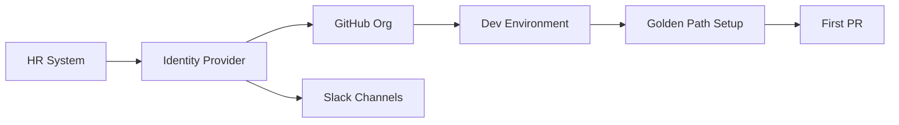

# 🚀 Onboarding Automation

  

---

## 🎯 1. Overview

A new engineer's first week shapes their productivity for months. Onboarding at {Company} is automated end-to-end so that every new hire can open a pull request on day one. Manual setup steps, tribal knowledge, and "ask someone" are failure modes - not acceptable onboarding strategies.

> **Rule:** Every new engineer must be able to clone, build, and run their team's primary service locally within 60 minutes of receiving their laptop.

---

## 📐 2. Onboarding Pipeline

**Visual overview:**



| Phase | Timeline | Automated Actions |
|-------|----------|-------------------|
| **Pre-day-one** | Before start date | SSO account, GitHub org invite, Slack channels, calendar groups |
| **Day one** | First 2 hours | Laptop bootstrap script, IDE setup, repo cloning |
| **Day one** | Hours 2 - 4 | Local build and test of team service |
| **Week one** | Days 2 - 5 | First PR merged, on-call shadow, architecture walkthrough |
| **30-day checkpoint** | Day 30 | Onboarding feedback survey, gap review with manager |

---

## 🛠️ 3. Laptop Bootstrap

The bootstrap script automates the entire development environment setup:

```bash
curl -fsSL https://bootstrap.internal.{company}.com/setup | bash
```

The script installs and configures:

| Component | Tool | Configuration |
|-----------|------|---------------|
| **Package manager** | Homebrew (macOS) / apt (Linux) | Versioned Brewfile or package list |
| **Runtime versions** | asdf or mise | `.tool-versions` per repo |
| **Containers** | Docker Desktop or Colima | Resource limits pre-configured |
| **IDE** | Team-standard IDE + extensions | Settings sync via dotfiles repo |
| **CLI tools** | kubectl, terraform, gh, aws-cli | Pre-authenticated via SSO |
| **VPN / network** | WireGuard or Tailscale | Auto-enrolled via IDP |

### 3.1 Bootstrap Success Criteria

The script must exit with a clear pass/fail summary:

| Check | Pass Criteria |
|-------|---------------|
| Docker running | `docker info` succeeds |
| Kubernetes context | `kubectl cluster-info` returns dev cluster |
| GitHub authentication | `gh auth status` shows authenticated |
| Sample build | Golden path template builds and tests pass |

---

## 📚 4. Knowledge Base Standards

Every team must maintain onboarding documentation that is machine-readable and current.

| Document | Location | Update Cadence |
|----------|----------|----------------|
| **Team README** | Root of team's primary repo | Every quarter |
| **Architecture diagram** | Backstage TechDocs | On every significant design change |
| **Runbook index** | Backstage TechDocs | On every operational change |
| **On-call guide** | Backstage TechDocs | Every quarter |
| **Glossary** | Team wiki or Backstage | On new domain term introduction |

### 4.1 Team README Template

Every team README must include:

1. Team mission (one sentence)
2. Services owned (with Backstage links)
3. Tech stack and key dependencies
4. Local development quick start
5. Contact channels (Slack, email, on-call)

---

## 🤖 5. Agent-Assisted Onboarding

AI coding agents can accelerate onboarding when indexed against team documentation:

| Use Case | Agent Capability |
|----------|-----------------|
| **Codebase questions** | "How does the payment service handle retries?" |
| **Setup troubleshooting** | "Docker build fails with error X - how do I fix it?" |
| **Standards lookup** | "What is the logging format for this service?" |
| **PR review prep** | "What conventions does this team follow for tests?" |

Teams must keep their Backstage TechDocs and repo README current so agent context stays accurate.

---

## 📊 6. Metrics

| Metric | Target |
|--------|--------|
| Time to first PR merged | < 3 business days |
| Bootstrap script success rate | > 95% on first run |
| 30-day onboarding satisfaction score | > 4.0 / 5.0 |
| Documentation freshness (updated within 90 days) | 100% of required docs |

---

## ⚠️ 7. Anti-Patterns

| Anti-Pattern | Problem | Fix |
|-------------|---------|-----|
| Tribal knowledge onboarding | New hires depend on specific people being available | Document everything in Backstage; make docs the source of truth |
| Stale setup guides | README says "run X" but X no longer works | Automate setup; CI validates bootstrap script weekly |
| No feedback loop | Onboarding pain points never surface | Mandatory 30-day survey with engineering leadership review |
| Manual access provisioning | Days waiting for GitHub, AWS, Slack access | Automate via IDP group membership and SCIM |

---
<div align="center">

⬅️ [Back to section](./README.md) · 🏠 [Back to root](../README.md)

</div>
