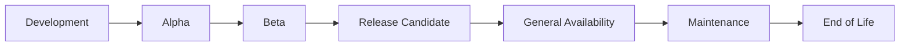

# 📦 SDK and Client Library Versioning

  

---

## 🎯 1. Overview

SDKs and client libraries are the primary interface between platform capabilities and product teams. Poorly versioned SDKs create upgrade pain, silent breaking changes, and dependency conflicts. All {Company} internal SDKs must follow Semantic Versioning 2.0 and the lifecycle standards in this document.

> **Rule:** Every internal SDK must use Semantic Versioning. Breaking changes require a major version bump, a migration guide, and a minimum 90-day deprecation window.

---

## 📐 2. Versioning Scheme

All SDKs follow Semantic Versioning (`MAJOR.MINOR.PATCH`):

| Component | When to Increment | Example |
|-----------|-------------------|---------|
| **MAJOR** | Breaking API change, removed feature, incompatible behavior | 2.0.0 - removed deprecated endpoint |
| **MINOR** | New feature, backward-compatible addition | 1.3.0 - added retry configuration |
| **PATCH** | Bug fix, security patch, documentation correction | 1.3.1 - fixed null pointer on empty response |

### 2.1 Pre-Release Versions

| Tag | Purpose | Stability |
|-----|---------|-----------|
| `1.0.0-alpha.1` | Early development, API may change | Not for production |
| `1.0.0-beta.1` | Feature complete, testing in progress | Limited production use with opt-in |
| `1.0.0-rc.1` | Release candidate, final validation | Production-ready pending sign-off |

---

## 🔄 3. Release Lifecycle

**Visual overview:**

| Phase | Duration | Support Level |
|-------|----------|---------------|
| **Alpha** | Variable | No support - expect breaking changes |
| **Beta** | 2 - 4 weeks | Bug fixes only |
| **GA** | Until next major | Full support - bugs, security, features |
| **Maintenance** | 6 months after next major GA | Security and critical bug fixes only |
| **End of Life** | After maintenance window | No support - upgrade required |

---

## 📋 4. Breaking Change Policy

Before releasing a major version with breaking changes:

| Step | Requirement | Timeline |
|------|-------------|----------|
| **Deprecation notice** | Mark deprecated APIs with `@Deprecated` and log warnings | At least 90 days before removal |
| **Migration guide** | Document step-by-step upgrade path | Published with beta release |
| **Compatibility layer** | Provide adapters or shims where feasible | Available during deprecation window |
| **Consumer scan** | Identify all internal consumers and notify owners | Before beta release |
| **Parallel support** | Maintain previous major version in maintenance mode | 6 months after GA |

### 4.1 What Constitutes a Breaking Change

| Change Type | Breaking? | Action |
|-------------|-----------|--------|
| Remove a public method | Yes | Major bump |
| Change method signature | Yes | Major bump |
| Change default behavior | Yes | Major bump |
| Add a new optional parameter | No | Minor bump |
| Add a new method | No | Minor bump |
| Fix a bug in existing behavior | No | Patch bump |
| Change internal implementation | No | Patch bump |

---

## 🏗️ 5. Publishing Standards

| Requirement | Standard |
|-------------|----------|
| **Artifact repository** | GitHub Packages (Maven, npm) or private registry |
| **Changelog** | `CHANGELOG.md` following Keep a Changelog format |
| **API documentation** | Auto-generated from source (Javadoc, TSDoc) |
| **Release notes** | GitHub Release with summary of changes |
| **Reproducible builds** | Pinned dependencies, locked build toolchain |
| **Security scanning** | SAST and dependency scan on every release |

### 5.1 Artifact Naming

| Platform | Convention | Example |
|----------|-----------|---------|
| **JVM** | `com.{company}.sdk.<name>` | `com.{company}.sdk.events` |
| **npm** | `@{company}/<name>` | `@{company}/http-client` |
| **Python** | `{company}-<name>` | `{company}-auth-sdk` |

---

## 📊 6. Consumer Compatibility Matrix

SDK maintainers must publish a compatibility matrix:

| SDK Version | Minimum Runtime | API Version | Status |
|-------------|-----------------|-------------|--------|
| 3.x | Java 21, Node 20 | v3 | GA |
| 2.x | Java 17, Node 18 | v2 | Maintenance |
| 1.x | Java 11, Node 16 | v1 | EOL |

---

## ⚠️ 7. Anti-Patterns

| Anti-Pattern | Problem | Fix |
|-------------|---------|-----|
| Breaking changes in a patch | Consumers break on minor update | Follow SemVer strictly |
| No deprecation window | Consumers forced to upgrade immediately | 90-day minimum deprecation period |
| Missing changelog | Consumers cannot assess upgrade risk | Automate changelog from conventional commits |
| Unpinned dependencies | Transitive dependency conflicts | Pin and lock all dependencies |
| No migration guide | Consumers spend hours figuring out upgrades | Publish step-by-step guide with every major |

---

⬅️ [Back to section](./README.md) · 🏠 [Back to root](../README.md)

