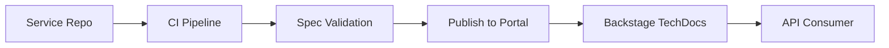

# 📖 API Documentation and Developer Portal

  

---

## 🎯 1. Overview

API documentation is the user interface of a service. If a consumer cannot understand your API from the docs alone, the API is incomplete. All {Company} APIs must be documented using OpenAPI 3.1 for REST and protobuf definitions for gRPC, published to the developer portal, and kept in sync with the implementation.

> **Rule:** Every API must have an OpenAPI spec (REST) or protobuf definition (gRPC) that is validated in CI and published to Backstage on every merge to main.

---

## 📐 2. Documentation Standards

| Requirement | REST (OpenAPI 3.1) | gRPC (Protobuf) |
|-------------|-------------------|------------------|
| **Spec format** | YAML, committed to repo | `.proto` files, committed to repo |
| **Validation** | `spectral lint` in CI | `buf lint` in CI |
| **Description** | Every endpoint, parameter, and schema documented | Every service, RPC, and message documented |
| **Examples** | Request and response examples for every endpoint | Example payloads in comments or companion docs |
| **Error codes** | All error responses documented with descriptions | Error details in `google.rpc.Status` |
| **Authentication** | Security schemes documented | Auth requirements in service docs |
| **Versioning** | Version in URL path (`/v1/`, `/v2/`) | Package versioning in proto package name |

---

## 🏗️ 3. Developer Portal Architecture

**Visual overview:**

The developer portal is the single source of truth for all API documentation:

| Portal Component | Purpose | Tool |
|-----------------|---------|------|
| **API catalog** | Discover available APIs | Backstage API plugin |
| **Interactive docs** | Try APIs with live requests | Swagger UI / Redoc |
| **SDK references** | Auto-generated client library docs | Javadoc, TSDoc, pdoc |
| **Guides** | Getting started, authentication, pagination | Backstage TechDocs (Markdown) |
| **Changelog** | API version history and migration notes | Generated from spec diffs |

---

## 📋 4. OpenAPI Spec Requirements

Every OpenAPI spec must include:

| Section | Requirement |
|---------|-------------|
| `info.title` | Human-readable service name |
| `info.description` | What the API does and who should use it |
| `info.version` | Current API version |
| `servers` | Base URLs for all environments |
| `paths` | Every endpoint with summary, description, parameters, request body, and responses |
| `components.schemas` | All request and response models with property descriptions |
| `components.securitySchemes` | Authentication methods |
| `tags` | Logical grouping of endpoints |

### 4.1 Spec Quality Rules

| Rule | Enforcement |
|------|-------------|
| No undocumented endpoints | CI lint gate |
| No missing descriptions on schemas | CI lint gate |
| No missing examples on request bodies | CI lint gate |
| Consistent naming (camelCase for JSON fields) | CI lint gate |
| No breaking changes without version bump | Spec diff check in CI |

---

## 🔄 5. Documentation Lifecycle

| Event | Action |
|-------|--------|
| **New API endpoint added** | Update OpenAPI spec in the same PR |
| **Request/response schema changed** | Update spec and examples in the same PR |
| **Endpoint deprecated** | Mark as `deprecated: true` in spec; add sunset date |
| **Endpoint removed** | Remove from spec in next major version only |
| **New API version released** | Publish migration guide alongside new spec |

### 5.1 Spec-First vs Code-First

| Approach | When to Use |
|----------|-------------|
| **Spec-first** | New APIs, public-facing APIs, cross-team contracts |
| **Code-first** | Rapid prototyping, internal-only APIs with single consumer |

For spec-first development, write the OpenAPI spec before implementation. Use code generation to create server stubs and client SDKs from the spec.

---

## 🤖 6. Agent Discoverability

API documentation must be structured for both human and agent consumption:

| Requirement | Purpose |
|-------------|---------|
| Machine-readable OpenAPI spec | Agents can discover and call APIs programmatically |
| Consistent error response schema | Agents can handle errors without custom parsing |
| Idempotency documentation | Agents can safely retry operations |
| Rate limit headers documented | Agents can implement backoff correctly |
| Pagination format documented | Agents can traverse result sets autonomously |

---

## ⚠️ 7. Anti-Patterns

| Anti-Pattern | Problem | Fix |
|-------------|---------|-----|
| Docs in a wiki, not the repo | Docs drift from implementation | Spec lives in the service repo, validated in CI |
| Auto-generated-only docs | No context, no examples, no guides | Supplement generated docs with hand-written guides |
| Undocumented error codes | Consumers handle errors by guessing | Document every error response with codes and descriptions |
| No interactive playground | Consumers cannot experiment safely | Deploy Swagger UI or Redoc with sandbox environment |
| Stale examples | Examples use deprecated fields or wrong formats | CI validates examples against the spec |

---

⬅️ [Back to section](./README.md) · 🏠 [Back to root](../README.md)

