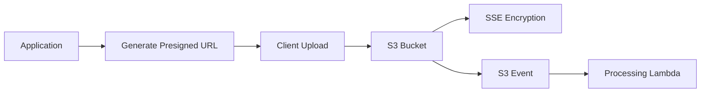

# 🗃️ Object and File Storage Patterns

  

---

## 🎯 1. Overview

Object storage (S3) is the default for all unstructured data at {Company} - documents, images, media, exports, backups, and data pipeline artifacts. Teams must not store blobs in relational databases or application file systems. This guide defines the patterns, naming, security, and lifecycle management for object storage.

> **Rule:** Amazon S3 is the default object store. All buckets must use the standard naming convention, encryption at rest, and a defined lifecycle policy.

---

## 📐 2. Storage Decision Matrix

| Data Type | Storage | Rationale |
|-----------|---------|-----------|
| User-uploaded files (images, documents) | S3 + CloudFront | Durable, scalable, CDN-cacheable |
| Service-generated reports / exports | S3 | Async generation, presigned URL download |
| Database backups | S3 (separate account) | Isolated from production blast radius |
| Data pipeline artifacts | S3 | Native integration with Spark, Athena, Glue |
| Temporary processing files | S3 with lifecycle expiry | Auto-deleted after processing window |
| Application logs | S3 (via Firehose) | Cost-effective long-term retention |

---

## 📋 3. Bucket Naming and Organization

### 3.1 Naming Convention

```
{company}-{environment}-{service}-{purpose}
```

| Component | Values | Example |
|-----------|--------|---------|
| `{company}` | Organization prefix | `{company}` |
| `{environment}` | `prod`, `staging`, `dev` | `prod` |
| `{service}` | Owning service name | `documents` |
| `{purpose}` | Content description | `uploads`, `exports`, `backups` |

Example: `{company}-prod-documents-uploads`

### 3.2 Object Key Structure

```
{tenant-id}/{year}/{month}/{day}/{uuid}.{extension}
```

Partition by date to enable efficient lifecycle policies and query patterns (Athena, S3 Select).

---

## 🔒 4. Security Requirements

| Requirement | Standard |
|-------------|----------|
| **Encryption at rest** | SSE-S3 (default) or SSE-KMS for sensitive data |
| **Encryption in transit** | TLS 1.2+ enforced via bucket policy |
| **Public access** | Blocked at account level; no public buckets |
| **Access control** | IAM roles per service; no shared credentials |
| **Presigned URLs** | Maximum 1-hour expiry for uploads, 15 minutes for downloads |
| **Versioning** | Enabled for data that must be recoverable |
| **MFA delete** | Enabled on compliance-sensitive buckets |
| **Access logging** | S3 server access logs to a dedicated logging bucket |

**Visual overview:**



---

## 🔄 5. Upload and Download Patterns

### 5.1 Upload Patterns

| Pattern | Use Case | Implementation |
|---------|----------|----------------|
| **Presigned URL upload** | Client-side file upload | Backend generates presigned PUT URL; client uploads directly to S3 |
| **Multipart upload** | Files > 100MB | Use S3 multipart upload API with presigned parts |
| **Server-side upload** | Backend-generated files | Service writes directly to S3 via SDK |

### 5.2 Download Patterns

| Pattern | Use Case | Implementation |
|---------|----------|----------------|
| **CDN-served** | Public or semi-public assets | CloudFront distribution with OAC |
| **Presigned URL download** | Authenticated, time-limited access | Backend generates presigned GET URL |
| **Streaming** | Large files, video | CloudFront with range request support |

---

## 📊 6. Lifecycle Management

Every bucket must have a lifecycle policy. No bucket is allowed to grow unbounded.

| Rule | Configuration | Rationale |
|------|---------------|-----------|
| **Transition to IA** | Move to S3 Infrequent Access after 90 days | Cost reduction for rarely accessed data |
| **Transition to Glacier** | Move to Glacier after 365 days (if retention required) | Long-term archival at minimal cost |
| **Expiration** | Delete objects after retention period | Prevent unbounded growth |
| **Incomplete uploads** | Abort multipart uploads after 7 days | Prevent orphaned parts accumulating cost |
| **Non-current versions** | Delete non-current versions after 30 days | Control versioning storage costs |

---

## ⚠️ 7. Anti-Patterns

| Anti-Pattern | Problem | Fix |
|-------------|---------|-----|
| Blobs in PostgreSQL | Database bloat, slow backups, expensive queries | Store in S3; save metadata and S3 key in database |
| Public buckets | Data exposure risk | Block public access at account level |
| No lifecycle policy | Unbounded cost growth | Define lifecycle rules at bucket creation |
| Flat key structure | Poor performance for listing, hard to partition | Use date-partitioned key prefixes |
| Long-lived presigned URLs | Security risk if URL is leaked | Maximum 1-hour expiry for uploads |

---
<div align="center">

⬅️ [Back to section](./README.md) · 🏠 [Back to root](../README.md)

</div>
